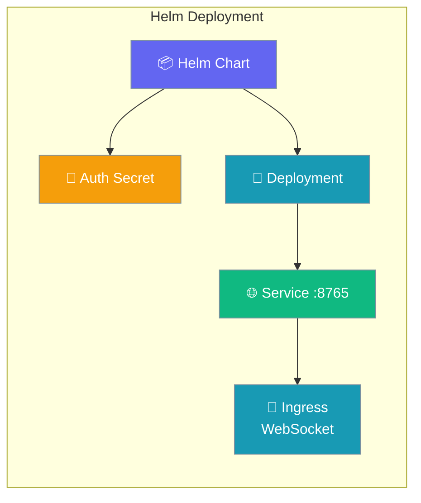
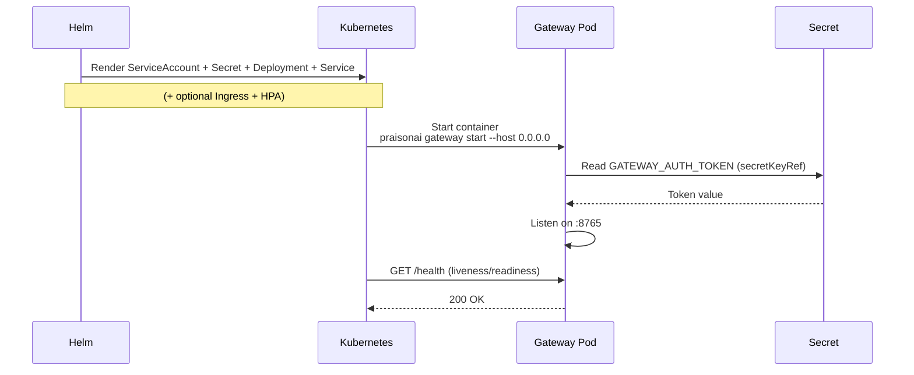

Deploy the PraisonAI gateway (WebSocket + REST on port 8765) to Kubernetes with the official Helm chart.



## Quick Start

<Steps>
<Step title="Create the auth token Secret">
Pre-create the Secret out-of-band (GitOps-friendly) instead of putting a token in Git.

```bash
kubectl create secret generic praisonai-gateway-auth \
  --from-literal=GATEWAY_AUTH_TOKEN="$(openssl rand -hex 16)"
```
</Step>

<Step title="Install the chart from a local checkout">
Point the release at the pre-created Secret.

```bash
helm install praisonai ./deploy/helm/praisonai-gateway \
  --set auth.existingSecret=praisonai-gateway-auth \
  --set image.tag=latest
```
</Step>

<Step title="Verify with a port-forward">
Forward the Service and hit the health endpoint.

```bash
kubectl port-forward svc/praisonai-praisonai-gateway 8765:8765
curl http://127.0.0.1:8765/health
```
</Step>
</Steps>

---

## How It Works

Helm renders the templates into Kubernetes objects, then the gateway container starts and reads its auth token from the Secret.



| Object | Created | Purpose |
|--------|---------|---------|
| `ServiceAccount` | when `serviceAccount.create=true` | Pod identity |
| `Secret` | when `auth.token` is set (no `existingSecret`) | Holds `GATEWAY_AUTH_TOKEN` |
| `Deployment` | always | Runs the gateway container on port 8765 |
| `Service` | always | Exposes the pod on port 8765 |
| `Ingress` | when `ingress.enabled=true` | WebSocket-aware external access |
| `HPA` | when `autoscaling.enabled=true` | CPU-based scaling |

---

## Configuration Options

Every key below is from `deploy/helm/praisonai-gateway/values.yaml`.

| Key | Type | Default | Description |
|-----|------|---------|-------------|
| `replicaCount` | `int` | `1` | Gateway replicas. See WebSocket note before scaling beyond 1. |
| `image.repository` | `string` | `ghcr.io/mervinpraison/praisonai` | Official GHCR image. |
| `image.tag` | `string` | `""` (falls back to Chart `appVersion`) | Pin a released tag in production (e.g. `"4.6.157"`). |
| `image.pullPolicy` | `string` | `IfNotPresent` | Standard Kubernetes image pull policy. |
| `imagePullSecrets` | `list` | `[]` | Image pull secrets for private registries. |
| `command` | `list` | `["praisonai","gateway","start","--host","0.0.0.0"]` | Container entrypoint. |
| `auth.enabled` | `bool` | `true` | Inject `GATEWAY_AUTH_TOKEN` into the pod. |
| `auth.existingSecret` | `string` | `""` | Reference a pre-created Kubernetes Secret (preferred / GitOps-friendly). |
| `auth.secretKey` | `string` | `GATEWAY_AUTH_TOKEN` | Data key inside the Secret whose value becomes the env var. **The env var itself is always named `GATEWAY_AUTH_TOKEN`** — this key only selects which entry in the Secret to read. |
| `auth.token` | `string` | `""` | Inline token; chart creates a Secret for you. **Avoid in Git.** |
| `env` | `list` | `[]` | Extra env vars (e.g. `OPENAI_API_KEY` via `valueFrom.secretKeyRef`). See example below. |
| `service.type` | `string` | `ClusterIP` | Kubernetes Service type. |
| `service.port` | `int` | `8765` | Gateway listen port (also exported to the container as `GATEWAY_PORT`). |
| `ingress.enabled` | `bool` | `false` | Expose via Ingress with WebSocket annotations. |
| `ingress.className` | `string` | `nginx` | IngressClass name. |
| `ingress.annotations` | `map` | NGINX WebSocket-friendly (see below) | Ingress annotations; adjust for Traefik/other controllers. |
| `ingress.hosts` | `list` | `[{host: agents.example.com, paths: [{path: /, pathType: Prefix}]}]` | Ingress hosts and paths. |
| `ingress.tls` | `list` | `[]` | Ingress TLS blocks. |
| `probes.enabled` | `bool` | `true` | Enable liveness/readiness probes. |
| `probes.path` | `string` | `/health` | Probe path (must match the gateway's health endpoint). |
| `resources` | `map` | `{}` | Kubernetes resource requests/limits. |
| `autoscaling.enabled` | `bool` | `false` | Optional CPU-based HPA. **See the WebSocket sticky-sessions warning before enabling.** |
| `autoscaling.minReplicas` | `int` | `1` | HPA minimum replicas. |
| `autoscaling.maxReplicas` | `int` | `3` | HPA maximum replicas. |
| `autoscaling.targetCPUUtilizationPercentage` | `int` | `80` | HPA target CPU utilization. |
| `serviceAccount.create` | `bool` | `true` | Create a dedicated ServiceAccount. |
| `serviceAccount.name` | `string` | `""` (derived from fullname) | Override the ServiceAccount name. |
| `podAnnotations` | `map` | `{}` | Annotations added to each pod. |
| `podSecurityContext` | `map` | `{}` | Pod-level securityContext. |
| `securityContext` | `map` | `{}` | Container-level securityContext. |
| `nodeSelector` | `map` | `{}` | Pod nodeSelector. |
| `tolerations` | `list` | `[]` | Pod tolerations. |
| `affinity` | `map` | `{}` | Pod affinity. |

Default `ingress.annotations`:

```yaml
nginx.ingress.kubernetes.io/proxy-read-timeout: "3600"
nginx.ingress.kubernetes.io/proxy-send-timeout: "3600"
```

---

## Security — Auth Is Fail-Fast by Default

When `auth.enabled=true` (the default), the chart refuses to render unless a token source is provided.

<Warning>
With `auth.enabled=true` you **must** set `auth.existingSecret` **or** `auth.token`. Without one, the pod would reference a Secret that is never created and fail with `CreateContainerConfigError`, so the chart fails fast at render time instead.
</Warning>

Without a token source, the render fails:

- `auth.enabled=true` only (no ingress):
  > `auth.enabled is true but no auth.existingSecret or auth.token was provided. Set one of them, or disable auth with auth.enabled=false.`
- `auth.enabled=true` **and** `ingress.enabled=true`:
  > `auth.enabled and ingress.enabled are true but no auth.existingSecret or auth.token was provided. Refusing to expose the gateway without a GATEWAY_AUTH_TOKEN.`

To run without a token (e.g. local testing behind trusted networking) set `auth.enabled=false`.

<Warning>
Never combine `auth.enabled=false` with `ingress.enabled=true` — that exposes an unauthenticated gateway to the network.
</Warning>

The injected env var is always named `GATEWAY_AUTH_TOKEN` — that is the only name the gateway reads. `auth.secretKey` selects **which data key in the Secret** to read, not the env var name. Renaming `auth.secretKey` does not rename the env var.

---

## Passing Other Secrets (LLM Keys) via `env`

Pass provider keys with the `valueFrom.secretKeyRef` pattern.

```yaml
env:
  - name: OPENAI_API_KEY
    valueFrom:
      secretKeyRef:
        name: praisonai-llm
        key: OPENAI_API_KEY
```

---

## WebSocket Ingress — Sticky Sessions

The gateway is stateful per WebSocket connection, so multi-replica setups need sticky sessions.

<Warning>
Before scaling `replicaCount > 1` (or enabling `autoscaling`), enable **sticky sessions** or a shared session backend. Otherwise reconnecting clients may land on a different pod and lose state.
</Warning>

The default NGINX annotations set long read/send timeouts. Add a cookie affinity annotation for sticky sessions:

```yaml
ingress:
  annotations:
    nginx.ingress.kubernetes.io/proxy-read-timeout: "3600"
    nginx.ingress.kubernetes.io/proxy-send-timeout: "3600"
    nginx.ingress.kubernetes.io/affinity: "cookie"
```

---

## Ingress + TLS Example

Expose the gateway on a real hostname with TLS.

```bash
helm install praisonai ./deploy/helm/praisonai-gateway \
  --set auth.existingSecret=praisonai-gateway-auth \
  --set ingress.enabled=true \
  --set ingress.hosts[0].host=agents.example.com \
  --set ingress.hosts[0].paths[0].path=/ \
  --set ingress.hosts[0].paths[0].pathType=Prefix \
  --set ingress.tls[0].secretName=agents-tls \
  --set ingress.tls[0].hosts[0]=agents.example.com
```

---

## Autoscaling (HPA)

Enable CPU-based scaling with an HPA.

```bash
helm install praisonai ./deploy/helm/praisonai-gateway \
  --set auth.existingSecret=praisonai-gateway-auth \
  --set autoscaling.enabled=true \
  --set autoscaling.minReplicas=2 \
  --set autoscaling.maxReplicas=5
```

<Warning>
Multi-replica gateways hold per-connection WebSocket state. Configure sticky sessions (see [WebSocket Ingress](#websocket-ingress-sticky-sessions)) before enabling autoscaling.
</Warning>

---

## Scope

<Info>
This chart intentionally covers the **gateway** only. Other services (`serve`, `claw`, bots) run from the same GHCR image and can be templated similarly if needed, but are out of scope for this chart.
</Info>

---

## Best Practices

<AccordionGroup>
<Accordion title="Prefer auth.existingSecret over auth.token">
Inline tokens end up in Git. Pre-created Secrets don't — create the Secret out-of-band and reference it with `auth.existingSecret`.
</Accordion>

<Accordion title="Pin image.tag to a released version in production">
The default `image.tag` falls back to Chart `appVersion` (`"latest"`), which drifts. Pin a released tag such as `"4.6.157"` for reproducible deployments.
</Accordion>

<Accordion title="Keep replicaCount: 1 until sticky sessions are configured">
WebSocket state is per-pod. Scale beyond one replica only after enabling sticky sessions or a shared session backend.
</Accordion>

<Accordion title="Set resources requests/limits">
The chart ships `resources: {}` by default, so the pod has no guaranteed CPU/memory. Set requests and limits — commented-out example values are in `values.yaml`.
</Accordion>
</AccordionGroup>

---

## Related

<CardGroup cols={2}>
<Card title="Gateway & Control Plane" icon="tower-broadcast" href="/docs/gateway">
  The service this chart deploys.
</Card>
<Card title="Docker Deployment" icon="docker" href="/docs/guides/deployment/docker">
  Docker deployment alternative.
</Card>
</CardGroup>
