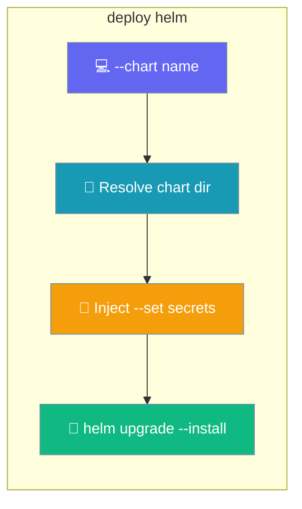
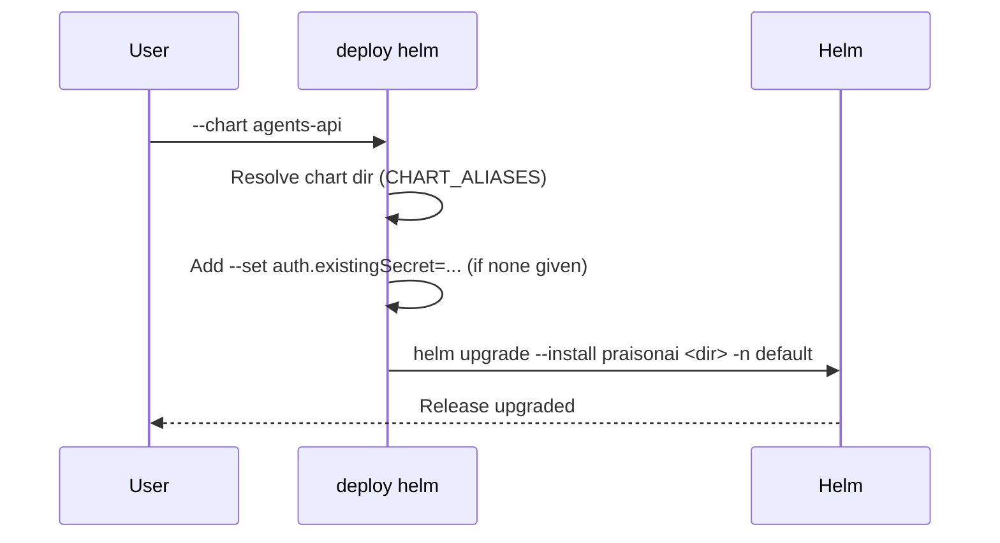

Install or upgrade either PraisonAI Helm chart with one command that injects the right auth secrets for you.



<Warning>
The charts ship in the git checkout, **not** in the PyPI wheel (`MANIFEST.in` excludes `infra/`). Run from a monorepo checkout, or set `PRAISONAI_HELM_ROOT` / `PRAISONAI_INFRA_ROOT`, or pass `--chart-dir`.
</Warning>

## Quick Start

<Steps>
<Step title="Create the auth Secret">
Pre-create the token Secret out-of-band (GitOps-friendly).

```bash
kubectl create secret generic praisonai-api-auth \
  --from-literal=PRAISONAI_API_TOKEN="$(openssl rand -hex 16)"
```
</Step>

<Step title="Install the chart">
The wrapper runs `helm upgrade --install` and wires the Secret automatically.

```bash
praisonai deploy helm --chart agents-api
```
</Step>
</Steps>

---

## How It Works

The wrapper resolves the chart directory by alias, injects default `--set` secret references when you don't, then shells out to Helm.



---

## Command Options

| Flag | Default | Description |
|------|---------|-------------|
| `--chart` | *(required)* | Chart name: `gateway` or `agents-api`. |
| `--release` / `-r` | `praisonai` | Helm release name. |
| `--namespace` / `-n` | `default` | Kubernetes namespace. |
| `--chart-dir` | *(resolved)* | Override the chart directory. |
| `--install` / `--no-install` | `--install` | Toggle `helm upgrade --install` vs. plain `upgrade`. |
| `--json` | `False` | Machine-readable output. |

The chart tree can be overridden with `PRAISONAI_HELM_ROOT`.

---

## Auto-Injected Secrets

When you don't supply the matching `--set` flags, the wrapper adds them for you.

| `--chart` | Injected `--set` flags |
|-----------|------------------------|
| `gateway` | `auth.existingSecret=praisonai-gateway-auth` |
| `agents-api` | `auth.existingSecret=praisonai-api-auth` and `postgres.auth.existingSecret=praisonai-postgres-auth` |

<Note>
Supplying your own `auth.*` (or `postgres.auth.*`) `--set` values disables the corresponding default injection, so you stay in control.
</Note>

---

## Worked Examples

Create the Secret first, then let the wrapper install the chart.

<Tabs>
<Tab title="Gateway">
```bash
kubectl create secret generic praisonai-gateway-auth \
  --from-literal=GATEWAY_AUTH_TOKEN="$(openssl rand -hex 16)"

praisonai deploy helm --chart gateway
```
</Tab>
<Tab title="Agents API">
```bash
kubectl create secret generic praisonai-api-auth \
  --from-literal=PRAISONAI_API_TOKEN="$(openssl rand -hex 16)"
kubectl create secret generic praisonai-postgres-auth \
  --from-literal=password="$(openssl rand -hex 16)"

praisonai deploy helm --chart agents-api
```
</Tab>
</Tabs>

---

## Best Practices

<AccordionGroup>
<Accordion title="Pre-create Secrets, don't inline tokens">
The wrapper references `existingSecret` names by default. Create those Secrets out-of-band so tokens never land in Git.
</Accordion>

<Accordion title="Use --no-install to guard existing releases">
Pass `--no-install` to run a plain `helm upgrade` that fails if the release doesn't already exist — useful in pipelines that shouldn't create new releases.
</Accordion>

<Accordion title="Override the chart dir for local edits">
Point `--chart-dir` at a working copy of the chart to test template changes before publishing.
</Accordion>
</AccordionGroup>

---

## Related

<CardGroup cols={2}>
<Card title="Helm Chart — Agents API" icon="ship" href="/docs/features/helm-chart-agents-api">
  Every value for the agents-api chart.
</Card>
<Card title="Helm Chart — Gateway" icon="ship" href="/docs/features/helm-chart-gateway">
  Every value for the gateway chart.
</Card>
</CardGroup>
