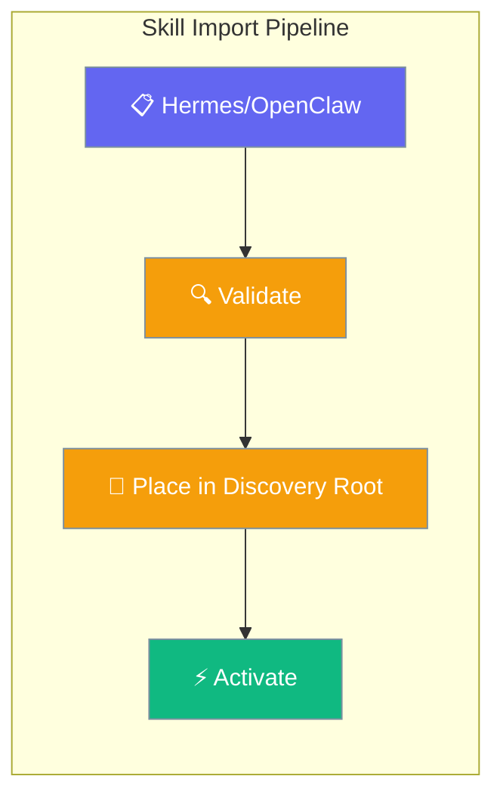
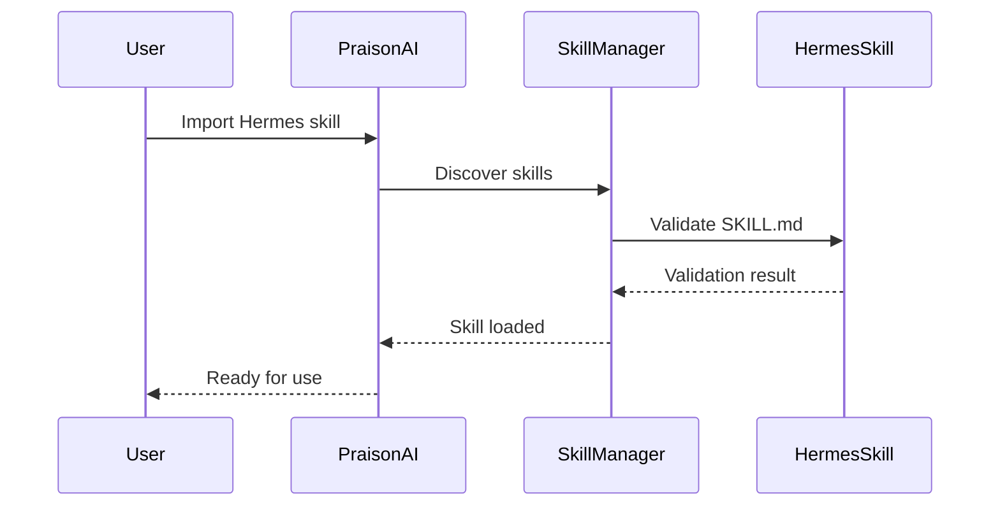
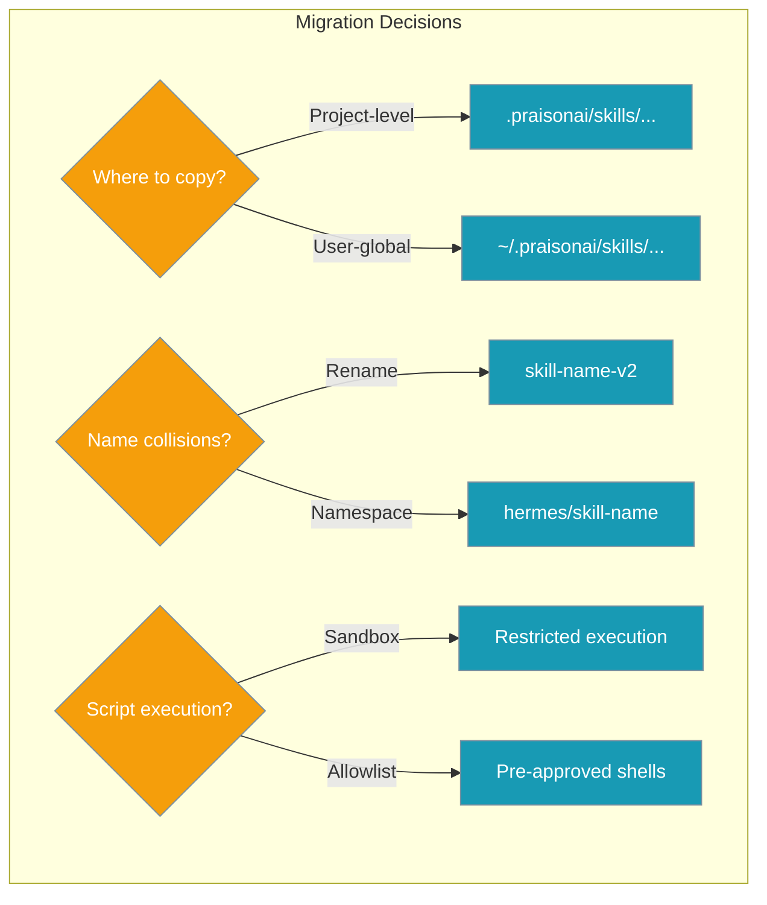
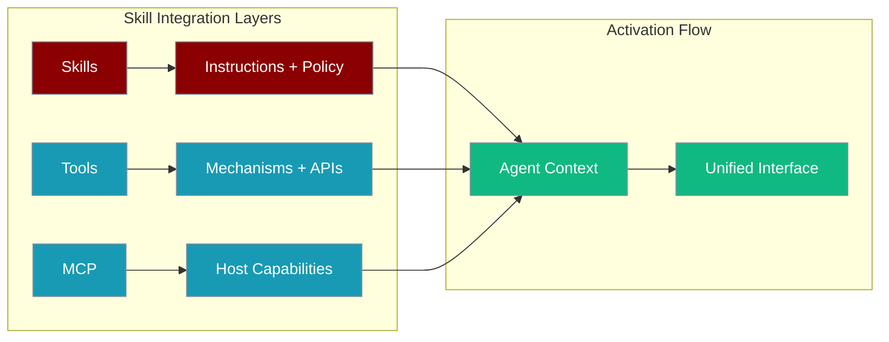
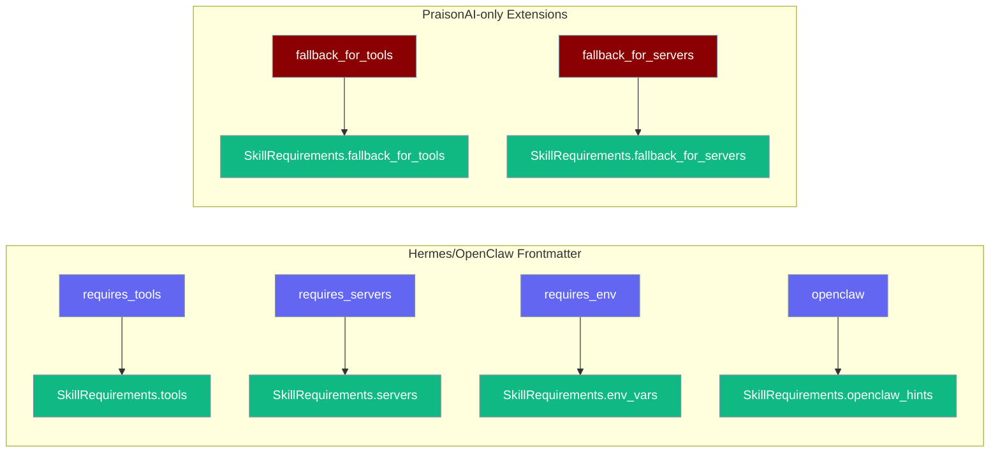

Teams adopting Hermes/OpenClaw bring skills as directories and need a migration map into PraisonAI's discovery roots and activation UX.



## Quick Start

<Steps>
<Step title="Simple Import">
Import an existing Hermes/OpenClaw skill into your PraisonAI project:

```python
from praisonaiagents import Agent
from praisonaiagents import discover_skills

# Discover skills from custom directory
skills = discover_skills(["/path/to/hermes-skills"])

agent = Agent(
    name="SkillAgent",
    instructions="Use imported skills to help users",
    skills=skills
)

agent.start("Process this data using available skills")
```
</Step>

<Step title="With Validation">
Validate and safely import skills with error handling:

```python
from praisonaiagents import Agent
from praisonaiagents import validate, load_skill

# Validate skill before import
skill_path = "/path/to/hermes-skills/data-processor"
errors = validate(skill_path)

if not errors:
    skill = load_skill("data-processor", ["/path/to/hermes-skills"])
    agent = Agent(
        name="ValidatedAgent",
        instructions="Use validated skills only",
        skills=[skill] if skill else []
    )
else:
    print(f"Skill validation failed: {errors}")
```
</Step>
</Steps>

---

## How It Works



| Phase | Process | Output |
|-------|---------|---------|
| **Discovery** | Scan directories for SKILL.md files | Found skills list |
| **Validation** | Check format, dependencies, security | Validation report |
| **Integration** | Load into PraisonAI discovery roots | Active skills |

---

## Migration Dimensions

### Artifact Inventory

Hermes/OpenClaw skills typically follow this structure:

```
skill-folder/
├── SKILL.md            ← frontmatter + body
├── scripts/            ← executable helpers (risk: platform-specific)  
└── references/         ← supplementary docs/data
```

PraisonAI handles these through its skill discovery system:



### Configuration Options

| Option | Type | Default | Description |
|--------|------|---------|-------------|
| `skill_dirs` | `List[str]` | `None` | Directories to scan for skills |
| `include_defaults` | `bool` | `True` | Include built-in skill directories |
| `validate_scripts` | `bool` | `True` | Validate script security before execution |
| `namespace_conflicts` | `bool` | `False` | Auto-namespace conflicting skill names |

---

## Step-by-Step Migration

<Steps>
<Step title="Validate UTF-8 Encoding">
Ensure all skill files use proper encoding (especially on Windows):

```python
from pathlib import Path

def validate_encoding(skill_path: str) -> bool:
    """Validate all files in skill directory are UTF-8 encoded."""
    skill_dir = Path(skill_path)
    
    for file_path in skill_dir.rglob("*.md"):
        try:
            file_path.read_text(encoding='utf-8')
        except UnicodeDecodeError:
            print(f"Invalid encoding in {file_path}")
            return False
    
    return True
```
</Step>

<Step title="Lint Frontmatter">
Check SKILL.md frontmatter against supported keys:

```python
import yaml
from pathlib import Path

def lint_frontmatter(skill_path: str) -> list:
    """Lint SKILL.md frontmatter for compatibility."""
    skill_md = Path(skill_path) / "SKILL.md"
    content = skill_md.read_text()
    
    if not content.startswith('---'):
        return ["Missing YAML frontmatter"]
    
    # Extract frontmatter
    parts = content.split('---', 2)
    if len(parts) < 3:
        return ["Malformed frontmatter"]
    
    try:
        frontmatter = yaml.safe_load(parts[1])
        required_keys = ['name', 'description']
        missing = [key for key in required_keys if key not in frontmatter]
        return [f"Missing required key: {key}" for key in missing]
    except yaml.YAMLError as e:
        return [f"Invalid YAML: {e}"]
```
</Step>

<Step title="Place in Discovery Root">
Copy to appropriate discovery directory:

```python
import shutil
from pathlib import Path

def import_skill(source_path: str, target_dir: str = None) -> str:
    """Import Hermes/OpenClaw skill to PraisonAI discovery root."""
    source = Path(source_path)
    
    # Default to project-level skills directory
    if target_dir is None:
        target_dir = Path.cwd() / ".praisonai" / "skills"
    else:
        target_dir = Path(target_dir)
    
    target_dir.mkdir(parents=True, exist_ok=True)
    destination = target_dir / source.name
    
    # Handle name conflicts
    counter = 1
    while destination.exists():
        destination = target_dir / f"{source.name}-{counter}"
        counter += 1
    
    shutil.copytree(source, destination)
    return str(destination)
```
</Step>

<Step title="Test Discovery">
Verify the skill is discoverable by PraisonAI:

```python
from praisonaiagents import discover_skills

def test_discovery(skills_dir: str) -> bool:
    """Test if imported skills are discoverable."""
    skills = discover_skills([skills_dir])
    
    if not skills:
        print("No skills discovered")
        return False
    
    for skill in skills:
        print(f"✓ Discovered: {skill.name} - {skill.description}")
    
    return True
```
</Step>

<Step title="Security Review">
Strip secrets and validate script safety:

```python
import re
from pathlib import Path

def security_review(skill_path: str) -> list:
    """Review skill for security issues."""
    issues = []
    skill_dir = Path(skill_path)
    
    # Check for hardcoded secrets
    secret_patterns = [
        r'api[_-]?key\s*=\s*["\'][^"\']+["\']',
        r'password\s*=\s*["\'][^"\']+["\']',
        r'token\s*=\s*["\'][^"\']+["\']'
    ]
    
    for file_path in skill_dir.rglob("*"):
        if file_path.is_file() and file_path.suffix in ['.md', '.py', '.txt']:
            content = file_path.read_text()
            for pattern in secret_patterns:
                if re.search(pattern, content, re.IGNORECASE):
                    issues.append(f"Potential secret in {file_path}")
    
    return issues
```
</Step>
</Steps>

---

## Runtime Bridges



Skills coexist with tools through layered integration:

1. **Skills** provide instructions and safety policy text
2. **Tools** provide mechanisms (API keys, quotas, auditing)
3. **MCP** bridges host capabilities and external services

### Tool Integration Pattern

```python
from praisonaiagents import Agent
from praisonaiagents import tool, load_skill

# Load Hermes skill
hermes_skill = load_skill("data-processor", ["/path/to/skills"])

# Create complementary tool
@tool
def process_data_api(data: str) -> str:
    """Process data using external API with proper auth."""
    # Tool handles API keys, rate limiting, etc.
    return api_call(data)

agent = Agent(
    name="HybridAgent", 
    skills=[hermes_skill],
    tools=[process_data_api]
)
```

---

## Best Practices

<AccordionGroup>
<Accordion title="Namespace Management">
Use consistent naming to avoid conflicts:

```python
# Good: Namespaced skill names
"hermes/data-processor"
"openclaw/file-manager" 
"custom/my-skill"

# Bad: Generic names that conflict
"processor"
"manager"
"skill"
```
</Accordion>

<Accordion title="Security Isolation">
Review and sanitize script execution:

```python
from praisonaiagents import validate

# Always validate before importing
def safe_import(skill_path: str) -> bool:
    errors = validate(skill_path)
    if errors:
        print(f"Security issues: {errors}")
        return False
    
    # Additional security checks
    security_issues = security_review(skill_path)
    if security_issues:
        print(f"Security review failed: {security_issues}")
        return False
    
    return True
```
</Accordion>

<Accordion title="Version Management">
Track skill versions and compatibility:

```python
# Include version in skill metadata
metadata = {
    "source": "hermes",
    "version": "1.2.0", 
    "compatibility": "praisonai>=0.1.0",
    "imported_at": "2024-01-15T10:30:00Z"
}
```
</Accordion>

<Accordion title="Testing Integration">
Test skills in isolation before deployment:

```python
def test_imported_skill(skill_name: str) -> bool:
    """Test imported skill functionality."""
    skill = load_skill(skill_name)
    
    if not skill:
        return False
    
    # Create test agent
    test_agent = Agent(
        name="TestAgent",
        skills=[skill],
        instructions="Test the imported skill"
    )
    
    # Run test cases
    test_result = test_agent.start("Execute test scenario")
    return "error" not in test_result.lower()
```
</Accordion>
</AccordionGroup>

---

## Troubleshooting

### Common Issues

| Problem | Symptoms | Solution |
|---------|----------|----------|
| **Skill not detected** | Empty discovery results | Check path, YAML format, UTF-8 encoding |
| **Import errors** | Module not found | Verify script dependencies, update requirements |
| **Permission denied** | Script execution fails | Review file permissions, security settings |
| **Name conflicts** | Skill override warnings | Use namespacing or rename conflicting skills |

### Validation Checklist

- [ ] SKILL.md exists and has valid YAML frontmatter
- [ ] Required fields: `name`, `description`
- [ ] UTF-8 encoding throughout
- [ ] No hardcoded secrets in files
- [ ] Scripts have proper dependencies
- [ ] File permissions allow execution

### Debug Commands

```bash
# Test skill discovery
praisonai skills list --dirs /path/to/hermes-skills

# Validate specific skill
praisonai skills validate --path /path/to/skill-folder

# Generate skills prompt XML
praisonai skills prompt --dirs /path/to/hermes-skills
```

---

## Capability Requirements

Hermes/OpenClaw skills can now declare capability requirements that are **first-class parsed** into `SkillRequirements` and enforced via PraisonAI's capability gates system.

### Supported Frontmatter Keys

All these frontmatter keys from Hermes/OpenClaw skills are now parsed and enforced:



| Hermes/OpenClaw Key | PraisonAI Field | Validation Result |
|---|---|---|
| `requires_tools` | `SkillRequirements.tools` | Missing tools → DEGRADED/UNAVAILABLE |
| `requires_servers` | `SkillRequirements.servers` | Missing servers → DEGRADED/UNAVAILABLE |
| `requires_env` | `SkillRequirements.env_vars` | Missing env vars → DEGRADED |
| `openclaw` | `SkillRequirements.openclaw_hints` | Passthrough metadata |
| `fallback_for_tools` ¹ | `SkillRequirements.fallback_for_tools` | Skill hidden when listed tool is present |
| `fallback_for_servers` ¹ | `SkillRequirements.fallback_for_servers` | Skill hidden when listed server is present |

¹ **PraisonAI-specific extension** — no Hermes/OpenClaw equivalent. Skills with these declarations are auto-hidden when the named capability is available. See [Graceful Fallback Skills](/features/skill-capability-gates#graceful-fallback-skills) for the full behaviour spec.

### Updated Linting

Update your frontmatter linting to accept these new capability requirement keys:

```python
def lint_frontmatter(skill_path: str) -> list:
    """Lint SKILL.md frontmatter for compatibility."""
    skill_md = Path(skill_path) / "SKILL.md"
    content = skill_md.read_text()
    
    if not content.startswith('---'):
        return ["Missing YAML frontmatter"]
    
    parts = content.split('---', 2)
    if len(parts) < 3:
        return ["Malformed frontmatter"]
    
    try:
        frontmatter = yaml.safe_load(parts[1])
        
        # Required keys
        required_keys = ['name', 'description']
        missing = [key for key in required_keys if key not in frontmatter]
        
        # Known capability keys (now accepted)
        capability_keys = [
            'requires_tools', 'requires-tools',
            'requires_servers', 'requires-servers', 
            'requires_env', 'requires-env',
            'openclaw',
            'fallback_for_tools', 'fallback-for-tools',
            'fallback_for_servers', 'fallback-for-servers',
        ]
        
        return [f"Missing required key: {key}" for key in missing]
    except yaml.YAMLError as e:
        return [f"Invalid YAML: {e}"]
```

For complete capability gates documentation, see [Skill Capability Gates](/features/skill-capability-gates).

---

## Related

<CardGroup cols={2}>
<Card title="Skills Overview" icon="puzzle-piece" href="/docs/features/skills">
  Learn about PraisonAI's skill system architecture
</Card>
<Card title="Tool Integration" icon="wrench" href="/docs/features/toolsets">
  Understand tools vs skills differences
</Card>
</CardGroup>