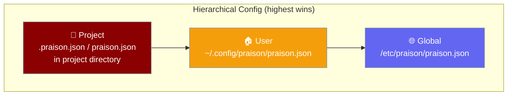
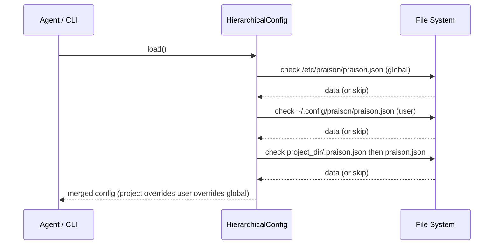

The praisonai CLI reads `.praison.json` from your project directory and automatically merges it with user and global config — project settings always win.



## Quick Start

<Steps>
  <Step title="Drop .praison.json in your project root">
    ```json
    {
      "model": "gpt-4o-mini",
      "temperature": 0.3
    }
    ```
  </Step>

  <Step title="Use an agent — config is picked up automatically">
    ```python
    from praisonaiagents import Agent

    agent = Agent(name="assistant", instructions="Be helpful.")
    agent.start("Summarise the README")
    ```

    The CLI discovers `.praison.json` in your project directory automatically — no extra setup needed.
  </Step>

  <Step title="Verify what got merged">
    ```python
    from praisonai.cli.features.config_hierarchy import load_config

    print(load_config())
    ```
  </Step>
</Steps>

---

## How Config Discovery Works



- Loads **global** → **user** → **project** (in that order, each overrides the previous).
- At project level, `.praison.json` (hidden) is checked before `praison.json` (visible).
- Set `project_dir` explicitly to point at a specific directory instead of `os.getcwd()`.

---

## Configuration File Precedence

| Layer | Path | Notes |
|-------|------|-------|
| Project (hidden) | `.praison.json` (in `project_dir`) | Checked first — highest precedence |
| Project (visible) | `praison.json` (in `project_dir`) | Fallback project config |
| User | `~/.config/praison/praison.json` | Per-user defaults |
| Global | `/etc/praison/praison.json` | System-wide defaults |

---

## Configuration Schema

Top-level keys supported in `.praison.json`:

| Key | Type | Description |
|-----|------|-------------|
| `model` | `string` | LLM model name (e.g. `"gpt-4o"`) |
| `temperature` | `number` | Sampling temperature (0–2) |
| `max_tokens` | `integer` | Max tokens per response |
| `providers` | `object` | Provider-specific settings (api_key, base_url) |
| `mcp` | `object` | MCP server configuration |
| `permissions` | `object` | Tool and path allowlists |
| `lsp` | `object` | Language server protocol settings |
| `output` | `object` | Output mode and color settings |
| `attribution` | `object` | Git commit attribution style |

**Example `.praison.json`:**

```json
{
  "model": "gpt-4o",
  "temperature": 0.7,
  "permissions": {
    "allowed_tools": ["read_file", "write_file"],
    "allowed_paths": ["./src", "./tests"]
  },
  "output": {
    "mode": "compact",
    "color": true
  }
}
```

---

## Common Patterns

**Monorepo with per-package overrides:**

Place a root `.praison.json` with your default model, then point `project_dir` to the package when running from a subdirectory:

```python
from praisonai.cli.features.config_hierarchy import HierarchicalConfig

config = HierarchicalConfig(project_dir="packages/frontend")
settings = config.load()
```

**Test fixture isolation:**

```python
from praisonai.cli.features.config_hierarchy import HierarchicalConfig

def test_my_feature(tmp_path):
    config = HierarchicalConfig(project_dir=str(tmp_path))
    settings = config.load()
```

**Validate config on load:**

```python
from praisonai.cli.features.config_hierarchy import HierarchicalConfig, ConfigValidationError

config = HierarchicalConfig()
try:
    settings = config.load(validate=True)
except ConfigValidationError as e:
    print(f"Config error: {e}")
```

---

## Constructor Parameters

| Param | Type | Default | Description |
|-------|------|---------|-------------|
| `project_dir` | `str` | `os.getcwd()` | Directory to search for project-level config (`.praison.json` or `praison.json`). |
| `user_config` | `str` | `~/.config/praison/praison.json` | Path to the user-level config file. |
| `global_config` | `str` | `/etc/praison/praison.json` | Path to the global config file. |

<Note>
Most users never need to import `HierarchicalConfig` directly — the CLI picks up `.praison.json` automatically. Use the import only when you need programmatic access or test isolation.
</Note>

---

## Best Practices

<AccordionGroup>
  <Accordion title="Commit .praison.json to your repo">
    Every teammate gets the same model and permissions automatically — no manual setup, no environment drift.
  </Accordion>
  <Accordion title="Use the hidden filename for project defaults">
    `.praison.json` (hidden) is for project-default state checked in to version control. Reserve `praison.json` (visible) for local human-editable overrides you want to keep out of git.
  </Accordion>
  <Accordion title="Keep secrets out of project config">
    Provider `api_key` values in `.praison.json` get committed to git. Store credentials in environment variables or a secrets manager instead.
  </Accordion>
  <Accordion title="Use explicit project_dir in tests">
    Pass an explicit `project_dir` pointing to a `tmp_path` fixture so tests do not inherit ancestor `.praison.json` files and become environment-sensitive.
  </Accordion>
  <Accordion title="Use validate=True for CI">
    Call `config.load(validate=True)` in your CI pipeline to catch config schema errors early before they reach production.
  </Accordion>
</AccordionGroup>

---

## Related

<CardGroup cols={2}>
  <Card title="YAML CLI Configuration" icon="file-code" href="/docs/features/cli-configuration">
    `.praisonai/config.yaml` — a separate YAML-based config system, distinct from `.praison.json`.
  </Card>
  <Card title="Advanced Features" icon="rocket" href="/docs/features/advanced-features">
    Other advanced CLI features including safe shell, file history, and output modes.
  </Card>
  <Card title="praisonai config subcommand" icon="terminal" href="/docs/cli/config">
    Reference for the `praisonai config` command (YAML system).
  </Card>
  <Card title="Context Files" icon="folder-open" href="/docs/features/context-files">
    Discovery for `AGENTS.md` / `CLAUDE.md` context files.
  </Card>
</CardGroup>
