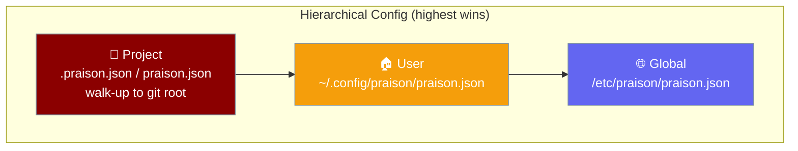
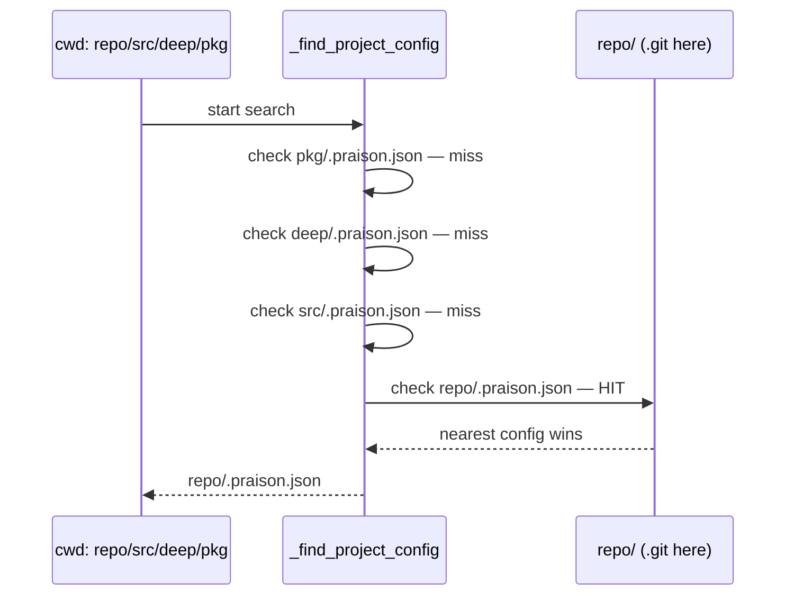
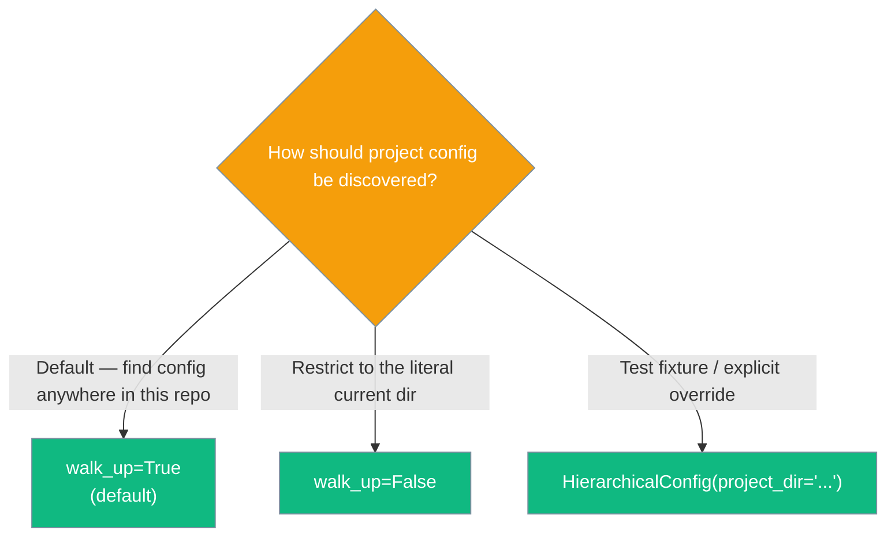
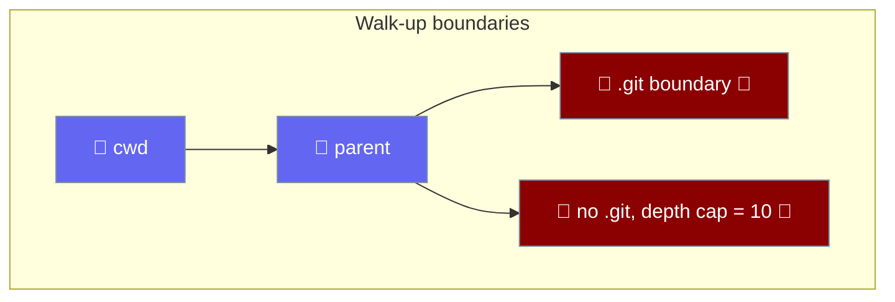

The praisonai CLI reads `.praison.json` from your project — and finds it automatically even when you run the CLI from a deep subdirectory.



## Quick Start

<Steps>
  <Step title="Drop .praison.json in your project root">
    ```json
    {
      "model": "gpt-4o-mini",
      "temperature": 0.3
    }
    ```
  </Step>

  <Step title="Use an agent from anywhere inside the repo">
    ```python
    from praisonaiagents import Agent

    agent = Agent(name="assistant", instructions="Be helpful.")
    agent.start("Summarise the README")
    ```

    The CLI discovers `.praison.json` automatically — no extra setup needed, even if you're nested deep inside `repo/src/deep/pkg/`.
  </Step>

  <Step title="Verify what got merged">
    ```python
    from praisonai.cli.features.config_hierarchy import load_config

    print(load_config())
    ```
  </Step>
</Steps>

---

## How Walk-up Works



- Starts at `project_dir` (defaults to `os.getcwd()`).
- At every level, checks `.praison.json` then `praison.json` (in that precedence order).
- **Stops at a directory containing `.git`** — config never leaks across project boundaries.
- When no `.git` is ever found, caps the walk at **10 ancestor levels** to avoid accidentally picking up unrelated configs.
- **Nearest config wins** — the first hit is returned.

---

## Choose Your Mode



**Default walk-up (recommended):**
```python
from praisonai.cli.features.config_hierarchy import HierarchicalConfig

config = HierarchicalConfig()
settings = config.load()
```

**Disable walk-up (cwd only):**
```python
config = HierarchicalConfig(walk_up=False)
settings = config.load()
```

**Explicit starting directory:**
```python
config = HierarchicalConfig(project_dir="/path/to/project")
settings = config.load()
```

---

## Walk-up Boundaries



The walk stops when it hits either:
- A directory containing `.git` (inclusive — the git-root itself is still checked for configs).
- 10 ancestor levels without finding any `.git` marker.

---

## Configuration File Precedence

| Layer | Path | Notes |
|-------|------|-------|
| Project (hidden) | `.praison.json` (walk-up from cwd) | Checked first at each level |
| Project (visible) | `praison.json` (walk-up from cwd) | Fallback at each level |
| User | `~/.config/praison/praison.json` | — |
| Global | `/etc/praison/praison.json` | — |

---

## Configuration Schema

Top-level keys supported in `.praison.json`:

| Key | Type | Description |
|-----|------|-------------|
| `model` | `string` | LLM model name (e.g. `"gpt-4o"`) |
| `temperature` | `number` | Sampling temperature (0–2) |
| `max_tokens` | `integer` | Max tokens per response |
| `providers` | `object` | Provider-specific settings (api_key, base_url) |
| `mcp` | `object` | MCP server configuration |
| `permissions` | `object` | Tool and path allowlists |
| `lsp` | `object` | Language server protocol settings |
| `output` | `object` | Output mode and color settings |
| `attribution` | `object` | Git commit attribution style |

**Example `.praison.json`:**

```json
{
  "model": "gpt-4o",
  "temperature": 0.7,
  "permissions": {
    "allowed_tools": ["read_file", "write_file"],
    "allowed_paths": ["./src", "./tests"]
  },
  "output": {
    "mode": "compact",
    "color": true
  }
}
```

---

## Common Patterns

**Monorepo with per-package overrides:**

Place a root `.praison.json` with your default model, then add a `packages/frontend/.praison.json` for package-specific overrides:

```json
// packages/frontend/.praison.json
{
  "model": "gpt-4o",
  "temperature": 0.1
}
```

Running `praisonai run "..."` from inside `packages/frontend/` picks up the nearest config automatically.

**Pin model and permissions for the whole repo:**

A single `.praison.json` at the repo root applies to every subdirectory:

```json
{
  "model": "gpt-4o-mini",
  "permissions": {
    "allowed_tools": ["read_file"],
    "allowed_paths": ["./src"]
  }
}
```

**Test fixture isolation:**

```python
from praisonai.cli.features.config_hierarchy import HierarchicalConfig

def test_my_feature(tmp_path):
    config = HierarchicalConfig(project_dir=str(tmp_path), walk_up=False)
    settings = config.load()
```

---

## Constructor Parameters

| Param | Type | Default | Description |
|-------|------|---------|-------------|
| `project_dir` | `str` | `os.getcwd()` | Starting directory for project-config discovery. |
| `user_config` | `str` | `~/.config/praison/praison.json` | Path to the user-level config file. |
| `global_config` | `str` | `/etc/praison/praison.json` | Path to the global config file. |
| `walk_up` | `bool` | `True` | When `True`, walk parent dirs to the git root (capped at 10 levels without a `.git`). When `False`, only check `project_dir`. |

<Note>
Most users never need to import `HierarchicalConfig` directly — the CLI picks up `.praison.json` automatically. Use the import only when you need programmatic access or test isolation.
</Note>

---

## Best Practices

<AccordionGroup>
  <Accordion title="Commit .praison.json to your repo">
    Every teammate gets the same model and permissions automatically — no manual setup, no environment drift.
  </Accordion>
  <Accordion title="Use the hidden filename for project defaults">
    `.praison.json` (hidden) is for project-default state checked in to version control. Reserve `praison.json` (visible) for local human-editable overrides you want to keep out of git.
  </Accordion>
  <Accordion title="Keep secrets out of project config">
    Provider `api_key` values in `.praison.json` get committed to git. Store credentials in environment variables or a secrets manager instead.
  </Accordion>
  <Accordion title="Disable walk-up in tests">
    Pass `walk_up=False` (or set an explicit `project_dir` to an isolated `tmp_path`) so tests do not inherit ancestor `.praison.json` files and become order-dependent or environment-sensitive.
  </Accordion>
  <Accordion title="Trust the git-root boundary">
    Running the CLI from a subdir of an unrelated parent repo will not pull in that parent's config. The `.git` marker is the safety boundary.
  </Accordion>
</AccordionGroup>

---

## Related

<CardGroup cols={2}>
  <Card title="YAML CLI Configuration" icon="file-code" href="/docs/features/cli-configuration">
    `.praisonai/config.yaml` — a separate YAML-based config system, not affected by walk-up discovery.
  </Card>
  <Card title="Advanced Features" icon="rocket" href="/docs/features/advanced-features">
    Other advanced CLI features including safe shell, file history, and output modes.
  </Card>
  <Card title="praisonai config subcommand" icon="terminal" href="/docs/cli/config">
    Reference for the `praisonai config` command (YAML system).
  </Card>
  <Card title="Context Files" icon="folder-open" href="/docs/features/context-files">
    Walk-up discovery for `AGENTS.md` / `CLAUDE.md` — the same boundary pattern applied to context files.
  </Card>
</CardGroup>
