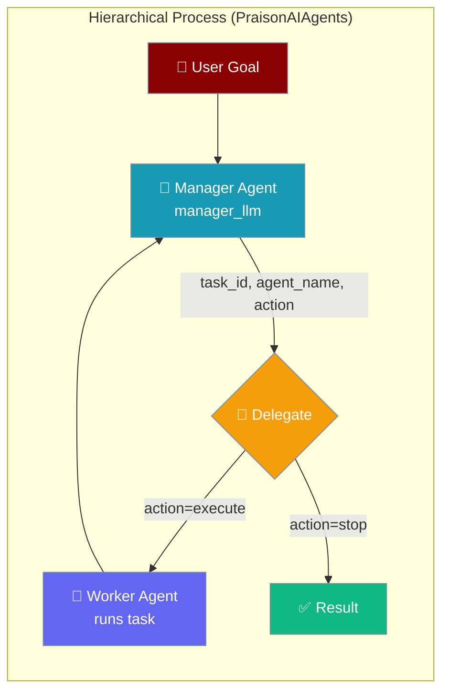
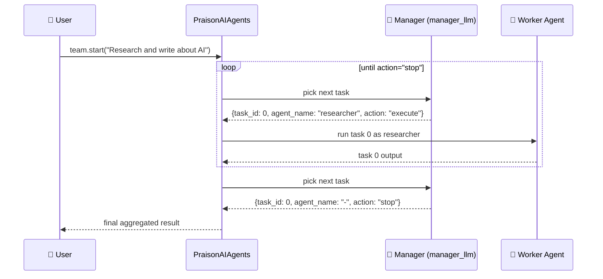
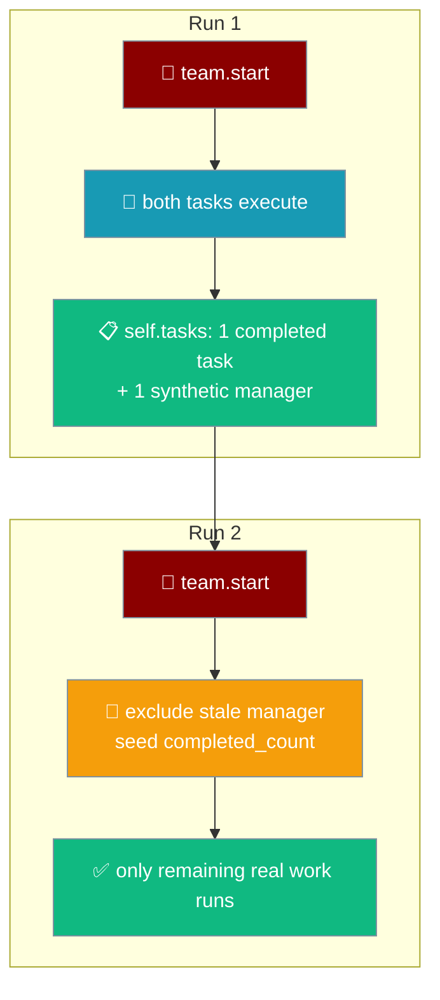
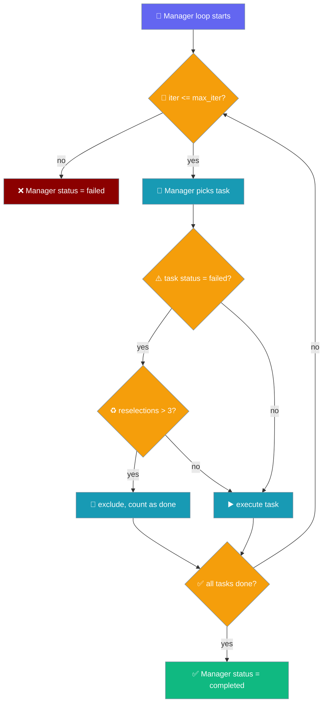
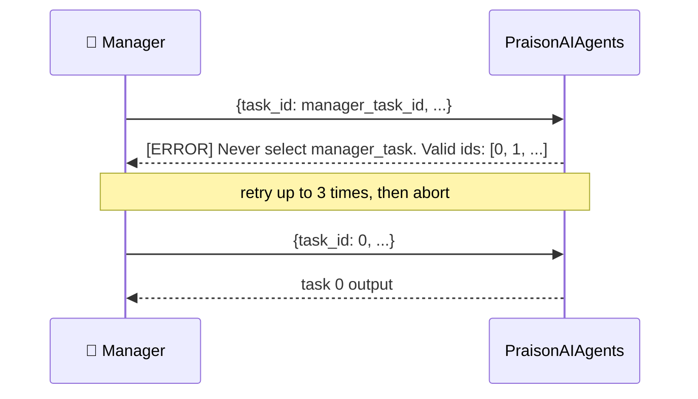

A manager agent decides which task runs next and which agent takes it, one delegation turn at a time.



<Note>
**Since PraisonAI PR #3790**, the hierarchical process correctly excludes the manager task from delegation candidates and blocks self-delegation. Earlier releases could allow the manager to delegate a subtask back to itself and could surface the manager's generic response as the final result. No API change — existing `process="hierarchical"` code benefits automatically.
</Note>

<Note>
**Since PraisonAI PR #4739**, the hierarchical loop only counts a task on its first transition to `completed` (keyed by `counted_task_ids`), and excludes every synthetic `manager_task` from prior runs of the same team (tracked in `Process._synthetic_manager_task_ids`). Existing `process="hierarchical"` code benefits automatically — no API change.
</Note>

## Quick Start

<Steps>
<Step title="Delegate two tasks to two agents">
The manager on `manager_llm` picks the next task and agent each turn.

```python
from praisonaiagents import Agent, Task, PraisonAIAgents

researcher = Agent(name="researcher", role="Research topics")
writer = Agent(name="writer", role="Write content")

tasks = [
    Task(name="research", description="Research AI trends", agent=researcher),
    Task(name="write", description="Write article about AI trends", agent=writer),
]

team = PraisonAIAgents(
    agents=[researcher, writer],
    tasks=tasks,
    process="hierarchical",
    manager_llm="gpt-4o-mini",
)
team.start()
```
</Step>

<Step title="See each delegation turn">
Add `output="verbose"` to watch the manager emit `{task_id, agent_name, action}` on every turn.

```python
from praisonaiagents import Agent, Task, PraisonAIAgents

researcher = Agent(name="researcher", role="Research topics")
writer = Agent(name="writer", role="Write content")

tasks = [
    Task(name="research", description="Research AI trends", agent=researcher),
    Task(name="write", description="Write article about AI trends", agent=writer),
]

team = PraisonAIAgents(
    agents=[researcher, writer],
    tasks=tasks,
    process="hierarchical",
    manager_llm="gpt-4o-mini",
    output="verbose",
)
team.start()
```
</Step>
</Steps>

---

## Which hierarchical?

Two flows share the `hierarchical` keyword — pick the one that matches your setup.

```mermaid
graph TB
    Q{Do you have a<br/>list of agents<br/>and tasks?}
    Q -->|Yes, PraisonAIAgents<br/>agents=[...], tasks=[...]| PC[Hierarchical Process<br/>THIS PAGE<br/>manager delegates by name]
    Q -->|Yes, but a step-by-step<br/>AgentFlow steps=[...]| WF[Hierarchical Workflow<br/>manager validates each step<br/>see workflow-hierarchical]

    classDef q fill:#F59E0B,stroke:#7C90A0,color:#fff
    classDef here fill:#189AB4,stroke:#7C90A0,color:#fff
    classDef other fill:#6366F1,stroke:#7C90A0,color:#fff

    class Q q
    class PC here
    class WF other
```

---

## How It Works

The manager loops: it picks a task and agent, the worker runs it, and the loop repeats until the manager returns `action="stop"`.



Each turn the manager reads the goal and remaining tasks, returns a single `{task_id, agent_name, action}` object, and the framework runs the named agent on that task. When no work remains, the manager returns `action="stop"` and the team aggregates the results.

---

## Return value

With `process="hierarchical"`, `.start()`, `.astart()`, and `.run()` return the raw output of the **last user-supplied task** (in insertion order), never the Manager's synthetic `manager_task`.

```python
from praisonaiagents import Agent, Task, PraisonAIAgents

researcher = Agent(name="researcher", role="Research topics")
writer = Agent(name="writer", role="Write content")

team = PraisonAIAgents(
    agents=[researcher, writer],
    tasks=[
        Task(name="research", description="Research AI trends", agent=researcher),
        Task(name="write", description="Write article", agent=writer),
    ],
    process="hierarchical",
    manager_llm="gpt-4o-mini",
)

# Default: the final delegated task's raw output (the article), NOT the Manager's string.
article = team.start()

# All task outputs keyed by task id, including the manager_task delegation trace.
all_outputs = team.start(return_dict=True)
```

The framework snapshots the real task ids before injecting the Manager, so:

- The default single-value return is the last user task's raw output.
- A stale `manager_task` from a prior run of the same team is skipped — calling `.start()` twice no longer returns the previous run's Manager output on the second call.
- Pass `return_dict=True` to inspect every task's `TaskOutput`, keyed by task id.
- The Manager's own generated content lives only in the delegation trace — run with `output="verbose"` to see it.

<Note>
Prior to PraisonAI PR [#3678](https://github.com/MervinPraison/praisonai/pull/3678), hierarchical runs returned the Manager agent's own generic output instead of the final worker task's result. If you were previously stripping the Manager preamble in application code, you can now remove that workaround.
</Note>

---

## Re-running the same team

Calling `team.start()` a second time — or starting a team where some tasks are already `status == "completed"` — now completes correctly instead of looping until `MAX_INVALID_SELECTIONS` or silently returning early.

Two fixes make this safe:

- **Stale managers excluded.** Every synthetic `manager_task` the process injects is tracked in `Process._synthetic_manager_task_ids`. On a second run, the previous run's manager (which the SDK never removes from `self.tasks`) is excluded from `total_tasks`, rejected as a delegation target by id, and left out of the delegable-ids re-prompt.
- **Counter seeded.** `completed_count` is seeded from tasks already `status == "completed"` before the run starts, so pre-completed tasks are counted once via `counted_task_ids` and the loop can reach completion.



```python
from praisonaiagents import Agent, Task, PraisonAIAgents

researcher = Agent(name="researcher", role="Research topics")
writer = Agent(name="writer", role="Write content")

research = Task(name="research", description="Research AI trends", agent=researcher)
write = Task(name="write", description="Write article about AI trends", agent=writer)

team = PraisonAIAgents(
    agents=[researcher, writer],
    tasks=[research, write],
    process="hierarchical",
    manager_llm="gpt-4o-mini",
)
team.start()   # first run — both tasks execute
team.start()   # second run — completes immediately, no phantom loop
```

<Note>
Since PraisonAI PR #4739, re-running a `PraisonAIAgents(process='hierarchical')` team is safe: stale synthetic managers from prior runs are excluded from `total_tasks` and rejected as delegation targets, and pre-completed tasks are counted once via `counted_task_ids`. Previously a second `team.start()` could loop until `MAX_INVALID_SELECTIONS` or silently return early.
</Note>

---

## Hierarchical loop bounds

The hierarchical manager delegates tasks in a loop. Two ceilings bound it so a repeatedly-failing task cannot run the loop forever.

| Bound | Default | Configurable | What it does |
|---|---|---|---|
| `max_iter` | `10` | `PraisonAIAgents(max_iter=...)` / `AgentTeam(max_iter=...)` | Total manager iterations before the loop exits with `Max iteration limit reached, ending hierarchical process.` |
| `MAX_TASK_RESELECTIONS` | `3` | Not currently configurable per-run | Per-task cap on how many times the manager may re-delegate a task that ends in `status == "failed"`. Once exceeded, the task is added to `excluded_task_ids` and counted toward `completed_count`. |
| `MAX_INVALID_SELECTIONS` | `3` | Not configurable | Per-round cap on the manager selecting non-existent task ids before the loop exits. |



<Warning>
If your hierarchical run previously appeared to hang, upgrade — the manager loop is now bounded. Persistent hangs after upgrade indicate a real problem (e.g. every task's own retries never terminate); check the log for `Task {id} failed {n} times; excluding from further delegation.`
</Warning>

<Note>
The manager task now reports `status == "failed"` when the loop exits without completing every delegable task. Previously it always reported `"completed"`, masking early exits. If you inspect `agent_team.tasks[<manager_id>].status` in tests or dashboards, expect `"failed"` on incomplete runs now.
</Note>

```python
from praisonaiagents import Agent, Task, PraisonAIAgents

researcher = Agent(role="Researcher", instructions="Research topics")
writer = Agent(role="Writer", instructions="Write content")

task1 = Task(description="Research AI trends", agent=researcher)
task2 = Task(description="Write article", agent=writer)

team = PraisonAIAgents(
    agents=[researcher, writer],
    tasks=[task1, task2],
    process="hierarchical",
    manager_llm="gpt-4o-mini",
    max_iter=10,   # <-- bounds the manager delegation loop
)
team.start()
```

<Note>
Since PraisonAI PR [#4819](https://github.com/MervinPraison/PraisonAI/pull/4819), `hierarchical()` / `ahierarchical()` honour `max_iter` (default `10`) like `workflow()` already did, and cap per-task re-delegation at `MAX_TASK_RESELECTIONS = 3`. Before #4819 a task ending in `status == "failed"` could be re-delegated forever. No API change — existing `process="hierarchical"` code benefits automatically.
</Note>

---

## The Manager's Schema

The manager returns a fixed three-field object every delegation turn.

| Field | Type | Required | Description |
|-------|------|----------|-------------|
| `task_id` | `int` | ✅ | Exact `task_id` from the tasks list (0-based). Never `manager_task`. |
| `agent_name` | `str` | ✅ | Name of the agent assigned to the task |
| `action` | `str` | ✅ | `"execute"` to run the task or `"stop"` to end the workflow |

---

## Invalid Selections & the Synthetic `manager_task`

The framework injects a synthetic `manager_task` for the manager's own turn — it is never a delegable task, and rejection is enforced by id so you can safely name a real Task `"manager_task"`.



| Rule | What happens |
|------|--------------|
| Manager returns the synthetic `manager_task`'s id | Rejected; manager is re-prompted with only the delegable ids. |
| Manager returns an id not in the tasks list | Rejected; same re-prompt path. |
| Manager keeps returning invalid ids | After `MAX_INVALID_SELECTIONS = 3` attempts the workflow aborts and logs an error. |
| A user Task is named `"manager_task"` | Delegable as normal — the synthetic task is matched by id, not name. |
| Manager re-selects an already-completed `task_id` | Logged (`"Manager re-selected already-completed task {id}; ignoring re-selection."`), not re-executed, and not counted twice. Loop keeps going. |

<Note>
Before PraisonAI PR [#3706](https://github.com/MervinPraison/PraisonAI/pull/3706), `ManagerInstructions.task_id` was described as "1-based" while runtime ids are 0-based, and validation only checked membership in `self.tasks` — which let the manager delegate to itself and the real user task never ran. If you built a workaround (renaming tasks, wrapping the manager, patching `response_format`), you can remove it now.
</Note>

### Re-selecting an already-completed task

A manager re-selecting a completed `task_id` is now logged and ignored — `completed_count` advances only on a task's first transition to `completed`, keyed by `counted_task_ids`.

Before PR #4739 the loop incremented `completed_count` on every status check for a selected task, so a re-selected completed task inflated the counter and let the loop exit while genuinely unexecuted tasks were still `"not started"`. Now the counter only advances inside the execution branch, so re-selection is safe.

Run with `output="verbose"` to see the warning line on every re-selection — the correct signal to tighten the manager prompt or add task-completion hints.

---

## OpenAI Strict-Mode Compatibility

Hierarchical process uses OpenAI's strict structured-output API natively — no JSON fallback, no per-turn retry.

Under the hood, every manager delegation turn asks the LLM for a fixed 3-field object:

| Field | Type | Meaning |
|-------|------|---------|
| `task_id` | `int` | Exact `task_id` from the tasks list (0-based). Never `manager_task`. |
| `agent_name` | `str` | Name of the agent assigned to the task |
| `action` | `str` | `"execute"` to run the task, `"stop"` to end the workflow |

The model (`ManagerInstructions` in `praisonaiagents/process/manager_schema.py`) sets `extra="forbid"`, so its generated JSON schema includes `additionalProperties: false` — the exact shape OpenAI's strict structured-output validator requires.

<Note>
Before PraisonAI 2026-08-04, hierarchical runs on OpenAI models silently fell back to JSON-mode on every delegation turn, making runs 5–13× slower. If you added a local workaround (patching `response_format`, or forcing `manager_llm="anthropic/..."` to sidestep the issue), you can remove it — `process="hierarchical"` is now strict-native by default on any OpenAI model.
</Note>

---

## Manager LLM Choice

`manager_llm` is optional and defaults to the team's LLM. A cheaper model is a good default for the manager, because it only picks the next task and agent — it does not do the work.

```python
from praisonaiagents import Agent, Task, PraisonAIAgents

researcher = Agent(name="researcher", role="Research topics")
writer = Agent(name="writer", role="Write content")

team = PraisonAIAgents(
    agents=[researcher, writer],
    tasks=[
        Task(name="research", description="Research AI trends", agent=researcher),
        Task(name="write", description="Write article about AI trends", agent=writer),
    ],
    process="hierarchical",
    manager_llm="gpt-4o-mini",
)
team.start()
```

---

## Common Patterns

Three realistic setups where a manager delegates by name.

<Tabs>
<Tab title="Research → Write → Review">
```python
from praisonaiagents import Agent, Task, PraisonAIAgents

researcher = Agent(name="researcher", role="Research topics")
writer = Agent(name="writer", role="Write content")
reviewer = Agent(name="reviewer", role="Review and improve content")

team = PraisonAIAgents(
    agents=[researcher, writer, reviewer],
    tasks=[
        Task(name="research", description="Research AI trends", agent=researcher),
        Task(name="write", description="Write an article on the research", agent=writer),
        Task(name="review", description="Review and polish the article", agent=reviewer),
    ],
    process="hierarchical",
    manager_llm="gpt-4o-mini",
)
team.start()
```
</Tab>

<Tab title="Collect → Analyse → Report">
```python
from praisonaiagents import Agent, Task, PraisonAIAgents

collector = Agent(name="collector", role="Collect raw data")
analyst = Agent(name="analyst", role="Analyse the data")
reporter = Agent(name="reporter", role="Write the report")

team = PraisonAIAgents(
    agents=[collector, analyst, reporter],
    tasks=[
        Task(name="collect", description="Collect sales figures", agent=collector),
        Task(name="analyse", description="Analyse trends in the figures", agent=analyst),
        Task(name="report", description="Write a summary report", agent=reporter),
    ],
    process="hierarchical",
    manager_llm="gpt-4o-mini",
)
team.start()
```
</Tab>

<Tab title="Triage → Respond">
```python
from praisonaiagents import Agent, Task, PraisonAIAgents

triager = Agent(name="triager", role="Classify incoming requests")
responder = Agent(name="responder", role="Draft a response")

team = PraisonAIAgents(
    agents=[triager, responder],
    tasks=[
        Task(name="triage", description="Classify the support ticket", agent=triager),
        Task(name="respond", description="Draft a reply to the ticket", agent=responder),
    ],
    process="hierarchical",
    manager_llm="gpt-4o-mini",
)
team.start()
```
</Tab>
</Tabs>

---

## Best Practices

<AccordionGroup>
<Accordion title="Use a cheaper manager_llm">
The manager only picks the next `(task_id, agent_name, action)` — it does not do the actual work. `gpt-4o-mini` (or an equivalently cheap model on another provider) is a good default.
</Accordion>

<Accordion title="Give tasks descriptive names">
The manager delegates by `agent_name` and picks tasks by `task_id`. A clear task `description` helps the manager reason about ordering.
</Accordion>

<Accordion title="Do not set response_format on manager_llm">
The framework already asks for the strict `ManagerInstructions` schema and OpenAI accepts it natively. Overriding `response_format` re-introduces the JSON fallback.
</Accordion>

<Accordion title="output=&quot;verbose&quot; shows delegation turns">
When debugging why the manager stops early, run with `output="verbose"` and read the `{task_id, agent_name, action}` payloads emitted on each turn.
</Accordion>

<Accordion title="Re-running a team is idempotent">
A second `team.start()` on an already-completed team returns immediately. Marking individual tasks `"not started"` and re-running will re-execute only those. Do not manually delete the synthetic `manager_task` from `self.tasks` — the SDK now tracks and excludes it automatically.
</Accordion>
</AccordionGroup>

---

## Related

<CardGroup cols={2}>
<Card title="Hierarchical Workflows" icon="sitemap" href="/features/workflow-hierarchical">
The `AgentFlow` variant, where a manager validates each step.
</Card>
<Card title="Agents" icon="user" href="/features/agents">
The underlying `Agent` class.
</Card>
<Card title="Tasks" icon="list-check" href="/concepts/tasks">
The `Task` class the manager delegates.
</Card>
<Card title="Process" icon="diagram-project" href="/concepts/process">
The process-mode concept page.
</Card>
</CardGroup>
