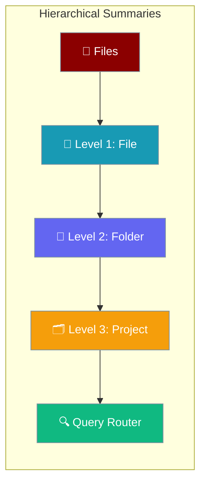
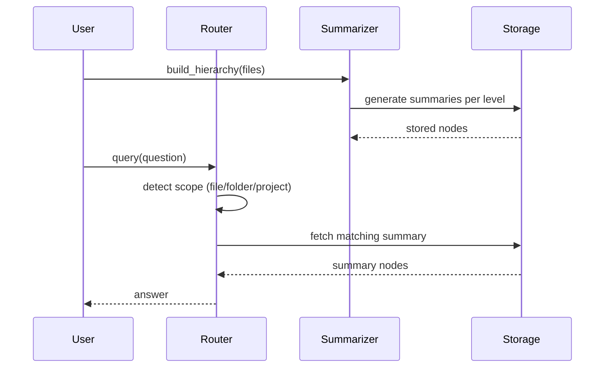

Hierarchical summaries build multi-level abstractions (file → folder → project) for efficient query routing in large knowledge bases.



## Quick Start

<Steps>
<Step title="Build a hierarchy">
```python
from praisonaiagents.rag import HierarchicalSummarizer

summarizer = HierarchicalSummarizer(max_levels=3)

files = ["./docs/api.md", "./docs/auth.md", "./docs/config.md"]
result = summarizer.build_hierarchy(files, base_path="./docs")
```
</Step>

<Step title="Query the hierarchy">
```python
answer = summarizer.query("How do I authenticate?")
print(answer)

# Persist for later reuse
summarizer.save("./summaries/hierarchy.json")
```
</Step>
</Steps>

---

## How It Works



---

## Building Hierarchies

### From Directory

```python
import os
from praisonaiagents.rag import HierarchicalSummarizer

summarizer = HierarchicalSummarizer(max_levels=3)

# Collect files
files = []
for root, _, filenames in os.walk("./docs"):
    for f in filenames:
        if f.endswith(('.md', '.txt', '.py')):
            files.append(os.path.join(root, f))

# Build hierarchy
result = summarizer.build_hierarchy(files, base_path="./docs")

print(f"Files processed: {len(files)}")
print(f"Summary nodes: {len(result.nodes)}")
```

### Summary Levels

| Level | Scope | Description |
|-------|-------|-------------|
| 1 | File | Summary of individual file content |
| 2 | Folder | Summary of all files in a folder |
| 3 | Project | Summary of entire project/corpus |

```python
# Configure levels
summarizer = HierarchicalSummarizer(
    max_levels=3,
    file_summary_tokens=500,
    folder_summary_tokens=1000,
    project_summary_tokens=2000,
)
```

## Query Routing

### Automatic Routing

The system automatically routes queries to the appropriate level:

```python
# Specific query -> routes to file level
answer = summarizer.query("What parameters does the auth function accept?")

# Broader query -> routes to folder level
answer = summarizer.query("What authentication methods are available?")

# High-level query -> routes to project level
answer = summarizer.query("What is this project about?")
```

### Manual Level Selection

```python
# Query specific level
answer = summarizer.query(
    "Overview of the project",
    level="project",
)

# Query folder level
answer = summarizer.query(
    "What's in the API folder?",
    level="folder",
    path="api/",
)
```

## Persistence

### Saving Hierarchies

```python
# Save to file
summarizer.save("./summaries/hierarchy.json")

# Load from file
summarizer.load("./summaries/hierarchy.json")
```

### Incremental Updates

```python
# Update when files change
summarizer.update_file("./docs/new_file.md")

# Rebuild folder summary
summarizer.rebuild_folder("./docs/api/")
```

## CLI Usage

```bash
# Build hierarchical summaries
praisonai knowledge summarize ./docs

# Specify levels
praisonai knowledge summarize ./docs --levels 2

# Save to output directory
praisonai knowledge summarize ./docs --output ./summaries

# With include/exclude patterns
praisonai knowledge summarize ./docs -i "*.md,*.txt" -e "test_*"

# Verbose output
praisonai knowledge summarize ./docs --verbose
```

## Integration with Agents

```python
from praisonaiagents import Agent

agent = Agent(
    name="HierarchicalAgent",
    instructions="Answer questions using the knowledge base.",
    knowledge={
        "sources": ["./docs"],
        "retrieval_k": 5,
    }
)

# High-level question uses project summary
response = agent.chat("What is this project about?")

# Specific question drills down to file level
response = agent.chat("What are the auth function parameters?")
```

## Summary Nodes

### SummaryNode Structure

```python
from dataclasses import dataclass
from typing import List, Optional

@dataclass
class SummaryNode:
    path: str
    level: int  # 1=file, 2=folder, 3=project
    summary: str
    token_count: int
    children: List[str] = None
    parent: Optional[str] = None
```

### Working with Nodes

```python
result = summarizer.build_hierarchy(files, base_path="./docs")

for node in result.nodes:
    print(f"Level {node.level}: {node.path}")
    print(f"  Summary: {node.summary[:100]}...")
    print(f"  Tokens: {node.token_count}")
```

## Best Practices

<AccordionGroup>
<Accordion title="Use 3 levels for most projects">
File → Folder → Project covers the majority of navigation needs. Add a 4th level only for mono-repos with deeply nested directories.
</Accordion>

<Accordion title="Set appropriate token limits per level">
Higher levels need more tokens to summarize broader scope.

```python
summarizer = HierarchicalSummarizer(
    file_summary_tokens=500,
    folder_summary_tokens=1000,
    project_summary_tokens=2000,
)
```
</Accordion>

<Accordion title="Persist hierarchies to avoid rebuilding">
Call `save()` after each `build_hierarchy()` and `load()` at startup to skip re-summarizing unchanged files.
</Accordion>

<Accordion title="Use incremental updates for large corpora">
Call `update_file()` and `rebuild_folder()` instead of rebuilding the entire hierarchy when only a few files change.
</Accordion>
</AccordionGroup>

---

## Related

<CardGroup cols={2}>
<Card title="Smart Retrieval" icon="magnifying-glass" href="/features/smart-retrieval">
  Hybrid search with reranking for knowledge bases
</Card>
<Card title="Large Context Overview" icon="database" href="/features/large-context-overview">
  Complete guide to large knowledge base handling
</Card>
</CardGroup>

---

## API Reference

### HierarchicalSummarizer

```python
class HierarchicalSummarizer:
    def __init__(
        self,
        max_levels: int = 3,
        file_summary_tokens: int = 500,
        folder_summary_tokens: int = 1000,
        project_summary_tokens: int = 2000,
    ):
        """Initialize hierarchical summarizer."""
    
    def build_hierarchy(
        self,
        files: List[str],
        base_path: str = None,
    ) -> HierarchyResult:
        """Build summary hierarchy from files."""
    
    def query(
        self,
        query: str,
        level: str = None,
        path: str = None,
    ) -> str:
        """Query the hierarchy."""
    
    def save(self, path: str) -> None:
        """Save hierarchy to file."""
    
    def load(self, path: str) -> None:
        """Load hierarchy from file."""
```

### HierarchyResult

```python
@dataclass
class HierarchyResult:
    nodes: List[SummaryNode]
    root_path: str
    total_files: int
    total_tokens: int
```
