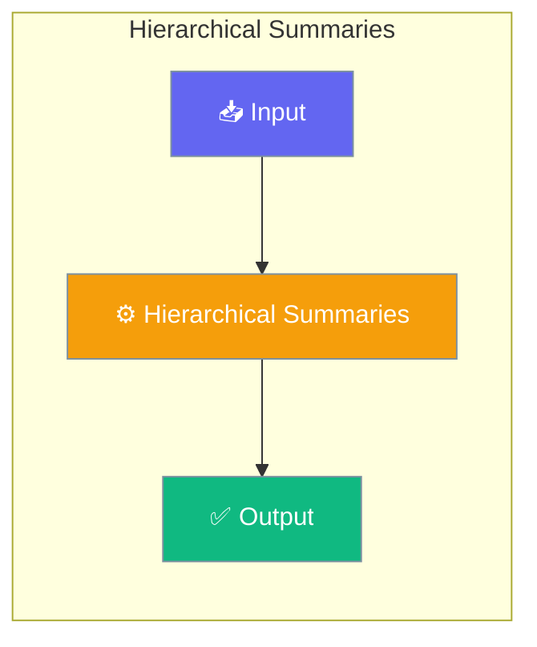

# Hierarchical Summaries

Hierarchical summaries build multi-level abstractions (file → folder → project) for efficient query routing in large knowledge bases.




## Overview

The HierarchicalSummarizer provides:
- **Multi-level summaries** at file, folder, and project levels
- **Query routing** to appropriate summary levels
- **Incremental updates** when files change
- **Persistent storage** of summary hierarchies

## Quick Start


<Steps>
<Step title="Quick Start">
```python
from praisonaiagents.rag import HierarchicalSummarizer

summarizer = HierarchicalSummarizer(max_levels=3)

# Build hierarchy from files
files = ["./docs/api.md", "./docs/auth.md", "./docs/config.md"]
result = summarizer.build_hierarchy(files, base_path="./docs")

# Query the hierarchy
answer = summarizer.query("How do I authenticate?")
print(answer)
```
</Step>
</Steps>


## Best Practices

<AccordionGroup>
  <Accordion title="Start simple">
    Enable the feature with a single parameter before adding configuration. Verify it works, then layer in options.
  </Accordion>
  <Accordion title="Use environment variables for secrets">
    Never hardcode API keys or tokens. Use `os.getenv("KEY_NAME")` to read from environment variables.
  </Accordion>
  <Accordion title="Test with minimal examples first">
    Copy the Quick Start example, run it, then extend it. This confirms your environment is set up correctly.
  </Accordion>
  <Accordion title="Check the logs">
    Set `verbose=True` on your agent to see detailed execution logs when debugging unexpected behavior.
  </Accordion>
</AccordionGroup>

## Related

<CardGroup cols={2}>
  <Card title="Features Overview" icon="grid-2" href="/docs/features">
    Browse all PraisonAI features
  </Card>
  <Card title="Quick Start" icon="rocket" href="/docs/introduction">
    Get started with PraisonAI agents
  </Card>
</CardGroup>
