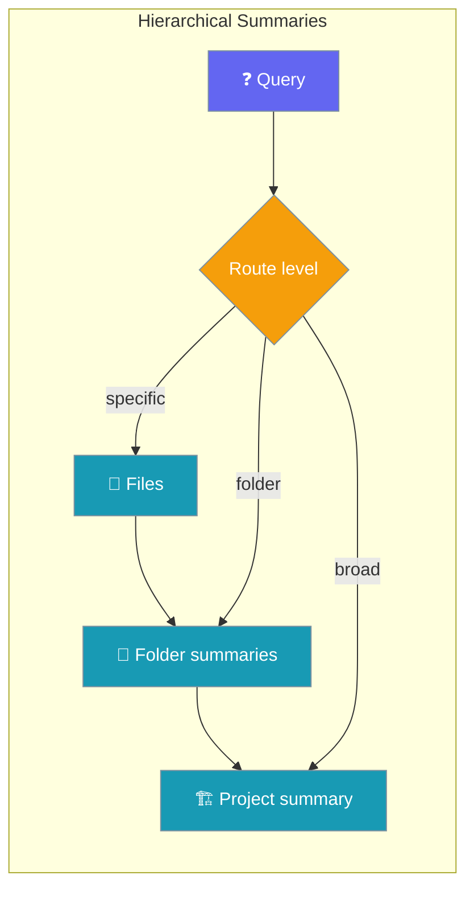

Hierarchical summaries build file → folder → project abstractions so agents route queries efficiently across large knowledge bases.



## Quick Start

<Steps>

<Step title="Build a three-level hierarchy">

```python
from praisonaiagents.rag import HierarchicalSummarizer

summarizer = HierarchicalSummarizer(max_levels=3)

files = ["./docs/api.md", "./docs/auth.md", "./docs/config.md"]
summarizer.build_hierarchy(files, base_path="./docs")

answer = summarizer.query("How do I authenticate?")
print(answer)
```

</Step>

<Step title="Persist and reload">

```python
summarizer.save("./summaries/hierarchy.json")
summarizer.load("./summaries/hierarchy.json")
```

</Step>

</Steps>

---

## Overview

The HierarchicalSummarizer provides:

- **Multi-level summaries** at file, folder, and project levels
- **Query routing** to appropriate summary levels
- **Incremental updates** when files change
- **Persistent storage** of summary hierarchies

## Building Hierarchies

### From Directory

```python
import os
from praisonaiagents.rag import HierarchicalSummarizer

summarizer = HierarchicalSummarizer(max_levels=3)

files = []
for root, _, filenames in os.walk("./docs"):
    for f in filenames:
        if f.endswith(('.md', '.txt', '.py')):
            files.append(os.path.join(root, f))

result = summarizer.build_hierarchy(files, base_path="./docs")

print(f"Files processed: {len(files)}")
print(f"Summary nodes: {len(result.nodes)}")
```

### Summary Levels

| Level | Scope | Description |
|-------|-------|-------------|
| 1 | File | Summary of individual file content |
| 2 | Folder | Summary of all files in a folder |
| 3 | Project | Summary of entire project/corpus |

```python
summarizer = HierarchicalSummarizer(
    max_levels=3,
    file_summary_tokens=500,
    folder_summary_tokens=1000,
    project_summary_tokens=2000,
)
```

## Query Routing

### Automatic Routing

```python
answer = summarizer.query("What parameters does the auth function accept?")
answer = summarizer.query("What authentication methods are available?")
answer = summarizer.query("What is this project about?")
```

### Manual Level Selection

```python
answer = summarizer.query("Overview of the project", level="project")
answer = summarizer.query("What's in the API folder?", level="folder", path="api/")
```

## Persistence

```python
summarizer.save("./summaries/hierarchy.json")
summarizer.load("./summaries/hierarchy.json")

summarizer.update_file("./docs/new_file.md")
summarizer.rebuild_folder("./docs/api/")
```

## CLI Usage

```bash
praisonai knowledge summarize ./docs
praisonai knowledge summarize ./docs --levels 2 --output ./summaries
praisonai knowledge summarize ./docs -i "*.md,*.txt" -e "test_*" --verbose
```

## Integration with Agents

```python
from praisonaiagents import Agent

agent = Agent(
    name="HierarchicalAgent",
    instructions="Answer questions using the knowledge base.",
    knowledge={
        "sources": ["./docs"],
        "retrieval_k": 5,
    },
)

response = agent.start("What is this project about?")
response = agent.start("What are the auth function parameters?")
```

## Best Practices

<AccordionGroup>

<Accordion title="Use three levels for most projects">
File, folder, and project summaries balance routing precision with build cost for typical documentation corpora.
</Accordion>

<Accordion title="Set token limits per level">
Keep file summaries shorter than folder summaries, and folder summaries shorter than the project root — avoids bloated parent nodes.
</Accordion>

<Accordion title="Persist hierarchies to disk">
Save to JSON after the initial build so startup skips re-summarising unchanged files.
</Accordion>

<Accordion title="Rebuild incrementally on change">
Call `update_file()` or `rebuild_folder()` instead of rebuilding the entire tree when only part of the corpus changes.
</Accordion>

</AccordionGroup>

---

## Related

<CardGroup cols={2}>
  <Card title="Knowledge" icon="book" href="/docs/features/knowledge">
    Knowledge sources and retrieval
  </Card>
  <Card title="Smart Retrieval" icon="magnifying-glass" href="/docs/features/smart-retrieval">
    Query routing and relevance strategies
  </Card>
  <Card title="Context Compression" icon="compress" href="/docs/features/context-compression">
    Compress long contexts before LLM calls
  </Card>
  <Card title="RAG Overview" icon="database" href="/docs/features/rag">
    Retrieval-augmented generation patterns
  </Card>
</CardGroup>
