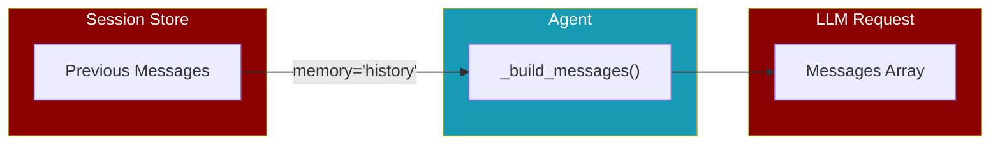

<Info>
History injection is enabled via memory presets like `memory="history"` or `memory=MemoryConfig(history=True)`.
</Info>

## Overview

History injection automatically loads previous conversation messages from a session and includes them in the agent's context. This enables:

- **Multi-turn conversations** across sessions
- **Context continuity** when users return
- **Persistent memory** without complex setup



## Quick Start

<Tabs>
  <Tab title="Preset (Simple)">
    ```python
    from praisonaiagents import Agent

    # Enable history with defaults (last 10 messages)
    agent = Agent(
        name="assistant",
        instructions="Be helpful",
        memory="history"
    )
    ```
  </Tab>
  <Tab title="Chat Preset">
    ```python
    from praisonaiagents import Agent

    # Conversational preset (last 20 messages)
    agent = Agent(
        name="assistant",
        instructions="Be helpful",
        memory="chat"
    )
    ```
  </Tab>
  <Tab title="Custom Limit">
    ```python
    from praisonaiagents import Agent
    from praisonaiagents.config import MemoryConfig

    # Custom history limit
    agent = Agent(
        name="assistant",
        instructions="Be helpful",
        memory=MemoryConfig(history=True, history_limit=5)
    )
    ```
  </Tab>
</Tabs>

## Memory Presets

Enable history via memory presets:

| Preset | History Limit | Description |
|--------|--------------|-------------|
| `memory="history"` | 10 messages | Standard history injection |
| `memory="session"` | 10 messages | Alias for "history" |
| `memory="chat"` | 20 messages | Conversational (more context) |

<CodeGroup>
```python history
# Enable history via memory preset
agent = Agent(
    name="assistant",
    memory="history"  # Enables history with file backend
)
```

```python session
# Alias for history preset
agent = Agent(
    name="assistant",
    memory="session"  # Same as "history"
)
```

```python chat
# Conversational preset with higher limit
agent = Agent(
    name="assistant",
    memory="chat"  # history_limit=20
)
```
</CodeGroup>

## MemoryConfig

For full control, use `MemoryConfig`:

```python
from praisonaiagents import Agent
from praisonaiagents.config import MemoryConfig

agent = Agent(
    name="assistant",
    instructions="Be helpful",
    memory=MemoryConfig(
        history=True,       # Enable history injection
        history_limit=15    # Last 15 messages
    )
)
```

<Expandable title="MemoryConfig History Fields">
  <ParamField path="history" type="bool" default="False">
    Whether history injection is enabled
  </ParamField>
  <ParamField path="history_limit" type="int" default="10">
    Maximum number of messages to inject (most recent)
  </ParamField>
</Expandable>

## With auto_save

When using `auto_save`, the session ID is automatically used for history:

```python
from praisonaiagents import Agent

agent = Agent(
    name="assistant",
    auto_save="my-session",  # Session name
    memory="history"  # Uses "my-session" for history
)

# First conversation
agent.start("Hello!")

# Later, same session continues
agent2 = Agent(
    name="assistant",
    auto_save="my-session",
    memory="history"  # Loads previous messages
)
agent2.start("What did I say before?")  # Has context!
```

## How It Works

<Steps>
  <Step title="Agent Initialization">
    History settings are resolved from `memory` parameter:
    - `memory="history"` → enabled with limit=10
    - `memory="chat"` → enabled with limit=20
    - `memory=MemoryConfig(history=True, history_limit=N)` → custom limit
  </Step>
  <Step title="Message Building">
    When `_build_messages()` is called:
    1. System prompt is added
    2. **Session history is injected** (if enabled)
    3. In-memory chat history is added
    4. User prompt is added
  </Step>
  <Step title="Session Store">
    History is loaded from the session store using `get_chat_history(session_id, max_messages=limit)`
  </Step>
</Steps>

## Best Practices

<CardGroup cols={2}>
  <Card title="Set Reasonable Limits" icon="gauge">
    Use `memory="history"` (10 messages) to avoid token bloat. More history = more tokens = higher cost.
  </Card>
  <Card title="Use Session IDs" icon="fingerprint">
    Always use meaningful session IDs like `user-{user_id}` for multi-user apps via `auto_save`.
  </Card>
  <Card title="Combine with auto_save" icon="floppy-disk">
    Use `auto_save` to persist conversations and `memory="history"` to reload them.
  </Card>
  <Card title="Test Token Usage" icon="coins">
    Monitor token usage when enabling history to ensure costs stay reasonable.
  </Card>
</CardGroup>

## Comparison

| Feature | `memory=True` | `memory="history"` | `memory="chat"` |
|---------|---------------|-------------------|-----------------|
| Enables memory backend | ✅ | ✅ | ✅ |
| Injects session history | ❌ | ✅ (10 msgs) | ✅ (20 msgs) |
| Long-term memory | ✅ | ✅ | ✅ |

<Tip>
Use `memory="history"` for conversation continuity with reasonable context. Use `memory="chat"` for longer conversational context.
</Tip>

## Related

<CardGroup cols={2}>
  <Card title="Memory" href="/memory/overview" icon="brain">
    Full memory system with backends
  </Card>
  <Card title="Sessions" href="/features/sessions" icon="clock">
    Session management and persistence
  </Card>
</CardGroup>
