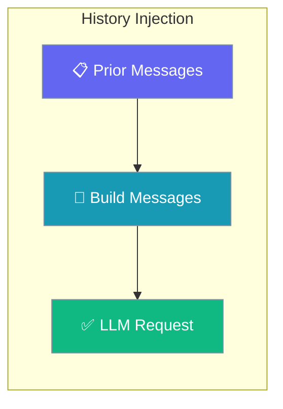
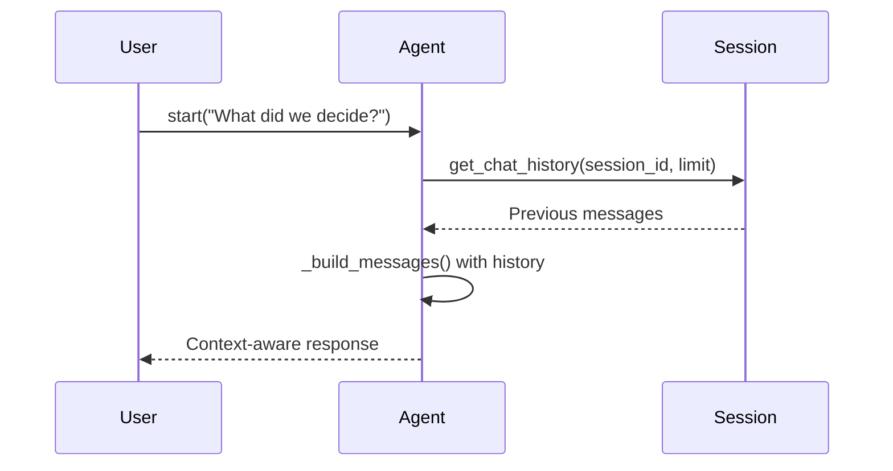

<Info>
History injection is enabled via memory presets like `memory="history"` or `memory=MemoryConfig(history=True)`.
</Info>

Session history is preserved even across long conversations — see [Retention Policies](/docs/features/session-persistence#retention-policies) for how overflow is summarised and archived.

## Overview

History injection automatically loads previous conversation messages from a session and includes them in the agent's context. This enables:

- **Multi-turn conversations** across sessions
- **Context continuity** when users return
- **Persistent memory** without complex setup

```python
from praisonaiagents import Agent

agent = Agent(
    name="assistant",
    instructions="Continue our conversation with prior turns in context",
    memory="history",
)

agent.start("What did we decide yesterday?")
```

The user returns to a session; prior messages are injected before the model runs.


```mermaid
graph LR
    subgraph "History Injection"
        H1[📋 Prior Messages] --> B[🧠 Build Messages]
        B --> M[✅ LLM Request]
    end

    classDef input fill:#6366F1,stroke:#7C90A0,color:#fff
    classDef tool fill:#189AB4,stroke:#7C90A0,color:#fff
    classDef output fill:#10B981,stroke:#7C90A0,color:#fff
    class H1 input
    class B tool
    class M output
```

## Quick Start

<Steps>
<Step title="Simple Usage">
<Tabs>
  <Tab title="Preset (Simple)">
    ```python
    from praisonaiagents import Agent

    # Enable history with defaults (last 10 messages)
    agent = Agent(
        name="assistant",
        instructions="Be helpful",
        memory="history"
    )
    ```
  </Tab>
  <Tab title="Chat Preset">
    ```python
    from praisonaiagents import Agent

    # Conversational preset (last 20 messages)
    agent = Agent(
        name="assistant",
        instructions="Be helpful",
        memory="chat"
    )
    ```
  </Tab>
  <Tab title="Custom Limit">
    ```python
    from praisonaiagents import Agent
    from praisonaiagents import MemoryConfig

    # Custom history limit
    agent = Agent(
        name="assistant",
        instructions="Be helpful",
        memory=MemoryConfig(history=True, history_limit=5)
    )
    ```
  </Tab>
</Tabs>
</Step>
<Step title="With Configuration">
Switch presets (memory="chat") or use a MemoryConfig for token limits and injection rules — see the remaining tabs.
</Step>
</Steps>

## Memory Presets

Enable history via memory presets:

| Preset | History Limit | Description |
|--------|--------------|-------------|
| `memory="history"` | 10 messages | Standard history injection |
| `memory="session"` | 10 messages | Alias for "history" |
| `memory="chat"` | 20 messages | Conversational (more context) |

<CodeGroup>
```python history
# Enable history via memory preset
agent = Agent(
    name="assistant",
    memory="history"  # Enables history with file backend
)
```

```python session
# Alias for history preset
agent = Agent(
    name="assistant",
    memory="session"  # Same as "history"
)
```

```python chat
# Conversational preset with higher limit
agent = Agent(
    name="assistant",
    memory="chat"  # history_limit=20
)
```
</CodeGroup>

## MemoryConfig

For full control, use `MemoryConfig`:

```python
from praisonaiagents import Agent
from praisonaiagents import MemoryConfig

agent = Agent(
    name="assistant",
    instructions="Be helpful",
    memory=MemoryConfig(
        history=True,       # Enable history injection
        history_limit=15    # Last 15 messages
    )
)
```

<Expandable title="MemoryConfig History Fields">
  <ParamField path="history" type="bool" default="False">
    Whether history injection is enabled
  </ParamField>
  <ParamField path="history_limit" type="int" default="10">
    Maximum number of messages to inject (most recent)
  </ParamField>
</Expandable>

<Note>
  Default sessions are **workspace-scoped** — the same agent name in a different project is a different session. See [Where sessions live](/docs/memory/features#where-sessions-live) for details and the `PRAISONAI_GLOBAL_SESSIONS` opt-out.
</Note>

## With auto_save

When using `auto_save`, the session ID is automatically used for history:

<Tabs>
  <Tab title="MemoryConfig (Recommended)">
```python
from praisonaiagents import Agent
from praisonaiagents import MemoryConfig

agent = Agent(
    name="assistant",
    memory=MemoryConfig(auto_save="my-session", history=True)
)

agent.start("Hello!")

# Later, same session continues
agent2 = Agent(
    name="assistant",
    memory=MemoryConfig(auto_save="my-session", history=True)
)
agent2.start("What did I say before?")  # Has context!
```
  </Tab>
  <Tab title="Legacy (Deprecated)">
```python
from praisonaiagents import Agent

agent = Agent(
    name="assistant",
    auto_save="my-session",  # Deprecated standalone param
    memory="history"
)
```
  </Tab>
</Tabs>

## How It Works

The user sends a message; the agent loads prior turns from the session store and prepends them to the messages array before calling the model.


```mermaid
sequenceDiagram
    participant User
    participant Agent
    participant Session

    User->>Agent: start("What did we decide?")
    Agent->>Session: get_chat_history(session_id, limit)
    Session-->>Agent: Previous messages
    Agent->>Agent: _build_messages() with history
    Agent-->>User: Context-aware response
```

<Steps>
  <Step title="Agent Initialization">
    History settings are resolved from `memory` parameter:
    - `memory="history"` → enabled with limit=10
    - `memory="chat"` → enabled with limit=20
    - `memory=MemoryConfig(history=True, history_limit=N)` → custom limit
  </Step>
  <Step title="Message Building">
    When `_build_messages()` is called:
    1. System prompt is added
    2. **Session history is injected** (if enabled)
    3. In-memory chat history is added
    4. User prompt is added
  </Step>
  <Step title="Session Store">
    History is loaded from the session store using `get_working_history(session_id, max_messages=limit)` when the store supports it — this replays a compacted summary + retained tail if a compaction checkpoint exists. Stores that implement only `get_chat_history` fall back to raw history automatically. See [Compacted Session Resume](/docs/features/session-compaction-checkpoint).
  </Step>
</Steps>

<Note>
**Per-turn persistence is exact.** When `memory="history"` (or `MemoryConfig(history=True)`) is combined with `auto_save`, each agent turn persists exactly the user message and the assistant response — no duplicates, even on repeated `save_state()` calls. Fixed in PraisonAI PR #1897.
</Note>

## Best Practices

<AccordionGroup>

<Accordion title="Set reasonable limits">
Use `memory="history"` (10 messages) to avoid token bloat. More history means more tokens and higher cost.
</Accordion>

<Accordion title="Use meaningful session IDs">
Always use session IDs like `user-{user_id}` for multi-user apps via `auto_save`.
</Accordion>

<Accordion title="Combine with auto_save">
Use `auto_save` to persist conversations and `memory="history"` to reload them. Repeated turns persist incrementally.
</Accordion>

<Accordion title="Monitor token usage">
Monitor token usage when enabling history to ensure costs stay reasonable.
</Accordion>

</AccordionGroup>

## Comparison

| Feature | `memory=True` | `memory="history"` | `memory="chat"` |
|---------|---------------|-------------------|-----------------|
| Enables memory backend | ✅ | ✅ | ✅ |
| Injects session history | ❌ | ✅ (10 msgs) | ✅ (20 msgs) |
| Long-term memory | ✅ | ✅ | ✅ |

<Tip>
Use `memory="history"` for conversation continuity with reasonable context. Use `memory="chat"` for longer conversational context.
</Tip>

## Related

<CardGroup cols={2}>
  <Card title="Memory" href="/docs/memory/overview" icon="brain">
    Full memory system with backends
  </Card>
  <Card title="Sessions" href="/docs/features/sessions" icon="clock">
    Session management and persistence
  </Card>
</CardGroup>
