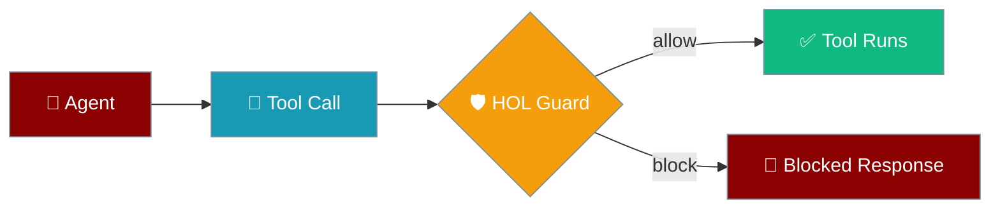
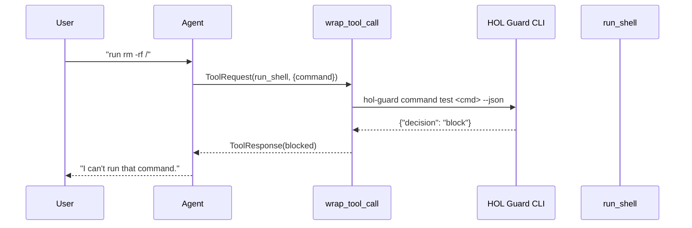
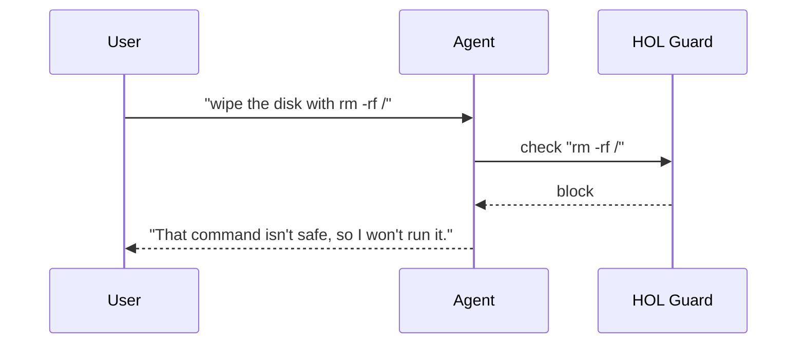

HOL Guard checks every shell command your agent proposes and only lets safe ones run.



HOL Guard is an external, optional security engine. Install it separately, then wrap your command-bearing tools with one `@wrap_tool_call` policy — every unsafe command is blocked before it runs.

## Quick Start

<Steps>
<Step title="Install HOL Guard">

HOL Guard is a separate CLI. Install it once:

```bash
pip install hol-guard
```

</Step>

<Step title="Add the guard policy to your agent">

```python
import json
import shutil
import subprocess

from praisonaiagents import Agent, tool
from praisonaiagents.hooks import wrap_tool_call, ToolRequest, ToolResponse

COMMAND_BEARING_TOOLS = {"run_shell"}
GUARD_TIMEOUT_SECONDS = 10


@tool
def run_shell(command: str) -> str:
    """Run a shell command and return its output."""
    result = subprocess.run(command, shell=True, capture_output=True, text=True)
    return result.stdout or result.stderr


def _inspect_with_hol_guard(command: str) -> bool:
    if not shutil.which("hol-guard"):
        return False
    try:
        completed = subprocess.run(
            ["hol-guard", "command", "test", command, "--json"],
            capture_output=True, text=True, timeout=GUARD_TIMEOUT_SECONDS,
        )
    except (subprocess.TimeoutExpired, OSError):
        return False
    if completed.returncode != 0:
        return False
    try:
        verdict = json.loads(completed.stdout)
    except (json.JSONDecodeError, ValueError):
        return False
    if not isinstance(verdict, dict):
        return False
    decision = str(verdict.get("decision", "")).lower()
    return decision in ("allow", "benign")


@wrap_tool_call
def hol_guard_tool_policy(request: ToolRequest, call_next):
    if request.tool_name not in COMMAND_BEARING_TOOLS:
        return call_next(request)

    command = request.arguments.get("command", "")

    if _inspect_with_hol_guard(command):
        return call_next(request)

    blocked_message = "Blocked by HOL Guard: command was not explicitly allowed."
    return ToolResponse(
        tool_name=request.tool_name,
        result=blocked_message,
        error=blocked_message,
        context=request.context,
    )


agent = Agent(
    name="GuardedShellBot",
    instructions="You run shell commands only when they are safe.",
    tools=[run_shell],
    hooks=[hol_guard_tool_policy],
)
```

</Step>

<Step title="Run and see a blocked command">

```python
agent.start("Delete every file with: rm -rf /")
```

HOL Guard inspects the command, returns a non-allow verdict, and the agent receives the blocked message instead of running the tool.

</Step>
</Steps>

---

## How It Works

Every command-bearing tool call passes through HOL Guard's CLI before it can execute.



| Step | What happens |
|------|--------------|
| Tool call | The agent proposes a `run_shell` command |
| Guard check | The policy shells out to `hol-guard command test` |
| Verdict | Only `allow` or `benign` reach the real tool |
| Block | Any other outcome returns a `ToolResponse` with `error` set |

Tools that are not in `COMMAND_BEARING_TOOLS` skip the guard entirely and run untouched.

---

## Configuration Options

Tune the policy by editing the constants in the example.

| Option | Type | Default | Description |
|--------|------|---------|-------------|
| `COMMAND_BEARING_TOOLS` | `set[str]` | `{"run_shell"}` | Tool names that must pass Guard before running |
| `GUARD_TIMEOUT_SECONDS` | `int` | `10` | Kill Guard's CLI if it hasn't answered in this many seconds |
| Verdict allow-list | `set[str]` | `{"allow", "benign"}` | Only these Guard decisions reach the wrapped tool |

---

## Fail-Closed Decision Matrix

The policy runs the tool only on an explicit safe verdict — everything else blocks.

| Situation | Wrapped tool runs? |
|-----------|--------------------|
| Guard returns `{"decision": "allow"}` | ✅ yes |
| Guard returns `{"decision": "benign"}` | ✅ yes |
| Guard returns `{"decision": "block"}` / `"review"` / `"unknown"` | ❌ no |
| Guard CLI not on PATH | ❌ no |
| Guard exits non-zero | ❌ no |
| Guard times out (> `GUARD_TIMEOUT_SECONDS`) | ❌ no |
| Guard emits malformed / non-object JSON | ❌ no |
| Tool is not in `COMMAND_BEARING_TOOLS` | ✅ passes through untouched (Guard not called) |

---

## User Interaction Flow

A real user asks for an unsafe command; HOL Guard blocks it and the agent refuses politely.



---

## Common Patterns

**Widen the tool allow-list** — add more command-bearing tools to the set:

```python
COMMAND_BEARING_TOOLS = {"run_shell", "run_script", "exec_command"}
```

**Log every blocked verdict** with an `after_tool` hook:

```python
from praisonaiagents.hooks import after_tool, ToolResponse

@after_tool
def log_blocks(response: ToolResponse):
    if response.error:
        print(f"[guard] blocked {response.tool_name}: {response.error}")
    return response
```

**Combine with `before_tool` argument validation** for defense in depth:

```python
from praisonaiagents.hooks import before_tool, ToolRequest

@before_tool
def require_command(request: ToolRequest):
    if request.tool_name in COMMAND_BEARING_TOOLS and not request.arguments.get("command"):
        raise ValueError("run_shell requires a non-empty command.")
    return request
```

---

## Best Practices

<AccordionGroup>
<Accordion title="Set both result and error on the blocked ToolResponse">
  The tool executor returns `ToolResponse.result` to the model and discards `error`. Set `result` so the model sees the block, and keep `error` populated so `after_tool` hooks and logs still have the signal. Setting only `error` would surface as a `null` result.
</Accordion>

<Accordion title="Keep Guard external">
  Do not vendor `hol-guard` into your agent's dependency tree. Installing it separately preserves independent versioning and lets ops teams patch Guard without a code deploy.
</Accordion>

<Accordion title="Timeout aggressively">
  Guard is on the hot path. `GUARD_TIMEOUT_SECONDS=10` is a ceiling, not a target — a slow Guard fails closed and blocks the command.
</Accordion>

<Accordion title="Prefer allow-lists to block-lists">
  The example checks for `allow`/`benign` explicitly and fails closed on everything else, including verdicts introduced in future Guard versions.
</Accordion>
</AccordionGroup>

---

## Related

<CardGroup cols={2}>
<Card title="Middleware" icon="webhook" href="/features/middleware">
  Intercept and modify model and tool calls with before/after hooks and wrap decorators
</Card>
<Card title="Hooks" icon="code-branch" href="/features/hooks">
  Event-based hooks for agent lifecycle events
</Card>
</CardGroup>
