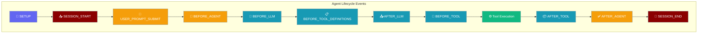

Hook events are triggered at specific points in the agent lifecycle, allowing you to intercept, modify, or block operations.

<Note>
This page covers **in-process lifecycle hooks** (SETUP, SESSION_START, BEFORE_AGENT, etc.) that fire inside a running agent. For **HTTP inbound triggers** that start agent runs from external services via `POST /hooks/<path>`, see [Gateway Inbound Hooks](/docs/features/gateway-inbound-hooks).
</Note>


```python
from praisonaiagents import Agent
from praisonaiagents.hooks import add_hook

@add_hook("before_tool")
def log_tool(event_data):
    print(f"Tool: {event_data.tool_name}")

agent = Agent(name="MyAgent", instructions="Be helpful.")
agent.start("Run a tool and show lifecycle hooks")
```

The user sends a prompt; hooks fire at each lifecycle event as the agent runs.


```mermaid
graph TB
    subgraph "Agent Lifecycle Events"
        A[🚀 SETUP] --> B[📥 SESSION_START]
        B --> C[💬 USER_PROMPT_SUBMIT]
        C --> D[🤖 BEFORE_AGENT]
        D --> E[🧠 BEFORE_LLM]
        E --> F[📋 BEFORE_TOOL_DEFINITIONS]
        F --> G[📤 AFTER_LLM]
        G --> H[🔧 BEFORE_TOOL]
        H --> I[⚙️ Tool Execution]
        I --> J[📦 AFTER_TOOL]
        J --> K[✅ AFTER_AGENT]
        K --> L[📴 SESSION_END]
    end
    
    classDef setup fill:#6366F1,stroke:#7C90A0,color:#fff
    classDef session fill:#8B0000,stroke:#7C90A0,color:#fff
    classDef agent fill:#F59E0B,stroke:#7C90A0,color:#fff
    classDef tool fill:#189AB4,stroke:#7C90A0,color:#fff
    classDef result fill:#10B981,stroke:#7C90A0,color:#fff
    
    class A setup
    class B,L session
    class C,D,K agent
    class E,F,G,H,J tool
    class I result

```

## Quick Start

<Steps>

<Step title="Import Hook Components">
```python
from praisonaiagents.hooks import HookRegistry, HookEvent, HookResult
```
</Step>

<Step title="Register a Hook">
```python
registry = HookRegistry()

@registry.on(HookEvent.BEFORE_TOOL)
def log_tool(event_data):
    print(f"Tool: {event_data.tool_name}")
    return HookResult.allow()
```
</Step>

<Step title="Use with Agent">
```python
from praisonaiagents import Agent

agent = Agent(
    name="MyAgent",
    instructions="You are helpful",
    hooks=registry
)
```
</Step>

</Steps>

---

## Core Events

### Tool Events

| Event | Trigger | Input Type | Use Case |
|-------|---------|------------|----------|
| `BEFORE_TOOL` | Before tool execution | `BeforeToolInput` | Security checks, logging |
| `AFTER_TOOL` | After tool execution | `AfterToolInput` | Result validation, logging |

```python
@registry.on(HookEvent.BEFORE_TOOL)
def before_tool(event_data):
    print(f"Calling: {event_data.tool_name}")
    print(f"Args: {event_data.arguments}")
    return HookResult.allow()

@registry.on(HookEvent.AFTER_TOOL)
def after_tool(event_data):
    print(f"Result: {event_data.result}")
    return HookResult.allow()
```

### Tool Definition Events

| Event | Trigger | Input Type | Use Case |
|-------|---------|------------|----------|
| `BEFORE_TOOL_DEFINITIONS` | After advertised tool list is assembled, before sent to LLM | `BeforeToolDefinitionsInput` | Redact tools per request, append usage notes, constrain schema per model |

`BEFORE_TOOL_DEFINITIONS` lets you shape the tool list the LLM actually sees — without changing the agent's permanent tool registration. Mutate `tool_definitions` **in place**; the runtime only adopts in-place mutations.

<Warning>
Mutate in place using `event_data.tool_definitions[:] = [...]`. Reassigning the local name (`event_data.tool_definitions = [...]`) is silently ignored by the runtime.
</Warning>

#### BeforeToolDefinitionsInput Fields

| Field | Type | Default | Description |
|-------|------|---------|-------------|
| `tool_definitions` | `List[Dict[str, Any]]` | `[]` | The fully-assembled OpenAI-style tool definition list about to be sent to the LLM. Mutate **in place** to filter or rewrite. |
| `model` | `str` | `""` | Model id the call will be sent to (e.g. `"gpt-4o"`). Use for per-model filtering. |
| `session_id`, `cwd`, `event_name`, `timestamp`, `agent_name` | — | — | Standard `HookInput` fields. |

```python
from praisonaiagents import Agent
from praisonaiagents.hooks import HookRegistry, HookEvent, HookResult

registry = HookRegistry()

@registry.on(HookEvent.BEFORE_TOOL_DEFINITIONS)
def sandbox_tools(event_data):
    # Drop dangerous tools for this request
    event_data.tool_definitions[:] = [
        t for t in event_data.tool_definitions
        if t["function"]["name"] != "delete_file"
    ]
    # Annotate remaining tools
    for t in event_data.tool_definitions:
        if t["function"]["name"] == "read_file":
            t["function"]["description"] += " (sandboxed: /workspace only)"
    return HookResult.allow()

agent = Agent(
    name="SafeAgent",
    instructions="Help the user with file operations.",
    hooks=registry,
)

agent.start("List my files")
```

**Per-model filtering** using the `model` field:

```python
@registry.on(HookEvent.BEFORE_TOOL_DEFINITIONS)
def small_model_subset(event_data):
    if event_data.model.startswith("gpt-3.5"):
        event_data.tool_definitions[:] = event_data.tool_definitions[:5]
    return HookResult.allow()
```

### Agent Events

| Event | Trigger | Input Type | Use Case |
|-------|---------|------------|----------|
| `BEFORE_AGENT` | Before agent runs | `BeforeAgentInput` | Setup, initialization |
| `AFTER_AGENT` | After agent completes | `AfterAgentInput` | Cleanup, reporting |

```python
@registry.on(HookEvent.BEFORE_AGENT)
def before_agent(event_data):
    print(f"Agent starting: {event_data.agent_name}")
    return HookResult.allow()

@registry.on(HookEvent.AFTER_AGENT)
def after_agent(event_data):
    print(f"Agent completed: {event_data.result}")
    return HookResult.allow()
```

### LLM Events

| Event | Trigger | Input Type | Use Case |
|-------|---------|------------|----------|
| `BEFORE_LLM` | Before LLM API call | `BeforeLLMInput` | Request modification |
| `AFTER_LLM` | After LLM response | `AfterLLMInput` | Response validation |

```python
@registry.on(HookEvent.BEFORE_LLM)
def before_llm(event_data):
    print(f"Model: {event_data.model}")
    print(f"Messages: {len(event_data.messages)}")
    return HookResult.allow()

@registry.on(HookEvent.AFTER_LLM)
def after_llm(event_data):
    print(f"Response length: {len(event_data.response)}")
    print(f"Tokens: {event_data.usage}")
    return HookResult.allow()
```

### Session Events

| Event | Trigger | Input Type | Use Case |
|-------|---------|------------|----------|
| `SESSION_START` | When session starts | `SessionStartInput` | Session initialization |
| `SESSION_END` | When session ends | `SessionEndInput` | Session cleanup |

<Note>
**Bot runtime semantics:** In the bot runtime (`BotOS`), `SESSION_START` fires exactly **once per user session lifetime** — on the first message, not on every message. `SESSION_END` fires when the user sends `/new`, when a policy auto-reset triggers, when stale sessions are reaped, or on `reset_all`. The `reason` field on `SessionEndInput` is one of `clear`, `policy`, `stale`, or `clear_all`.
</Note>

```python
@registry.on(HookEvent.SESSION_START)
def session_start(event_data):
    print(f"Session: {event_data.session_id}")
    print(f"Source: {event_data.source}")
    print(f"Platform: {event_data.session_name}")
    return HookResult.allow()

@registry.on(HookEvent.SESSION_END)
def session_end(event_data):
    print(f"Session ended: {event_data.session_id}")
    print(f"Reason: {event_data.reason}")
    return HookResult.allow()
```

### Error Events

| Event | Trigger | Input Type | Use Case |
|-------|---------|------------|----------|
| `ON_ERROR` | When error occurs | `OnErrorInput` | Error handling |
| `ON_RETRY` | Before retry attempt | `OnRetryInput` | Retry logic |

```python
@registry.on(HookEvent.ON_ERROR)
def on_error(event_data):
    print(f"Error: {event_data.error}")
    # Log to external service
    return HookResult.allow()

@registry.on(HookEvent.ON_RETRY)
def on_retry(event_data):
    # New tool-level fields
    print(f"[retry] {event_data.tool_name} attempt {event_data.attempt}/{event_data.max_attempts}")
    print(f"Error type: {event_data.error_type}, delay: {event_data.delay_ms}ms")
    
    # Legacy fields still available for backward compatibility
    # event_data.retry_count, event_data.max_retries, event_data.error_message
    
    if event_data.attempt > 2:
        return HookResult.deny("Too many retries")
    return HookResult.allow()
```

### Async vs Sync

`ON_RETRY` fires on **both** sync and async retry paths. If you register the handler as a regular `def`, it is dispatched in a thread executor on the async path; if you register an `async def`, it is awaited directly. Either form is safe on both paths.

<Note>
Released in PraisonAI #2386 — earlier versions skipped this event on the async path.
</Note>

#### OnRetryInput Fields

The `OnRetryInput` event includes both new tool-specific fields and legacy fields for backward compatibility:

**New fields (recommended):**
- `tool_name`: Name of the failing tool
- `attempt`: Current attempt number (1-based)  
- `max_attempts`: Maximum attempts configured
- `delay_ms`: Delay before this retry in milliseconds
- `error_type`: Classified error type (`timeout`, `rate_limit`, `connection_error`, `unknown`)
- `error`: Original exception object

**LLM retry fields** (populated when fired by `Agent(retry=...)` — see [Agent Retry](/features/agent-retry)):
- `delay_seconds`: Seconds the agent will sleep before the next attempt
- `attempt`: Current attempt number (0-based)
- `operation`: `"llm_request"` (sync) or `"async_llm_request"` (async)
- `error_message`: String representation of the failing `LLMError`
- `max_retries`: Configured `RetryBackoffConfig.max_retries`
- `retry_count`: Same as `attempt + 1` (1-based legacy alias)

**Legacy fields (for backward compatibility):**
- `retry_count`: Same as `attempt`  
- `max_retries`: Same as `max_attempts`
- `error_message`: String representation of `error`

### Agent-Level Error Callbacks

In addition to hook events, agents support a direct `on_error` callback for LLM failures:

```python
from praisonaiagents import Agent
from praisonaiagents.errors import LLMError

def agent_error_handler(error):
    """Called when LLM chat completion fails"""
    print(f"Agent {error.agent_id} LLM error: {error.message}")
    print(f"Model: {error.model_name}")
    print(f"Retryable: {error.is_retryable}")
    
    # Custom error recovery logic
    if error.is_retryable:
        print("Will be retried by orchestration")
    else:
        print("Fatal error - check configuration")

# Agent-specific error handling
agent = Agent(
    name="Error Aware Agent",
    instructions="Process user requests",
    on_error=agent_error_handler  # Direct callback, not a hook
)
```

#### Hook Events vs Agent Callbacks

| Approach | Scope | Return Value | When Called |
|----------|-------|--------------|-------------|
| **HookEvent.ON_ERROR** | Global, all agents | `HookResult` | Any hook system error |
| **agent.on_error** | Single agent | None | LLM chat completion errors |

```python
# Using both together for comprehensive error handling
registry = HookRegistry()

@registry.on(HookEvent.ON_ERROR)
def global_hook_error(event_data):
    """Catches all hook system errors"""
    return HookResult.allow()

def llm_specific_error(error):
    """Catches LLM errors for this agent only"""
    pass

agent = Agent(
    name="Comprehensive Error Handling",
    hooks=registry,           # Global error hooks
    on_error=llm_specific_error  # Agent-specific LLM errors
)
```

---

## Extended Events

### User Interaction Events

| Event | Trigger | Use Case |
|-------|---------|----------|
| `USER_PROMPT_SUBMIT` | User submits prompt | Input validation, logging |
| `NOTIFICATION` | Notification sent | Alert routing |

```python
@registry.on(HookEvent.USER_PROMPT_SUBMIT)
def on_prompt(event_data):
    print(f"User prompt: {event_data.prompt}")
    # Validate or modify input
    return HookResult.allow()

@registry.on(HookEvent.NOTIFICATION)
def on_notification(event_data):
    print(f"Notification: {event_data.message}")
    # Route to external service
    return HookResult.allow()
```

### Subagent Events

| Event | Trigger | Use Case |
|-------|---------|----------|
| `SUBAGENT_STOP` | Subagent completes | Result handling |

```python
@registry.on(HookEvent.SUBAGENT_STOP)
def on_subagent_stop(event_data):
    print(f"Subagent completed: {event_data.agent_name}")
    print(f"Result: {event_data.result}")
    return HookResult.allow()
```

### System Events

| Event | Trigger | Use Case |
|-------|---------|----------|
| `SETUP` | Initialization/maintenance | Config loading |
| `BEFORE_COMPACTION` | Before context compaction | Pre-compaction hooks |
| `AFTER_COMPACTION` | After context compaction | Post-compaction validation |

```python
@registry.on(HookEvent.SETUP)
def on_setup(event_data):
    print("System initializing...")
    # Load configuration
    return HookResult.allow()

@registry.on(HookEvent.BEFORE_COMPACTION)
def before_compaction(event_data):
    print(f"Compacting context: {event_data.token_count} tokens")
    return HookResult.allow()

@registry.on(HookEvent.AFTER_COMPACTION)
def after_compaction(event_data):
    print(f"Compacted to: {event_data.new_token_count} tokens")
    return HookResult.allow()
```

### Message Events

| Event | Trigger | Input Type | Use Case |
|-------|---------|------------|----------|
| `MESSAGE_RECEIVED` | Inbound message from a bot channel, before agent dispatch | `MessageReceivedInput` | **Inbound gate** — drop (deny), redact/rewrite content, authorise sender, rate-limit |
| `MESSAGE_SENDING` | Before message sent | `MessageSendingInput` | Outbound gate — cancel or rewrite outbound text |
| `MESSAGE_SENT` | After message sent | `MessageSentInput` | Confirmation |

`MESSAGE_RECEIVED` is a **first-class control point**: hooks can drop an inbound message so the agent never runs, or rewrite the message content before the agent (or memory) sees it. This is symmetric with `MESSAGE_SENDING` on the outbound side.

The hook now returns a decision that every platform adapter (Telegram, Slack, Discord, WhatsApp, Email, AgentMail) honours:

- `HookResult.deny(reason=...)` → the message is **dropped**; agent dispatch is skipped entirely.
- `HookResult(modified_input={"content": "..."})` → the inbound message content is **rewritten** before dispatch.
- `None` or `HookResult.allow()` → message passes through unchanged (default).
- Hook errors are **non-fatal** — a raising hook logs the error and lets the message through.

<Note>
`MESSAGE_RECEIVED` and `MESSAGE_SENDING` are the two message-lifecycle events that **do gate** — `deny` drops the message entirely, `modified_input["content"]` rewrites it. The gate is safe from both sync and async adapters (Telegram, Slack, Discord, WhatsApp, Email, AgentMail) — no `async def` required in your hook. See [PraisonAI #2589](https://github.com/MervinPraison/PraisonAI/pull/2589).
</Note>

#### Drop / block an inbound message

```python
from praisonaiagents import Agent
from praisonaiagents.hooks import HookRegistry, HookEvent, HookResult

registry = HookRegistry()

@registry.on(HookEvent.MESSAGE_RECEIVED)
def block_bots(event_data):
    if event_data.sender_id.endswith("bot"):
        return HookResult.deny("no bots")
    return HookResult.allow()

agent = Agent(name="Concierge", instructions="Be helpful.", hooks=registry)
```

#### Redact PII before the agent sees it

```python
import re
from praisonaiagents import Agent
from praisonaiagents.hooks import HookRegistry, HookEvent, HookResult

registry = HookRegistry()

@registry.on(HookEvent.MESSAGE_RECEIVED)
def redact_pii(event_data):
    cleaned = re.sub(r"\b\d{3}-\d{2}-\d{4}\b", "[SSN]", event_data.content)
    return HookResult(decision="allow", modified_input={"content": cleaned})

agent = Agent(name="SafeAgent", instructions="Be helpful.", hooks=registry)
```

#### Authorise sender against an allowlist

```python
from praisonaiagents import Agent
from praisonaiagents.hooks import HookRegistry, HookEvent, HookResult

registry = HookRegistry()
ALLOWED = {"U123", "U456"}

@registry.on(HookEvent.MESSAGE_RECEIVED)
def only_allowed_users(event_data):
    if event_data.sender_id not in ALLOWED:
        return HookResult.deny("unauthorised")
    return HookResult.allow()

agent = Agent(name="PrivateAgent", instructions="Be helpful.", hooks=registry)
```

#### How the gate applies decisions

| Decision | Effect |
|----------|--------|
| `HookResult.deny("reason")` | Message is dropped; the agent is never invoked; the adapter returns immediately |
| `HookResult(decision="allow", modified_input={"content": "..."})` | Content is rewritten in place; agent, memory, and command parser all see the new text |
| `HookResult.allow()` | Message passes through unchanged |

<Note>
When multiple `MESSAGE_RECEIVED` hooks run, the **last matching modification** wins. Hook errors are non-fatal — the message passes through unchanged.
</Note>

```python
@registry.on(HookEvent.MESSAGE_SENDING)
def on_message_sending(event_data):
    print(f"Sending: {event_data.content}")
    return HookResult.allow()
```

Since PraisonAI PR #2589, every messaging adapter (Telegram, Slack, Discord, WhatsApp, email, agentmail) honours these decisions. Hook exceptions are non-fatal — the message passes through.

See [Inbound Message Gate](/docs/features/inbound-message-gate) for patterns and failure semantics.

### Gateway Events

| Event | Trigger | Input Type | Key Fields | Use Case |
|-------|---------|------------|------------|----------|
| `GATEWAY_START` | `BotOS.start()` | `GatewayStartInput` | `platforms`, `bot_count` | Initialization |
| `GATEWAY_STOP` | `BotOS.stop()` | `GatewayStopInput` | `platforms`, `bot_count`, `reason` | Cleanup |

```python
@registry.on(HookEvent.GATEWAY_START)
def on_gateway_start(event_data):
    print(f"Gateway starting on: {event_data.platforms}")
    print(f"Bot count: {event_data.bot_count}")
    return HookResult.allow()

@registry.on(HookEvent.GATEWAY_STOP)
def on_gateway_stop(event_data):
    print(f"Gateway stopping: {event_data.platforms}")
    print(f"Reason: {event_data.reason}")
    return HookResult.allow()
```

### Schedule & background events

Schedule hooks fire when scheduled jobs are managed and triggered by `BotOS`. `JOB_COMPLETED` fires when a background subagent job launched via `spawn_subagent(background=True)` reaches a terminal state — after the internal `on_complete` callback runs, best-effort (a raising handler cannot crash the worker).

| Event | Trigger | Input Type | Key Fields | Use Case |
|-------|---------|------------|------------|----------|
| `SCHEDULE_ADD` | Schedule job added | — | — | Audit schedule changes |
| `SCHEDULE_REMOVE` | Schedule job removed | — | — | Audit schedule changes |
| `SCHEDULE_TRIGGER` | Scheduled job runs | `ScheduleTriggerInput` | `job_name`, `job_id`, `message` | Observability, metrics |
| `JOB_COMPLETED` | Background job reaches terminal state (`COMPLETED` or `FAILED`) | `JobCompletedInput` | `job_info` (`job_id`, `status`, `result`/`error`, `duration`, `origin`, `deliver`, `platform`, `chat_id`, `thread_id`) | Observability, custom delivery routing, chat-back delivery (see [Background Subagents](/docs/features/background-subagents)) |

```python
@registry.on(HookEvent.SCHEDULE_TRIGGER)
def on_schedule_trigger(event_data):
    print(f"Job fired: {event_data.job_name}")
    print(f"Job ID: {event_data.job_id}")
    print(f"Message: {event_data.message}")
    return HookResult.allow()

@registry.on(HookEvent.JOB_COMPLETED)
def on_job_completed(event_data):
    print(f"Job finished: {event_data.job_id} → {event_data.status}")
    if event_data.error:
        print(f"Error: {event_data.error}")
    return HookResult.allow()

@registry.on(HookEvent.SCHEDULE_ADD)
def on_schedule_add(event_data):
    print(f"Schedule added for agent: {event_data.agent_name}")
    return HookResult.allow()
```

### Background Job Events

`JOB_COMPLETED` fires when a background job reaches a terminal state (`COMPLETED` or `FAILED`). It fires after the internal `on_complete` callback runs — a raising handler cannot crash the worker.

```python
from praisonaiagents.hooks import HookEvent, register_hook

@register_hook(HookEvent.JOB_COMPLETED)
def log_job_result(event_data):
    job = event_data.job_info
    print(f"Job {job.job_id} → {job.status.value}")
    if job.status.value == "completed":
        print(f"Result: {job.result}")
    else:
        print(f"Error: {job.error}")
    return HookResult.allow()
```

#### `JobCompletedInput` Fields

| Field | Type | Description |
|-------|------|-------------|
| `job_info` | `JobInfo` | Terminal job state. Contains `job_id`, `status`, `result`, `error`, `duration`, `origin`. |

Typical uses:
- Observability and metrics on background job durations and failure rates
- Custom delivery routing when the built-in `deliver=` token is insufficient
- External side effects on completion (webhooks, database writes)

### Storage Events

| Event | Trigger | Use Case |
|-------|---------|----------|
| `TOOL_RESULT_PERSIST` | Before result storage | Result modification |

```python
@registry.on(HookEvent.TOOL_RESULT_PERSIST)
def on_persist(event_data):
    print(f"Persisting: {event_data.tool_name}")
    # Modify or filter result before storage
    return HookResult.allow()
```

### Kanban Events

| Event | Input Type | Use Case |
|-------|------------|----------|
| `KANBAN_TASK_CREATED` | `KanbanHookInput` | Task added to board |
| `KANBAN_TASK_CLAIMED` | `KanbanHookInput` | Task assigned |
| `KANBAN_TASK_MOVED` | `KanbanHookInput` | Task status changed (includes auto-promotion: dispatcher fires `to_status='ready'` when all parents are terminal — see [Dependency Auto-Promotion](/docs/features/kanban#dependency-auto-promotion)). |
| `KANBAN_TASK_DONE` | `KanbanHookInput` | Task completed |
| `KANBAN_TASK_BLOCKED` | `KanbanHookInput` | Task blocked |
| `KANBAN_TASK_FAILED` | `KanbanHookInput` | Task failed |

```python
@registry.on(HookEvent.KANBAN_TASK_MOVED)
def track_progress(event_data):
    print(f"Task {event_data.task_id}: {event_data.from_status} → {event_data.to_status}")
    return HookResult.allow()

@registry.on(HookEvent.KANBAN_TASK_BLOCKED)
def handle_blocked(event_data):
    print(f"Task blocked: {event_data.task_id}")
    return HookResult.allow()
```

#### Dependency Auto-Promotion Events

When the dispatcher auto-promotes a child task, `KANBAN_TASK_MOVED` fires with this payload:

```python
{
    "task_id": "t_child",
    "to_status": "ready",
    "task": {...},
}
```

<Note>
Auto-promotion events do **not** include `from_status`. Check for its absence if you need to distinguish auto-promotions from manual moves.
</Note>

```python
@registry.on(HookEvent.KANBAN_TASK_MOVED)
def on_auto_promotion(event_data):
    if event_data.get("to_status") == "ready" and not event_data.get("from_status"):
        print(f"Task {event_data['task_id']} auto-promoted to ready")
    return HookResult.allow()
```

---

## Complete Event Reference

| Event | Category | Description |
|-------|----------|-------------|
| `BEFORE_TOOL` | Tool | Before tool execution |
| `AFTER_TOOL` | Tool | After tool execution |
| `BEFORE_TOOL_DEFINITIONS` | Tool | Before tool definitions are sent to LLM |
| `BEFORE_AGENT` | Agent | Before agent runs |
| `AFTER_AGENT` | Agent | After agent completes |
| `BEFORE_LLM` | LLM | Before LLM API call |
| `AFTER_LLM` | LLM | After LLM response |
| `SESSION_START` | Session | Session starts |
| `SESSION_END` | Session | Session ends |
| `ON_ERROR` | Error | Error occurs |
| `ON_RETRY` | Error | Before retry |
| `USER_PROMPT_SUBMIT` | User | User submits prompt |
| `NOTIFICATION` | User | Notification sent |
| `SUBAGENT_STOP` | Subagent | Subagent completes |
| `SETUP` | System | Initialization |
| `BEFORE_COMPACTION` | Context | Before compaction |
| `AFTER_COMPACTION` | Context | After compaction |
| `MESSAGE_RECEIVED` | Message | Inbound gate — drop (deny) or redact/rewrite before agent dispatch (see [Inbound Message Gate](/docs/features/inbound-message-gate)) |
| `MESSAGE_SENDING` | Message | Outbound gate — cancel or rewrite before sending |
| `MESSAGE_SENT` | Message | After message sent |
| `GATEWAY_START` | Gateway | Gateway starts |
| `GATEWAY_STOP` | Gateway | Gateway stops |
| `SCHEDULE_ADD` | Schedule | Schedule job added |
| `SCHEDULE_REMOVE` | Schedule | Schedule job removed |
| `SCHEDULE_TRIGGER` | Schedule | Scheduled job runs |
| `JOB_COMPLETED` | Background | Background job reached terminal state (COMPLETED or FAILED) |
| `TOOL_RESULT_PERSIST` | Storage | Before result storage |
| `KANBAN_TASK_CREATED` | Kanban | Task added to board |
| `KANBAN_TASK_CLAIMED` | Kanban | Task assigned |
| `KANBAN_TASK_MOVED` | Kanban | Task status changed (includes auto-promotion: dispatcher fires this with `to_status='ready'` for each dependent task whose parents are all terminal) |
| `KANBAN_TASK_DONE` | Kanban | Task completed |
| `KANBAN_TASK_BLOCKED` | Kanban | Task blocked |
| `KANBAN_TASK_FAILED` | Kanban | Task failed |

---

## Bot Runtime Lifecycle

Gateway and session hooks are emitted by `BotOS` and `BotSessionManager` — no extra wiring needed when your agent is passed to a bot.

- All emission is **best-effort** and a **no-op when no hooks are registered** (zero overhead)
- `BEFORE_AGENT` / `AFTER_AGENT` are fired by `agent.chat()` itself — they are **not** re-fired at the gateway boundary to avoid double-dispatch
- In async contexts (e.g. inside `BotSessionManager.chat`), emission is fire-and-forget; in sync contexts it is blocking

<Note>
**`MESSAGE_RECEIVED` and `MESSAGE_SENDING` are policy gates, not passive observers.** `deny` drops the message; `modified_input["content"]` rewrites it. Gateway/session lifecycle events (`GATEWAY_START`, `GATEWAY_STOP`, `SESSION_START`, `SESSION_END`) remain best-effort observability points and do not gate startup or shutdown.
</Note>

---

## Best Practices

<AccordionGroup>

<Accordion title="Keep hooks lightweight">
Hooks run synchronously. Avoid heavy operations that could slow down agent execution.
</Accordion>

<Accordion title="Use matchers for filtering">
Use pattern matchers to only run hooks for specific tools or operations.
</Accordion>

<Accordion title="Return early">
Return `HookResult.allow()` quickly for non-matching cases to minimize overhead.
</Accordion>

<Accordion title="Handle errors gracefully">
Wrap hook logic in try/except to prevent breaking agent execution.
</Accordion>

</AccordionGroup>

---

## Related

<CardGroup cols={2}>
  <Card title="Inbound Message Gate" icon="shield-check" href="/docs/features/inbound-message-gate">
    Drop or redact incoming messages before the agent sees them
  </Card>
  <Card title="Hooks" icon="link" href="/docs/features/hooks">
    Hook system overview
  </Card>
  <Card title="Kanban Tasks" icon="list-check" href="/docs/features/kanban">
    Kanban hook events and lifecycle
  </Card>
  <Card title="Plugins" icon="puzzle-piece" href="/docs/features/plugins">
    Plugin system with hooks
  </Card>
</CardGroup>
