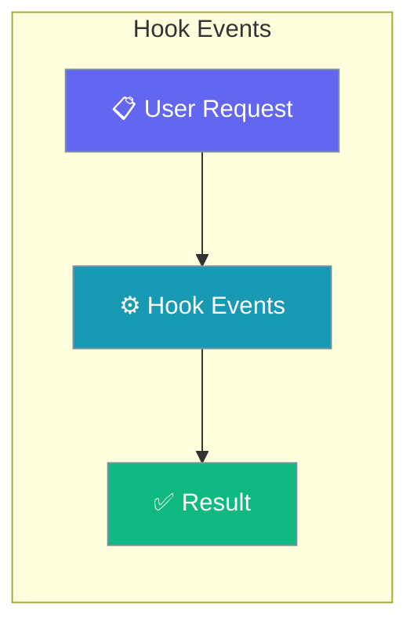
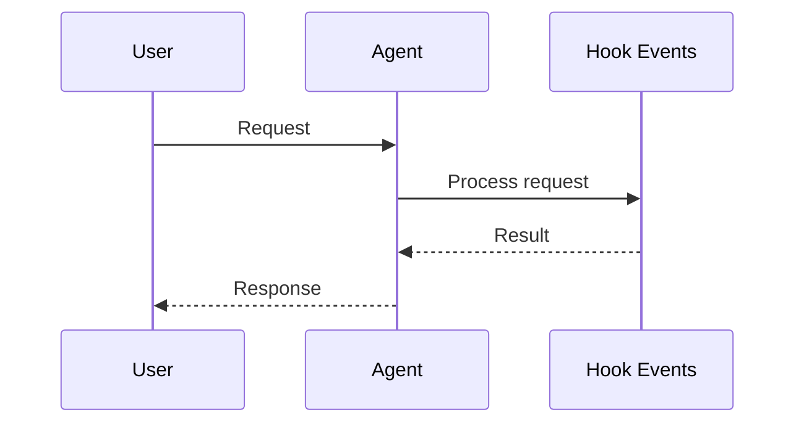
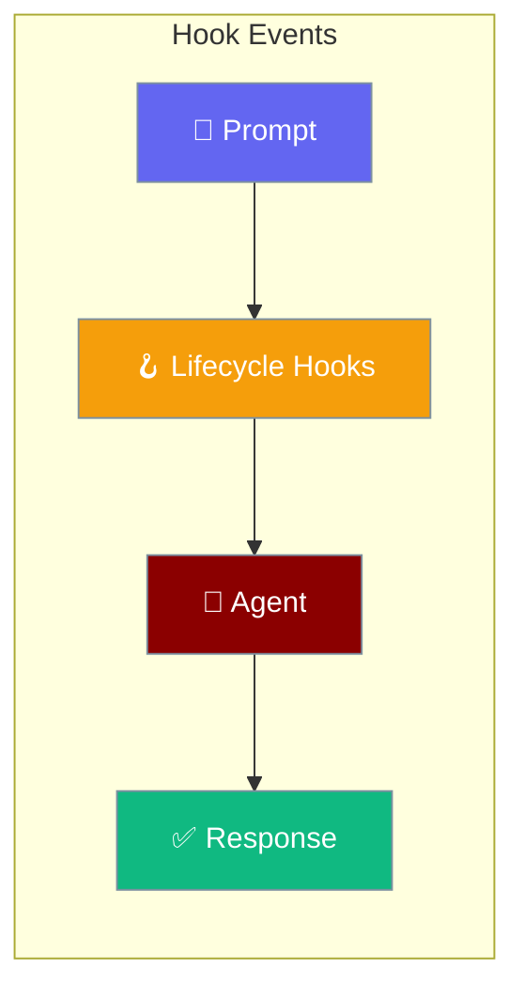
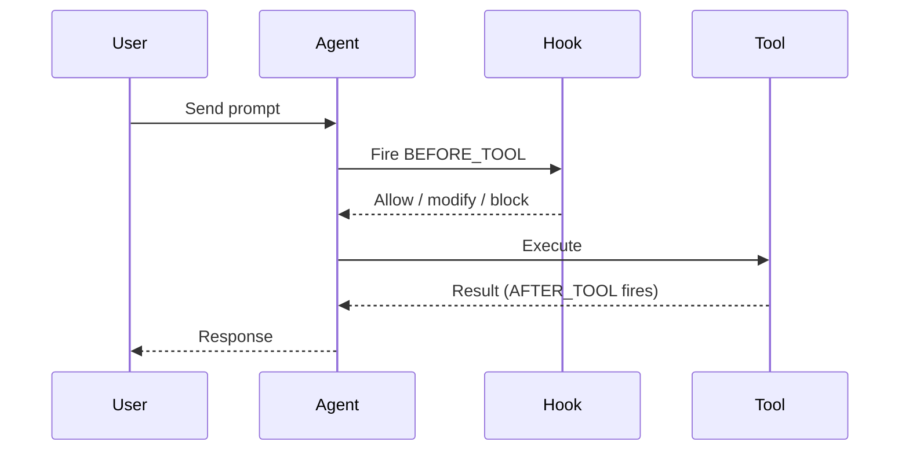
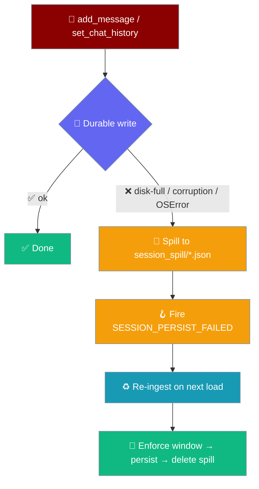
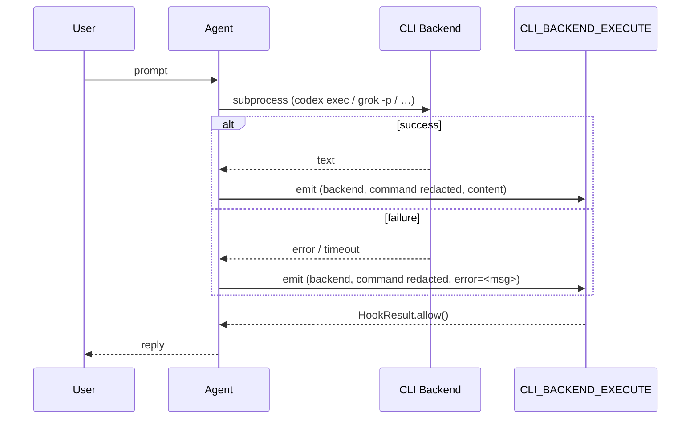
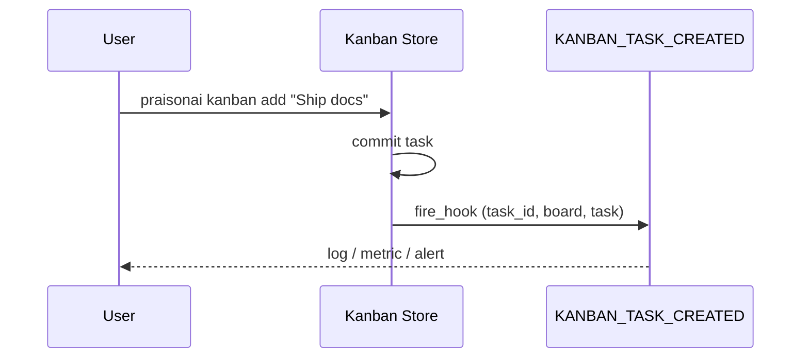

Hook events are triggered at specific points in the agent lifecycle, allowing you to intercept, modify, or block operations.



```mermaid
graph LR
    subgraph "Hook Events"
        Request[📋 User Request] --> Process[⚙️ Hook Events]
        Process --> Result[✅ Result]
    end

    classDef input fill:#6366F1,stroke:#7C90A0,color:#fff
    classDef process fill:#189AB4,stroke:#7C90A0,color:#fff
    classDef output fill:#10B981,stroke:#7C90A0,color:#fff

    class Request input
    class Process process
    class Result output
```


```mermaid
sequenceDiagram
    participant User
    participant Agent
    participant Feature as Hook Events

    User->>Agent: Request
    Agent->>Feature: Process request
    Feature-->>Agent: Result
    Agent-->>User: Response
```


<Note>
This page covers **in-process lifecycle hooks** (SESSION_START, BEFORE_AGENT, etc.) that fire inside a running agent. For **HTTP inbound triggers** that start agent runs from external services via `POST /hooks/<path>`, see [Gateway Inbound Hooks](/features/gateway-inbound-hooks).
</Note>

<Note>
Hooks that rewrite the payload via `modified_input` (`before_llm`, `before_tool_definitions`, `before_tool`) must be registered with `sequential=True`. See [Sequential vs Parallel Hooks](/features/hooks#sequential-vs-parallel-hooks).
</Note>


```python
from praisonaiagents import Agent
from praisonaiagents.hooks import add_hook

@add_hook("before_tool")
def log_tool(event_data):
    print(f"Tool: {event_data.tool_name}")

agent = Agent(name="MyAgent", instructions="Be helpful.")
agent.start("Run a tool and show lifecycle hooks")
```

The user sends a prompt; hooks fire at each lifecycle event as the agent runs.


```mermaid
graph LR
    subgraph "Hook Events"
        In[📝 Prompt] --> Hooks[🪝 Lifecycle Hooks]
        Hooks --> Agent[🤖 Agent]
        Agent --> Out[✅ Response]
    end

    classDef input fill:#6366F1,stroke:#7C90A0,color:#fff
    classDef process fill:#F59E0B,stroke:#7C90A0,color:#fff
    classDef agent fill:#8B0000,stroke:#7C90A0,color:#fff
    classDef output fill:#10B981,stroke:#7C90A0,color:#fff

    class In input
    class Hooks process
    class Agent agent
    class Out output
```

## How It Works


```mermaid
sequenceDiagram
    participant User
    participant Agent
    participant Hook
    participant Tool

    User->>Agent: Send prompt
    Agent->>Hook: Fire BEFORE_TOOL
    Hook-->>Agent: Allow / modify / block
    Agent->>Tool: Execute
    Tool-->>Agent: Result (AFTER_TOOL fires)
    Agent-->>User: Response
```

### Lifecycle Events


```mermaid
graph TB
    subgraph "Agent Lifecycle Events"
        B[📥 SESSION_START] --> D[🤖 BEFORE_AGENT]
        D --> E[🧠 BEFORE_LLM]
        E --> F[📋 BEFORE_TOOL_DEFINITIONS]
        F --> G[📤 AFTER_LLM]
        G --> H[🔧 BEFORE_TOOL]
        H --> I[⚙️ Tool Execution]
        I --> J[📦 AFTER_TOOL]
        J --> K[✅ AFTER_AGENT]
        K --> L[📴 SESSION_END]
    end

    classDef session fill:#8B0000,stroke:#7C90A0,color:#fff
    classDef agent fill:#F59E0B,stroke:#7C90A0,color:#fff
    classDef tool fill:#189AB4,stroke:#7C90A0,color:#fff
    classDef result fill:#10B981,stroke:#7C90A0,color:#fff

    class B,L session
    class D,K agent
    class E,F,G,H,J tool
    class I result
```

## Quick Start

<Steps>

<Step title="Import Hook Components">
```python
from praisonaiagents.hooks import HookRegistry, HookEvent, HookResult
```
</Step>

<Step title="Register a Hook">
```python
registry = HookRegistry()

@registry.on(HookEvent.BEFORE_TOOL)
def log_tool(event_data):
    print(f"Tool: {event_data.tool_name}")
    return HookResult.allow()
```
</Step>

<Step title="Use with Agent">
```python
from praisonaiagents import Agent

agent = Agent(
    name="MyAgent",
    instructions="You are helpful",
    hooks=registry
)
```
</Step>

</Steps>

---

## Core Events

### Tool Events

| Event | Trigger | Input Type | Use Case |
|-------|---------|------------|----------|
| `BEFORE_TOOL` | Before tool execution — register with `sequential=True` when the hook needs to rewrite arguments via `modified_input` | `BeforeToolInput` | Security checks, logging |
| `AFTER_TOOL` | After tool execution | `AfterToolInput` | Redact/rewrite `tool_output`, block the result, validation, logging |

```python
@registry.on(HookEvent.BEFORE_TOOL)
def before_tool(event_data):
    print(f"Calling: {event_data.tool_name}")
    print(f"Args: {event_data.arguments}")
    return HookResult.allow()

@registry.on(HookEvent.AFTER_TOOL)
def after_tool(event_data):
    print(f"Result: {event_data.tool_output}")
    return HookResult.allow()

# Rewrite the tool output in place (propagates to the model)
@registry.on(HookEvent.AFTER_TOOL)
def redact(event_data):
    event_data.tool_output = str(event_data.tool_output).replace(
        "sk-SECRET123", "[REDACTED]"
    )
    return HookResult.allow()

# Block the tool output entirely
@registry.on(HookEvent.AFTER_TOOL)
def block_pii(event_data):
    if "ssn=" in str(event_data.tool_output):
        return HookResult.block("PII detected — result suppressed")
    return HookResult.allow()
```

<Note>
`BEFORE_TOOL` and `AFTER_TOOL` fire on **both sync (`chat`) and async (`achat`) paths**. A blocking `BEFORE_TOOL` hook returning `HookResult.block(reason=...)` prevents tool execution on either path — use it for security gates without worrying which entrypoint the caller uses.
</Note>

<Note>
**AFTER_TOOL can rewrite or block the tool result (PraisonAI PRs [#3968](https://github.com/MervinPraison/PraisonAI/issues/3968) / [#3969](https://github.com/MervinPraison/PraisonAI/pull/3969)).** Mutate `event_data.tool_output` in place to rewrite/redact the value the model sees, or return `HookResult.block(reason)` to suppress it. Applies on both sync (`chat()`) and async (`achat()`) paths. Prefer this seam over rewriting inside the tool body when the goal is a cross-cutting scrub or policy gate. See [Redact / Block Tool Output](/features/redact-tool-output).
</Note>

<Note>
**`BEFORE_TOOL` fails closed (PR #3855).** A `BEFORE_TOOL` hook that raises an exception or times out now returns `HookResult(decision="deny", reason=...)` — the tool does **not** run. A security gate can no longer silently fail open because of a bug in the hook body.
</Note>

<Note>
**`AFTER_TOOL` result may be an error payload.** If the tool raised, `event_data.tool_output` is `{"error": "<message>"}`; if it returned a non-JSON-serializable value (`datetime`, `set`, `bytes`, a custom class), it is `{"result": "<str(value)>"}`. The run continues either way (PR #3855), so `AFTER_TOOL` handlers should tolerate both shapes. The same guard also holds one layer down at the LLM message layer (PR #4808) — see [Reliability Guarantees](/features/reliability-guarantees).
</Note>

<Note>
**`AFTER_TOOL` returns can rewrite or block (PR #3969).** Returning a value from an `AFTER_TOOL` hook **replaces** `event_data.tool_output` before the model sees it — use it to redact secrets or PII from a tool result. Raising `GuardrailBlocked` prevents the result from reaching the model, mirroring `BEFORE_TOOL`. Both apply on the sync and async tool-execution paths. Before PR [#3969](https://github.com/MervinPraison/PraisonAI/pull/3969) the return value was silently discarded, so the hook was observe-only. See the [Redact Secrets from Tool Output](/features/hooks#redact-secrets-from-tool-output) pattern.
</Note>

#### Command hook exit codes

A shell-command hook communicates its verdict through **both** its exit code and its stdout JSON. The runner requires them to agree on `allow`.

| Exit code | Decision | Notes |
|-----------|----------|-------|
| `0` | `allow` | JSON on stdout (if any) is honoured — `decision`, `reason`, `modified_input`, `additional_context`. No JSON is treated as allow. |
| `2` | `deny` | Blocking sentinel. `stderr` (or `stdout`) becomes `reason`. Explicit `deny`-JSON is still honoured. |
| Any other non-zero (`127`, `126`, `1`, `137`, …) | `deny` | Hook did not render a trustworthy verdict. `reason` names the exit code and the captured stderr/stdout. `allow`-JSON on stdout does **not** override this. |
| Timed out (killed) | `deny` | Same reason format; matches the exception/timeout path. |

- `exit 0` + JSON → JSON is honoured (`allow`, `deny`, `modified_input`, etc.).
- `exit 0` + no JSON → treated as `allow`.
- `exit 2` → treated as `deny` regardless of stdout; `stderr` (or `stdout`) is the reason. Explicit `deny`-JSON is honoured and its `reason` is preserved.
- Any other exit code (`127` command-not-found, `126` not-executable, `1`, `137`, …) → treated as `deny` with a reason naming the exit code. If stdout was `{"decision": "allow"}`, the allow is **discarded** — a gating hook that crashed after printing allow-JSON has not actually approved the call.

<Warning>
A script that prints `{"decision": "allow"}` and then crashes (missing binary, `set -e` trip, `exit 127` from a shell) is now treated as **deny**, not allow. This is deliberate and matches the fail-closed posture — scripts that intend to allow must return exit code `0`. `deny`-JSON (`{"decision": "deny", "reason": "…"}`) is still honoured under an unexpected exit code, and its `reason` is preserved verbatim.
</Warning>

### Tool Definition Events

| Event | Trigger | Input Type | Use Case |
|-------|---------|------------|----------|
| `BEFORE_TOOL_DEFINITIONS` | After advertised tool list is assembled, before sent to LLM — register with `sequential=True` when the hook needs to rewrite the list via `modified_input` | `BeforeToolDefinitionsInput` | Redact tools per request, append usage notes, constrain schema per model |

`BEFORE_TOOL_DEFINITIONS` lets you shape the tool list the LLM actually sees — without changing the agent's permanent tool registration. Mutate `tool_definitions` **in place**; the runtime only adopts in-place mutations.

<Warning>
Mutate in place using `event_data.tool_definitions[:] = [...]`. Reassigning the local name (`event_data.tool_definitions = [...]`) is silently ignored by the runtime.
</Warning>

#### BeforeToolDefinitionsInput Fields

| Field | Type | Default | Description |
|-------|------|---------|-------------|
| `tool_definitions` | `List[Dict[str, Any]]` | `[]` | The fully-assembled OpenAI-style tool definition list about to be sent to the LLM. Mutate **in place** to filter or rewrite. |
| `model` | `str` | `""` | Model id the call will be sent to (e.g. `"gpt-4o"`). Use for per-model filtering. |
| `session_id`, `cwd`, `event_name`, `timestamp`, `agent_name` | — | — | Standard `HookInput` fields. |

```python
from praisonaiagents import Agent
from praisonaiagents.hooks import HookRegistry, HookEvent, HookResult

registry = HookRegistry()

@registry.on(HookEvent.BEFORE_TOOL_DEFINITIONS)
def sandbox_tools(event_data):
    # Drop dangerous tools for this request
    event_data.tool_definitions[:] = [
        t for t in event_data.tool_definitions
        if t["function"]["name"] != "delete_file"
    ]
    # Annotate remaining tools
    for t in event_data.tool_definitions:
        if t["function"]["name"] == "read_file":
            t["function"]["description"] += " (sandboxed: /workspace only)"
    return HookResult.allow()

agent = Agent(
    name="SafeAgent",
    instructions="Help the user with file operations.",
    hooks=registry,
)

agent.start("List my files")
```

**Per-model filtering** using the `model` field:

```python
@registry.on(HookEvent.BEFORE_TOOL_DEFINITIONS)
def small_model_subset(event_data):
    if event_data.model.startswith("gpt-3.5"):
        event_data.tool_definitions[:] = event_data.tool_definitions[:5]
    return HookResult.allow()
```

### Agent Events

| Event | Trigger | Input Type | Use Case |
|-------|---------|------------|----------|
| `BEFORE_AGENT` | Before agent runs | `BeforeAgentInput` | Setup, initialization |
| `AFTER_AGENT` | After agent completes | `AfterAgentInput` | Cleanup, reporting |

```python
@registry.on(HookEvent.BEFORE_AGENT)
def before_agent(event_data):
    print(f"Agent starting: {event_data.agent_name}")
    return HookResult.allow()

@registry.on(HookEvent.AFTER_AGENT)
def after_agent(event_data):
    print(f"Agent completed: {event_data.result}")
    return HookResult.allow()
```

### LLM Events

| Event | Trigger | Input Type | Use Case |
|-------|---------|------------|----------|
| `BEFORE_LLM` | Before LLM API call — register with `sequential=True` when the hook needs to rewrite `messages` via `modified_input` | `BeforeLLMInput` | Request modification |
| `AFTER_LLM` | After LLM response | `AfterLLMInput` | Response validation |
| `MODEL_FALLBACK` | Primary model unavailable mid-turn — runtime switched to the next `fallback_models` entry | `ModelFallbackInput` | Alerts, metrics, per-user notice on silent quality/cost degradation |

```python
@registry.on(HookEvent.BEFORE_LLM)
def before_llm(event_data):
    print(f"Model: {event_data.model}")
    print(f"Messages: {len(event_data.messages)}")
    return HookResult.allow()

@registry.on(HookEvent.AFTER_LLM)
def after_llm(event_data):
    print(f"Response length: {len(event_data.response)}")
    print(f"Tokens: {event_data.usage}")
    return HookResult.allow()
```

<Note>
**Sync/async parity — since PraisonAI PR [#3908](https://github.com/MervinPraison/PraisonAI/pull/3908).** `BEFORE_LLM` and `AFTER_LLM` fire on **both sync (`chat` / `start`) and async (`achat` / `astart`) paths**. A blocking `BEFORE_LLM` hook returning `HookResult(decision="deny", reason=...)` short-circuits the LLM call on either path and the agent returns `"[LLM request blocked by hook: <reason>]"`. Earlier releases silently skipped these hooks on `achat()`, so features registered on `BEFORE_LLM` (e.g. `enable_pii_redaction()`) had no effect on async workflows.
</Note>

#### MODEL_FALLBACK — silent model switch became observable

Fires the moment the runtime swaps the primary model for the next entry in `fallback_models` after a retryable failure, so an otherwise silent quality/cost degradation becomes an observable state transition.

<Note>
**Observe-only.** Notification only — the turn already continued on `to_model`. Return `HookResult.allow()`; do not attempt to redirect the recovery here. Provider internals are redacted; only the failure class (`reason_category`) reaches your hook. Zero overhead when unsubscribed, and errors inside the hook never break the fallback path.
</Note>

<Note>
Register on the **agent-scoped** registry passed via `Agent(hooks=...)` (as shown below) so the hook fires on both sync and async runs — see [Model Fallback → Observing the Switch](/features/model-fallback#observing-the-switch). Hooks registered only on the global default registry may be skipped on the async path.
</Note>

##### `ModelFallbackInput` Fields

| Field | Type | Default | Description |
|-------|------|---------|-------------|
| `from_model` | `str` | `""` | Model id the turn was using when the failure hit (e.g. `"gpt-4o"`). |
| `to_model` | `str` | `""` | Next entry in the `fallback_models` chain that the turn continues on. |
| `reason_category` | `str` | `""` | Failure classification from the LLM error classifier (e.g. `"rate_limit"`, `"provider_down"`, `"timeout"`). Provider internals stay redacted. |
| `fallback_index` | `int` | `0` | 0-based index into `fallback_models` of the entry now in use. |
| `session_id`, `cwd`, `event_name`, `timestamp`, `agent_name` | — | — | Standard `HookInput` fields. |

```python
from praisonaiagents import Agent
from praisonaiagents.config import LLMConfig
from praisonaiagents.hooks import HookRegistry, HookEvent, HookResult

registry = HookRegistry()

@registry.on(HookEvent.MODEL_FALLBACK)
def on_fallback(event_data):
    print(f"[fallback] {event_data.from_model} → {event_data.to_model}")
    print(f"           reason={event_data.reason_category} index={event_data.fallback_index}")
    return HookResult.allow()

agent = Agent(
    name="assistant",
    instructions="Be helpful.",
    llm=LLMConfig(model="gpt-4o", fallback_models=["claude-3-5-sonnet", "gpt-4o-mini"]),
    hooks=registry,
)
agent.start("Answer even during a provider outage")
```

The paired [`MODEL_FALLBACK` stream event](/features/streaming#streamevent-protocol) carries the same fields for live UIs. See [Model Fallback → Observing the Switch](/features/model-fallback#observing-the-switch) for the primary user-facing page.

### Session Events

| Event | Trigger | Input Type | Use Case |
|-------|---------|------------|----------|
| `SESSION_START` | When session starts | `SessionStartInput` | Session initialization |
| `SESSION_END` | When session ends | `SessionEndInput` | Session cleanup |
| `SESSION_PERSIST_FAILED` | A durable session write failed (disk-full / SQLite corruption / permission / `OSError`) **or** a stored session file was found corrupt at load time (malformed JSON / invalid UTF-8) | `SessionPersistFailedInput` | **Observe-only** — alert/metric on silent data-loss; a failed write is salvaged to a spill file and re-ingested on next load, a corrupt read is quarantined to `<file>.json.corrupt-<epoch_ms>` |

<Tip>
Plugin authors: subclass `Plugin` and override `session_start` / `session_end` — see [Plugins → How the Bridge Works](/docs/features/plugins#how-the-bridge-works).
</Tip>

<Note>
**Bot runtime semantics:** In the bot runtime (`BotOS`), `SESSION_START` fires exactly **once per user session lifetime** — on the first message, not on every message. `SESSION_END` fires when the user sends `/new`, when a policy auto-reset triggers, when stale sessions are reaped, or on `reset_all`. The `reason` field on `SessionEndInput` is one of `clear`, `policy`, `stale`, or `clear_all`.
</Note>

```python
@registry.on(HookEvent.SESSION_START)
def session_start(event_data):
    print(f"Session: {event_data.session_id}")
    print(f"Source: {event_data.source}")
    print(f"Platform: {event_data.session_name}")
    return HookResult.allow()

@registry.on(HookEvent.SESSION_END)
def session_end(event_data):
    print(f"Session ended: {event_data.session_id}")
    print(f"Reason: {event_data.reason}")
    return HookResult.allow()
```

#### `SESSION_PERSIST_FAILED` — a durable write failed

Fires when the session store cannot persist a turn (`add_message` / `set_chat_history` hits disk-full, SQLite/FTS corruption, or a permission / `OSError`). Before this hook, a failed durable write silently collapsed to `False` and the already-produced turn lived only in memory — lost on the next shutdown. Now the store salvages the turn to a spill file and fires this event so the failure is observable.

<Note>
**Observe-only.** This is an observability signal, not a policy gate — it never re-runs the write and never raises on the caller's hot path. Return `HookResult.allow()` (or nothing). It mirrors the outbound-side `MESSAGE_UNDELIVERED` posture. Skipped entirely when no such hook is registered (zero overhead). See [Write-failure salvage](/features/session-persistence#write-failure-salvage) for the spill + re-ingest flow.
</Note>

<Note>
On a **corrupt read** the `error` field starts with `corrupt session file:`, and `spilled` carries the quarantine path (`<file>.json.corrupt-<epoch_ms>`) instead of the write-failure spill path. `role`/`content` are empty because there is no in-flight turn. See [Corruption-quarantine on load](/features/session-persistence#corruption-quarantine-on-load) for the full flow.
</Note>

##### `SessionPersistFailedInput` Fields

| Field | Type | Default | Description |
|-------|------|---------|-------------|
| `role` | `str` | `""` | Role of the message that failed to persist (`user` / `assistant`) |
| `content` | `str` | `""` | Message content (truncated to 500 chars in `to_dict`) |
| `error` | `str` | `""` | Stringified error from the failing write (e.g. `"atomic write failed"` or the OSError text) |
| `spilled` | `bool` | `False` | Whether the last-resort fallback write itself succeeded |
| `spill_path` | `Optional[str]` | `None` | The file the turn was salvaged to (when `spilled=True`) |
| `session_id`, `cwd`, `event_name`, `timestamp`, `agent_name` | — | — | Standard `HookInput` fields |

```python
from praisonaiagents import Agent
from praisonaiagents.hooks import HookRegistry, HookEvent, HookResult

registry = HookRegistry()

@registry.on(HookEvent.SESSION_PERSIST_FAILED)
def on_persist_failed(data):
    # Alert / metric — do NOT retry the write here; the store has already spilled.
    print(f"[persist-fail] role={data.role} spilled={data.spilled} path={data.spill_path}")
    print(f"[persist-fail] error={data.error}")
    return HookResult.allow()

agent = Agent(name="assistant", instructions="Help the user.", hooks=registry)
agent.start("Hello")
```

##### Spill & recovery flow

A failed durable write salvages the turn to a spill file, fires this hook, then re-ingests the spill on the next session load.


```mermaid
graph TB
    W[💬 add_message / set_chat_history] --> D{💾 Durable write}
    D -->|✅ ok| Done[✅ Done]
    D -->|❌ disk-full / corruption / OSError| S[📄 Spill to session_spill/*.json]
    S --> H[🪝 Fire SESSION_PERSIST_FAILED]
    H --> R[♻️ Re-ingest on next load]
    R --> E[📏 Enforce window → persist → delete spill]

    classDef write fill:#8B0000,stroke:#7C90A0,color:#fff
    classDef decision fill:#6366F1,stroke:#7C90A0,color:#fff
    classDef spill fill:#F59E0B,stroke:#7C90A0,color:#fff
    classDef hook fill:#189AB4,stroke:#7C90A0,color:#fff
    classDef ok fill:#10B981,stroke:#7C90A0,color:#fff

    class W write
    class D decision
    class S,H spill
    class R hook
    class Done,E ok
```

Spill files land under `~/.praisonai/state/session_spill/` (written `0600`, atomic temp-file + `os.replace`).

<AccordionGroup>

<Accordion title="Observe-only — never retry">
The hook is a notification. Do not retry the write from it — the store has already spilled the turn and re-ingests it on the next load.
</Accordion>

<Accordion title="Collision-safe filenames">
Spill filenames carry a random token, so consecutive same-millisecond/PID failures never overwrite each other — no lost turns.
</Accordion>

<Accordion title="Recovery respects retention">
`_reingest_spill` runs `_enforce_window` before persisting, so recovered turns obey the retention policy like any ordinary write.
</Accordion>

<Accordion title="Malformed spills are skipped">
A non-object root, non-list `messages`, or non-object message is skipped — a bad spill never blocks recovery.
</Accordion>

</AccordionGroup>

### Error Events

| Event | Trigger | Input Type | Use Case |
|-------|---------|------------|----------|
| `ON_ERROR` | When error occurs | `OnErrorInput` | Error handling |
| `ON_RETRY` | Before retry attempt | `OnRetryInput` | Retry logic |

<Tip>
Plugin authors: subclass `Plugin` and override `on_error` — see [Plugins → How the Bridge Works](/docs/features/plugins#how-the-bridge-works).
</Tip>

```python
@registry.on(HookEvent.ON_ERROR)
def on_error(event_data):
    print(f"Error: {event_data.error}")
    # Log to external service
    return HookResult.allow()

@registry.on(HookEvent.ON_RETRY)
def on_retry(event_data):
    # New tool-level fields
    print(f"[retry] {event_data.tool_name} attempt {event_data.attempt}/{event_data.max_attempts}")
    print(f"Error type: {event_data.error_type}, delay: {event_data.delay_ms}ms")
    
    # Legacy fields still available for backward compatibility
    # event_data.retry_count, event_data.max_retries, event_data.error_message
    
    if event_data.attempt > 2:
        return HookResult.deny("Too many retries")
    return HookResult.allow()
```

### Async vs Sync

`ON_RETRY` fires on **both** sync and async retry paths. If you register the handler as a regular `def`, it is dispatched in a thread executor on the async path; if you register an `async def`, it is awaited directly. Either form is safe on both paths.

<Note>
Retry is on by default, so `ON_RETRY` fires with **no config needed** on both the native OpenAI-client path and the LiteLLM path (default `max_retries=3`). It only stops firing if you disable retry with `retry=False`. See [Agent Retry](/features/agent-retry).
</Note>

<Note>
Released in PraisonAI #2386 — earlier versions skipped this event on the async path.
</Note>

#### OnRetryInput Fields

The `OnRetryInput` event includes both new tool-specific fields and legacy fields for backward compatibility:

**New fields (recommended):**
- `tool_name`: Name of the failing tool
- `attempt`: Current attempt number (1-based)  
- `max_attempts`: Maximum attempts configured
- `delay_ms`: Delay before this retry in milliseconds
- `error_type`: Classified error type (`timeout`, `rate_limit`, `connection_error`, `unknown`)
- `error`: Original exception object

**LLM retry fields** (populated whenever a transient LLM error is retried, including the default `RetryBackoffConfig()` policy applied to every Agent — see [Agent Retry](/features/agent-retry)). `ON_RETRY` now fires on default Agents too; pass `retry=False` to disable retries and stop these fires:
- `delay_seconds`: Seconds the agent will sleep before the next attempt
- `attempt`: Current attempt number (0-based)
- `operation`: `"llm_request"` (sync) or `"async_llm_request"` (async)
- `error_message`: String representation of the failing `LLMError`
- `max_retries`: Configured `RetryBackoffConfig.max_retries`
- `retry_count`: Same as `attempt + 1` (1-based legacy alias)

**Legacy fields (for backward compatibility):**
- `retry_count`: Same as `attempt`  
- `max_retries`: Same as `max_attempts`
- `error_message`: String representation of `error`

### Agent-Level Error Callbacks

In addition to hook events, agents support a direct `on_error` callback for LLM failures:

```python
from praisonaiagents import Agent
from praisonaiagents import LLMError

def agent_error_handler(error):
    """Called when LLM chat completion fails"""
    print(f"Agent {error.agent_id} LLM error: {error.message}")
    print(f"Model: {error.model_name}")
    print(f"Retryable: {error.is_retryable}")
    
    # Custom error recovery logic
    if error.is_retryable:
        print("Will be retried by orchestration")
    else:
        print("Fatal error - check configuration")

# Agent-specific error handling
agent = Agent(
    name="Error Aware Agent",
    instructions="Process user requests",
    on_error=agent_error_handler  # Direct callback, not a hook
)
```

#### Hook Events vs Agent Callbacks

| Approach | Scope | Return Value | When Called |
|----------|-------|--------------|-------------|
| **HookEvent.ON_ERROR** | Global, all agents | `HookResult` | Any hook system error |
| **agent.on_error** | Single agent | None | LLM chat completion errors |

```python
# Using both together for comprehensive error handling
registry = HookRegistry()

@registry.on(HookEvent.ON_ERROR)
def global_hook_error(event_data):
    """Catches all hook system errors"""
    return HookResult.allow()

def llm_specific_error(error):
    """Catches LLM errors for this agent only"""
    pass

agent = Agent(
    name="Comprehensive Error Handling",
    hooks=registry,           # Global error hooks
    on_error=llm_specific_error  # Agent-specific LLM errors
)
```

---

## Extended Events

### User Interaction Events

<Note>
There is no dedicated `USER_PROMPT_SUBMIT` event. `BEFORE_AGENT` is the closest live equivalent — it fires at `Agent.chat()` entry carrying the mutable `prompt` and can block — but it also fires for internal / sub-agent invocations no user ever submitted, so an audit hook subscribed to it will over-report. Filter on `event_data.parent_agent_name is None` if you only care about top-level user prompts.

There is no `NOTIFICATION` event.
</Note>

### Subagent Events

| Event | Trigger | Use Case |
|-------|---------|----------|
| `SUBAGENT_STOP` | A subagent spawned via `spawn_subagent` reaches a terminal state (success or failure) | Result handling, telemetry, cost accounting |

Fires exactly once per subagent from the single completion chokepoint in `tools/subagent_tool.py` — covers synchronous spawns, `background=True` jobs, resolver-routed named agents, generic factory spawns, simulation mode, and failures.

```python
from praisonaiagents.hooks import HookRegistry, HookEvent, HookResult, SubagentStopInput

@registry.on(HookEvent.SUBAGENT_STOP)
def on_subagent_stop(event_data: SubagentStopInput):
    print(f"Subagent: {event_data.agent_name}")
    print(f"Task:     {event_data.task}")
    print(f"Success:  {event_data.success}")
    if event_data.success:
        print(f"Output:   {event_data.output}")
    else:
        print(f"Error:    {event_data.error}")
    print(f"LLM:      {event_data.llm}")
    print(f"Depth:    {event_data.depth}")
    print(f"Duration: {event_data.duration_ms:.1f} ms")
    return HookResult.allow()
```

**Observe-only.** Errors in the hook never break the subagent — the emit is fully guarded.

#### `SubagentStopInput` Fields

| Field | Type | Default | Description |
|-------|------|---------|-------------|
| `task` | `str` | `""` | The task string the subagent was spawned with |
| `success` | `bool` | `True` | `False` when the subagent raised |
| `output` | `Any` | `None` | Terminal output — serialised via `str()` in `to_dict()` |
| `error` | `Optional[str]` | `None` | Error message when `success` is False |
| `llm` | `Optional[str]` | `None` | Effective LLM used |
| `permission_mode` | `Optional[str]` | `None` | Effective permission mode |
| `depth` | `int` | `0` | Depth of the subagent in the spawn tree |
| `duration_ms` | `float` | `0.0` | Wall-clock time from spawn to terminal state |
| `agent_name`, `session_id`, `cwd`, `event_name`, `timestamp` | — | — | Standard `HookInput` fields (`agent_name` carries the subagent name) |

### Plugin Lifecycle Events

| Event | Trigger | Payload |
|-------|---------|---------|
| `ON_INIT` | Emitted by `PluginManager.register()` right after the plugin runs its own `on_init` | `PluginLifecycleInput` |
| `ON_SHUTDOWN` | Emitted by `PluginManager.unregister()` right after the plugin runs its own `on_shutdown` | `PluginLifecycleInput` |

`plugin.on_init` / `plugin.on_shutdown` are the plugin's *own* callbacks; `ON_INIT` / `ON_SHUTDOWN` are the runtime events **other** listeners (metrics/audit plugins, gateways) subscribe to. Lets an observability plugin see the plugin set change at runtime instead of polling `list_plugins()`.

```python
from praisonaiagents.hooks import HookRegistry, HookEvent, HookResult, PluginLifecycleInput

@registry.on(HookEvent.ON_INIT)
def on_plugin_registered(event_data: PluginLifecycleInput):
    print(f"Plugin loaded: {event_data.plugin_name} v{event_data.plugin_version}")
    return HookResult.allow()

@registry.on(HookEvent.ON_SHUTDOWN)
def on_plugin_removed(event_data: PluginLifecycleInput):
    print(f"Plugin unloaded: {event_data.plugin_name}")
    return HookResult.allow()
```

**Observe-only.** Fully guarded — a failing hook never breaks plugin loading. Zero cost when nothing is listening (early-out on `registry.has_hooks(...)`).

#### `PluginLifecycleInput` Fields

| Field | Type | Default | Description |
|-------|------|---------|-------------|
| `plugin_name` | `str` | `""` | Registered plugin name |
| `plugin_version` | `str` | `""` | Plugin version |
| `plugin_description` | `str` | `""` | Plugin description |
| `agent_name`, `session_id`, `cwd`, `event_name`, `timestamp` | — | — | Standard `HookInput` fields |

### System Events

| Event | Trigger | Use Case |
|-------|---------|----------|
| `BEFORE_COMPACTION` | Before context compaction | Pre-compaction hooks |
| `AFTER_COMPACTION` | After context compaction | Post-compaction validation |

```python
@registry.on(HookEvent.BEFORE_COMPACTION)
def before_compaction(event_data):
    print(f"Compacting context: {event_data.token_count} tokens")
    return HookResult.allow()

@registry.on(HookEvent.AFTER_COMPACTION)
def after_compaction(event_data):
    # event_data is the CompactionResult for this pass.
    print(f"Compacted to: {event_data.compacted_tokens} tokens")

    # 1.6.152+: summary is populated for summarising strategies.
    # Pre-1.6.152 the field existed but was always "".
    if event_data.summary:
        # e.g. mirror into your own long-term memory store here
        print(f"Summary: {event_data.summary[:120]}")
    return HookResult.allow()
```

<Note>
Plugin persisters subscribe to `AFTER_COMPACTION` to read `event_data.summary`. See [Compacted Session Resume](/features/session-compaction-checkpoint) for the built-in checkpoint that ships with PraisonAI, and [Context Compaction](/docs/features/context-compaction#new-compactionresult-fields) for the full `CompactionResult` fields.
</Note>

### Plugin Lifecycle Events

| Event | Trigger | Payload |
|-------|---------|---------|
| `ON_INIT` | Emitted by `PluginManager.register()` right after the plugin runs its own `on_init` | `PluginLifecycleInput` |
| `ON_SHUTDOWN` | Emitted by `PluginManager.unregister()` right after the plugin runs its own `on_shutdown` | `PluginLifecycleInput` |

`plugin.on_init` / `plugin.on_shutdown` are the plugin's *own* callbacks; `ON_INIT` / `ON_SHUTDOWN` are the runtime events **other** listeners (metrics/audit plugins, gateways) subscribe to. Lets an observability plugin see the plugin set change at runtime instead of polling `list_plugins()`.

```python
from praisonaiagents.hooks import HookRegistry, HookEvent, HookResult, PluginLifecycleInput

@registry.on(HookEvent.ON_INIT)
def on_plugin_registered(event_data: PluginLifecycleInput):
    print(f"Plugin loaded: {event_data.plugin_name} v{event_data.plugin_version}")
    return HookResult.allow()

@registry.on(HookEvent.ON_SHUTDOWN)
def on_plugin_removed(event_data: PluginLifecycleInput):
    print(f"Plugin unloaded: {event_data.plugin_name}")
    return HookResult.allow()
```

**Observe-only.** Fully guarded — a failing hook never breaks plugin loading. Zero cost when nothing is listening (early-out on `registry.has_hooks(...)`).

#### `PluginLifecycleInput` Fields

| Field | Type | Default | Description |
|-------|------|---------|-------------|
| `plugin_name` | `str` | `""` | Registered plugin name |
| `plugin_version` | `str` | `""` | Plugin version |
| `plugin_description` | `str` | `""` | Plugin description |
| `session_id`, `cwd`, `event_name`, `timestamp`, `agent_name` | — | — | Standard `HookInput` fields |

### Message Events

| Event | Trigger | Input Type | Use Case |
|-------|---------|------------|----------|
| `MESSAGE_RECEIVED` | Inbound message from a bot channel, before agent dispatch | `MessageReceivedInput` | **Inbound gate** — drop (deny), redact/rewrite content, authorise sender, rate-limit |
| `MESSAGE_SENDING` | Before message sent | `MessageSendingInput` | Outbound gate — cancel or rewrite outbound text |
| `MESSAGE_SENT` | After message sent | `MessageSentInput` | Confirmation |
| `MESSAGE_UNDELIVERED` | Reply permanently undeliverable (target confirmed dead / retries exhausted) | `MessageUndeliveredInput` | **Operator routing** — mirror to home channel, alert, or re-queue |

#### Aliased Events

Three `HookEvent` members are **aliases** — the enum member and its live target are the same object. Registration on the alias is registration on the live event.

| Alias | Live event | Notes |
|-------|-----------|-------|
| `HookEvent.BEFORE_MESSAGE` | `HookEvent.MESSAGE_RECEIVED` | The plugin-facing `Plugin.before_message` method has always routed here |
| `HookEvent.AFTER_MESSAGE` | `HookEvent.MESSAGE_SENDING` | Outbound counterpart |
| `HookEvent.TOOL_RESULT_PERSIST` | `HookEvent.AFTER_TOOL` | `AFTER_TOOL` already sees the result before it is written into the conversation |

```python
>>> HookEvent.BEFORE_MESSAGE is HookEvent.MESSAGE_RECEIVED
True
>>> HookEvent("before_message") is HookEvent.MESSAGE_RECEIVED
True
```

Legacy string values (`"before_message"`, `"after_message"`, `"tool_result_persist"`) still resolve — config files, `add_hook("before_message", ...)` calls, and any other string-based registration keep working unchanged.

`MESSAGE_RECEIVED` is a **first-class control point**: hooks can drop an inbound message so the agent never runs, or rewrite the message content before the agent (or memory) sees it. This is symmetric with `MESSAGE_SENDING` on the outbound side.

### Aliased Events

Three `HookEvent` members are **aliases** — the enum member and its live target are the same object. Registration on the alias is registration on the live event.

| Alias | Live event | Notes |
|-------|-----------|-------|
| `HookEvent.BEFORE_MESSAGE` | `HookEvent.MESSAGE_RECEIVED` | The plugin-facing `Plugin.before_message` method has always routed here |
| `HookEvent.AFTER_MESSAGE` | `HookEvent.MESSAGE_SENDING` | Outbound counterpart |
| `HookEvent.TOOL_RESULT_PERSIST` | `HookEvent.AFTER_TOOL` | `AFTER_TOOL` already sees the result before it is written into the conversation |

```python
>>> HookEvent.BEFORE_MESSAGE is HookEvent.MESSAGE_RECEIVED
True
>>> HookEvent("before_message") is HookEvent.MESSAGE_RECEIVED
True
```

Legacy string values (`"before_message"`, `"after_message"`, `"tool_result_persist"`) still resolve — config files, `add_hook("before_message", ...)` calls, and any other string-based registration keep working unchanged.

<Note>
`MESSAGE_RECEIVED` and `MESSAGE_SENDING` payloads now include the enriched identity fields (`platform`, `sender_id`, `channel_id`, `channel_type`, `message_id`, `session_id`) when the underlying input provides them — the same fields that reach the [Plugin `_message_payload` bridge](/features/plugins#message-lifecycle-plugins).
</Note>

The hook now returns a decision that every platform adapter (Telegram, Slack, Discord, WhatsApp, Email, AgentMail) honours:

- `HookResult.deny(reason=...)` → the message is **dropped**; agent dispatch is skipped entirely.
- `HookResult(modified_input={"content": "..."})` → the inbound message content is **rewritten** before dispatch.
- `None` or `HookResult.allow()` → message passes through unchanged (default).
- Hook errors are **non-fatal** — a raising hook logs the error and lets the message through.

<Note>
`MESSAGE_RECEIVED` and `MESSAGE_SENDING` are the two message-lifecycle events that **do gate** — `deny` drops the message entirely, `modified_input["content"]` rewrites it. The gate is safe from both sync and async adapters (Telegram, Slack, Discord, WhatsApp, Email, AgentMail) — no `async def` required in your hook. See [PraisonAI #2589](https://github.com/MervinPraison/PraisonAI/pull/2589).
</Note>

#### Drop / block an inbound message

```python
from praisonaiagents import Agent
from praisonaiagents.hooks import HookRegistry, HookEvent, HookResult

registry = HookRegistry()

@registry.on(HookEvent.MESSAGE_RECEIVED)
def block_bots(event_data):
    if event_data.sender_id.endswith("bot"):
        return HookResult.deny("no bots")
    return HookResult.allow()

agent = Agent(name="Concierge", instructions="Be helpful.", hooks=registry)
```

#### Redact PII before the agent sees it

```python
import re
from praisonaiagents import Agent
from praisonaiagents.hooks import HookRegistry, HookEvent, HookResult

registry = HookRegistry()

@registry.on(HookEvent.MESSAGE_RECEIVED)
def redact_pii(event_data):
    cleaned = re.sub(r"\b\d{3}-\d{2}-\d{4}\b", "[SSN]", event_data.content)
    return HookResult(decision="allow", modified_input={"content": cleaned})

agent = Agent(name="SafeAgent", instructions="Be helpful.", hooks=registry)
```

#### Authorise sender against an allowlist

```python
from praisonaiagents import Agent
from praisonaiagents.hooks import HookRegistry, HookEvent, HookResult

registry = HookRegistry()
ALLOWED = {"U123", "U456"}

@registry.on(HookEvent.MESSAGE_RECEIVED)
def only_allowed_users(event_data):
    if event_data.sender_id not in ALLOWED:
        return HookResult.deny("unauthorised")
    return HookResult.allow()

agent = Agent(name="PrivateAgent", instructions="Be helpful.", hooks=registry)
```

#### How the gate applies decisions

| Decision | Effect |
|----------|--------|
| `HookResult.deny("reason")` | Message is dropped; the agent is never invoked; the adapter returns immediately |
| `HookResult(decision="allow", modified_input={"content": "..."})` | Content is rewritten in place; agent, memory, and command parser all see the new text |
| `HookResult.allow()` | Message passes through unchanged |

<Note>
When multiple `MESSAGE_RECEIVED` hooks run, the **last matching modification** wins. Hook errors are non-fatal — the message passes through unchanged.
</Note>

```python
@registry.on(HookEvent.MESSAGE_SENDING)
def on_message_sending(event_data):
    print(f"Sending: {event_data.content}")
    return HookResult.allow()
```

Since PraisonAI PR #2589, every messaging adapter (Telegram, Slack, Discord, WhatsApp, email, agentmail) honours these decisions. Hook exceptions are non-fatal — the message passes through.

See [Inbound Message Gate](/features/inbound-message-gate) for patterns and failure semantics.

#### `MESSAGE_UNDELIVERED` — close the loop on a permanent failure

Fires when the gateway's `DeliveryRouter` classifies a send as *permanently* failed. Observability only — the hook does **not** gate anything.

```python
from praisonaiagents import Agent
from praisonaiagents.hooks import HookRegistry, HookEvent, HookResult

registry = HookRegistry()

@registry.on(HookEvent.MESSAGE_UNDELIVERED)
def route_undelivered(event_data):
    # event_data is a MessageUndeliveredInput
    print(
        f"[UNDELIVERED] {event_data.platform}:{event_data.channel_id} "
        f"error={event_data.error} notice_delivered={event_data.notice_delivered}"
    )
    return HookResult.allow()

agent = Agent(name="broadcaster", instructions="Send updates.", hooks=registry)
```

See [Undelivered Message Notice](/features/undelivered-messages) for the full opt-in flow and the `gateway.notify_on_undelivered` config.

<Note>
**Plugin bridge:** inside a `Plugin` subclass, `MESSAGE_SENT` and `MESSAGE_UNDELIVERED` surface as the base methods `message_sent(message)` and `message_undelivered(message)` — see [Plugins → Message-Lifecycle Plugins](/features/plugins#message-lifecycle-plugins). The plugin bridge only wires these when your subclass overrides them.
</Note>

### Gateway Events

| Event | Trigger | Input Type | Key Fields | Use Case |
|-------|---------|------------|------------|----------|
| `GATEWAY_START` | `BotOS.start()` | `GatewayStartInput` | `platforms`, `bot_count` | Initialization |
| `GATEWAY_STOP` | `BotOS.stop()` | `GatewayStopInput` | `platforms`, `bot_count`, `reason` | Cleanup |

```python
@registry.on(HookEvent.GATEWAY_START)
def on_gateway_start(event_data):
    print(f"Gateway starting on: {event_data.platforms}")
    print(f"Bot count: {event_data.bot_count}")
    return HookResult.allow()

@registry.on(HookEvent.GATEWAY_STOP)
def on_gateway_stop(event_data):
    print(f"Gateway stopping: {event_data.platforms}")
    print(f"Reason: {event_data.reason}")
    return HookResult.allow()
```

### Schedule & background events

Schedule hooks fire when scheduled jobs are managed and triggered by `BotOS`. `JOB_COMPLETED` is emitted by `BackgroundJobManager.start_job` for **every** background job it runs — not only `spawn_subagent(background=True)` jobs — when the job reaches a terminal state (`COMPLETED` or `FAILED`), best-effort (a raising handler cannot crash the worker). It does **not** fire for `CANCELLED` or `LOST`.

| Event | Trigger | Input Type | Key Fields | Use Case |
|-------|---------|------------|------------|----------|
| `SCHEDULE_ADD` | Schedule job persisted | `ScheduleAddInput` | `job_name`, `job_id`, `schedule`, `message`, `agent_id`, `principal`, `enabled` | Audit schedule changes |
| `SCHEDULE_REMOVE` | Schedule job deleted | `ScheduleRemoveInput` | `job_name`, `job_id`, `schedule`, `principal` | Audit schedule changes |
| `SCHEDULE_TRIGGER` | Scheduled job runs | `ScheduleTriggerInput` | `job_name`, `job_id`, `message` | Observability, metrics |
| `JOB_COMPLETED` | Any managed background job reaches `COMPLETED` or `FAILED` (never `CANCELLED`/`LOST`) | `JobCompletedInput` | `job_id`, `status`, `result`, `error`, `agent_name`, `session_id`, `deliver`, `platform`, `chat_id`, `thread_id` | Observability, custom delivery routing, chat-back delivery (see [Background Subagents](/features/background-subagents)) |

```python
@registry.on(HookEvent.SCHEDULE_TRIGGER)
def on_schedule_trigger(event_data):
    print(f"Job fired: {event_data.job_name}")
    print(f"Job ID: {event_data.job_id}")
    print(f"Message: {event_data.message}")
    return HookResult.allow()

@registry.on(HookEvent.JOB_COMPLETED)
def on_job_completed(event_data):
    print(f"Job finished: {event_data.job_id} → {event_data.status}")
    if event_data.error:
        print(f"Error: {event_data.error}")
    return HookResult.allow()

@registry.on(HookEvent.SCHEDULE_ADD)
def on_schedule_add(event_data):
    print(f"Schedule added: {event_data.job_name} ({event_data.job_id})")
    print(f"When: {event_data.schedule}")
    print(f"Enabled: {event_data.enabled}")
    return HookResult.allow()

@registry.on(HookEvent.SCHEDULE_REMOVE)
def on_schedule_remove(event_data):
    print(f"Schedule removed: {event_data.job_name} ({event_data.job_id})")
    print(f"When: {event_data.schedule}")
    return HookResult.allow()
```

**Where SCHEDULE events fire:** `SCHEDULE_ADD` and `SCHEDULE_REMOVE` are emitted by the schedule **store** — the one chokepoint every add/remove path funnels through — from `add()`, `remove()`, `remove_by_name()`, and the one-shot `delete_after_run` auto-delete inside `claim_due()`. The same hook fires whether the mutation came from the `schedule_add`/`schedule_remove` tools, the `praisonai schedule` CLI, or the gateway `config.yaml` reconciler.

Events fire **only on a real change** and never in these four cases:
- **Duplicate add** — an `add()` that raises `ValueError` on a duplicate name/id fires nothing.
- **Missing remove** — a `remove()`/`remove_by_name()` that matches no job fires nothing.
- **Principal-scoped skip** — a `remove_by_name()` that matches nothing under the caller's tenant `principal` fires nothing.
- **Rolled-back persist** — if `_save()` fails and the deletion is rolled back, nothing is emitted.

A spent `delete_after_run` one-shot fires `SCHEDULE_REMOVE` **exactly once**: the auto-delete inside `claim_due()` emits, and the runner's later `remove(job.id)` finds nothing and stays silent.

### Background Job Events

`JOB_COMPLETED` fires from `BackgroundJobManager.start_job` for every managed background job when it reaches `COMPLETED` or `FAILED` — best-effort, so a raising handler cannot crash the worker. See the [JOB_COMPLETED Hook](/features/job-completed-hook) page for the full guide.

```python
from praisonaiagents.hooks import HookEvent, add_hook

@add_hook(HookEvent.JOB_COMPLETED)
def log_job_result(data):
    print(f"Job {data.job_id} → {data.status}")
    if data.status == "completed":
        print(f"Result: {data.result}")
    else:
        print(f"Error: {data.error}")
```

#### `JobCompletedInput` Fields

| Field | Type | Description |
|-------|------|-------------|
| `job_id` | `str` | Unique job identifier |
| `status` | `str` | Terminal state: `"completed"` or `"failed"` |
| `result` | `Any` | Return value on success; `None` on failure |
| `error` | `str \| None` | Error message on failure; `None` on success |
| `agent_name` | `str` | Always `"background"` for manager-emitted jobs |
| `session_id` | `str` | Origin session id (empty string when unset) |
| `deliver` | `str` | Delivery token set at spawn time (empty string when unset) |
| `platform` | `str` | Origin platform (empty string when unset) |
| `chat_id` | `str` | Origin chat/channel id (empty string when unset) |
| `thread_id` | `str` | Origin thread id (empty string when unset) |

Typical uses:
- Observability and metrics on background job failure rates
- Custom delivery routing when the built-in `deliver=` token is insufficient
- External side effects on completion (webhooks, database writes)

### Storage Events

| Event | Trigger | Use Case |
|-------|---------|----------|
| `TOOL_RESULT_PERSIST` | Alias of `AFTER_TOOL` (see [Aliased Events](#aliased-events)) — subscribe to `AFTER_TOOL` directly | Result modification |

`TOOL_RESULT_PERSIST` resolves to the same enum member as `AFTER_TOOL`. Register on `AFTER_TOOL` — it already receives the tool result before it is written into the conversation, and mutating `event_data.tool_output` is exactly what gets stored.

```python
@registry.on(HookEvent.AFTER_TOOL)
def on_persist(event_data):
    # Mutate event_data.tool_output to rewrite the value stored + sent to the model
    return HookResult.allow()
```

### CLI Backend Events

| Event | Trigger | Input Type | Use Case |
|-------|---------|------------|----------|
| `CLI_BACKEND_EXECUTE` | Agent delegates a turn to a CLI backend subprocess | `CliBackendExecuteInput` | Observability — confirm CLI delegation, log subprocess argv, capture errors |

`CLI_BACKEND_EXECUTE` fires on **both success and failure**, so subprocess startup errors and timeouts stay traceable — the payload's `error` field carries the exception message on the failure path.


```mermaid
sequenceDiagram
    participant User
    participant Agent
    participant CLI as CLI Backend
    participant Hook as CLI_BACKEND_EXECUTE

    User->>Agent: prompt
    Agent->>CLI: subprocess (codex exec / grok -p / …)
    alt success
        CLI-->>Agent: text
        Agent->>Hook: emit (backend, command redacted, content)
    else failure
        CLI-->>Agent: error / timeout
        Agent->>Hook: emit (backend, command redacted, error=<msg>)
    end
    Hook-->>Agent: HookResult.allow()
    Agent-->>User: reply
```

<Note>
This hook is **observe-only** — it cannot gate the CLI backend call. Return `HookResult.allow()` (or return nothing). For a policy gate on tool use, register on `BEFORE_TOOL` instead.
</Note>

#### `CliBackendExecuteInput` Fields

| Field | Type | Default | Description |
|-------|------|---------|-------------|
| `backend` | `str` | `""` | Human-readable backend id, e.g. `"claude"`, `"codex"`, `"grok"`, `"gemini"`. Comes from `config.command` when available, else the backend class name. |
| `command` | `Optional[List[Any]]` | `None` | The full subprocess argv the CLI backend spawned. **Prompt/system values are redacted** (`"<redacted>"`) at serialisation, so log sinks never see the user prompt. |
| `content` | `Optional[str]` | `None` | The backend's textual response. **Truncated to the first 500 characters** at serialisation. |
| `error` | `Optional[str]` | `None` | Non-null on failure — carries the exception message from the CLI subprocess or timeout. |
| `transport` | `str` | `"subprocess"` | Always `"subprocess"` today. Reserved for future transports. |
| `praisonai_llm_http` | `bool` | `False` | Always `False` — the hook exists precisely because PraisonAI did **not** make an HTTP LLM call this turn. Useful for dashboards proving the LiteLLM path was skipped. |
| `session_id`, `cwd`, `event_name`, `timestamp`, `agent_name` | — | — | Standard `HookInput` fields. |

<Note>
Two safety mechanisms apply at `to_dict()` time (the payload that reaches log sinks): prompt/system values that follow `-p`, `--prompt`, `-i`, `--input`, `-m`, `--message`, `--system` are replaced with `"<redacted>"`, and `content` is truncated to the first **500 characters**. The live in-memory `command` field is left untouched — only the serialised payload is redacted.
</Note>

#### Trace CLI delegation programmatically

```python
from praisonaiagents import Agent
from praisonaiagents.hooks import HookRegistry, HookEvent, HookResult

registry = HookRegistry()

@registry.on(HookEvent.CLI_BACKEND_EXECUTE)
def trace_cli_backend(event_data):
    if event_data.error:
        print(f"[cli-backend] {event_data.backend} FAILED: {event_data.error}")
    else:
        argv = " ".join(str(a) for a in (event_data.command or []))
        print(f"[cli-backend] {event_data.backend} ok → {argv}")
    return HookResult.allow()

agent = Agent(
    name="assistant",
    instructions="Be helpful.",
    cli_backend="codex-cli",   # or claude-code, grok-cli, gemini-cli
    hooks=registry,
)

agent.start("Refactor utils.py")
```

The prompt is redacted at the payload boundary:

```
[cli-backend] codex ok → codex exec --skip-git-repo-check -C /workspace <redacted>
```

#### Enable the built-in tracer plugin

The `cli_backend_tracer` plugin from **praisonai-plugins** is the batteries-included consumer of this hook — it logs every delegation to the standard `praisonai` logger. Enable it with one env var and a plugin toggle:

```bash
pip install praisonai-plugins
export PRAISONAI_CLI_BACKEND_DEBUG=1
praisonai plugins enable cli_backend_tracer
```

Or use the standard Python knob:

```bash
export LOGLEVEL=DEBUG
```

With either set and the plugin enabled, every `codex exec` / `grok -p` / `gemini -p` / `claude` delegation appears in the log stream, with the prompt value already redacted.

#### What gets masked

`redact_command` masks the value **that follows** these flags, leaving the flag itself visible for verification:

| Flag | Reason it's masked |
|------|--------------------|
| `-p`, `--prompt` | The user prompt |
| `-i`, `--input` | Alternate prompt form (Grok) |
| `-m`, `--message` | Chat message form |
| `--system` | System instruction |

Non-list `command` values (already-serialised strings, `None`) pass through unchanged.

### Kanban Events

<Note>
**Where do these come from?** The SQLite kanban store is the single emission chokepoint — every writer (CLI `praisonai kanban ...`, agent tools, the gateway dispatcher, the HTTP API, the UI) goes through it, so one emission per transition covers them all. Subscribe with `add_hook`; you never emit these yourself. See [fire_hook](/features/fire-hook) if you emit your own events.
</Note>

The store fires six lifecycle events after a transition commits, each carrying a `KanbanHookInput` (unknown keys such as `task` land in `.extra`).

| Event | Emitted when | Key payload |
|-------|--------------|-------------|
| `KANBAN_TASK_CREATED` | Task committed to the board (not on idempotency-key replay) | `task_id`, `board`, `status`, `to_status`, `assignee`, `task` |
| `KANBAN_TASK_CLAIMED` | A worker wins the claim race (loser emits nothing) | `task_id`, `status`, `from_status`, `to_status`, `assignee`, `worker_pid`, `claim_expires` |
| `KANBAN_TASK_MOVED` | Any status change (also reclaim and auto-promotion) | `task_id`, `status`, `from_status`, `to_status`, `assignee`, `task` |
| `KANBAN_TASK_DONE` | Destination is `done` (fires alongside `MOVED`) | `task_id`, `status`, `from_status`, `to_status`, `assignee`, `task` |
| `KANBAN_TASK_BLOCKED` | Destination is `blocked`, or the circuit breaker trips | `task_id`, `status`, `from_status`, `to_status`, `task` (circuit break adds `consecutive_failures`, `max_retries`, `circuit_broken`, `error`) |
| `KANBAN_TASK_FAILED` | Each recorded attempt failure | `task_id`, `status`, `from_status`, `to_status`, `consecutive_failures`, `max_retries`, `circuit_broken`, `error` |

```python
@registry.on(HookEvent.KANBAN_TASK_MOVED)
def track_progress(event_data):
    print(f"Task {event_data.task_id}: {event_data.from_status} → {event_data.to_status}")
    return HookResult.allow()

@registry.on(HookEvent.KANBAN_TASK_BLOCKED)
def handle_blocked(event_data):
    print(f"Task blocked: {event_data.task_id}")
    return HookResult.allow()
```

#### A subscriber in a real scenario

A user adds a card; the store commits it and the subscriber runs.


```mermaid
sequenceDiagram
    participant User
    participant Store as Kanban Store
    participant Hook as KANBAN_TASK_CREATED

    User->>Store: praisonai kanban add "Ship docs"
    Store->>Store: commit task
    Store->>Hook: fire_hook (task_id, board, task)
    Hook-->>User: log / metric / alert
```

#### Circuit-breaker double-emit

A `record_failure` that trips the breaker fires **both** `KANBAN_TASK_FAILED` **and** `KANBAN_TASK_BLOCKED`, in that order — a subscriber on each event sees one of each for the same transition.

```python
@registry.on(HookEvent.KANBAN_TASK_FAILED)
def on_failed(event_data):
    if event_data.extra.get("circuit_broken"):
        print(f"Task {event_data.task_id} tripped the breaker; a BLOCKED event follows")
    return HookResult.allow()
```

#### Reclaim of a stale claim

Reclaiming a stale claim (`running → ready`) fires `KANBAN_TASK_MOVED` with `reclaimed=True` and `reason` in `{"dead", "stale_heartbeat"}`. There is no separate reclaim event.

```python
@registry.on(HookEvent.KANBAN_TASK_MOVED)
def on_reclaim(event_data):
    if event_data.extra.get("reclaimed"):
        print(f"Reclaimed {event_data.task_id}: {event_data.extra.get('reason')}")
    return HookResult.allow()
```

<Note>
When a `workspace_kind="worktree"` task fails to merge cleanly, the dispatcher moves it to `blocked` (which fires `KANBAN_TASK_BLOCKED`) and records the conflicted files on the **task comment thread**, not on the hook payload. Poll them via `kanban_show(task_id)`. See [Kanban → Merge conflict handling](/docs/features/kanban#merge-conflict-handling).
</Note>

<Note>
**Preserved worktree comments (not a hook — a task comment).** A clean-merge task may also carry a `worktree_preserved at <path>: <reason>` comment when the dispatcher's lossless guard refuses to tear down a worktree with uncommitted changes or unmerged commits (or when `git worktree remove` itself fails). No hook fires — poll for the comment via `kanban_show(task_id)` if you need to alert on it. See [Kanban → Lossless-only worktree teardown](/docs/features/kanban#lossless-only-worktree-teardown).
</Note>

#### Dependency Auto-Promotion Events

When the dispatcher auto-promotes a child task, `KANBAN_TASK_MOVED` fires with this payload:

```python
{
    "task_id": "t_child",
    "to_status": "ready",
    "task": {...},
}
```

<Note>
Auto-promotion events (dispatcher-emitted) do **not** include `from_status`, whereas store-emitted `MOVED` events always do. Check for `from_status` absence to distinguish an auto-promotion from a manual move.
</Note>

```python
@registry.on(HookEvent.KANBAN_TASK_MOVED)
def on_auto_promotion(event_data):
    if event_data.get("to_status") == "ready" and not event_data.get("from_status"):
        print(f"Task {event_data['task_id']} auto-promoted to ready")
    return HookResult.allow()
```

---

## Complete Event Reference

| Event | Category | Description |
|-------|----------|-------------|
| `BEFORE_TOOL` | Tool | Before tool execution |
| `AFTER_TOOL` | Tool | After tool execution — mutate `tool_output` to rewrite/redact, or `HookResult.block(reason)` to suppress the result before it reaches the model |
| `BEFORE_TOOL_DEFINITIONS` | Tool | Before tool definitions are sent to LLM |
| `BEFORE_AGENT` | Agent | Before agent runs |
| `AFTER_AGENT` | Agent | After agent completes |
| `BEFORE_LLM` | LLM | Before LLM API call — fires sync + async |
| `AFTER_LLM` | LLM | After LLM response — fires sync + async |
| `MODEL_FALLBACK` | LLM | Primary model unavailable mid-turn — runtime switched to the next `fallback_models` entry (observe-only; provider internals redacted). See [Model Fallback → Observing the Switch](/features/model-fallback#observing-the-switch). |
| `ON_INIT` | Plugin | A plugin was registered — fires from `PluginManager.register()` after `plugin.on_init`. Payload: `PluginLifecycleInput` |
| `ON_SHUTDOWN` | Plugin | A plugin was unregistered — fires from `PluginManager.unregister()` after `plugin.on_shutdown`. Payload: `PluginLifecycleInput` |
| `SESSION_START` | Session | Session starts |
| `SESSION_END` | Session | Session ends |
| `SESSION_PERSIST_FAILED` | Session | A durable session write failed **or** a stored session file was found corrupt at load time — observe-only; a failed write is spilled and re-ingested (see [Write-failure salvage](/features/session-persistence#write-failure-salvage)), a corrupt read is quarantined (see [Corruption-quarantine on load](/features/session-persistence#corruption-quarantine-on-load)) |
| `ON_ERROR` | Error | Error occurs |
| `ON_RETRY` | Error | Before retry |
| `SUBAGENT_STOP` | Subagent | A subagent spawned via `spawn_subagent` reached a terminal state. Fires once from the single completion chokepoint — covers sync, background, resolver-routed, factory spawns, simulation, and failures. Payload: `SubagentStopInput` |
| `BEFORE_COMPACTION` | Context | Before compaction |
| `AFTER_COMPACTION` | Context | After compaction |
| `MESSAGE_RECEIVED` | Message | Inbound gate — drop (deny) or redact/rewrite before agent dispatch; payload carries enriched identity (`platform`, `sender_id`, `channel_id`, `channel_type`, `message_id`, `session_id`) (see [Inbound Message Gate](/features/inbound-message-gate)) |
| `MESSAGE_SENDING` | Message | Outbound gate — cancel or rewrite before sending; payload carries the enriched identity fields |
| `BEFORE_MESSAGE` | Message | **Alias of `MESSAGE_RECEIVED`.** Subscribe to `MESSAGE_RECEIVED` directly |
| `AFTER_MESSAGE` | Message | **Alias of `MESSAGE_SENDING`.** Subscribe to `MESSAGE_SENDING` directly |
| `MESSAGE_SENT` | Message | After successful delivery; enriched identity payload — also the plugin `message_sent(message)` bridge |
| `MESSAGE_UNDELIVERED` | Message | Reply permanently undeliverable — operator routing; enriched identity payload plus `error`/`notice_delivered`, also the plugin `message_undelivered(message)` bridge (see [Undelivered Message Notice](/features/undelivered-messages)) |
| `GATEWAY_START` | Gateway | Gateway starts |
| `GATEWAY_STOP` | Gateway | Gateway stops |
| `SCHEDULE_ADD` | Schedule | Schedule job persisted (store `add`) |
| `SCHEDULE_REMOVE` | Schedule | Schedule job deleted (store `remove`/`remove_by_name`/one-shot cleanup) |
| `SCHEDULE_TRIGGER` | Schedule | Scheduled job runs |
| `JOB_COMPLETED` | Background | Background job reached terminal state (COMPLETED or FAILED) |
| `TOOL_RESULT_PERSIST` | Storage | **Alias of `AFTER_TOOL`.** Subscribe to `AFTER_TOOL` directly — the two names resolve to the same enum member |
| `CLI_BACKEND_EXECUTE` | CLI Backend | Fires after an Agent delegates a turn to a CLI backend subprocess (success **and** failure). Observe-only. |
| `KANBAN_TASK_CREATED` | Kanban | Task added to board |
| `KANBAN_TASK_CLAIMED` | Kanban | Task assigned |
| `KANBAN_TASK_MOVED` | Kanban | Task status changed (includes auto-promotion: dispatcher fires this with `to_status='ready'` for each dependent task whose parents are all terminal) |
| `KANBAN_TASK_DONE` | Kanban | Task completed |
| `KANBAN_TASK_BLOCKED` | Kanban | Task blocked |
| `KANBAN_TASK_FAILED` | Kanban | Task failed |

---

## Bot Runtime Lifecycle

Gateway and session hooks are emitted by `BotOS` and `BotSessionManager` — no extra wiring needed when your agent is passed to a bot.

- All emission is **best-effort** and a **no-op when no hooks are registered** (zero overhead)
- `BEFORE_AGENT` / `AFTER_AGENT` are fired by `agent.chat()` itself — they are **not** re-fired at the gateway boundary to avoid double-dispatch
- In async contexts (e.g. inside `BotSessionManager.chat`), emission is fire-and-forget; in sync contexts it is blocking

<Note>
**`MESSAGE_RECEIVED` and `MESSAGE_SENDING` are policy gates, not passive observers.** `deny` drops the message; `modified_input["content"]` rewrites it. Gateway/session lifecycle events (`GATEWAY_START`, `GATEWAY_STOP`, `SESSION_START`, `SESSION_END`) remain best-effort observability points and do not gate startup or shutdown. `CLI_BACKEND_EXECUTE` is also **observe-only** — it is orthogonal to the message gates and cannot stop the CLI delegation; it only reports that a subprocess turn happened.
</Note>

---

## Best Practices

<AccordionGroup>

<Accordion title="Keep hooks lightweight">
Hooks run synchronously. Avoid heavy operations that could slow down agent execution.
</Accordion>

<Accordion title="Use matchers for filtering">
Use pattern matchers to only run hooks for specific tools or operations.
</Accordion>

<Accordion title="Return early">
Return `HookResult.allow()` quickly for non-matching cases to minimize overhead.
</Accordion>

<Accordion title="Handle errors gracefully">
Wrap hook logic in try/except to prevent breaking agent execution.
</Accordion>

</AccordionGroup>

---

## Related

<CardGroup cols={2}>
  <Card title="Inbound Message Gate" icon="shield-check" href="/features/inbound-message-gate">
    Drop or redact incoming messages before the agent sees them
  </Card>
  <Card title="Hooks" icon="link" href="/features/hooks">
    Hook system overview
  </Card>
  <Card title="Kanban Tasks" icon="list-check" href="/features/kanban">
    Kanban hook events and lifecycle
  </Card>
  <Card title="Plugins" icon="puzzle-piece" href="/features/plugins">
    Plugin system with hooks
  </Card>
</CardGroup>
