Hook events are triggered at specific points in the agent lifecycle, allowing you to intercept, modify, or block operations.

```mermaid
graph TB
    subgraph "Agent Lifecycle Events"
        A[🚀 SETUP] --> B[📥 SESSION_START]
        B --> C[💬 USER_PROMPT_SUBMIT]
        C --> D[🤖 BEFORE_AGENT]
        D --> E[🧠 BEFORE_LLM]
        E --> F[📤 AFTER_LLM]
        F --> G[🔧 BEFORE_TOOL]
        G --> H[⚙️ Tool Execution]
        H --> I[📦 AFTER_TOOL]
        I --> J[✅ AFTER_AGENT]
        J --> K[📴 SESSION_END]
    end
    
    classDef setup fill:#6366F1,stroke:#7C90A0,color:#fff
    classDef session fill:#8B0000,stroke:#7C90A0,color:#fff
    classDef agent fill:#F59E0B,stroke:#7C90A0,color:#fff
    classDef tool fill:#189AB4,stroke:#7C90A0,color:#fff
    classDef result fill:#10B981,stroke:#7C90A0,color:#fff
    
    class A setup
    class B,K session
    class C,D,J agent
    class E,F,G,I tool
    class H result
```



## Quick Start

<Steps>

<Step title="Import Hook Components">
```python
from praisonaiagents.hooks import HookRegistry, HookEvent, HookResult
```
</Step>

<Step title="Register a Hook">
```python
registry = HookRegistry()

@registry.on(HookEvent.BEFORE_TOOL)
def log_tool(event_data):
    print(f"Tool: {event_data.tool_name}")
    return HookResult.allow()
```
</Step>

<Step title="Use with Agent">
```python
from praisonaiagents import Agent

agent = Agent(
    name="MyAgent",
    instructions="You are helpful",
    hooks=registry
)
```
</Step>

</Steps>

---

## Core Events

### Tool Events

| Event | Trigger | Input Type | Use Case |
|-------|---------|------------|----------|
| `BEFORE_TOOL` | Before tool execution | `BeforeToolInput` | Security checks, logging |
| `AFTER_TOOL` | After tool execution | `AfterToolInput` | Result validation, logging |

```python
@registry.on(HookEvent.BEFORE_TOOL)
def before_tool(event_data):
    print(f"Calling: {event_data.tool_name}")
    print(f"Args: {event_data.arguments}")
    return HookResult.allow()

@registry.on(HookEvent.AFTER_TOOL)
def after_tool(event_data):
    print(f"Result: {event_data.result}")
    return HookResult.allow()
```

### Agent Events

| Event | Trigger | Input Type | Use Case |
|-------|---------|------------|----------|
| `BEFORE_AGENT` | Before agent runs | `BeforeAgentInput` | Setup, initialization |
| `AFTER_AGENT` | After agent completes | `AfterAgentInput` | Cleanup, reporting |

```python
@registry.on(HookEvent.BEFORE_AGENT)
def before_agent(event_data):
    print(f"Agent starting: {event_data.agent_name}")
    return HookResult.allow()

@registry.on(HookEvent.AFTER_AGENT)
def after_agent(event_data):
    print(f"Agent completed: {event_data.result}")
    return HookResult.allow()
```

### LLM Events

| Event | Trigger | Input Type | Use Case |
|-------|---------|------------|----------|
| `BEFORE_LLM` | Before LLM API call | `BeforeLLMInput` | Request modification |
| `AFTER_LLM` | After LLM response | `AfterLLMInput` | Response validation |

```python
@registry.on(HookEvent.BEFORE_LLM)
def before_llm(event_data):
    print(f"Model: {event_data.model}")
    print(f"Messages: {len(event_data.messages)}")
    return HookResult.allow()

@registry.on(HookEvent.AFTER_LLM)
def after_llm(event_data):
    print(f"Response length: {len(event_data.response)}")
    print(f"Tokens: {event_data.usage}")
    return HookResult.allow()
```

### Session Events

| Event | Trigger | Input Type | Use Case |
|-------|---------|------------|----------|
| `SESSION_START` | When session starts | `SessionStartInput` | Session initialization |
| `SESSION_END` | When session ends | `SessionEndInput` | Session cleanup |

```python
@registry.on(HookEvent.SESSION_START)
def session_start(event_data):
    print(f"Session: {event_data.session_id}")
    return HookResult.allow()

@registry.on(HookEvent.SESSION_END)
def session_end(event_data):
    print(f"Session ended: {event_data.session_id}")
    return HookResult.allow()
```

### Error Events

| Event | Trigger | Input Type | Use Case |
|-------|---------|------------|----------|
| `ON_ERROR` | When error occurs | `OnErrorInput` | Error handling |
| `ON_RETRY` | Before retry attempt | `OnRetryInput` | Retry logic |

```python
@registry.on(HookEvent.ON_ERROR)
def on_error(event_data):
    print(f"Error: {event_data.error}")
    # Log to external service
    return HookResult.allow()

@registry.on(HookEvent.ON_RETRY)
def on_retry(event_data):
    print(f"Retry {event_data.attempt}/{event_data.max_retries}")
    if event_data.attempt > 2:
        return HookResult.deny("Too many retries")
    return HookResult.allow()
```

---

## Extended Events

### User Interaction Events

| Event | Trigger | Use Case |
|-------|---------|----------|
| `USER_PROMPT_SUBMIT` | User submits prompt | Input validation, logging |
| `NOTIFICATION` | Notification sent | Alert routing |

```python
@registry.on(HookEvent.USER_PROMPT_SUBMIT)
def on_prompt(event_data):
    print(f"User prompt: {event_data.prompt}")
    # Validate or modify input
    return HookResult.allow()

@registry.on(HookEvent.NOTIFICATION)
def on_notification(event_data):
    print(f"Notification: {event_data.message}")
    # Route to external service
    return HookResult.allow()
```

### Subagent Events

| Event | Trigger | Use Case |
|-------|---------|----------|
| `SUBAGENT_STOP` | Subagent completes | Result handling |

```python
@registry.on(HookEvent.SUBAGENT_STOP)
def on_subagent_stop(event_data):
    print(f"Subagent completed: {event_data.agent_name}")
    print(f"Result: {event_data.result}")
    return HookResult.allow()
```

### System Events

| Event | Trigger | Use Case |
|-------|---------|----------|
| `SETUP` | Initialization/maintenance | Config loading |
| `BEFORE_COMPACTION` | Before context compaction | Pre-compaction hooks |
| `AFTER_COMPACTION` | After context compaction | Post-compaction validation |

```python
@registry.on(HookEvent.SETUP)
def on_setup(event_data):
    print("System initializing...")
    # Load configuration
    return HookResult.allow()

@registry.on(HookEvent.BEFORE_COMPACTION)
def before_compaction(event_data):
    print(f"Compacting context: {event_data.token_count} tokens")
    return HookResult.allow()

@registry.on(HookEvent.AFTER_COMPACTION)
def after_compaction(event_data):
    print(f"Compacted to: {event_data.new_token_count} tokens")
    return HookResult.allow()
```

### Message Events

| Event | Trigger | Use Case |
|-------|---------|----------|
| `MESSAGE_RECEIVED` | Message received | Preprocessing |
| `MESSAGE_SENDING` | Before message sent | Modification |
| `MESSAGE_SENT` | After message sent | Confirmation |

```python
@registry.on(HookEvent.MESSAGE_RECEIVED)
def on_message_received(event_data):
    print(f"Received: {event_data.message}")
    return HookResult.allow()

@registry.on(HookEvent.MESSAGE_SENDING)
def on_message_sending(event_data):
    print(f"Sending: {event_data.message}")
    return HookResult.allow()
```

### Gateway Events

| Event | Trigger | Use Case |
|-------|---------|----------|
| `GATEWAY_START` | Gateway starts | Initialization |
| `GATEWAY_STOP` | Gateway stops | Cleanup |

```python
@registry.on(HookEvent.GATEWAY_START)
def on_gateway_start(event_data):
    print("Gateway starting...")
    return HookResult.allow()

@registry.on(HookEvent.GATEWAY_STOP)
def on_gateway_stop(event_data):
    print("Gateway stopping...")
    return HookResult.allow()
```

### Storage Events

| Event | Trigger | Use Case |
|-------|---------|----------|
| `TOOL_RESULT_PERSIST` | Before result storage | Result modification |

```python
@registry.on(HookEvent.TOOL_RESULT_PERSIST)
def on_persist(event_data):
    print(f"Persisting: {event_data.tool_name}")
    # Modify or filter result before storage
    return HookResult.allow()
```

---

## Complete Event Reference

| Event | Category | Description |
|-------|----------|-------------|
| `BEFORE_TOOL` | Tool | Before tool execution |
| `AFTER_TOOL` | Tool | After tool execution |
| `BEFORE_AGENT` | Agent | Before agent runs |
| `AFTER_AGENT` | Agent | After agent completes |
| `BEFORE_LLM` | LLM | Before LLM API call |
| `AFTER_LLM` | LLM | After LLM response |
| `SESSION_START` | Session | Session starts |
| `SESSION_END` | Session | Session ends |
| `ON_ERROR` | Error | Error occurs |
| `ON_RETRY` | Error | Before retry |
| `USER_PROMPT_SUBMIT` | User | User submits prompt |
| `NOTIFICATION` | User | Notification sent |
| `SUBAGENT_STOP` | Subagent | Subagent completes |
| `SETUP` | System | Initialization |
| `BEFORE_COMPACTION` | Context | Before compaction |
| `AFTER_COMPACTION` | Context | After compaction |
| `MESSAGE_RECEIVED` | Message | Message received |
| `MESSAGE_SENDING` | Message | Before message sent |
| `MESSAGE_SENT` | Message | After message sent |
| `GATEWAY_START` | Gateway | Gateway starts |
| `GATEWAY_STOP` | Gateway | Gateway stops |
| `TOOL_RESULT_PERSIST` | Storage | Before result storage |

---

## Best Practices

<AccordionGroup>

<Accordion title="Keep hooks lightweight">
Hooks run synchronously. Avoid heavy operations that could slow down agent execution.
</Accordion>

<Accordion title="Use matchers for filtering">
Use pattern matchers to only run hooks for specific tools or operations.
</Accordion>

<Accordion title="Return early">
Return `HookResult.allow()` quickly for non-matching cases to minimize overhead.
</Accordion>

<Accordion title="Handle errors gracefully">
Wrap hook logic in try/except to prevent breaking agent execution.
</Accordion>

</AccordionGroup>

---

## Related

<CardGroup cols={2}>
  <Card title="Hooks" icon="link" href="/docs/features/hooks">
    Hook system overview
  </Card>
  <Card title="Plugins" icon="puzzle-piece" href="/docs/features/plugins">
    Plugin system with hooks
  </Card>
</CardGroup>
