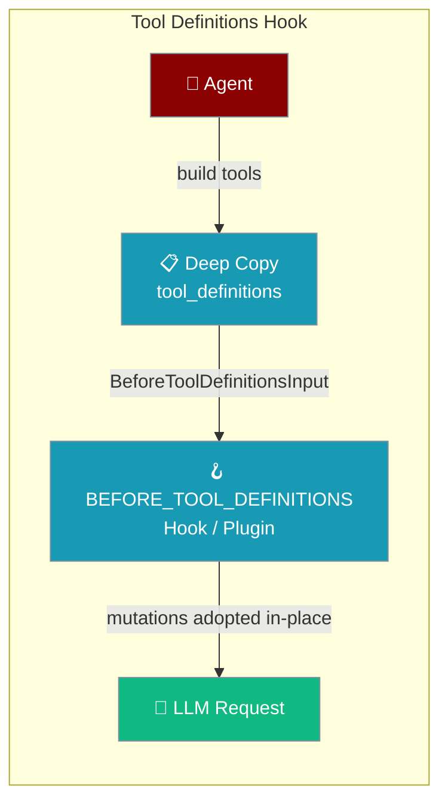
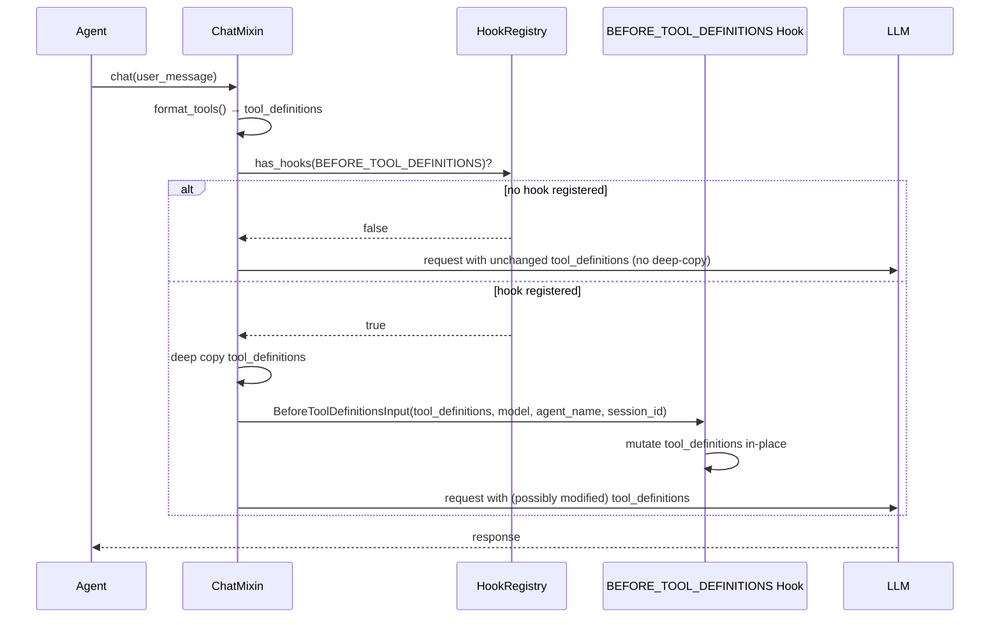

The `BEFORE_TOOL_DEFINITIONS` hook fires right after the tool list is assembled for a request and before it reaches the LLM — letting you drop tools, rewrite descriptions, or constrain parameter schemas on the fly.

<Note>
For the full hook lifecycle model, see the [Hooks concept page](/docs/concepts/hooks).
</Note>


```python
from praisonaiagents import Agent
from praisonaiagents.hooks import HookEvent, BeforeToolDefinitionsInput

def hide_dangerous(data: BeforeToolDefinitionsInput) -> None:
    data.tool_definitions[:] = [
        t for t in data.tool_definitions
        if t.get("function", {}).get("name") != "execute_shell"
    ]

agent = Agent(
    name="Safe Agent",
    instructions="Help with safe tasks only.",
    hooks={HookEvent.BEFORE_TOOL_DEFINITIONS: hide_dangerous},
)

agent.start("What can you do?")
```

The user prompts the agent; the hook trims tool definitions before the LLM sees them.



## Quick Start

<Steps>
<Step title="Drop a Tool by Name">
Remove a tool from the LLM's view for every request — the tool stays registered on the agent but the model never sees it:

```python
from praisonaiagents import Agent
from praisonaiagents.hooks import HookEvent, BeforeToolDefinitionsInput

def hide_dangerous_tools(data: BeforeToolDefinitionsInput) -> None:
    data.tool_definitions[:] = [
        t for t in data.tool_definitions
        if t.get("function", {}).get("name") != "execute_shell"
    ]

agent = Agent(
    name="Safe Agent",
    instructions="Help users with safe tasks only.",
    hooks={HookEvent.BEFORE_TOOL_DEFINITIONS: hide_dangerous_tools},
)

agent.start("What can you do?")
```
</Step>

<Step title="Rewrite a Tool Description">
Append usage guidance to a tool description before it reaches the model:

```python
from praisonaiagents import Agent
from praisonaiagents.hooks import HookEvent, BeforeToolDefinitionsInput

def annotate_tools(data: BeforeToolDefinitionsInput) -> None:
    for tool in data.tool_definitions:
        fn = tool.get("function", {})
        if fn.get("name") == "web_search":
            fn["description"] = (
                fn.get("description", "") +
                " Always cite the URL in your answer."
            )

agent = Agent(
    name="Researcher",
    instructions="Search the web and cite sources.",
    hooks={HookEvent.BEFORE_TOOL_DEFINITIONS: annotate_tools},
)

agent.start("What is the latest on AI safety?")
```
</Step>

<Step title="Async Hook">
The hook fires on both sync and async agent paths. Use an async function when you need async lookups:

```python
import asyncio
from praisonaiagents import Agent
from praisonaiagents.hooks import HookEvent, BeforeToolDefinitionsInput

async def filter_by_session(data: BeforeToolDefinitionsInput) -> None:
    allowed = await fetch_allowed_tools(data.session_id)
    data.tool_definitions[:] = [
        t for t in data.tool_definitions
        if t.get("function", {}).get("name") in allowed
    ]

agent = Agent(
    name="Session-Scoped Agent",
    instructions="Operate within your session's permissions.",
    hooks={HookEvent.BEFORE_TOOL_DEFINITIONS: filter_by_session},
)
```
</Step>

<Step title="As a Plugin">
Plugins implement `before_tool_definitions()` as a method:

```python
from praisonaiagents import Agent, Plugin
from praisonaiagents.hooks import BeforeToolDefinitionsInput

class ToolFilterPlugin(Plugin):
    def before_tool_definitions(self, data: BeforeToolDefinitionsInput) -> None:
        data.tool_definitions[:] = [
            t for t in data.tool_definitions
            if not t.get("function", {}).get("name", "").startswith("internal_")
        ]

agent = Agent(
    name="Plugin Agent",
    instructions="Help the user.",
    plugins=[ToolFilterPlugin()],
)
```
</Step>
</Steps>

---

## How It Works



**Deep copy guarantee (when a hook is registered):** The agent deep-copies `tool_definitions` before passing them to the hook. This means:
- Hook mutations cannot accidentally poison the agent's internal tool cache.
- Each request starts from the clean, registered tool list.
- Only in-place mutations (`data.tool_definitions[:] = ...`) are adopted.

---

## `BeforeToolDefinitionsInput` Fields

| Field | Type | Description |
|-------|------|-------------|
| `tool_definitions` | `List[Dict[str, Any]]` | The assembled OpenAI-style tool definitions. Mutate in-place. |
| `model` | `str` | The LLM model name for this request |
| `agent_name` | `str` | Name of the agent firing the hook |
| `session_id` | `str` | Session identifier (for per-session filtering) |

---

## Mutation Pattern

Always mutate `tool_definitions` **in-place** with slice assignment. Reassigning the variable does nothing:

```python
def hook(data: BeforeToolDefinitionsInput) -> None:
    # ✅ Correct — slice assignment mutates in-place
    data.tool_definitions[:] = [
        t for t in data.tool_definitions if keep(t)
    ]

    # ❌ Wrong — reassigning the variable is ignored by the runtime
    data.tool_definitions = [t for t in data.tool_definitions if keep(t)]
```

---

## Best Practices

<AccordionGroup>
<Accordion title="Zero overhead when no hook is registered">
`BEFORE_TOOL_DEFINITIONS` costs nothing when no hook is registered — the runtime checks `has_hooks()` before doing any work (including the deep copy of `tool_definitions`) on both sync (`chat`) and async (`achat`) paths. Adding this hook is safe on the tool-calling hot path; the deep-copy and hook execution only run when you actually opt in.

```python
from praisonaiagents import Agent
from praisonaiagents.hooks import HookEvent, BeforeToolDefinitionsInput

def read_file(path: str) -> str:
    """Read a file."""
    return f"contents of {path}"

def delete_file(path: str) -> str:
    """Delete a file."""
    return f"deleted {path}"

# No BEFORE_TOOL_DEFINITIONS hook registered → the runtime skips the deep-copy
# and hook plumbing entirely. Same cost as an agent that never had hooks wired up.
agent = Agent(name="Fast", instructions="Be helpful.", tools=[read_file, delete_file])
agent.start("Read notes.txt")

# Only pay the cost when you actually opt in:
def drop_delete(data: BeforeToolDefinitionsInput) -> None:
    data.tool_definitions[:] = [
        t for t in data.tool_definitions
        if t.get("function", {}).get("name") != "delete_file"
    ]

agent = Agent(
    name="Safer",
    instructions="Be helpful.",
    tools=[read_file, delete_file],
    hooks={HookEvent.BEFORE_TOOL_DEFINITIONS: drop_delete},
)
agent.start("Read notes.txt")   # Now the deep-copy + hook fire on every request.
```
</Accordion>

<Accordion title="Use session_id to scope per-user tool access">
The `session_id` field lets you load per-session permissions from a store and filter tools accordingly. This is the recommended pattern for multi-tenant bots where different users get different tool sets.
</Accordion>

<Accordion title="Prefer description rewriting over tool removal">
Removing a tool stops the model from calling it but can break agent plans that depend on it. Rewriting the description (e.g. adding `"(disabled for this session)"`) lets the model know the tool exists but should not be called.
</Accordion>

<Accordion title="Keep hooks fast — they run on every request">
The hook fires before every LLM call. Avoid slow I/O in sync hooks; use async hooks for database or network lookups.
</Accordion>

<Accordion title="Test with the deep-copy guarantee in mind">
Because the runtime deep-copies before calling your hook, changes to one request's tool list never affect the next. You cannot cache mutations across requests via the hook input itself.
</Accordion>
</AccordionGroup>

---

## Related

<CardGroup cols={2}>
<Card title="Hooks (Concept)" icon="webhook" href="/docs/concepts/hooks">
  Full hook lifecycle model
</Card>
<Card title="Hook Events" icon="list" href="/docs/features/hook-events">
  All available hook events
</Card>
<Card title="Bot Lifecycle Hooks" icon="activity" href="/docs/features/bot-lifecycle-hooks">
  Hooks for bot startup and shutdown
</Card>
<Card title="Tool Availability" icon="wrench" href="/docs/features/tool-availability">
  Control which tools agents can use
</Card>
</CardGroup>
