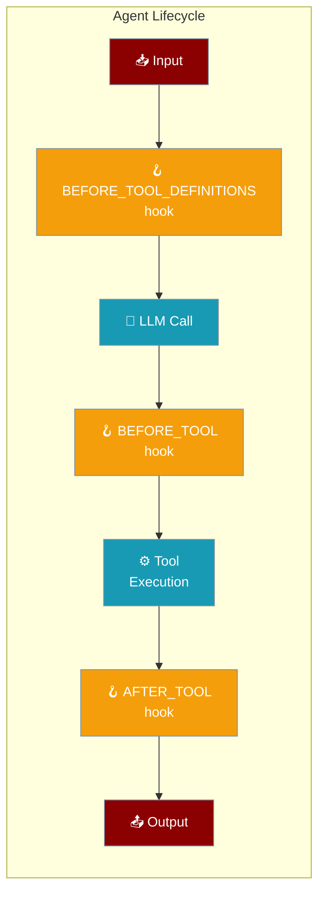
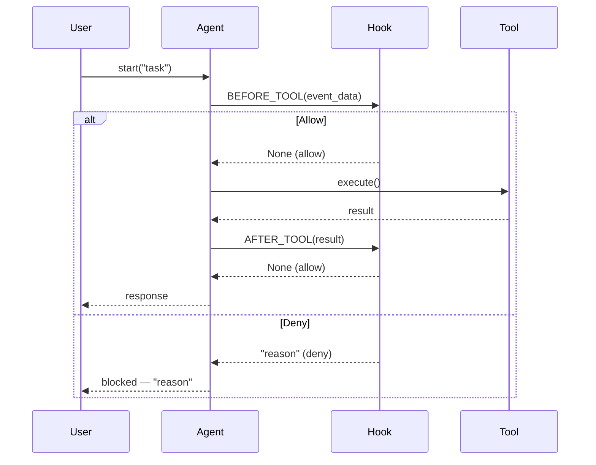

Hooks intercept agent actions at lifecycle points so you can log, modify, or block them without changing agent code.


```python
from praisonaiagents import Agent
from praisonaiagents.hooks import add_hook

@add_hook("before_tool")
def log_tools(event_data):
    print(f"Running tool: {event_data.tool_name}")

agent = Agent(name="SecureAssistant", instructions="You are a helpful assistant.")
agent.start("Help me organise my files")
```

The user sends a request; hooks intercept tools and lifecycle steps without changing agent code.


```mermaid
graph LR
    subgraph "Agent Lifecycle"
        INPUT["📥 Input"] --> BTD["🪝 BEFORE_TOOL_DEFINITIONS\nhook"]
        BTD --> LLM["🧠 LLM Call"]
        LLM --> BEFORE["🪝 BEFORE_TOOL\nhook"]
        BEFORE --> TOOL["⚙️ Tool\nExecution"]
        TOOL --> AFTER["🪝 AFTER_TOOL\nhook"]
        AFTER --> OUTPUT["📤 Output"]
    end

    classDef agent fill:#8B0000,stroke:#7C90A0,color:#fff
    classDef tool fill:#189AB4,stroke:#7C90A0,color:#fff
    classDef hook fill:#F59E0B,stroke:#7C90A0,color:#fff
    classDef success fill:#10B981,stroke:#7C90A0,color:#fff

    class INPUT,OUTPUT agent
    class TOOL,LLM tool
    class BTD,BEFORE,AFTER hook
```

## Quick Start

<Steps>
<Step title="Simple Usage">
Register a hook with `add_hook` and any agent picks it up automatically:

```python
from praisonaiagents import Agent
from praisonaiagents.hooks import add_hook

@add_hook('before_tool')
def log_tools(event_data):
    print(f"Running tool: {event_data.tool_name}")

@add_hook('before_tool')
def block_delete(event_data):
    if "delete" in event_data.tool_name.lower():
        return "Delete operations are blocked"

agent = Agent(
    name="SecureAssistant",
    instructions="You are a helpful assistant."
)

agent.start("Help me organize my files")
```

Hook return values:
- `None` or no return → Allow
- `False` → Deny
- `"reason"` → Deny with custom message
</Step>

<Step title="With HooksConfig">
Attach a `HooksConfig` to a specific agent for scoped hooks:

```python
from praisonaiagents import Agent, HooksConfig

def log_step(event_data):
    print(f"Step: {event_data}")

def on_tool(event_data):
    print(f"Tool called: {event_data.tool_name}")

agent = Agent(
    name="MonitoredAgent",
    instructions="You are a helpful assistant.",
    hooks=HooksConfig(
        on_step=log_step,
        on_tool_call=on_tool,
    )
)

agent.start("Write a haiku about Python")
```
</Step>
</Steps>

---

## How It Works


```mermaid
sequenceDiagram
    participant User
    participant Agent
    participant Hook
    participant Tool

    User->>Agent: start("task")
    Agent->>Hook: BEFORE_TOOL(event_data)
    alt Allow
        Hook-->>Agent: None (allow)
        Agent->>Tool: execute()
        Tool-->>Agent: result
        Agent->>Hook: AFTER_TOOL(result)
        Hook-->>Agent: None (allow)
        Agent-->>User: response
    else Deny
        Hook-->>Agent: "reason" (deny)
        Agent-->>User: blocked — "reason"
    end
```

### Available Hook Events

| Event | When It Fires |
|-------|--------------|
| `before_tool` | Before any tool executes |
| `after_tool` | After a tool returns a result |
| `before_tool_definitions` | After tool list assembled, before sent to LLM — shape what the model sees |
| `before_agent` | Before the agent starts a turn |
| `after_agent` | After the agent completes a turn |
| `before_llm` | Before an LLM API call |
| `after_llm` | After an LLM API response |
| `on_error` | When any error occurs |
| `on_retry` | Before a retry attempt — fires on both sync and async LLM paths (post-PR #2386) |
| `session_start` | When a session begins |
| `session_end` | When a session ends |

`on_retry` is emitted once per retryable error, just before the back-off sleep. It runs whether the LLM call is `agent.chat(...)` (sync) or `await agent.achat(...)` (async). Sync-registered callbacks on the async path are run in a thread executor — they cannot block the event loop.

---

## Configuration Options

<Card title="HooksConfig SDK Reference" icon="code" href="/docs/sdk/reference/python/classes/HooksConfig">
  Full parameter reference for HooksConfig
</Card>

```python
from praisonaiagents import Agent, HooksConfig

agent = Agent(
    instructions="...",
    hooks=HooksConfig(
        on_step=my_step_callback,
        on_tool_call=my_tool_callback,
        middleware=[my_middleware],
    )
)
```

| Option | Type | Default | Description |
|--------|------|---------|-------------|
| `on_step` | `Callable \| None` | `None` | Called on each agent step |
| `on_tool_call` | `Callable \| None` | `None` | Called before each tool execution |
| `middleware` | `List` | `[]` | Middleware list applied to all events |

---

## Common Patterns

### Security Filtering

```python
from praisonaiagents import Agent
from praisonaiagents.hooks import add_hook

BLOCKED_TOOLS = {"delete_file", "execute_command", "drop_table"}

@add_hook('before_tool')
def security_filter(event_data):
    if event_data.tool_name in BLOCKED_TOOLS:
        return f"Tool '{event_data.tool_name}' is not allowed in this environment"

agent = Agent(
    name="SafeAgent",
    instructions="Help users manage their documents safely."
)

agent.start("Clean up the old log files")
```

### Audit Logging

```python
import json
from datetime import datetime
from praisonaiagents import Agent
from praisonaiagents.hooks import add_hook

@add_hook('before_tool')
def audit_before(event_data):
    print(json.dumps({
        "ts": datetime.utcnow().isoformat(),
        "event": "before_tool",
        "tool": event_data.tool_name,
    }))

@add_hook('after_tool')
def audit_after(event_data):
    print(json.dumps({
        "ts": datetime.utcnow().isoformat(),
        "event": "after_tool",
        "tool": event_data.tool_name,
    }))

agent = Agent(
    name="AuditAgent",
    instructions="Process user requests with full audit trail."
)

agent.start("Search for the latest AI research papers")
```

### Tool Matching with HookRegistry

```python
from praisonaiagents import Agent
from praisonaiagents.hooks import HookRegistry, HookEvent, HookResult

registry = HookRegistry()

@registry.on(HookEvent.BEFORE_TOOL)
def file_guard(event_data) -> HookResult:
    if event_data.tool_name.startswith("write_"):
        print(f"Write operation: {event_data.tool_name}")
    return HookResult.allow()

agent = Agent(
    name="GuardedAgent",
    instructions="You are a helpful assistant.",
    hooks=registry
)

agent.start("Create a summary and save it to output.txt")
```

---

## Best Practices

<AccordionGroup>
  <Accordion title="Keep hooks lightweight">
    Hooks run synchronously before/after each operation. Avoid network calls or heavy computation inside hook functions — use async queues for heavy processing.
  </Accordion>
  <Accordion title="Return None to allow, string to deny">
    The simplest hook contract: return nothing (or `None`) to allow, return a string with a reason to block. This keeps hooks readable.
  </Accordion>
  <Accordion title="Use add_hook for global rules, HooksConfig for per-agent rules">
    `add_hook` registers hooks globally — all agents in the process obey them. Use `HooksConfig` when you need different rules per agent.
  </Accordion>
  <Accordion title="Set _strict_hooks=True in tests">
    By default, hook exceptions are logged as warnings and execution continues. Set `agent._strict_hooks = True` in tests so hook failures surface immediately as errors.
  </Accordion>
</AccordionGroup>

---

## Related

<CardGroup cols={2}>
  <Card title="Guardrails" icon="shield-halved" href="/docs/features/guardrails">
    Validate agent output quality with automatic retry
  </Card>
  <Card title="Callbacks" icon="circle-nodes" href="/docs/features/callbacks">
    Observe agent events for UI and logging purposes
  </Card>
</CardGroup>
