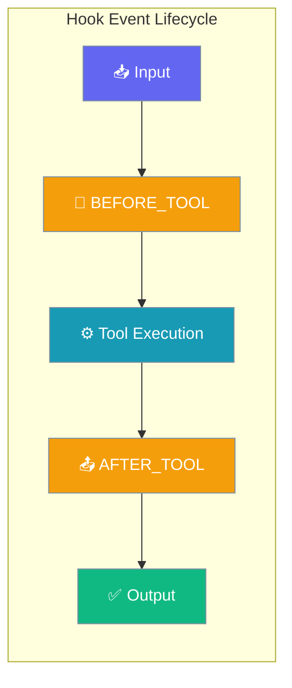
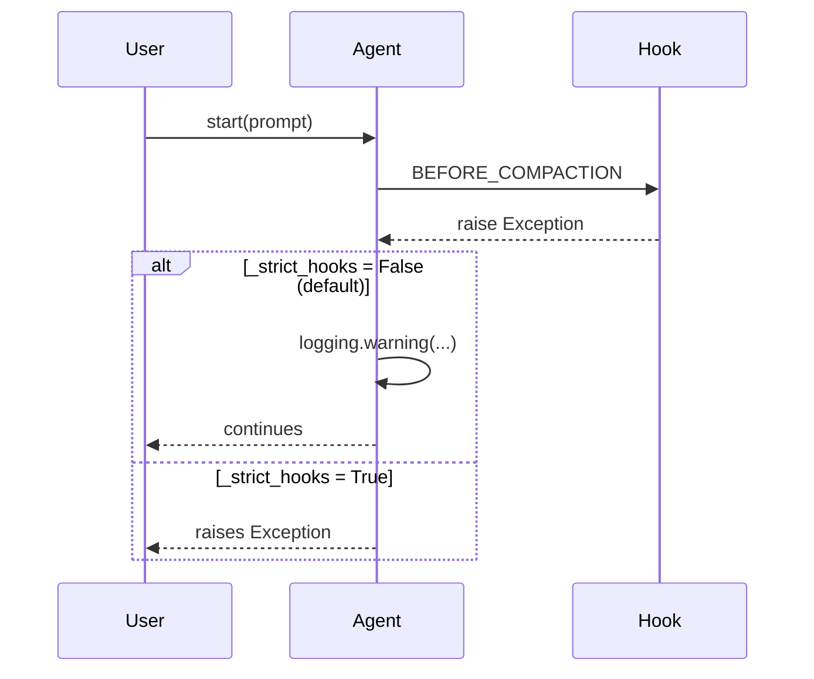

# Hooks

Intercept and modify agent behavior at various lifecycle points. Unlike callbacks (which are for UI events), hooks can intercept, modify, or block tool execution.

## Quick Start

### Simplest Usage

```python
from praisonaiagents import Agent
from praisonaiagents.hooks import add_hook

# Register hooks with simple string events
@add_hook('before_tool')
def log_tools(event_data):
    print(f"Tool: {event_data.tool_name}")
    # No return needed - defaults to allow

@add_hook('before_tool')
def security_check(event_data):
    if "delete" in event_data.tool_name.lower():
        return "Delete operations blocked"  # String = deny with reason
    # No return = allow

# Agent automatically uses registered hooks
agent = Agent(
    name="SecureAssistant",
    instructions="You are a helpful assistant."
)

agent.start("Help me organize my files")
```

> **Tip**: Hook returns are simple:
> - `None` or no return → Allow
> - `False` → Deny
> - `"reason"` → Deny with custom message

### Agent-Centric Usage

```python
from praisonaiagents import Agent
from praisonaiagents.hooks import HookRegistry, HookEvent, HookResult, BeforeToolInput

# Create a hook registry
registry = HookRegistry()

# Log all tool calls
@registry.on(HookEvent.BEFORE_TOOL)
def log_tools(event_data: BeforeToolInput) -> HookResult:
    print(f"Tool: {event_data.tool_name}")
    return HookResult.allow()

# Block dangerous operations
@registry.on(HookEvent.BEFORE_TOOL)
def security_check(event_data: BeforeToolInput) -> HookResult:
    if "delete" in event_data.tool_name.lower():
        return HookResult.deny("Delete operations blocked")
    return HookResult.allow()

# Agent with hooks - intercepts tool calls
agent = Agent(
    name="SecureAssistant",
    instructions="You are a helpful assistant.",
    hooks=registry
)

agent.start("Help me organize my files")
```

## Hook Events


```mermaid
graph LR
    subgraph "Hook Event Lifecycle"
        A[📥 Input] --> B[🔧 BEFORE_TOOL]
        B --> C[⚙️ Tool Execution]
        C --> D[📤 AFTER_TOOL]
        D --> E[✅ Output]
    end
    
    classDef input fill:#6366F1,stroke:#7C90A0,color:#fff
    classDef hook fill:#F59E0B,stroke:#7C90A0,color:#fff
    classDef process fill:#189AB4,stroke:#7C90A0,color:#fff
    classDef output fill:#10B981,stroke:#7C90A0,color:#fff
    
    class A input
    class B,D hook
    class C process
    class E output
```

### Core Events

| Event | Trigger | Use Case |
|-------|---------|----------|
| `BEFORE_TOOL` | Before tool execution | Security checks, logging |
| `AFTER_TOOL` | After tool execution | Result logging, validation |
| `BEFORE_AGENT` | Before agent runs | Setup, initialization |
| `AFTER_AGENT` | After agent completes | Cleanup, reporting |
| `BEFORE_LLM` | Before LLM API call | Request modification, logging |
| `AFTER_LLM` | After LLM API response | Response logging, validation |
| `SESSION_START` | When session starts | Session initialization |
| `SESSION_END` | When session ends | Session cleanup |
| `ON_ERROR` | When an error occurs | Error handling, recovery |
| `ON_RETRY` | Before a retry attempt | Retry logic, backoff |

### Extended Events

| Event | Trigger | Use Case |
|-------|---------|----------|
| `USER_PROMPT_SUBMIT` | When user submits a prompt | Input validation, logging |
| `NOTIFICATION` | When notification is sent | Alert routing, logging |
| `SUBAGENT_STOP` | When subagent completes | Subagent result handling |
| `SETUP` | On initialization/maintenance | System setup, config loading |
| `BEFORE_COMPACTION` | Before context compaction | Pre-compaction hooks |
| `AFTER_COMPACTION` | After context compaction | Post-compaction validation |
| `MESSAGE_RECEIVED` | When message is received | Message preprocessing |
| `MESSAGE_SENDING` | Before message is sent | Message modification |
| `MESSAGE_SENT` | After message is sent | Delivery confirmation |
| `GATEWAY_START` | When gateway starts | Gateway initialization |
| `GATEWAY_STOP` | When gateway stops | Gateway cleanup |
| `TOOL_RESULT_PERSIST` | Before tool result storage | Result modification |

## Hook Decisions

| Decision | Description |
|----------|-------------|
| `allow` | Allow the operation to proceed |
| `deny` | Deny the operation with a reason |
| `block` | Block the operation silently |
| `ask` | Prompt for user confirmation |

## CLI Commands

```bash
praisonai hooks list                    # List registered hooks
praisonai hooks test before_tool        # Test hooks for an event
praisonai hooks run "echo test"         # Run a command hook
praisonai hooks validate hooks.json     # Validate configuration
```

---

## Low-level API Reference

### HookRegistry Direct Usage

```python
from praisonaiagents.hooks import (
    HookRegistry, HookRunner, HookEvent, HookResult,
    BeforeToolInput
)

# Create a hook registry
registry = HookRegistry()

# Log all tool calls
@registry.on(HookEvent.BEFORE_TOOL)
def log_tools(event_data: BeforeToolInput) -> HookResult:
    print(f"Tool: {event_data.tool_name}")
    return HookResult.allow()

# Block dangerous operations
@registry.on(HookEvent.BEFORE_TOOL)
def security_check(event_data: BeforeToolInput) -> HookResult:
    if "delete" in event_data.tool_name.lower():
        return HookResult.deny("Delete operations blocked")
    return HookResult.allow()

# Execute hooks
runner = HookRunner(registry)
result = runner.run(HookEvent.BEFORE_TOOL, event_data)
```

### Shell Command Hooks

Register external scripts as hooks:

```python
from praisonaiagents.hooks import HookRegistry, HookEvent

registry = HookRegistry()

# Run external validator before file writes
registry.register_command_hook(
    event=HookEvent.BEFORE_TOOL,
    command="python /path/to/file_validator.py",
    matcher="write_*"  # Only for tools starting with write_
)
```

### Matcher Patterns

```python
from praisonaiagents.hooks import HookRegistry, HookEvent, HookResult

registry = HookRegistry()

# Match specific tools
registry.register_function_hook(
    event=HookEvent.BEFORE_TOOL,
    func=my_hook,
    matcher="write_file"  # Exact match
)

# Match with wildcard
registry.register_function_hook(
    event=HookEvent.BEFORE_TOOL,
    func=my_hook,
    matcher="file_*"  # Matches file_read, file_write, etc.
)

# Match multiple patterns
registry.register_function_hook(
    event=HookEvent.BEFORE_TOOL,
    func=my_hook,
    matcher=["read_*", "write_*"]  # Multiple patterns
)
```

### Configuration File

Create `.praison/hooks.json` in your project:

```json
{
  "enabled": true,
  "timeout": 30,
  "hooks": {
    "pre_write_code": "./scripts/lint.sh",
    "post_write_code": [
      "./scripts/format.sh",
      "./scripts/git-add.sh"
    ],
    "pre_run_command": {
      "command": "./scripts/validate-command.sh",
      "timeout": 60,
      "enabled": true,
      "block_on_failure": true,
      "pass_input": true
    }
  }
}
```

## LLM Hooks

Intercept LLM API calls for logging, modification, or validation:

```python
from praisonaiagents import Agent
from praisonaiagents.hooks import HookRegistry, HookEvent, HookResult, BeforeLLMInput, AfterLLMInput

registry = HookRegistry()

@registry.on(HookEvent.BEFORE_LLM)
def log_llm_request(event_data: BeforeLLMInput) -> HookResult:
    """Log LLM requests before they are sent."""
    print(f"LLM Request: {len(event_data.messages)} messages")
    print(f"Model: {event_data.model}")
    return HookResult.allow()

@registry.on(HookEvent.AFTER_LLM)
def log_llm_response(event_data: AfterLLMInput) -> HookResult:
    """Log LLM responses after they are received."""
    print(f"LLM Response: {len(event_data.response)} chars")
    print(f"Tokens used: {event_data.usage}")
    return HookResult.allow()

agent = Agent(
    name="MonitoredAgent",
    instructions="You are helpful.",
    hooks=registry
)
```

## Error and Retry Hooks

Handle errors and customize retry behavior:

```python
from praisonaiagents.hooks import OnErrorInput, OnRetryInput

@registry.on(HookEvent.ON_ERROR)
def handle_error(event_data: OnErrorInput) -> HookResult:
    """Handle errors during agent execution."""
    print(f"Error occurred: {event_data.error}")
    print(f"Context: {event_data.context}")
    # Log to external service, send alert, etc.
    return HookResult.allow()

@registry.on(HookEvent.ON_RETRY)
def handle_retry(event_data: OnRetryInput) -> HookResult:
    """Customize retry behavior."""
    print(f"Retry attempt {event_data.attempt} of {event_data.max_retries}")
    if event_data.attempt > 2:
        return HookResult.deny("Too many retries")
    return HookResult.allow()
```

## Agent-Level Error Callbacks

Agents now support an `on_error` callback that is called when LLM errors occur, separate from the HookEvent system:

```python
from praisonaiagents import Agent
from praisonaiagents.errors import LLMError

def handle_llm_error(error):
    """Agent-level error handler for LLM failures"""
    print(f"LLM Error in agent: {error.agent_id}")
    print(f"Model: {error.model_name}")
    print(f"Retryable: {error.is_retryable}")
    
    # Could implement custom error recovery here
    if error.is_retryable and "rate limit" in error.message.lower():
        print("Rate limit detected - implement backoff strategy")
    elif not error.is_retryable:
        print("Fatal error - manual intervention required")

agent = Agent(
    name="Error Aware Agent",
    instructions="Process user requests",
    on_error=handle_llm_error  # Called when LLM errors occur
)

# When _chat_completion raises LLMError, on_error is called first
try:
    result = agent.start("Hello world")
except LLMError as e:
    print(f"Error propagated after on_error hook: {e}")
```

### Error Hook vs Agent Callback

| Type | Purpose | When Called | Scope |
|------|---------|-------------|-------|
| **HookEvent.ON_ERROR** | General error handling | Any error in hook system | All registered hooks |
| **agent.on_error** | LLM-specific errors | When `_chat_completion` fails | Single agent instance |

```python
# Both can be used together
registry = HookRegistry()

@registry.on(HookEvent.ON_ERROR)
def global_error_handler(event_data):
    """Handles all types of errors"""
    print(f"Global error: {event_data.error}")
    return HookResult.allow()

def llm_error_handler(error):
    """Handles only LLM errors for this agent"""
    print(f"LLM error: {error.message}")

agent = Agent(
    name="Dual Error Handling",
    instructions="Process requests",
    hooks=registry,        # Global error handling
    on_error=llm_error_handler  # LLM-specific handling
)
```

### Error Handler Behavior

- **Exception Swallowing**: Exceptions inside the `on_error` callback are swallowed and logged at debug level
- **Execution Order**: `on_error` is called before the `LLMError` is raised
- **No Return Value**: The callback cannot prevent error propagation (unlike hooks)

```python
def robust_error_handler(error):
    """Safe error handler that won't crash the agent"""
    try:
        # Could call external monitoring service
        send_alert_to_monitoring(error)
        log_to_database(error)
    except Exception as handler_error:
        # This exception is automatically caught and logged
        pass  # Won't crash the agent

agent = Agent(
    name="Robust Agent",
    on_error=robust_error_handler
)
```

## Strict mode: fail loud on hook errors

By default, exceptions inside a hook are logged as warnings and the agent continues. Setting `agent._strict_hooks = True` re-raises the exception so failures are surfaced immediately — useful in tests, staging, or when a hook enforces a compliance check that must not be silently ignored.

```python
from praisonaiagents import Agent
from praisonaiagents.hooks import HookRegistry, HookEvent, HookResult

registry = HookRegistry()

@registry.on(HookEvent.BEFORE_COMPACTION)
def audit_compaction(event_data):
    # ... your audit / validation logic
    return HookResult.allow()

agent = Agent(
    name="StrictAgent",
    instructions="You are a careful assistant.",
    hooks=registry,
)
agent._strict_hooks = True   # Any hook exception will now propagate
```

| Mode | Hook raises | Default? |
|---|---|---|
| Relaxed (default) | Warning is logged, execution continues | ✅ |
| Strict (`_strict_hooks = True`) | Exception propagates, call aborts | |


```mermaid
sequenceDiagram
    participant User
    participant Agent
    participant Hook
    User->>Agent: start(prompt)
    Agent->>Hook: BEFORE_COMPACTION
    Hook-->>Agent: raise Exception
    alt _strict_hooks = False (default)
        Agent->>Agent: logging.warning(...)
        Agent-->>User: continues
    else _strict_hooks = True
        Agent-->>User: raises Exception
    end
```

Applies today to the compaction hooks (`BEFORE_COMPACTION`, `AFTER_COMPACTION`) and the outer compaction block; follow-up PRs may extend coverage.

## Best Practices

1. **Keep hooks lightweight** - Hooks run synchronously, avoid heavy operations
2. **Use matchers** - Only run hooks for relevant tools
3. **Return early** - Return `allow` quickly for non-matching cases
4. **Log decisions** - Log why hooks deny operations for debugging
5. **Hook failures now log warnings by default** - Check logs for `BEFORE_COMPACTION hook failed` / `AFTER_COMPACTION hook failed` lines
6. **Use `agent._strict_hooks = True` in tests or staging** - To fail loudly when a hook raises

## See Also

- [Hooks CLI](/docs/cli/hooks)
- [Hooks SDK Module](/docs/sdk/praisonaiagents/hooks/hooks)
- [Guardrails](/features/guardrails)
