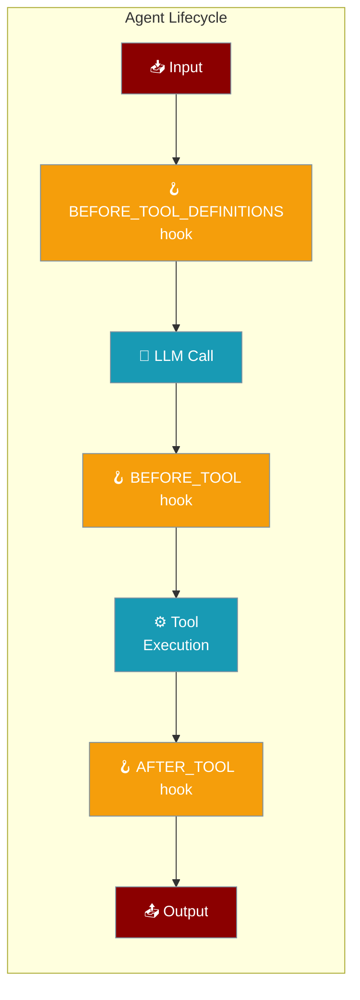
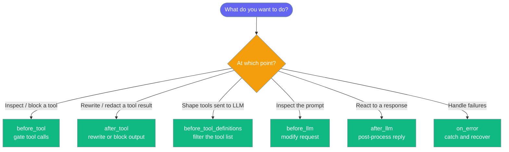
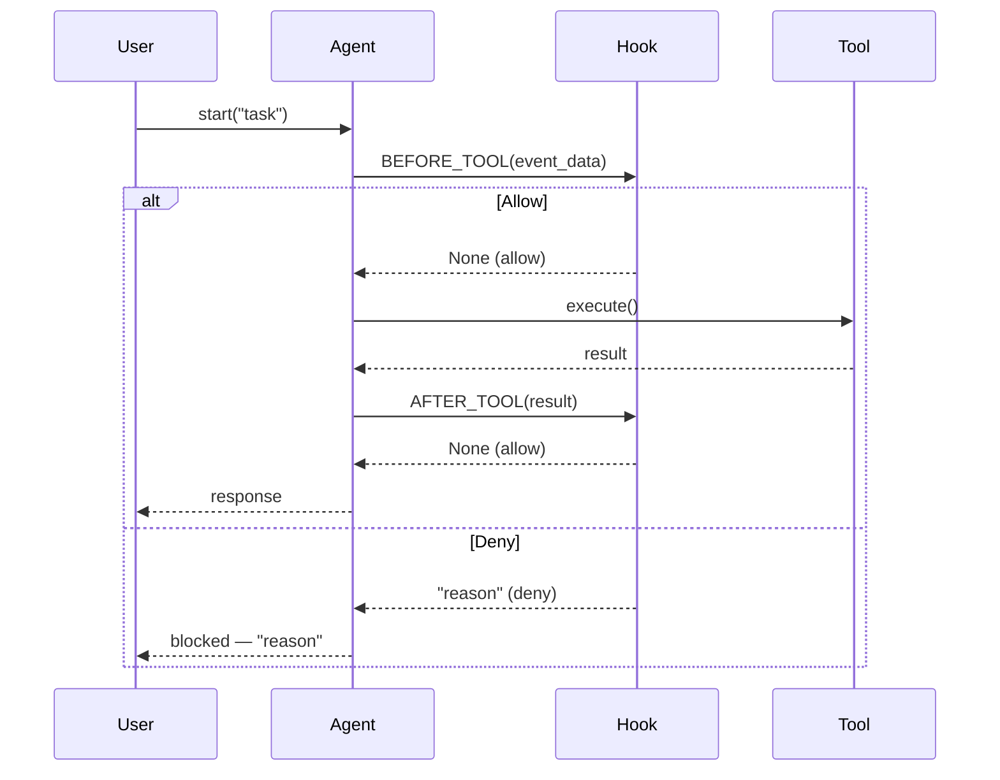
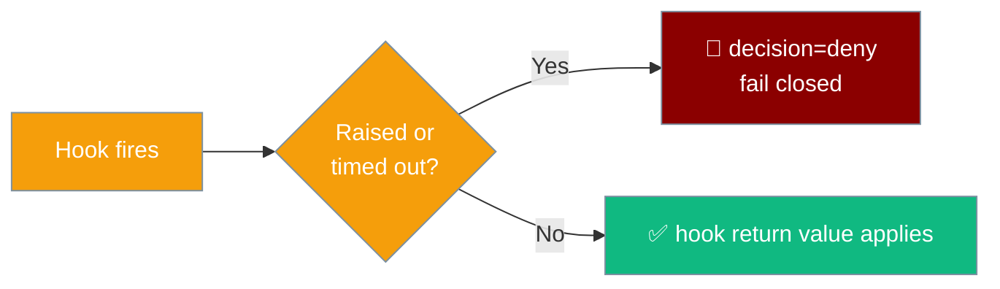
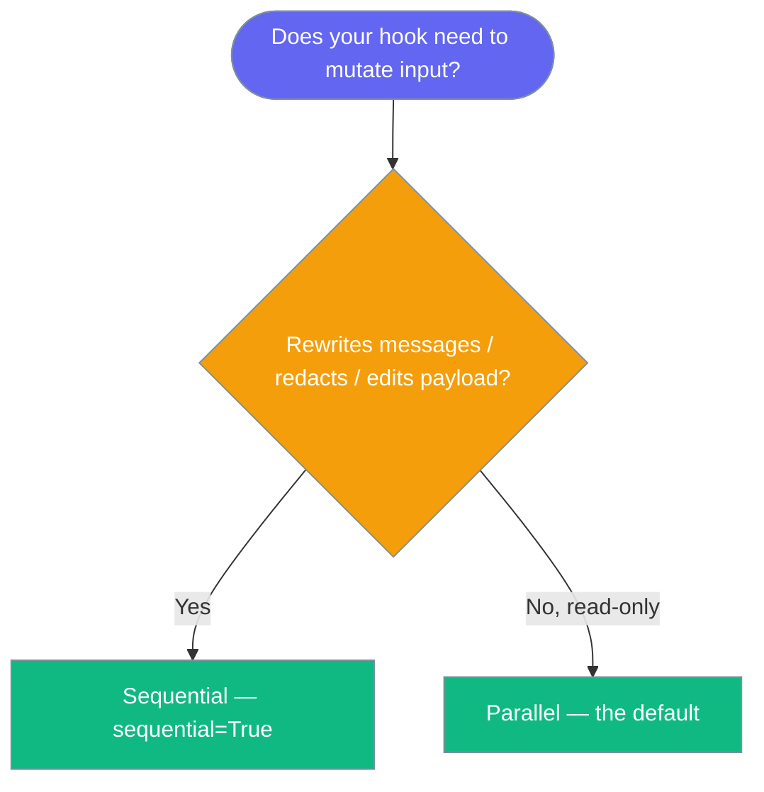
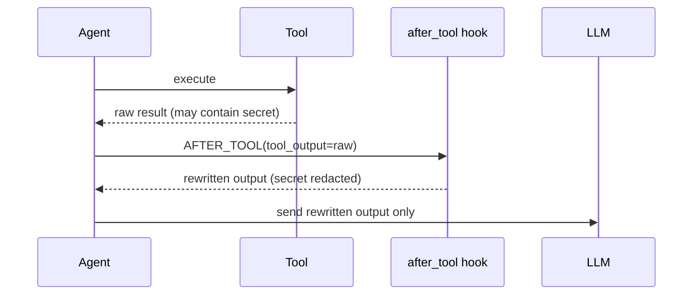

Hooks intercept agent actions at lifecycle points so you can log, modify, or block them without changing agent code.


```python
from praisonaiagents import Agent
from praisonaiagents.hooks import add_hook

@add_hook("before_tool")
def log_tools(event_data):
    print(f"Running tool: {event_data.tool_name}")

agent = Agent(name="SecureAssistant", instructions="You are a helpful assistant.")
agent.start("Help me organise my files")
```

The user sends a request; hooks intercept tools and lifecycle steps without changing agent code.


```mermaid
graph LR
    subgraph "Agent Lifecycle"
        INPUT["📥 Input"] --> BTD["🪝 BEFORE_TOOL_DEFINITIONS\nhook"]
        BTD --> LLM["🧠 LLM Call"]
        LLM --> BEFORE["🪝 BEFORE_TOOL\nhook"]
        BEFORE --> TOOL["⚙️ Tool\nExecution"]
        TOOL --> AFTER["🪝 AFTER_TOOL\nhook"]
        AFTER --> OUTPUT["📤 Output"]
    end

    classDef agent fill:#8B0000,stroke:#7C90A0,color:#fff
    classDef tool fill:#189AB4,stroke:#7C90A0,color:#fff
    classDef hook fill:#F59E0B,stroke:#7C90A0,color:#fff
    classDef success fill:#10B981,stroke:#7C90A0,color:#fff

    class INPUT,OUTPUT agent
    class TOOL,LLM tool
    class BTD,BEFORE,AFTER hook
```

## Quick Start

<Steps>
<Step title="Simple Usage">
Register a hook with `add_hook` and any agent picks it up automatically:

```python
from praisonaiagents import Agent
from praisonaiagents.hooks import add_hook

@add_hook('before_tool')
def log_tools(event_data):
    print(f"Running tool: {event_data.tool_name}")

@add_hook('before_tool')
def block_delete(event_data):
    if "delete" in event_data.tool_name.lower():
        return "Delete operations are blocked"

agent = Agent(
    name="SecureAssistant",
    instructions="You are a helpful assistant."
)

agent.start("Help me organize my files")
```

Hook return values:
- `None` or no return → Allow
- `False` → Deny
- `"reason"` → Deny with custom message
</Step>

<Step title="With HooksConfig">
Attach a `HooksConfig` to a specific agent for scoped hooks:

```python
from praisonaiagents import Agent, HooksConfig

def log_step(event_data):
    print(f"Step: {event_data}")

def on_tool(event_data):
    print(f"Tool called: {event_data.tool_name}")

agent = Agent(
    name="MonitoredAgent",
    instructions="You are a helpful assistant.",
    hooks=HooksConfig(
        on_step=log_step,
        on_tool_call=on_tool,
    )
)

agent.start("Write a haiku about Python")
```
</Step>
</Steps>

---

## Which Hook Point Should I Use?

Pick the lifecycle event that matches what you want to observe or block.


```mermaid
graph TB
    Start([What do you want to do?]) --> Q1{At which point?}
    Q1 -->|Inspect / block a tool| A[before_tool<br/>gate tool calls]
    Q1 -->|Rewrite / redact a tool result| B[after_tool<br/>rewrite or block output]
    Q1 -->|Shape tools sent to LLM| C[before_tool_definitions<br/>filter the tool list]
    Q1 -->|Inspect the prompt| D[before_llm<br/>modify request]
    Q1 -->|React to a response| E[after_llm<br/>post-process reply]
    Q1 -->|Handle failures| F[on_error<br/>catch and recover]

    classDef start fill:#6366F1,stroke:#7C90A0,color:#fff
    classDef question fill:#F59E0B,stroke:#7C90A0,color:#fff
    classDef answer fill:#10B981,stroke:#7C90A0,color:#fff

    class Start start
    class Q1 question
    class A,B,C,D,E,F answer
```

---

## How It Works


```mermaid
sequenceDiagram
    participant User
    participant Agent
    participant Hook
    participant Tool

    User->>Agent: start("task")
    Agent->>Hook: BEFORE_TOOL(event_data)
    alt Allow
        Hook-->>Agent: None (allow)
        Agent->>Tool: execute()
        Tool-->>Agent: result
        Agent->>Hook: AFTER_TOOL(result)
        Hook-->>Agent: None (allow)
        Agent-->>User: response
    else Deny
        Hook-->>Agent: "reason" (deny)
        Agent-->>User: blocked — "reason"
    end
```

A hook that **raises or times out** now counts as `Deny`, not `Allow`. Every hook lifecycle path returns `HookResult(decision="deny", reason=...)` on error — a crashing `BEFORE_TOOL` gate no longer lets the tool call through by accident.


```mermaid
graph LR
    A[Hook fires] --> B{Raised or<br/>timed out?}
    B -->|Yes| D[🚫 decision=deny<br/>fail closed]
    B -->|No| C[✅ hook return value applies]

    classDef question fill:#F59E0B,stroke:#7C90A0,color:#fff
    classDef deny fill:#8B0000,stroke:#7C90A0,color:#fff
    classDef allow fill:#10B981,stroke:#7C90A0,color:#fff

    class A,B question
    class D deny
    class C allow
```

### Sequential vs Parallel Hooks

A hook's execution mode decides whether it can rewrite the payload.

**Sequential hooks** run one after another and their `modified_input` is applied back to the payload. **Parallel hooks** run concurrently and cannot mutate the payload — use them for read-only observers (metrics, logging, tracing). If your hook needs to rewrite the request (redact secrets, inject headers, edit messages), register it with `sequential=True`.


```mermaid
graph TB
    Start([Does your hook need to mutate input?])
    Start --> Q1{Rewrites messages / redacts / edits payload?}
    Q1 -->|Yes| A[Sequential — sequential=True]
    Q1 -->|No, read-only| B[Parallel — the default]

    classDef start fill:#6366F1,stroke:#7C90A0,color:#fff
    classDef question fill:#F59E0B,stroke:#7C90A0,color:#fff
    classDef answer fill:#10B981,stroke:#7C90A0,color:#fff

    class Start start
    class Q1 question
    class A,B answer
```

```python
from praisonaiagents.hooks import HookRegistry, HookEvent

registry = HookRegistry()

# Read-only observer — parallel (default)
registry.register_function(
    event=HookEvent.BEFORE_LLM,
    func=log_prompt,
    name="my.logger",
)

# Rewriter — MUST be sequential to apply modified_input
registry.register_function(
    event=HookEvent.BEFORE_LLM,
    func=redact_pii,
    name="my.pii_redactor",
    sequential=True,   # <-- required for modified_input to take effect
)
```

<Warning>
Registering a mutating hook without `sequential=True` looks correct but silently no-ops — the runner runs it in parallel with sibling hooks, so its `modified_input` is discarded. As of PraisonAI [PR #4034](https://github.com/MervinPraison/PraisonAI/pull/4034) the runtime **logs a warning** when a parallel hook returns a non-empty `modified_input`: `"Parallel hook '<name>' returned modified_input which is discarded; register it with sequential=True to apply it."` Watch your logs when adopting a new mutating hook.
</Warning>

### Available Hook Events

The events most agents will ever need are the agent / tool / LLM / error / session ones — start here.

| Event | When it fires |
|-------|--------------|
| `before_agent` | Before the agent starts a turn |
| `after_agent` | After the agent completes a turn |
| `before_tool` | Before any tool executes |
| `after_tool` | After a tool returns a result |
| `before_tool_definitions` | After tool list assembled, before sent to LLM — shape what the model sees |
| `before_llm` | Before an LLM API call (sync + async) |
| `after_llm` | After an LLM API response (sync + async) |
| `on_error` | When any error occurs |
| `on_retry` | Before a retry attempt (sync + async LLM paths) |
| `session_start` | When a session begins |
| `session_end` | When a session ends |

<Note>
This is the **core lifecycle** subset. The SDK ships ~40 events in total — including LLM lifecycle hooks (`before_llm`, `after_llm`, `model_fallback`), plugin/system hooks (`on_init`, `on_shutdown`), tool-result persistence (`tool_result_persist`), message-level bot hooks (`before_message`, `after_message`, `message_received`, `message_sending`, `message_sent`), gateway hooks (`gateway_start`, `gateway_stop`), compaction hooks (`before_compaction`, `after_compaction`), permission/config/auth hooks (`on_permission_ask`, `on_config`, `on_auth`), schedule hooks (`schedule_add`, `schedule_remove`, `schedule_trigger`), background-job hooks (`job_completed`), kanban task hooks, and Claude-Code-parity events (`user_prompt_submit`, `notification`, `subagent_stop`, `setup`).

See [Hook Events](/features/hook-events) for the complete reference with input dataclasses and examples for each.
</Note>

`on_retry` is emitted once per retryable error, just before the back-off sleep. It runs whether the LLM call is `agent.chat(...)` (sync) or `await agent.achat(...)` (async). Sync-registered callbacks on the async path are run in a thread executor — they cannot block the event loop.

<Note>
Since PraisonAI PR [#3908](https://github.com/MervinPraison/PraisonAI/pull/3908), `before_llm` and `after_llm` fire on both `chat()` and `achat()`. See [Hook Events → LLM Events](/features/hook-events#llm-events) for the parity note and blocking semantics.
</Note>

<Note>
**Two lookalike fields.** Function-style hooks return `HookResult` and set `modified_input` to rewrite the payload. Shell-command hooks parse into `HookOutput` and use `modified_data` for the same purpose. When you write a hook in Python, always use `HookResult(decision="allow", modified_input={...})` — the internal Agent code reads `.modified_input` on hook results.
</Note>

---

## Configuration Options

<Card title="HooksConfig SDK Reference" icon="code" href="/sdk/reference/praisonaiagents/modules/feature_configs">
  Full parameter reference for HooksConfig
</Card>

```python
from praisonaiagents import Agent, HooksConfig

agent = Agent(
    instructions="...",
    hooks=HooksConfig(
        on_step=my_step_callback,
        on_tool_call=my_tool_callback,
        middleware=[my_middleware],
    )
)
```

| Option | Type | Default | Description |
|--------|------|---------|-------------|
| `on_step` | `Callable \| None` | `None` | Called on each agent step |
| `on_tool_call` | `Callable \| None` | `None` | Called before each tool execution |
| `middleware` | `List` | `[]` | Middleware list applied to all events |

---

## Common Patterns

### Security Filtering

```python
from praisonaiagents import Agent
from praisonaiagents.hooks import add_hook

BLOCKED_TOOLS = {"delete_file", "execute_command", "drop_table"}

@add_hook('before_tool')
def security_filter(event_data):
    if event_data.tool_name in BLOCKED_TOOLS:
        return f"Tool '{event_data.tool_name}' is not allowed in this environment"

agent = Agent(
    name="SafeAgent",
    instructions="Help users manage their documents safely."
)

agent.start("Clean up the old log files")
```

### Audit Logging

```python
import json
from datetime import datetime
from praisonaiagents import Agent
from praisonaiagents.hooks import add_hook

@add_hook('before_tool')
def audit_before(event_data):
    print(json.dumps({
        "ts": datetime.utcnow().isoformat(),
        "event": "before_tool",
        "tool": event_data.tool_name,
    }))

@add_hook('after_tool')
def audit_after(event_data):
    print(json.dumps({
        "ts": datetime.utcnow().isoformat(),
        "event": "after_tool",
        "tool": event_data.tool_name,
    }))

agent = Agent(
    name="AuditAgent",
    instructions="Process user requests with full audit trail."
)

agent.start("Search for the latest AI research papers")
```

### Redact Secrets from Tool Output

Rewrite the tool result the model sees — scrub API keys before they ever reach the LLM. Returning a value from an `after_tool` hook **replaces** `event_data.tool_output`.

```python
import re
from praisonaiagents import Agent
from praisonaiagents.hooks import add_hook

SECRET_RE = re.compile(r"sk-[A-Za-z0-9]{20,}")

@add_hook('after_tool')
def redact_secrets(event_data):
    """Rewrite the tool result the model sees — never leak API keys."""
    result = event_data.tool_output
    if isinstance(result, str) and SECRET_RE.search(result):
        return SECRET_RE.sub("[REDACTED-SECRET]", result)
    return None  # unchanged

agent = Agent(name="Assistant", instructions="Help with logs.")
agent.start("Read /var/log/api.log and summarise the errors")
```


```mermaid
sequenceDiagram
    participant Agent
    participant Tool
    participant AfterTool as after_tool hook
    participant LLM

    Agent->>Tool: execute
    Tool-->>Agent: raw result (may contain secret)
    Agent->>AfterTool: AFTER_TOOL(tool_output=raw)
    AfterTool-->>Agent: rewritten output (secret redacted)
    Agent->>LLM: send rewritten output only
```

### Block a Tool Result via GuardrailBlocked

Raise `GuardrailBlocked` inside `after_tool` to stop a result reaching the model — mirrors the block path already available on `before_tool`.

```python
from praisonaiagents import Agent
from praisonaiagents.hooks import add_hook
from praisonaiagents.plugins import GuardrailBlocked

@add_hook('after_tool')
def block_pii(event_data):
    if "ssn=" in str(event_data.tool_output).lower():
        raise GuardrailBlocked("Tool result contained PII; blocked before reaching model.")

agent = Agent(name="Assistant", instructions="Help with customer records.")
agent.start("Look up the account details for order 4821")
```

<Note>
`after_tool` returns are honoured as of PraisonAI PR [#3969](https://github.com/MervinPraison/PraisonAI/pull/3969) — before that release the return value was silently discarded, so the hook could observe but never rewrite or block. Both the sync (`agent.chat(...)`) and async (`await agent.achat(...)`) tool-execution paths now read back `event_data.tool_output` and honour `GuardrailBlocked`.
</Note>

### Tool Matching with HookRegistry

```python
from praisonaiagents import Agent
from praisonaiagents.hooks import HookRegistry, HookEvent, HookResult

registry = HookRegistry()

@registry.on(HookEvent.BEFORE_TOOL)
def file_guard(event_data) -> HookResult:
    if event_data.tool_name.startswith("write_"):
        print(f"Write operation: {event_data.tool_name}")
    return HookResult.allow()

agent = Agent(
    name="GuardedAgent",
    instructions="You are a helpful assistant.",
    hooks=registry
)

agent.start("Create a summary and save it to output.txt")
```

### Redact a Tool Result

Rewrite `event_data.tool_output` in place to scrub a secret, or return `HookResult.block(reason)` to suppress the result entirely.

```python
from praisonaiagents import Agent
from praisonaiagents.hooks import HookRegistry, HookEvent, HookResult

registry = HookRegistry()

@registry.on(HookEvent.AFTER_TOOL)
def redact_secrets(event_data):
    scrubbed = str(event_data.tool_output).replace("sk-SECRET123", "[REDACTED]")
    event_data.tool_output = scrubbed        # rewrite in place
    return HookResult.allow()

@registry.on(HookEvent.AFTER_TOOL)
def block_on_pii(event_data):
    if "ssn=" in str(event_data.tool_output):
        return HookResult.block("PII detected in tool output")
    return HookResult.allow()

agent = Agent(
    name="SafeAgent",
    instructions="Answer using the fetch tool.",
    tools=["fetch"],
    hooks=registry,
)
agent.start("Fetch the user profile")
```

See [Redact / Block Tool Output](/features/redact-tool-output) for the plugin-style equivalent.

<Note>
`HookEvent.BEFORE_TOOL` and `HookEvent.AFTER_TOOL` now fire on **both** the sync (`agent.chat(...)`) and async (`await agent.achat(...)`) tool-execution paths. When a `BEFORE_TOOL` hook blocks a call, the tool returns `"Execution of {tool_name} was blocked by security policy."` on either path. `AFTER_TOOL` results aggregate context onto the tool output (string concat, or the `_additional_context` key on a dict result). The check costs nothing when no hooks are registered.

**`AFTER_TOOL` can also rewrite or block the result** (PraisonAI PRs [#3968](https://github.com/MervinPraison/PraisonAI/issues/3968) / [#3969](https://github.com/MervinPraison/PraisonAI/pull/3969)). Mutate `event_data.tool_output` in place to redact the value the model sees, or return `HookResult.block(reason)` to suppress it. See [Redact / Block Tool Output](/features/redact-tool-output).
</Note>

---

## Best Practices

<AccordionGroup>
  <Accordion title="Keep hooks lightweight">
    Hooks run synchronously before/after each operation. Avoid network calls or heavy computation inside hook functions — use async queues for heavy processing.
  </Accordion>
  <Accordion title="Return None to allow, string to deny">
    The simplest hook contract: return nothing (or `None`) to allow, return a string with a reason to block. This keeps hooks readable.
  </Accordion>
  <Accordion title="Use add_hook for global rules, HooksConfig for per-agent rules">
    `add_hook` registers hooks globally — all agents in the process obey them. Use `HooksConfig` when you need different rules per agent.
  </Accordion>
  <Accordion title="Sequential for rewriters, parallel for observers">
    Parallel is the default and is faster. Only mark a hook `sequential=True` when it needs to mutate the payload via `modified_input`.
  </Accordion>
  <Accordion title="Hooks fail closed on exception or timeout">
    A `BEFORE_TOOL` (or any) hook that raises or times out now returns `HookResult(decision="deny", reason=...)` — the tool does **not** execute. This matches `GuardrailChain` and closes a silent-pass-through where a buggy security hook used to allow the call through. Set `agent._strict_hooks = True` in tests to also surface the underlying exception, not just the deny.
  </Accordion>
  <Accordion title="Tool errors don't fail closed — hooks do">
    Tool failures are tolerated: a tool that raises or returns a non-JSON result is fed back to the model as `{"error": ...}` / `{"result": ...}` and the run continues. Hooks are the opposite — a raising or timed-out hook denies the call. Keep security gates in hooks, not in tool bodies.
  </Accordion>
  <Accordion title="before_agent / after_agent / BEFORE_TOOL_DEFINITIONS cost nothing when unregistered">
    `before_agent`, `after_agent`, and `BEFORE_TOOL_DEFINITIONS` cost nothing when no hook is registered — the runtime checks `has_hooks()` before building the input (including `os.getcwd()`, the tools list, and any deep-copy of tool definitions) on both sync (`chat`) and async (`achat`) paths. Register these hooks in production without a per-turn overhead concern.

    ```python
    from praisonaiagents import Agent
    from praisonaiagents.hooks import add_hook

    # No before_agent / after_agent hook registered anywhere in the process.
    # The runtime skips input construction entirely — no os.getcwd(), no tools list build.
    agent = Agent(name="Fast", instructions="Be helpful.")
    agent.start("Say hi")

    # Only pay the cost when you actually opt in:
    @add_hook("after_agent")
    def log_turn(event_data):
        print(f"Turn completed by {event_data.agent_name} in {event_data.execution_time_ms:.0f}ms")

    agent.start("Say hi again")   # Now the input is built and after_agent fires.
    ```
  </Accordion>
</AccordionGroup>

---

## Related

<CardGroup cols={3}>
  <Card title="Hook Events" icon="webhook" href="/features/hook-events">
    Complete list of ~40 events with input dataclasses and examples
  </Card>
  <Card title="Guardrails" icon="shield-halved" href="/features/guardrails">
    Validate agent output quality with automatic retry
  </Card>
  <Card title="Callbacks" icon="circle-nodes" href="/features/callbacks">
    Observe agent events for UI and logging purposes
  </Card>
</CardGroup>
