# Hooks

Execute custom actions before and after agent operations, similar to Windsurf's Cascade Hooks. Configure hooks via JSON or register Python callables programmatically.

```mermaid
graph LR
    subgraph "Hook Events"
        PRE["🔵 Pre-Operation"]
        OP["⚡ Operation"]
        POST["🟢 Post-Operation"]
    end
    
    subgraph "Hook Types"
        SCRIPT["📜 Script Hooks"]
        CALLABLE["🐍 Python Callables"]
    end
    
    PRE --> OP
    OP --> POST
    
    SCRIPT --> PRE
    SCRIPT --> POST
    CALLABLE --> PRE
    CALLABLE --> POST
    
    classDef event fill:#189AB4,stroke:#7C90A0,color:#fff
    classDef type fill:#2E8B57,stroke:#7C90A0,color:#fff
    
    class PRE,OP,POST event
    class SCRIPT,CALLABLE type
```



## Quick Start

<CodeGroup>
```python Python Callable Hooks
from praisonaiagents.memory import HooksManager

hooks = HooksManager()

# Register a pre-write hook
def before_write(context):
    print(f"About to write to: {context.get('file_path')}")
    # Return modified context or None
    return {"validated": True}

hooks.register("pre_write_code", before_write)

# Execute hooks
result = hooks.execute("pre_write_code", {"file_path": "main.py"})
print(f"Hook success: {result.success}")
```

```python Script Hooks (JSON Config)
from praisonaiagents.memory import HooksManager

hooks = HooksManager()

# Create configuration file
hooks.create_config(
    hooks={
        "pre_write_code": "./scripts/lint.sh",
        "post_write_code": "./scripts/format.sh",
        "pre_run_command": "./scripts/validate.sh"
    },
    timeout=30,
    enabled=True
)

# Hooks are automatically loaded from .praison/hooks.json
```

```json .praison/hooks.json
{
  "enabled": true,
  "timeout": 30,
  "hooks": {
    "pre_write_code": "./scripts/lint.sh",
    "post_write_code": "./scripts/format.sh",
    "pre_run_command": {
      "command": "./scripts/validate.sh",
      "timeout": 60,
      "block_on_failure": true
    }
  }
}
```
</CodeGroup>

## Hook Events

| Event | Trigger | Use Case |
|-------|---------|----------|
| `pre_read_code` | Before reading a file | Access logging |
| `post_read_code` | After reading a file | Content validation |
| `pre_write_code` | Before writing to a file | Linting, validation |
| `post_write_code` | After writing to a file | Formatting, git add |
| `pre_run_command` | Before running a command | Security checks |
| `post_run_command` | After running a command | Logging, cleanup |
| `pre_user_prompt` | Before processing user input | Input sanitization |
| `post_user_prompt` | After processing user input | Response logging |
| `pre_mcp_tool_use` | Before using an MCP tool | Permission checks |
| `post_mcp_tool_use` | After using an MCP tool | Result logging |

## Configuration File

Create `.praison/hooks.json` in your project:

```json
{
  "enabled": true,
  "timeout": 30,
  "hooks": {
    "pre_write_code": "./scripts/lint.sh",
    "post_write_code": [
      "./scripts/format.sh",
      "./scripts/git-add.sh"
    ],
    "pre_run_command": {
      "command": "./scripts/validate-command.sh",
      "timeout": 60,
      "enabled": true,
      "block_on_failure": true,
      "pass_input": true
    }
  }
}
```

### Configuration Options

| Option | Type | Default | Description |
|--------|------|---------|-------------|
| `enabled` | boolean | `true` | Enable/disable all hooks |
| `timeout` | integer | `30` | Global timeout in seconds |
| `hooks` | object | `{}` | Map of event names to commands |

### Per-Hook Options

| Option | Type | Default | Description |
|--------|------|---------|-------------|
| `command` | string | required | Script or command to run |
| `timeout` | integer | global | Override global timeout |
| `enabled` | boolean | `true` | Enable/disable this hook |
| `block_on_failure` | boolean | `false` | Block operation if hook fails |
| `pass_input` | boolean | `true` | Pass context as environment variables |

## Python Callable Hooks

Register Python functions as hooks:

```python
from praisonaiagents.memory import HooksManager

hooks = HooksManager()

# Simple hook
def log_writes(context):
    print(f"Writing to {context.get('file_path')}")

hooks.register("pre_write_code", log_writes)

# Hook that modifies context
def add_timestamp(context):
    import time
    context["timestamp"] = time.time()
    return context

hooks.register("pre_write_code", add_timestamp)

# Hook that can block operations
def security_check(context):
    if "password" in context.get("content", "").lower():
        raise ValueError("Cannot write passwords to files!")

hooks.register("pre_write_code", security_check)

# Unregister a hook
hooks.unregister("pre_write_code", log_writes)
```

## Script Hooks

Scripts receive context as environment variables:

```bash
#!/bin/bash
# scripts/lint.sh

# Context is passed as environment variables
echo "File: $PRAISON_HOOK_FILE_PATH"
echo "Content length: ${#PRAISON_HOOK_CONTENT}"

# Full context as JSON
echo "Context: $PRAISON_HOOK_CONTEXT"

# Run linting
if ! pylint "$PRAISON_HOOK_FILE_PATH"; then
    echo "Linting failed!"
    exit 1
fi

# Return modified content (optional)
# echo "MODIFIED:new content here"
```

### Environment Variables

| Variable | Description |
|----------|-------------|
| `PRAISON_HOOK_FILE_PATH` | File path (if applicable) |
| `PRAISON_HOOK_CONTENT` | Content being written |
| `PRAISON_HOOK_COMMAND` | Command being run |
| `PRAISON_HOOK_CONTEXT` | Full context as JSON |

### Exit Codes

| Code | Meaning |
|------|---------|
| `0` | Success |
| `1` | Failure (blocks if `block_on_failure` is true) |
| Other | Failure |

## Hook Results

```python
from praisonaiagents.memory import HooksManager, HookResult

hooks = HooksManager()

result = hooks.execute("pre_write_code", {"file_path": "main.py"})

# Check result
print(f"Success: {result.success}")
print(f"Exit code: {result.exit_code}")
print(f"Stdout: {result.stdout}")
print(f"Stderr: {result.stderr}")
print(f"Blocked: {result.blocked}")
print(f"Modified input: {result.modified_input}")
```

## Blocking Operations

Use `block_on_failure` to prevent operations when hooks fail:

```json
{
  "hooks": {
    "pre_write_code": {
      "command": "./scripts/security-scan.sh",
      "block_on_failure": true
    }
  }
}
```

```python
result = hooks.execute("pre_write_code", {"content": "..."})

if result.blocked:
    print("Operation blocked by hook!")
    print(f"Reason: {result.stderr}")
else:
    # Proceed with operation
    pass
```

## Statistics

```python
from praisonaiagents.memory import HooksManager

hooks = HooksManager()

# Check if hooks exist for an event
if hooks.has_hooks("pre_write_code"):
    print("Pre-write hooks are configured")

# Get statistics
stats = hooks.get_stats()
print(f"Enabled: {stats['enabled']}")
print(f"Script hooks: {stats['script_hooks']}")
print(f"Callable hooks: {stats['callable_hooks']}")
print(f"Total hooks: {stats['total_hooks']}")
print(f"Events: {stats['events']}")
```

## Best Practices

<AccordionGroup>
  <Accordion title="Keep hooks fast">
    Hooks run synchronously. Keep them fast (under 5 seconds) to avoid slowing down operations. Use `timeout` to prevent hanging.
  </Accordion>
  <Accordion title="Use block_on_failure sparingly">
    Only block operations for critical checks like security scans. Most hooks should log or modify without blocking.
  </Accordion>
  <Accordion title="Handle errors gracefully">
    Hooks should catch exceptions and return meaningful error messages. Don't let hooks crash the main operation.
  </Accordion>
  <Accordion title="Use Python hooks for complex logic">
    Script hooks are good for simple tasks. Use Python callable hooks for complex validation or transformation logic.
  </Accordion>
</AccordionGroup>

## See Also

<CardGroup cols={2}>
  <Card title="Workflows" icon="diagram-project" href="/features/workflows">
    Create reusable multi-step workflows
  </Card>
  <Card title="Rules & Instructions" icon="scroll" href="/features/rules">
    Auto-discover and apply persistent rules
  </Card>
  <Card title="Agent Memory" icon="memory" href="/features/memory">
    Persistent memory for agents
  </Card>
</CardGroup>
