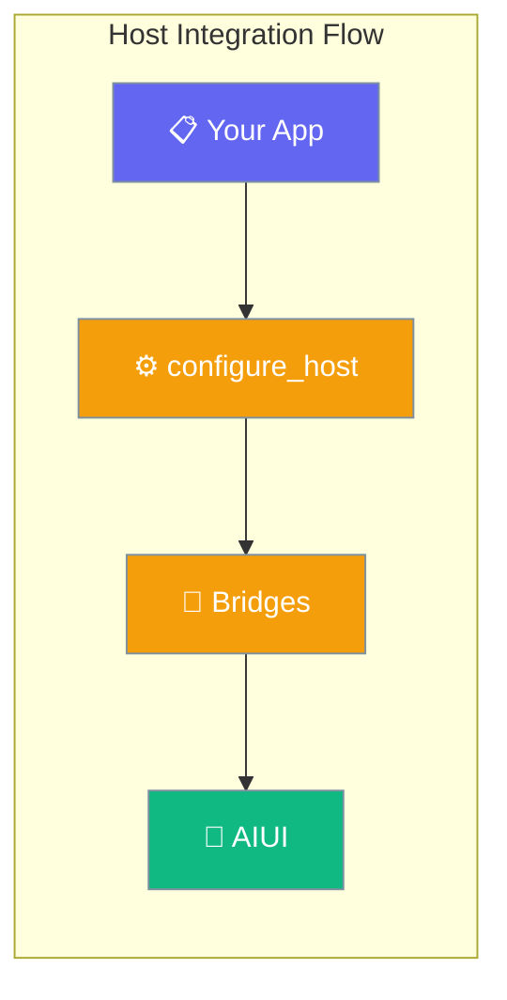
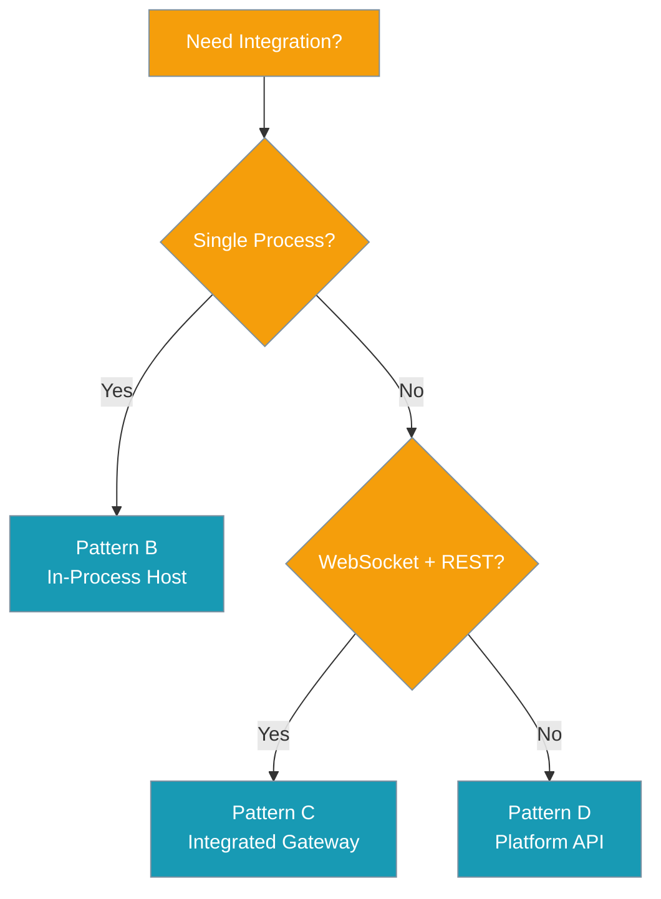

Integrate PraisonAI agents directly into your application using the built-in host integration module.



## Quick Start

<Steps>
<Step title="Simple Host">

Create a host app with default settings:

```python
from praisonai.integration import build_host_app

app = build_host_app(
    title="My Agent App",
    pages=["chat", "agents", "sessions", "usage"],
)
# Run with: uvicorn main:app --host 0.0.0.0 --port 8000
```

</Step>

<Step title="Advanced Configuration">

Configure with custom agents and settings:

```python
from praisonai.integration import configure_host, create_host_app

configure_host(
    title="Advanced Agent Platform",
    logo="🚀",
    pages=["chat", "agents", "memory", "knowledge", "sessions"],
    agents=[
        {
            "name": "Code Assistant",
            "instructions": "Help with coding tasks",
            "llm": "gpt-4o"
        }
    ],
    theme={"primary_color": "#3b82f6"}
)

app = create_host_app()
```

</Step>
</Steps>

---

## Integration Patterns

Choose your integration pattern based on your needs:



---

## Configuration Options

| Option | Type | Default | Description |
|--------|------|---------|-------------|
| `pages` | `Sequence[str]` | `None` | UI pages to include |
| `title` | `str` | `"PraisonAI"` | Application title |
| `logo` | `str` | `"🤖"` | Logo or emoji |
| `sidebar` | `bool` | `True` | Show navigation sidebar |
| `page_header` | `bool` | `True` | Show page header |
| `theme` | `Dict[str, Any]` | `None` | Custom theme settings |
| `agents` | `List[Any]` | `None` | Pre-configured agents |
| `agent_kwargs` | `Dict[str, Any]` | `None` | Default agent parameters |
| `gateway` | `Any` | `None` | External gateway reference |
| `modules` | `Sequence[str]` | `None` | Additional modules to load |

---

## API Reference

### Core Functions

<AccordionGroup>

<Accordion title="configure_host()">
Apply host settings and wire backends. Must be called before `create_host_app()`.

```python
configure_host(
    pages=["chat", "agents"],
    title="My App",
    agents=[{"name": "Assistant"}]
)
```
</Accordion>

<Accordion title="create_host_app()">
Return the Starlette app instance. Call after `configure_host()`.

```python
app = create_host_app()
# Ready for uvicorn, gunicorn, etc.
```
</Accordion>

<Accordion title="build_host_app()">
One-shot configuration and app creation. Simplest approach.

```python
app = build_host_app(title="Quick Setup")
```
</Accordion>

<Accordion title="run_integrated_gateway()">
Pattern C: Start gateway with integrated UI on single port (async).

```python
await run_integrated_gateway(
    port=8080,
    title="Gateway App",
    pages=["chat", "agents"]
)
```
</Accordion>

</AccordionGroup>

---

## Legacy Mode

<Warning>
Set `PRAISONAI_HOST_LEGACY=1` to use callback-only mode without provider wiring. This skips automatic backend integration.
</Warning>

```bash
export PRAISONAI_HOST_LEGACY=1
```

In legacy mode, only `@aiui.reply` callbacks work - no automatic agent integration.

---

## Common Patterns

### Pattern B: In-Process Host

Embed the UI in your existing application:

```python
from praisonai.integration import build_host_app
from fastapi import FastAPI

# Your existing app
main_app = FastAPI()

# Create agent UI
agent_ui = build_host_app(
    title="Agent Dashboard",
    pages=["chat", "sessions"]
)

# Mount as subapp
main_app.mount("/agents", agent_ui)
```

### Pattern C: Integrated Gateway

Single process serving UI + API + WebSocket:

```python
import asyncio
from praisonai.integration import run_integrated_gateway

async def main():
    await run_integrated_gateway(
        port=8080,
        host="0.0.0.0",
        title="Agent Gateway",
        agents=[{"name": "Assistant", "llm": "gpt-4o"}]
    )

if __name__ == "__main__":
    asyncio.run(main())
```

### Custom Bridges

Wire your own backend services:

```python
from praisonai.integration import configure_host, setup_bridges

configure_host(title="Custom App")
setup_bridges()  # Auto-wire available bridges

# Or set custom backends
import praisonaiui.backends as backends
backends.set_backend("usage_sink", my_custom_sink)
```

---

## Best Practices

<AccordionGroup>

<Accordion title="Environment Configuration">
Use environment variables for configuration that changes between deployments:

```python
configure_host(
    title=os.getenv("APP_TITLE", "PraisonAI"),
    agents=[{
        "llm": os.getenv("PRAISONAI_MODEL", "gpt-4o-mini")
    }]
)
```
</Accordion>

<Accordion title="Error Handling">
Handle import errors gracefully for optional features:

```python
try:
    from praisonai.integration import build_host_app
    app = build_host_app()
except ImportError:
    # Fallback for environments without UI
    from fastapi import FastAPI
    app = FastAPI()
```
</Accordion>

<Accordion title="Resource Cleanup">
Use context managers for proper cleanup in long-running applications:

```python
from contextlib import asynccontextmanager

@asynccontextmanager
async def lifespan(app):
    # Startup
    setup_bridges()
    yield
    # Cleanup - bridges handle themselves

app = build_host_app()
app.router.lifespan_context = lifespan
```
</Accordion>

</AccordionGroup>

---

## Related

<CardGroup cols={2}>
<Card title="Integration Patterns" icon="diagram-project" href="/docs/features/integration-patterns">
  Compare Pattern B vs C vs D
</Card>
<Card title="Backend Injection" icon="arrows-right-left" href="/docs/features/aiui-backends">
  Custom backend services
</Card>
</CardGroup>