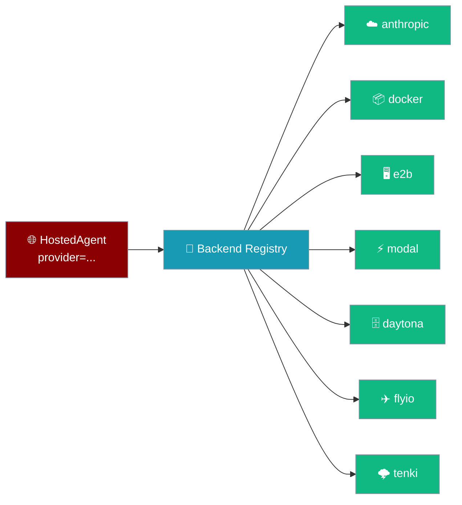
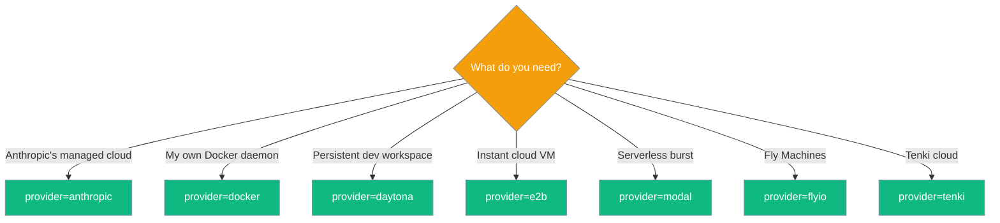
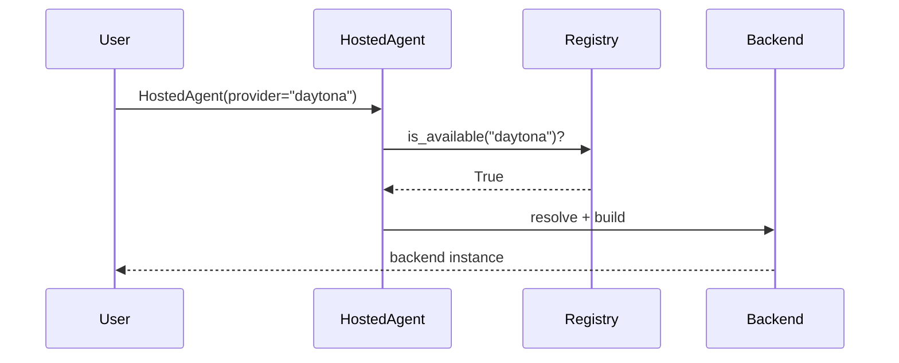

HostedAgent hosts the whole agent loop in any registered compute runtime — pick one with a single string.



## Quick Start

<Steps>
<Step title="Anthropic-hosted loop">
```python
from praisonaiagents import Agent
from praisonai import HostedAgent

agent = Agent(backend=HostedAgent(provider="anthropic"))
agent.start("Summarise today's meeting notes.")
```
</Step>

<Step title="Daytona-hosted loop">
```python
from praisonaiagents import Agent
from praisonai import HostedAgent, HostedAgentConfig

agent = Agent(backend=HostedAgent(
    provider="daytona",
    config=HostedAgentConfig(model="gpt-4o-mini", name="RemoteDev"),
))
agent.start("Set up a Python project and run pytest.")
```
</Step>
</Steps>

---

## Which provider should I pick?

The scenario picks the string.



---

## How it resolves — the backend registry

`HostedAgent(provider=...)` is a factory: it looks the provider up in `ManagedBackendRegistry` and returns the resolved backend.



`anthropic` is a builtin; every registered compute runtime — `docker` included as of [PR #4077](https://github.com/MervinPraison/PraisonAI/pull/4077) — resolves through the same registry and runs on one generic backend.

---

## Provider matrix

<Note>
The `docker`, `e2b`, `modal`, and `daytona` extras now name real, working extras. Before [PR #4073](https://github.com/MervinPraison/PraisonAI/pull/4073), three of them were absent or empty despite the docs implying they worked — `pip` warned about the unknown extra and then "succeeded", so users hit the same failure after the install. If you see `WARNING: praisonai does not provide the extra 'e2b'`, upgrade `praisonai`.
</Note>

| Provider | Extra install | Env var | Persistent | Best for |
|---|---|---|:---:|---|
| `anthropic` | (builtin) | `ANTHROPIC_API_KEY` | ❌ | Anthropic-hosted loops |
| `docker` | `pip install 'praisonai[docker]'` | (local daemon) | ❌ | Local isolation |
| `e2b` | `pip install 'praisonai[e2b]'` | `E2B_API_KEY` | ❌ | Instant cloud VM |
| `modal` | `pip install 'praisonai[modal]'` | Modal auth | ❌ | Serverless burst |
| `daytona` | `pip install 'praisonai[daytona]'` | `DAYTONA_API_KEY` | ✅ | Persistent dev workspaces |
| `flyio` | Fly.io token | `FLY_API_TOKEN` | ❌ | Fly Machines |
| `tenki` | Tenki credentials | Tenki auth | ❌ | Tenki cloud |

---

## Custom image / template

Since [PR #4077](https://github.com/MervinPraison/PraisonAI/pull/4077) the generic backend honours `image=` — one string maps to each provider's native concept.

| Provider | `image=` honoured as |
|---|---|
| `docker` | Docker image ref |
| `e2b` | E2B template name (unless `metadata["e2b_template"]` is set) |
| `modal` | Registry image ref via `Image.from_registry(...)` |
| `daytona`, `flyio`, `tenki` | Not applicable (uses provider-native workspace/image handling) |

```python
from praisonaiagents import Agent
from praisonai import HostedAgent, HostedAgentConfig

# Same string across providers — each maps it to the right native concept.
agent = Agent(backend=HostedAgent(
    provider="modal",
    config=HostedAgentConfig(model="gpt-4o-mini"),
    image="ghcr.io/my-org/my-runtime:latest",
))
agent.start("Do something in my custom image.")
```

The default image is `python:3.12-slim`; `image=` is honoured only when set to something other than that default.

---

## Daytona notes

Two Daytona defects were fixed in [PR #4074](https://github.com/MervinPraison/PraisonAI/pull/4074).

<Note>
**Memory unit.** `ComputeConfig` takes `memory_mb` (megabytes). Daytona's native unit is GiB, so the provider converts automatically — `memory_gib = max(1, round((memory_mb or 1024) / 1024))`. The default `ComputeConfig()` now provisions 1 GiB instead of asking for 1024 GiB. Sub-1024 MB requests floor to 1 GiB (never 0).
</Note>

<Note>
**File uploads.** Uploading a local file copies the file's *contents* to the remote destination (`upload_file(content, remote_path)`). Earlier versions swapped the arguments and wrote the path string into a file named after the content.
</Note>

---

## What HostedAgent will NOT accept

`openai`, `gemini`, `ollama`, and `local` are LLM routing names, not runtimes. HostedAgent raises `ValueError("... not yet available. Use LocalAgent ...")`.

```python
from praisonai import LocalAgent, LocalAgentConfig

agent = LocalAgent(config=LocalAgentConfig(model="openai/gpt-4o"))
agent.start("Draft a release note.")
```

---

## Common Patterns

### Swap the provider without touching agent code

The provider is one string; the agent stays the same.

```python
from praisonaiagents import Agent
from praisonai import HostedAgent, HostedAgentConfig

def build(provider: str) -> Agent:
    return Agent(backend=HostedAgent(
        provider=provider,
        config=HostedAgentConfig(model="gpt-4o-mini"),
    ))

agent = build("daytona")
agent.start("Run the test suite.")
```

### Pick the provider per environment

Read the provider from an env var to switch cloud vs local.

```python
import os
from praisonaiagents import Agent
from praisonai import HostedAgent

provider = os.environ.get("HOSTED_PROVIDER", "anthropic")
agent = Agent(backend=HostedAgent(provider=provider))
agent.start("Summarise the changelog.")
```

---

## Best Practices

<AccordionGroup>
<Accordion title="Prefer anthropic for zero-setup hosted loops">
`provider="anthropic"` needs only `ANTHROPIC_API_KEY` — no extra install, no daemon. Reach for a compute runtime when you need your own isolation, persistence, or a specific cloud.
</Accordion>

<Accordion title="Keep the provider swappable">
Pass the provider as a plain string from config or an env var. Every registered runtime shares the same `HostedAgent(provider=..., config=...)` shape, so switching clouds never touches agent code.
</Accordion>

<Accordion title="Use LocalAgent for LLM-only routing">
`openai`, `gemini`, `ollama`, and `local` are not runtimes. Use `LocalAgent(config=LocalAgentConfig(model="..."))` for those, and add `compute="..."` when you want cloud-sandboxed tools with a local loop.
</Accordion>

<Accordion title="Daytona for persistent workspaces">
`daytona` is the only runtime in the matrix that persists between runs — pick it when you want a dev workspace to survive across sessions. Remember `memory_mb` is megabytes; the provider converts to GiB.
</Accordion>
</AccordionGroup>

---

## Related

<CardGroup cols={2}>
<Card title="Hosted Agent" icon="cloud" href="/features/hosted-agent">
The base class and its Anthropic path.
</Card>
<Card title="Placement — where does my agent run?" icon="map-pin" href="/features/placement">
Short form: `Agent(run_on="daytona")`.
</Card>
<Card title="Managed Backend Plugins" icon="puzzle-piece" href="/features/managed-backend-plugins">
Register your own runtime via entry points.
</Card>
<Card title="Self-Hosted Agent (Docker)" icon="docker" href="/features/run-on-docker">
`provider="docker"` runs the whole loop in a container you own.
</Card>
</CardGroup>
