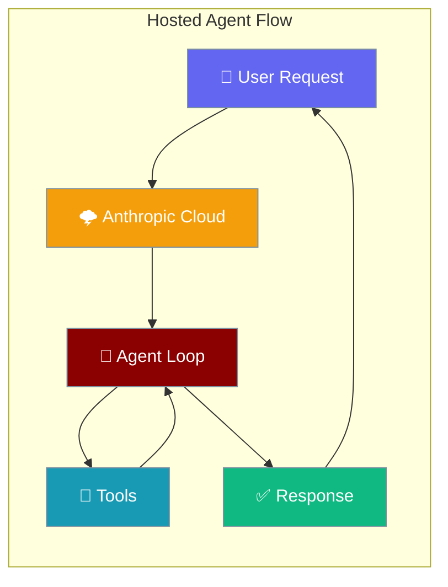
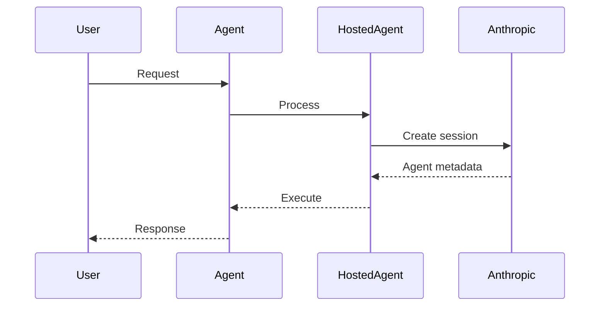

Hosted Agent runs the entire agent loop — model, tools, session — on Anthropic's managed cloud infrastructure.



## Quick Start

<Steps>
<Step title="Basic Hosted Agent">
```python
from praisonaiagents import Agent
from praisonai import HostedAgent

agent = Agent(
    name="assistant",
    backend=HostedAgent(provider="anthropic"),
)

agent.start("What is the capital of France? One word.")
```
</Step>

<Step title="With Configuration">
```python
from praisonaiagents import Agent
from praisonai import HostedAgent, HostedAgentConfig

agent = Agent(
    name="assistant",
    backend=HostedAgent(
        provider="anthropic",
        config=HostedAgentConfig(
            model="claude-3-5-sonnet-latest",
            system="You are a concise assistant.",
            tools=[{"type": "agent_toolset_20260401"}],
        ),
    ),
)

agent.start("Write hello.txt with the words 'hello world'")
```
</Step>
</Steps>

---

## How It Works



The agent loop runs entirely on Anthropic's infrastructure. Agent metadata including `agent_id`, `agent_version`, `environment_id`, and `session_id` are provided by Anthropic's API.

---

## Configuration Options

| Option | Type | Default | Description |
|--------|------|---------|-------------|
| `name` | `str` | `"Agent"` | Agent name |
| `model` | `str` | `"claude-haiku-4-5"` | Model to use |
| `system` | `str` | `"You are a helpful coding assistant."` | System prompt |
| `description` | `str` | `""` | Agent description |
| `tools` | `List[Dict[str, Any]]` | `[{"type": "agent_toolset_20260401"}]` | Tool configurations |
| `mcp_servers` | `List[Dict[str, Any]]` | `[]` | MCP server configurations |
| `skills` | `List[Dict[str, Any]]` | `[]` | Skills configurations |
| `callable_agents` | `List[Dict[str, Any]]` | `[]` | Callable agent configurations |
| `metadata` | `Dict[str, Any]` | `{}` | Additional metadata |
| `env_name` | `str` | `"praisonai-env"` | Environment name |
| `packages` | `Dict[str, List[str]]` | `None` | Package dependencies |
| `networking` | `Dict[str, Any]` | `{}` | Networking configuration |
| `session_title` | `str` | `"PraisonAI session"` | Session title |
| `resources` | `List[Dict[str, Any]]` | `[]` | Session resources |
| `vault_ids` | `List[str]` | `[]` | Vault IDs for secrets |

---

## Common Patterns

### Streaming

```python
from praisonaiagents import Agent
from praisonai import HostedAgent, HostedAgentConfig

agent = Agent(
    name="assistant",
    backend=HostedAgent(
        provider="anthropic",
        config=HostedAgentConfig(model="claude-3-5-sonnet-latest"),
    ),
)

for event in agent.start("Explain quantum computing", stream=True):
    print(event, end="")
```

### Multi-turn Sessions

```python
# Continue previous session
agent.start("Remember this: My favorite color is blue")
response = agent.start("What's my favorite color?")
```

### Session Management

```python
# Retrieve session information
session_info = agent.backend.retrieve_session()
print(f"Session ID: {session_info.session_id}")
print(f"Usage: {session_info.usage}")

# List all sessions
sessions = agent.backend.list_sessions()
for session in sessions:
    print(f"Session: {session.title} - {session.created_at}")
```

---

## Best Practices

<AccordionGroup>
<Accordion title="When to Choose Hosted Agent">
Choose HostedAgent when you want the entire agent execution in a managed cloud environment:
- No local infrastructure setup
- Built-in scaling and reliability
- Integrated tool sandboxing
- Anthropic's security and compliance features
</Accordion>

<Accordion title="API Key Configuration">
HostedAgent automatically uses `ANTHROPIC_API_KEY` or `CLAUDE_API_KEY` environment variables:
```bash
export ANTHROPIC_API_KEY="your-key-here"
```
No additional configuration needed.
</Accordion>

<Accordion title="Cost Considerations">
Monitor usage through session retrieval:
- Track token usage per session
- Set budget limits in your Anthropic account
- Use cheaper models like "claude-haiku-4-5" for simple tasks
</Accordion>

<Accordion title="Tool Configuration">
Use the default agent toolset for most cases:
```python
tools=[{"type": "agent_toolset_20260401"}]
```
This provides file operations, code execution, and web browsing capabilities.
</Accordion>
</AccordionGroup>

---

<Note>
Currently only `provider="anthropic"` is supported. Any other provider raises a `ValueError` with hints to use `LocalAgent` instead.
</Note>

---

## Related

<CardGroup cols={2}>
<Card title="Local Agent" icon="desktop" href="/docs/features/local-agent">
  Run agent loops locally with optional cloud sandboxing
</Card>
<Card title="Managed Agents" icon="cog" href="/docs/concepts/managed-agents">
  Overview of managed agent backends
</Card>
<Card title="Agents" icon="user" href="/docs/concepts/agents">
  Core agent concepts and patterns
</Card>
<Card title="Tools" icon="wrench" href="/docs/concepts/tools">
  Available tools and configurations
</Card>
</CardGroup>