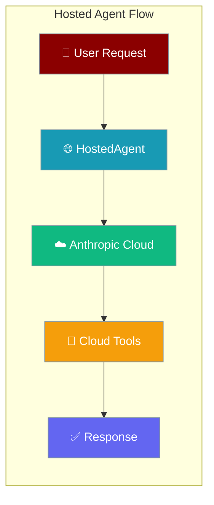
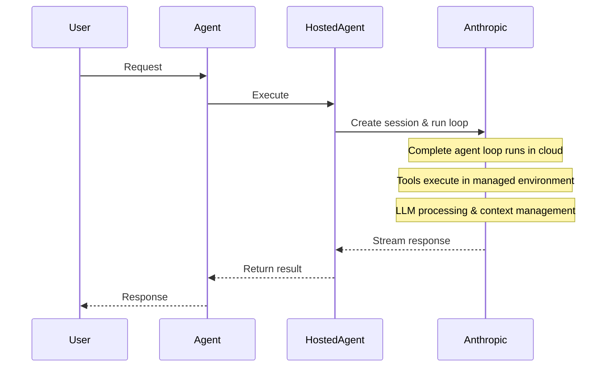
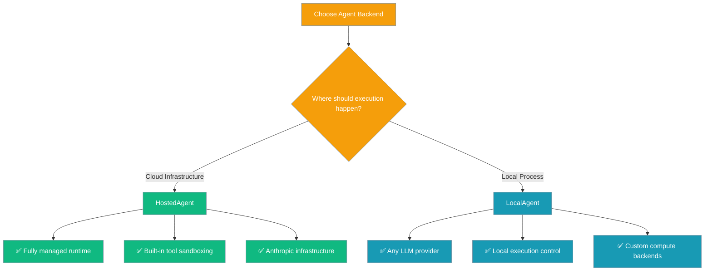

HostedAgent runs the complete agent execution loop on Anthropic's managed infrastructure, providing seamless cloud-based agent processing with built-in tools and session management.



## Quick Start

<Steps>
<Step title="Simple Usage">
Create a hosted agent with minimal configuration:

```python
from praisonai import HostedAgent, HostedAgentConfig
from praisonaiagents import Agent

hosted = HostedAgent(
    provider="anthropic",
    config=HostedAgentConfig(
        model="claude-3-5-sonnet-latest",
        system="You are a helpful coding assistant."
    )
)

agent = Agent(name="coder", backend=hosted)
result = agent.start("Create a simple Python function to calculate fibonacci numbers")
```
</Step>

<Step title="With Tools and Multi-Turn">
Enable agent tools and demonstrate session continuity:

```python
from praisonai import HostedAgent, HostedAgentConfig
from praisonaiagents import Agent

hosted = HostedAgent(
    provider="anthropic",
    config=HostedAgentConfig(
        model="claude-3-5-sonnet-latest",
        system="You are a helpful assistant with access to tools.",
        tools=[{"type": "agent_toolset_20260401"}]
    )
)

agent = Agent(name="assistant", backend=hosted)

# First turn
result1 = agent.start("Write a Python script to list files in current directory")

# Second turn - continues same session
result2 = agent.start("Now modify it to only show Python files")
```
</Step>
</Steps>

---

## How It Works



| Component | Location | Purpose |
|-----------|----------|---------|
| **Agent Loop** | Anthropic Cloud | Complete execution environment |
| **Tools** | Anthropic Cloud | Sandboxed tool execution |
| **LLM** | Anthropic Cloud | Claude model processing |
| **Session State** | Anthropic Cloud | Persistent conversation context |

---

## When to Use HostedAgent vs LocalAgent



---

## Configuration Options

<Card title="HostedAgent API Reference" icon="code" href="/docs/sdk/reference/typescript/classes/HostedAgent">
  Complete HostedAgent configuration options
</Card>

<Card title="HostedAgentConfig Reference" icon="code" href="/docs/sdk/reference/typescript/classes/HostedAgentConfig">
  Configuration object parameters
</Card>

| Option | Type | Default | Description |
|--------|------|---------|-------------|
| `model` | `str` | `"claude-haiku-4-5"` | Claude model to use |
| `system` | `str` | `"You are a helpful coding assistant."` | System prompt |
| `name` | `str` | `"Agent"` | Agent display name |
| `tools` | `List[Dict]` | `[{"type": "agent_toolset_20260401"}]` | Available tools |
| `packages` | `Dict` | `None` | Package dependencies |
| `networking` | `Dict` | Unrestricted | Network configuration |

---

## Common Patterns

### Multi-turn Conversation

Anthropic maintains session state in the cloud between calls:

```python
from praisonai import HostedAgent, HostedAgentConfig
from praisonaiagents import Agent

hosted = HostedAgent(
    provider="anthropic",
    config=HostedAgentConfig(
        model="claude-3-5-sonnet-latest",
        system="You are a helpful assistant with perfect memory."
    )
)

agent = Agent(name="assistant", backend=hosted)

# First conversation
agent.start("My favorite color is blue")

# Later conversation - agent remembers
response = agent.start("What's my favorite color?")
# Response: "Your favorite color is blue."
```

### Usage Tracking

Retrieve session information and usage metrics:

```python
# After agent execution
session_info = hosted.retrieve_session()
print(f"Session ID: {session_info['id']}")
print(f"Input tokens: {session_info['usage']['input_tokens']}")
print(f"Output tokens: {session_info['usage']['output_tokens']}")

# List all sessions for this agent
sessions = hosted.list_sessions()
for session in sessions:
    print(f"Session {session['id']}: {session['status']}")
```

### Session Management

List and manage active sessions:

```python
# List all sessions
sessions = hosted.list_sessions()

# Archive a specific session
hosted.archive_session("sesn_123...")

# Resume a previous session by ID
hosted.resume_session("sesn_123...")
agent.start("Continue where we left off")
```

---

## Migrating from ManagedAgent

Replace the deprecated `ManagedAgent` factory with the new canonical class:

```python
# Before (deprecated)
from praisonai.integrations.managed_agents import ManagedAgent, ManagedConfig

managed = ManagedAgent(
    provider="anthropic",
    config=ManagedConfig(
        model="claude-3-5-sonnet-latest",
        system="You are helpful"
    )
)

# After (canonical)
from praisonai import HostedAgent, HostedAgentConfig

hosted = HostedAgent(
    provider="anthropic",
    config=HostedAgentConfig(
        model="claude-3-5-sonnet-latest",
        system="You are helpful"
    )
)
```

---

## Best Practices

<AccordionGroup>
<Accordion title="Managing API Costs">
- Use `claude-haiku-4-5` for simple tasks to minimize costs
- Implement usage tracking with `retrieve_session()` to monitor token consumption
- Set appropriate tool policies to control execution overhead
- Archive old sessions to avoid accumulating state storage costs
</Accordion>

<Accordion title="Choosing Tools">
- Use `agent_toolset_20260401` for general-purpose tool access
- Specify minimal tool sets to reduce complexity and cost
- Test tool combinations in development before production deployment
- Review tool execution logs via session metadata
</Accordion>

<Accordion title="Session Reuse">
- Reuse sessions for related conversations to maintain context
- Implement session ID management for user-specific contexts
- Use `resume_session()` to continue conversations across application restarts
- Archive sessions when conversations are complete
</Accordion>

<Accordion title="Error Handling">
- Handle `ValueError` for unsupported providers gracefully
- Implement retry logic for transient network issues
- Use `interrupt()` to stop long-running operations
- Monitor session status and handle error states appropriately
</Accordion>
</AccordionGroup>

---

## Related

<CardGroup cols={2}>
<Card title="Local Agent" icon="desktop" href="/docs/features/local-agent">
  Run agent loops locally with any LLM
</Card>

<Card title="ManagedAgent Persistence" icon="database" href="/docs/features/managed-agent-persistence">
  Database integration with hosted agents
</Card>

<Card title="Session Info" icon="info" href="/docs/features/managed-agents-session-info">
  Session metadata and usage tracking
</Card>

<Card title="Managed CLI" icon="terminal" href="/docs/features/managed-cli">
  Command-line tools for hosted resources
</Card>
</CardGroup>