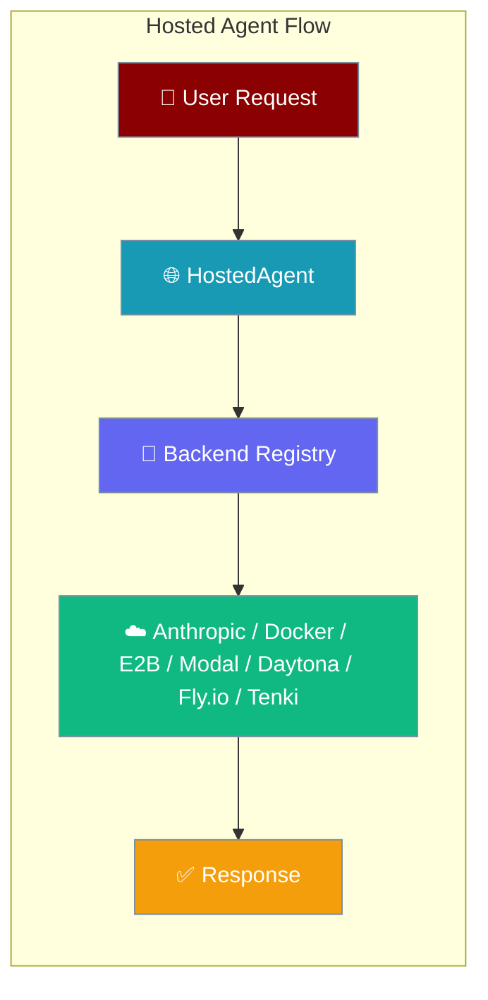
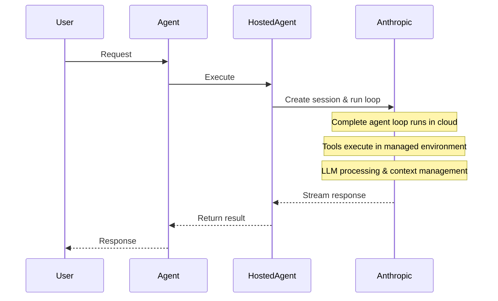
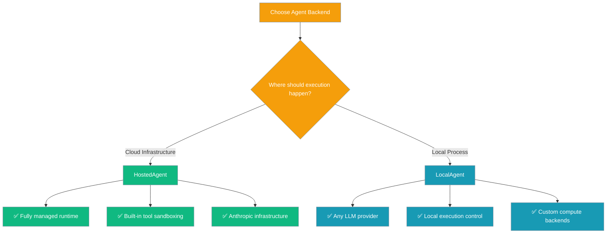
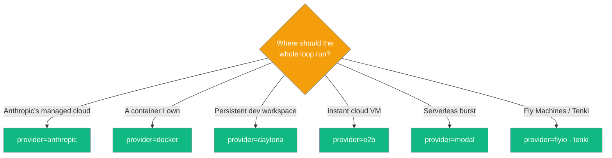
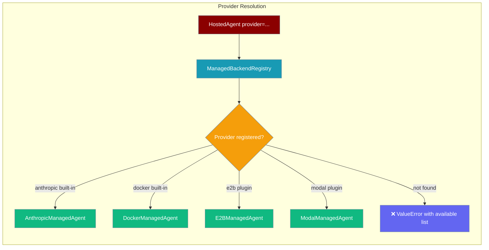

HostedAgent hosts the whole agent loop away from your process — on Anthropic, or in any registered compute runtime (Docker, E2B, Modal, Daytona, Fly.io, Tenki).

<Note>
For the same shape without a vendor cloud — run the whole agent in a Docker container you own — see [Self-Hosted Agent (Docker)](/features/run-on-docker). For a provider-by-provider guide, see [HostedAgent Compute Runtimes](/features/hosted-agent-compute-runtimes).
</Note>


```python
from praisonaiagents import Agent
from praisonai import HostedAgent, HostedAgentConfig

# Anthropic-hosted loop (the classic case)
agent = Agent(backend=HostedAgent(provider="anthropic"))

# Same class, Daytona-hosted loop (guaranteed since PR #4074)
agent = Agent(backend=HostedAgent(
    provider="daytona",
    config=HostedAgentConfig(model="gpt-4o-mini"),
))
```

The user sends a request; the full agent loop runs on the chosen provider's hosted runtime.


```mermaid
graph LR
    subgraph "Hosted Agent Flow"
        A[📝 User Request] --> B[🌐 HostedAgent]
        B --> C[🔀 Backend Registry]
        C --> D[☁️ Anthropic / Docker / E2B / Modal / Daytona / Fly.io / Tenki]
        D --> E[✅ Response]
    end
    
    classDef input fill:#8B0000,stroke:#7C90A0,color:#fff
    classDef process fill:#189AB4,stroke:#7C90A0,color:#fff
    classDef registry fill:#6366F1,stroke:#7C90A0,color:#fff
    classDef cloud fill:#10B981,stroke:#7C90A0,color:#fff
    classDef output fill:#F59E0B,stroke:#7C90A0,color:#fff
    
    class A input
    class B process
    class C registry
    class D cloud
    class E output

```

## Quick Start

<Steps>
<Step title="Simple Usage">
Create a hosted agent with minimal configuration:

```python
from praisonai import HostedAgent, HostedAgentConfig
from praisonaiagents import Agent

hosted = HostedAgent(
    provider="anthropic",
    config=HostedAgentConfig(
        model="claude-3-5-sonnet-latest",
        system="You are a helpful coding assistant."
    )
)

agent = Agent(name="coder", backend=hosted)
result = agent.start("Create a simple Python function to calculate fibonacci numbers")
```
</Step>

<Step title="With Tools and Multi-Turn">
Enable agent tools and demonstrate session continuity:

```python
from praisonai import HostedAgent, HostedAgentConfig
from praisonaiagents import Agent

hosted = HostedAgent(
    provider="anthropic",
    config=HostedAgentConfig(
        model="claude-3-5-sonnet-latest",
        system="You are a helpful assistant with access to tools.",
        tools=[{"type": "agent_toolset_20260401"}]
    )
)

agent = Agent(name="assistant", backend=hosted)

# First turn
result1 = agent.start("Write a Python script to list files in current directory")

# Second turn - continues same session
result2 = agent.start("Now modify it to only show Python files")
```
</Step>
</Steps>

---

## How It Works


```mermaid
sequenceDiagram
    participant User
    participant Agent
    participant HostedAgent
    participant Anthropic
    
    User->>Agent: Request
    Agent->>HostedAgent: Execute
    HostedAgent->>Anthropic: Create session & run loop
    
    Note over Anthropic: Complete agent loop runs in cloud
    Note over Anthropic: Tools execute in managed environment
    Note over Anthropic: LLM processing & context management
    
    Anthropic-->>HostedAgent: Stream response
    HostedAgent-->>Agent: Return result
    Agent-->>User: Response
```

| Component | Location | Purpose |
|-----------|----------|---------|
| **Agent Loop** | Anthropic Cloud | Complete execution environment |
| **Tools** | Anthropic Cloud | Sandboxed tool execution |
| **LLM** | Anthropic Cloud | Claude model processing |
| **Session State** | Anthropic Cloud | Persistent conversation context |

---

## When to Use HostedAgent vs LocalAgent


```mermaid
graph TB
    A[Choose Agent Backend] --> B{Where should execution happen?}
    B -->|Cloud Infrastructure| C[HostedAgent]
    B -->|Local Process| D[LocalAgent]
    
    C --> E[✅ Fully managed runtime]
    C --> F[✅ Built-in tool sandboxing]
    C --> G[✅ Anthropic infrastructure]
    
    D --> H[✅ Any LLM provider]
    D --> I[✅ Local execution control]
    D --> J[✅ Custom compute backends]
    
    classDef hosted fill:#10B981,stroke:#7C90A0,color:#fff
    classDef local fill:#189AB4,stroke:#7C90A0,color:#fff
    classDef decision fill:#F59E0B,stroke:#7C90A0,color:#fff
    
    class C,E,F,G hosted
    class D,H,I,J local
    class A,B decision
```

---

## Which provider should I pick?

`anthropic` is one entry in the backend registry; every registered compute runtime is another.


```mermaid
graph TB
    Q{Where should the<br/>whole loop run?}
    Q -->|Anthropic's managed cloud| AN[provider=anthropic]
    Q -->|A container I own| DK[provider=docker]
    Q -->|Persistent dev workspace| DY[provider=daytona]
    Q -->|Instant cloud VM| E2[provider=e2b]
    Q -->|Serverless burst| MO[provider=modal]
    Q -->|Fly Machines / Tenki| FL[provider=flyio · tenki]

    classDef question fill:#F59E0B,stroke:#7C90A0,color:#fff
    classDef answer fill:#10B981,stroke:#7C90A0,color:#fff

    class Q question
    class AN,DK,DY,E2,MO,FL answer
```

<Note>
`provider="daytona"` requires **daytona-sdk** and `DAYTONA_API_KEY`. Memory in `ComputeConfig` is specified as `memory_mb` (megabytes) and is converted to Daytona's native GiB unit automatically (minimum 1 GiB). File uploads via `execute_in_compute()` copy the local file's contents to the remote path — this was fixed in [PR #4074](https://github.com/MervinPraison/PraisonAI/pull/4074); earlier versions wrote the path string to a file named after the content.
</Note>

---

## Which providers resolve vs raise

Registered compute runtimes resolve; LLM routing names raise a `ValueError` that points at `LocalAgent`.

| `provider=` value | Resolves | Raises `ValueError` |
|---|:---:|:---:|
| `anthropic` | ✅ | |
| `docker`, `e2b`, `modal`, `daytona`, `flyio`, `tenki` | ✅ | |
| `openai`, `gemini`, `ollama`, `local` | | ✅ ("use `LocalAgent`") |
| anything unregistered | | ✅ |

For `openai`, `gemini`, `ollama`, and `local`, use `LocalAgent` instead:

```python
from praisonai import LocalAgent, LocalAgentConfig

agent = LocalAgent(config=LocalAgentConfig(model="openai/gpt-4o"))
```

---

## Configuration Options

<Card title="HostedAgent API Reference" icon="code" href="/sdk/reference/typescript/classes/AgentConfig">
  Complete HostedAgent configuration options
</Card>

<Card title="HostedAgentConfig Reference" icon="code" href="/sdk/reference/typescript/classes/AgentConfig">
  Configuration object parameters
</Card>

| Option | Type | Default | Description |
|--------|------|---------|-------------|
| `model` | `str` | `"claude-haiku-4-5"` | Claude model to use |
| `system` | `str` | `"You are a helpful coding assistant."` | System prompt |
| `name` | `str` | `"Agent"` | Agent display name |
| `tools` | `List[Dict]` | `[{"type": "agent_toolset_20260401"}]` | Available tools |
| `packages` | `Dict` | `None` | Package dependencies |
| `networking` | `Dict` | Unrestricted | Network configuration |

---

## Common Patterns

### Multi-turn Conversation

Anthropic maintains session state in the cloud between calls:

```python
from praisonai import HostedAgent, HostedAgentConfig
from praisonaiagents import Agent

hosted = HostedAgent(
    provider="anthropic",
    config=HostedAgentConfig(
        model="claude-3-5-sonnet-latest",
        system="You are a helpful assistant with perfect memory."
    )
)

agent = Agent(name="assistant", backend=hosted)

# First conversation
agent.start("My favorite color is blue")

# Later conversation - agent remembers
response = agent.start("What's my favorite color?")
# Response: "Your favorite color is blue."
```

### Usage Tracking

Retrieve session information and usage metrics:

```python
# After agent execution
session_info = hosted.retrieve_session()
print(f"Session ID: {session_info['id']}")
print(f"Input tokens: {session_info['usage']['input_tokens']}")
print(f"Output tokens: {session_info['usage']['output_tokens']}")

# List all sessions for this agent
sessions = hosted.list_sessions()
for session in sessions:
    print(f"Session {session['id']}: {session['status']}")
```

### Session Management

List and manage active sessions:

```python
# List all sessions
sessions = hosted.list_sessions()

# Archive a specific session
hosted.archive_session("sesn_123...")

# Resume a previous session by ID
hosted.resume_session("sesn_123...")
agent.start("Continue where we left off")
```

---

## Pluggable Provider Backends

`HostedAgent` uses `ManagedBackendRegistry` to look up provider backends — third-party packages can register new providers via the `praisonai.managed_backends` entry-point group.

- `docker` is now a **built-in** provider alongside `anthropic`, resolved through the same registry (no plugin needed). `HostedAgent(provider="docker")` runs the whole agent in a local container — see [Self-Hosted Agent (Docker)](/features/run-on-docker).


```mermaid
graph LR
    subgraph "Provider Resolution"
        A[HostedAgent provider=...] --> B[ManagedBackendRegistry]
        B --> C{Provider registered?}
        C -->|anthropic built-in| D[AnthropicManagedAgent]
        C -->|docker built-in| H[DockerManagedAgent]
        C -->|e2b plugin| E[E2BManagedAgent]
        C -->|modal plugin| F[ModalManagedAgent]
        C -->|not found| G[❌ ValueError with available list]
    end

    classDef input fill:#8B0000,stroke:#7C90A0,color:#fff
    classDef registry fill:#189AB4,stroke:#7C90A0,color:#fff
    classDef decision fill:#F59E0B,stroke:#7C90A0,color:#fff
    classDef success fill:#10B981,stroke:#7C90A0,color:#fff
    classDef fail fill:#6366F1,stroke:#7C90A0,color:#fff

    class A input
    class B registry
    class C decision
    class D,E,F,H success
    class G fail
```

### Entry-point registration

A pip-installable package can publish a new `HostedAgent` provider by declaring an entry point:

```toml
# pyproject.toml
[project.entry-points."praisonai.managed_backends"]
e2b = "e2b_praisonai.backend:E2BManagedAgent"
```

After `pip install e2b-praisonai`, `HostedAgent(provider="e2b")` resolves it automatically — no core change needed.

### Factory semantics

For non-Anthropic backends, `HostedAgent.__new__` acts as a **factory** — it returns the resolved backend instance directly. Python skips `__init__` when `__new__` returns a non-`cls` instance, so callers get the real backend's methods rather than Anthropic-inherited ones:

```python
from praisonai import HostedAgent, HostedAgentConfig
from praisonaiagents import Agent

# A third-party "e2b" plugin is installed via pip.
# HostedAgent resolves it through the registry — no core change.
hosted = HostedAgent(
    provider="e2b",
    config=HostedAgentConfig(model="claude-haiku-4-5"),
)

agent = Agent(name="Researcher", instructions="Research and summarise.", llm=hosted)
agent.start("Find three sources on agentic RAG.")
```

### Programmatic registration

Register a backend without an entry point for testing or embedding:

```python
from praisonai import HostedAgent, HostedAgentConfig
from praisonaiagents import Agent

class E2BManagedAgent:
    def __init__(self, provider, config=None, **kwargs):
        self.provider = provider
        self.config = config

    def is_available(self):
        try:
            import e2b
            return True
        except ImportError:
            return False

from praisonai.integrations.backend_registry import get_backend_registry
get_backend_registry().register("e2b", E2BManagedAgent)

hosted = HostedAgent(provider="e2b", config=HostedAgentConfig(model="claude-haiku-4-5"))
agent = Agent(name="Coder", instructions="Write code.", llm=hosted)
agent.start("Write a hello world script.")
```

### Error message

When `HostedAgent(provider="unknown")` is called with an unregistered provider, the error lists available backends:

```
ValueError: Managed runtime for provider 'unknown' is not available.
Available: ['anthropic', 'e2b', ...]
```

Cross-reference: [Managed Backend Plugins](/features/managed-backend-plugins) — full guide to authoring and publishing provider backends.

---

## Migrating from ManagedAgent

Replace the deprecated `ManagedAgent` factory with the new canonical class:

```python
# Before (deprecated)
from praisonai.integrations.managed_agents import ManagedAgent, ManagedConfig

managed = ManagedAgent(
    provider="anthropic",
    config=ManagedConfig(
        model="claude-3-5-sonnet-latest",
        system="You are helpful"
    )
)

# After (canonical)
from praisonai import HostedAgent, HostedAgentConfig

hosted = HostedAgent(
    provider="anthropic",
    config=HostedAgentConfig(
        model="claude-3-5-sonnet-latest",
        system="You are helpful"
    )
)
```

---

## Best Practices

<AccordionGroup>
<Accordion title="Managing API Costs">
- Use `claude-haiku-4-5` for simple tasks to minimize costs
- Implement usage tracking with `retrieve_session()` to monitor token consumption
- Set appropriate tool policies to control execution overhead
- Archive old sessions to avoid accumulating state storage costs
</Accordion>

<Accordion title="Choosing Tools">
- Use `agent_toolset_20260401` for general-purpose tool access
- Specify minimal tool sets to reduce complexity and cost
- Test tool combinations in development before production deployment
- Review tool execution logs via session metadata
</Accordion>

<Accordion title="Session Reuse">
- Reuse sessions for related conversations to maintain context
- Implement session ID management for user-specific contexts
- Use `resume_session()` to continue conversations across application restarts
- Archive sessions when conversations are complete
</Accordion>

<Accordion title="Error Handling">
- Handle `ValueError` for unsupported providers gracefully
- Implement retry logic for transient network issues
- Use `interrupt()` to stop long-running operations
- Monitor session status and handle error states appropriately
</Accordion>
</AccordionGroup>

---

## Related

<CardGroup cols={2}>
<Card title="HostedAgent Compute Runtimes" icon="server" href="/features/hosted-agent-compute-runtimes">
  Run the whole loop in Docker, E2B, Modal, Daytona, Fly.io, or Tenki
</Card>

<Card title="Placement — where does my agent run?" icon="map-pin" href="/features/placement">
  `Agent(run_on="daytona")` is the short form of this factory
</Card>

<Card title="Self-Hosted Agent (Docker)" icon="docker" href="/features/run-on-docker">
  `run_on="docker"` — the whole agent in a container you own
</Card>

<Card title="Local Agent" icon="desktop" href="/features/local-agent">
  Run agent loops locally with any LLM
</Card>

<Card title="Managed Backend Plugins" icon="puzzle-piece" href="/features/managed-backend-plugins">
  Add new HostedAgent providers via entry points
</Card>

<Card title="ManagedAgent Persistence" icon="database" href="/features/managed-agent-persistence">
  Database integration with hosted agents
</Card>

<Card title="Session Info" icon="info" href="/features/managed-agents-session-info">
  Session metadata and usage tracking
</Card>
</CardGroup>