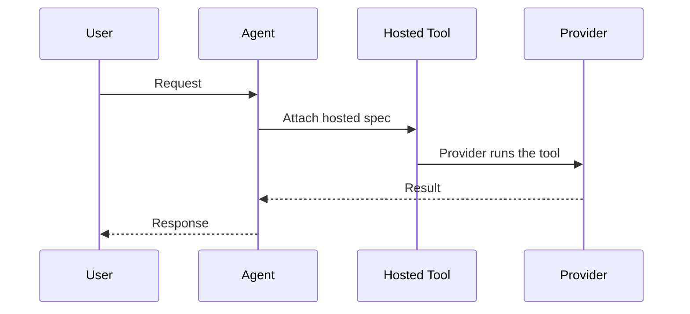
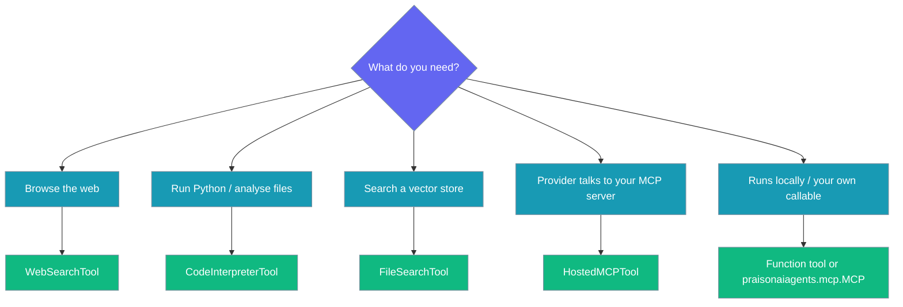

Provider-hosted tools run on the provider (OpenAI, etc.) rather than in your process. Attach them to any `Agent` like a regular tool.


## Quick Start

<Steps>
<Step title="Simple: web search">
```python
from praisonaiagents import Agent
from praisonaiagents.tools import WebSearchTool

agent = Agent(
    instructions="Research assistant",
    tools=[WebSearchTool()],
)
agent.start("What are the latest AI trends this year?")
```
</Step>

<Step title="With a vector store">
```python
from praisonaiagents import Agent
from praisonaiagents.tools import FileSearchTool

agent = Agent(
    instructions="Research assistant",
    tools=[FileSearchTool(vector_store_ids=["vs_123"])],
)
agent.start("Summarise our internal design docs on retrieval.")
```
</Step>

<Step title="Combine hosted and local tools">
```python
from praisonaiagents import Agent
from praisonaiagents.tools import WebSearchTool

def word_count(text: str) -> int:
    return len(text.split())

agent = Agent(
    instructions="Research assistant",
    tools=[WebSearchTool(), word_count],
)
agent.start("Search for the latest LLM releases and count the words in your summary.")
```
</Step>
</Steps>

---

## How It Works

A hosted tool has no local callable — the provider executes it and returns the result.



| Step | What happens |
|------|--------------|
| Attach | You add a hosted tool to `tools=[…]` |
| Forward | The Agent sends the spec to the provider |
| Execute | The provider runs the tool — no local code |
| Return | The result flows back into the Agent's answer |

---

## Available Hosted Tools

Four factories, all re-exported from `praisonaiagents.tools`.

| Factory | Purpose | Example |
|---------|---------|---------|
| `WebSearchTool` | Provider-side web search | `WebSearchTool()` |
| `CodeInterpreterTool` | Run Python / analyse files in a managed container | `CodeInterpreterTool()` |
| `FileSearchTool` | Search an existing vector store | `FileSearchTool(vector_store_ids=["vs_123"])` |
| `HostedMCPTool` | Provider connects to an MCP server you host | `HostedMCPTool(server_url="https://mcp.example.com")` |

```python
from praisonaiagents import Agent
from praisonaiagents.tools import (
    WebSearchTool,
    CodeInterpreterTool,
    FileSearchTool,
    HostedMCPTool,
)

agent = Agent(
    instructions="Research assistant",
    tools=[
        WebSearchTool(),
        CodeInterpreterTool(),
        FileSearchTool(vector_store_ids=["vs_123"]),
        HostedMCPTool(server_url="https://mcp.example.com"),
    ],
)
agent.start("Research the topic, run any calculations, and cite our internal docs.")
```

<Note>
`HostedMCPTool` is not the same as `from praisonaiagents.mcp import MCP`. `MCP` runs an MCP client in your process; `HostedMCPTool` tells the **provider** to connect to the server for you.
</Note>

---

## Configuration Options

All parameters are keyword-only.

### WebSearchTool

| Parameter | Type | Default | Notes |
|-----------|------|---------|-------|
| `search_context_size` | `str \| None` | `None` | Passed through as `search_context_size` on the spec |

### CodeInterpreterTool

| Parameter | Type | Default | Notes |
|-----------|------|---------|-------|
| `file_ids` | `list[str] \| None` | `None` | Attached to `container.file_ids` (`container.type="auto"`) |

### FileSearchTool

| Parameter | Type | Default | Notes |
|-----------|------|---------|-------|
| `vector_store_ids` | `list[str] \| None` | `None` | Vector stores to search |
| `max_num_results` | `int \| None` | `None` | Cap on results |

### HostedMCPTool

| Parameter | Type | Default | Notes |
|-----------|------|---------|-------|
| `server_url` | `str` | *required* | Empty string raises `ValueError` |
| `server_label` | `str` | `"mcp_server"` | Label surfaced to the provider |
| `require_approval` | `str` | `"never"` | Provider approval policy |

---

## When to Pick Which



---

## Common Patterns

Mix a hosted tool with your own Python function in one Agent.

```python
from praisonaiagents import Agent
from praisonaiagents.tools import WebSearchTool

def to_upper(text: str) -> str:
    return text.upper()

agent = Agent(
    instructions="Assistant",
    tools=[WebSearchTool(), to_upper],
)
agent.start("Search the news and shout the headline back at me.")
```

Search across multiple vector stores at once.

```python
from praisonaiagents import Agent
from praisonaiagents.tools import FileSearchTool

agent = Agent(
    instructions="Assistant",
    tools=[FileSearchTool(vector_store_ids=["vs_docs", "vs_specs"], max_num_results=5)],
)
agent.start("Find the retention policy across both stores.")
```

Point a hosted MCP tool at a server the provider can reach.

```python
from praisonaiagents import Agent
from praisonaiagents.tools import HostedMCPTool

agent = Agent(
    instructions="Assistant",
    tools=[HostedMCPTool(server_url="https://mcp.example.com", server_label="docs")],
)
agent.start("Use the connected MCP server to answer.")
```

---

## Best Practices

<AccordionGroup>
<Accordion title="Prefer hosted when the provider implements it">
Use a hosted tool when the provider already runs the capability — you avoid shipping and maintaining the code yourself.
</Accordion>

<Accordion title="HostedMCPTool is not the local MCP client">
`HostedMCPTool` asks the provider to connect to an MCP server. `from praisonaiagents.mcp import MCP` runs the client in your process. Choose the local `MCP` when you need it on your own machine or with your own callable.
</Accordion>

<Accordion title="Mix hosted and local tools freely">
Hosted specs and normal Python functions live together in the same `tools=[…]` list. The Agent forwards each to the right place.
</Accordion>

<Accordion title="Each hosted config is distinct">
`FileSearchTool(vector_store_ids=["vs_1"])` and `["vs_2"]` are different tool specs. No workaround needed — they are treated separately.
</Accordion>
</AccordionGroup>

---

## Related

<CardGroup cols={2}>
<Card title="Deep Research Agent" icon="flask-vial" href="/docs/agents/deep-research">
The specialised agent that uses these hosted specs internally.
</Card>
<Card title="MCP (local client)" icon="plug" href="/docs/features/mcp">
Run an MCP client in your own process — for contrast with `HostedMCPTool`.
</Card>
<Card title="Unified Web Search" icon="magnifying-glass-plus" href="/docs/tools/web-search">
The local `search_web` tool — for contrast with hosted `WebSearchTool`.
</Card>
</CardGroup>
