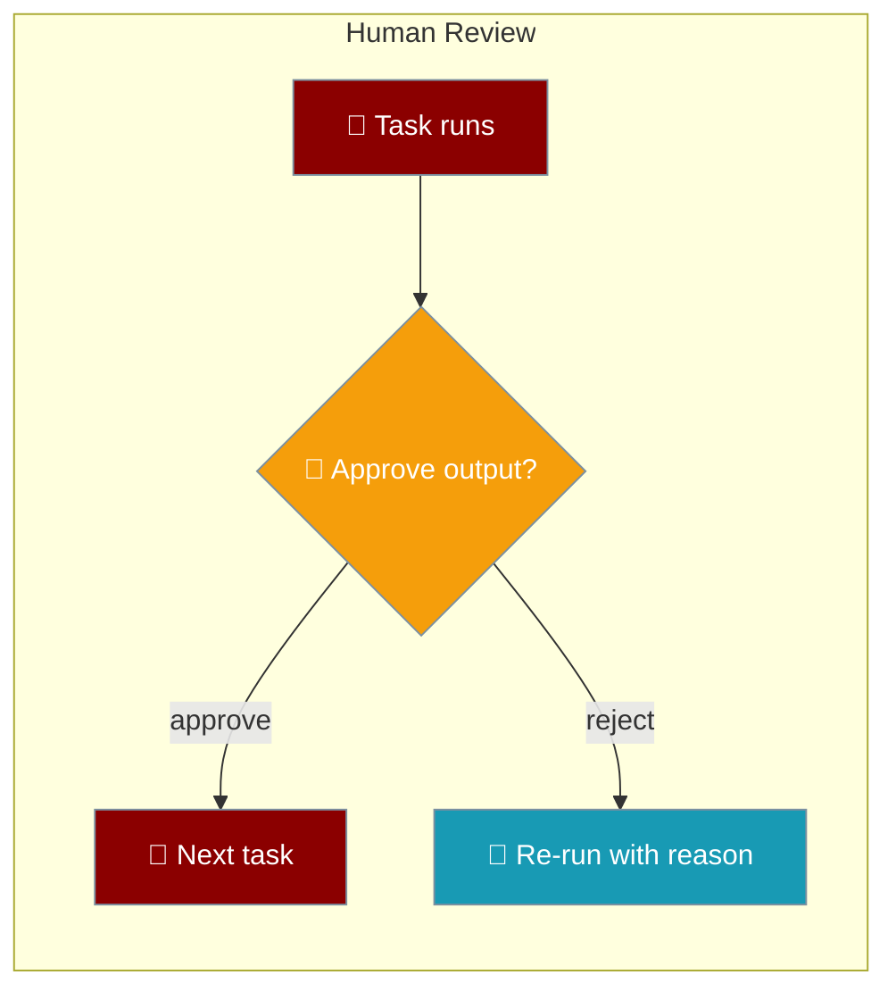
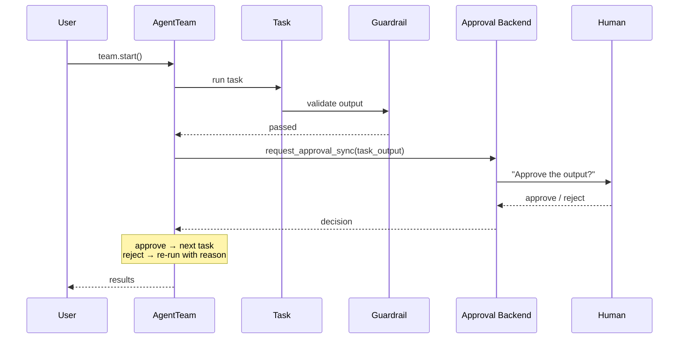
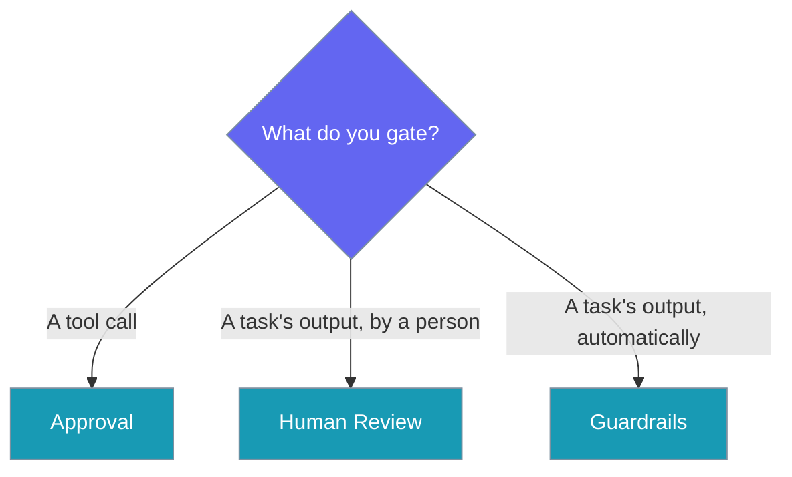

Require a person to sign off on a task's output before the next task can read it.



<Note>
The TypeScript counterpart lives at [Human-in-the-Loop Review (TypeScript)](/js/human-in-the-loop-review).
</Note>

## Quick Start

<Steps>
<Step title="Require sign-off with human_input=True">
Set `human_input=True` on the task; the reviewer is asked before the next task runs.

```python
from praisonaiagents import Agent, Task, AgentTeam

drafter = Agent(name="Drafter", instructions="Draft the customer reply")

task = Task(
    description="Draft a customer refund reply",
    expected_output="A one-paragraph reply",
    agent=drafter,
    human_input=True,
)

team = AgentTeam(agents=[drafter], tasks=[task])
team.start()
```
</Step>

<Step title="Ask your own question with human_review_prompt">
Set `human_review_prompt` to control exactly what the reviewer is asked.

```python
from praisonaiagents import Agent, Task, AgentTeam

drafter = Agent(name="Drafter", instructions="Draft the customer reply")

task = Task(
    description="Draft a customer refund reply",
    expected_output="A one-paragraph reply",
    agent=drafter,
    human_input=True,
    human_review_prompt="Is this legally safe to send?",
)

team = AgentTeam(agents=[drafter], tasks=[task])
team.start()
```
</Step>
</Steps>

<Info>
Review reuses the existing approval backends, so it works wherever [Approval](/features/approval) already does — console, callback, bot, or UI — with no separate wiring.
</Info>

---

## How It Works

The task runs, the automatic guardrail passes, then the approval backend asks a person to sign off before the next task reads the output.



### Behaviour Contract

Every rule below comes straight from `_apply_human_review` / `_aapply_human_review`.

| Rule | Behaviour |
|------|-----------|
| Opt-in default | When `human_input` is falsy, review returns the output untouched and the approval backend is never called. Callers need no `if` of their own. |
| No silent skip | With `human_input=True` and `praisonaiagents.approval` unavailable, review **raises** — a task that was supposed to be signed off and simply was not is the exact failure this prevents. |
| Runs after the guardrail | The automatic guardrail runs first; a person reviews only output that already passed, so no one is woken to reject what a guardrail would have caught. |
| Rejection feedback shape | A rejection fills `task.validation_feedback` with `{validation_response, validated_task, rejected_output}` — the same shape the guardrail retry writes, so the workflow engine consumes it without error. |
| Retry semantics | Rejection increments `retry_count`, sets `task.status = "in progress"`, and re-runs the task with the reviewer's reason folded into its context. |
| Bounded retries | Repeated rejection stops at `task.max_retries` with an exception naming the reviewer's reason, rather than looping forever. |
| Output truncation | The reviewer sees `str(task_output.raw)[:4000]` — truncated to keep the approval-backend payload bounded. |
| Audit label | The request's `tool_name` is `task_output:<task name>`, so approval rules and audit trails tell task-output reviews apart from tool-call reviews. Requests use `risk_level="high"` and carry the reviewer's prompt in `context`. |
| Async offload | The async path offloads the blocking backend call via `loop.run_in_executor`, so review does not stall the event loop or other tasks running under `asyncio.gather`. |
| Custom prompt | `human_review_prompt` is passed through to the backend; otherwise a default question is built from the task name. |

---

## Approval vs. Human Review vs. Guardrails

Three features gate agent work at different points — pick by *what* you are protecting.

> The approval manager gates a TOOL CALL and guardrails validate automatically; neither let an orchestrator require a person to approve an output before the next task consumes it.



| Feature | Gates | Who decides |
|---------|-------|-------------|
| [Approval](/features/approval) | A tool call before it runs | A person |
| Human Review | A task's output before the next task reads it | A person |
| [Guardrails](/concepts/guardrails) | A task's output | Automatic validation |

---

## Task Options

Two `Task` fields turn on review.

| Option | Type | Default | Description |
|--------|------|---------|-------------|
| `human_input` | `bool` | `False` | Require a person to approve this task's output before the next task consumes it. |
| `human_review_prompt` | `Optional[str]` | `None` | Custom question the reviewer is asked. Falls back to `Approve the output of task <name>?`. |

---

## Best Practices

<AccordionGroup>
<Accordion title="The rejection reason is fed back automatically">
A rejection writes the reviewer's reason into `task.validation_feedback`, and the outer retry loop folds it into the re-run's prompt — the next draft addresses the objection without any code from you.
</Accordion>

<Accordion title="Register a non-TTY approval backend for headless runs">
`human_input=True` with `praisonaiagents.approval` unavailable raises rather than skipping. For headless or CI runs, register a console, callback, bot, or UI backend so the review can actually reach a person.
</Accordion>

<Accordion title="Pair with guardrails — guardrail first, human review second">
Add a guardrail for the checks a machine can make, and reserve human review for judgement calls. Review only runs on output the guardrail already accepted, so a person is never asked about something already rejected.
</Accordion>

<Accordion title="Set max_retries to bound repeated rejections">
Repeated rejection stops at `task.max_retries` with an exception naming the last reason. Set it deliberately so a reviewer who keeps rejecting halts the workflow instead of looping.
</Accordion>
</AccordionGroup>

---

## Alternative: team-level review hooks

`MultiAgentHooksConfig(on_task_complete=…)` is a lightweight hook that runs on every task in a sequential team and can edit outputs in place.

<Warning>
The two mechanisms are complementary. `Task(human_input=True)` reuses approval backends and integrates with the retry loop, so it can hard-stop and re-run a task. The `MultiAgentHooksConfig` gate runs on every task and can mutate outputs, but cannot hard-stop the workflow on its own — a bare `raise` inside it is logged and swallowed.
</Warning>

<Steps>
<Step title="Team-level review gate (soft: approve / edit)">
The team-level hook receives `(task, task_output)` and fires for every task — filter by `task.name`. Rejection is logged, not raised.

```python
from praisonaiagents import Agent, Task, AgentTeam, MultiAgentHooksConfig

REVIEW_TASKS = {"research"}

def review_gate(task, task_output):        # signature: (task, task_output)
    if task.name not in REVIEW_TASKS:
        return
    print(f"\n--- Review: {task.name} ---\n{task_output.raw}\n")
    choice = input("Approve (y), reject (n), edit (e)? ").strip().lower()
    if choice == "e":
        # downstream tasks that read this task via context=[t1] see the edit
        task_output.raw = input("Edited output: ").strip()

researcher = Agent(name="Researcher", role="Researcher", goal="Research", backstory="Expert")
writer = Agent(name="Writer", role="Writer", goal="Write", backstory="Writer")

t1 = Task(name="research", description="List 5 facts about {{topic}}",
          expected_output="5 bullets", agent=researcher)
t2 = Task(name="summary", description="Write 3-sentence summary",
          expected_output="3 sentences", agent=writer, context=[t1])

team = AgentTeam(
    agents=[researcher, writer],
    tasks=[t1, t2],
    process="sequential",
    variables={"topic": "REST APIs"},   # NOT team.start(inputs=...) — see Gotchas
    hooks=MultiAgentHooksConfig(on_task_complete=review_gate),
)
team.start()
```
</Step>

<Step title="Per-task strict gate (hard-stop on reject)">
The per-task 1-argument callback halts the run when combined with `fail_on_callback_error=True`.

```python
def review_output(task_output):          # signature: (task_output)
    print(f"\n--- Review output ---\n{task_output.raw}\n")
    if input("Approve? (y/n) ").strip().lower() == "n":
        raise RuntimeError("Human rejected output")

t1_strict = Task(
    name="research",
    description="List 5 facts about {{topic}}",
    expected_output="5 bullets",
    agent=researcher,
    variables={"topic": "REST APIs"},
    on_task_complete=review_output,       # 1-arg signature
    fail_on_callback_error=True,          # REQUIRED so reject halts the workflow
)
```
</Step>
</Steps>

### ⚠️ Two different `on_task_complete` hooks — DIFFERENT signatures

The team-level and per-task hooks look identical but bind different objects.

| Where set | Signature | Rejects halt run? | Use when |
|---|---|---|---|
| `AgentTeam(hooks=MultiAgentHooksConfig(on_task_complete=fn))` | `fn(task, task_output)` | ❌ exceptions are logged + swallowed | Soft gate that filters by `task.name` |
| `Task(on_task_complete=fn)` — 1 param | `fn(task_output)` | ✅ with `fail_on_callback_error=True` | Hard-stop gate on one specific task |
| `Task(on_task_complete=fn)` — 2 params | `fn(task_output, metadata)` — **NOT** `(task, task_output)` | ✅ with `fail_on_callback_error=True` | You need the metadata dict (`task_id`, `task_name`) |

<AccordionGroup>
<Accordion title="The team-level hook swallows exceptions">
A bare `raise` inside a `MultiAgentHooksConfig` hook does **not** stop the workflow today — the team-level path logs and swallows it. To hard-stop on reject, use `Task(human_input=True)` or a per-task `Task(on_task_complete=…, fail_on_callback_error=True)` instead.
</Accordion>

<Accordion title="AgentTeam.start(inputs=…) is silently ignored">
`start()` forwards `**kwargs` but never consumes an `inputs=` argument. Pass template values via `AgentTeam(variables={...})` with `{{key}}` placeholders in task/agent fields. Note the **double brace** `{{topic}}` — not the single-brace `{topic}` used by the roles-file YAML loader.
</Accordion>

<Accordion title="Editing propagates through context=[t1]">
Mutating `task_output.raw` inside the hook is picked up by downstream tasks that read that task via `context=[t1]`, so edits flow forward automatically.
</Accordion>

<Accordion title="Filter by task.name, not index">
The team-level hook fires for every task in the team. Use `task.name in REVIEW_TASKS` to opt individual tasks into review rather than relying on position.
</Accordion>
</AccordionGroup>

---

## Related

<CardGroup cols={2}>
<Card title="Approval" icon="shield-check" href="/features/approval">
The approval system this feature reuses
</Card>
<Card title="Approval Backends" icon="plug" href="/features/approval-backends">
Plug in console / callback / bot / UI
</Card>
<Card title="Guardrails" icon="shield" href="/concepts/guardrails">
Automatic output validation (runs first)
</Card>
<Card title="Human Review (TypeScript)" icon="js" href="/js/human-in-the-loop-review">
The TypeScript parity page
</Card>
<Card title="Multi-Agent Hooks" icon="webhook" href="/features/multi-agent-hooks">
Lifecycle callbacks for multi-agent workflows
</Card>
<Card title="Task Context Control" icon="sitemap" href="/features/task-context-control">
Control which task outputs feed the next task
</Card>
</CardGroup>
