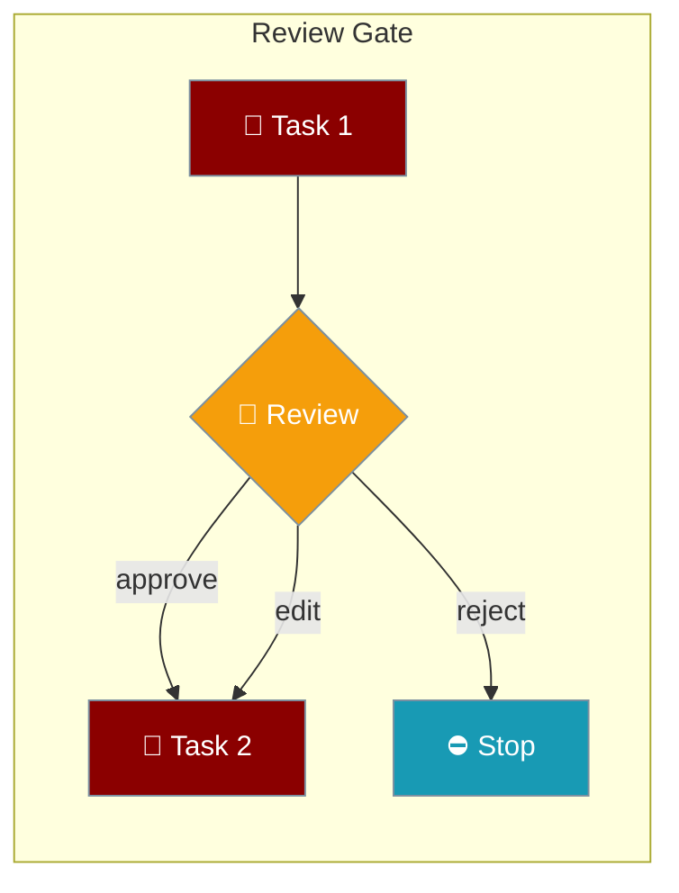
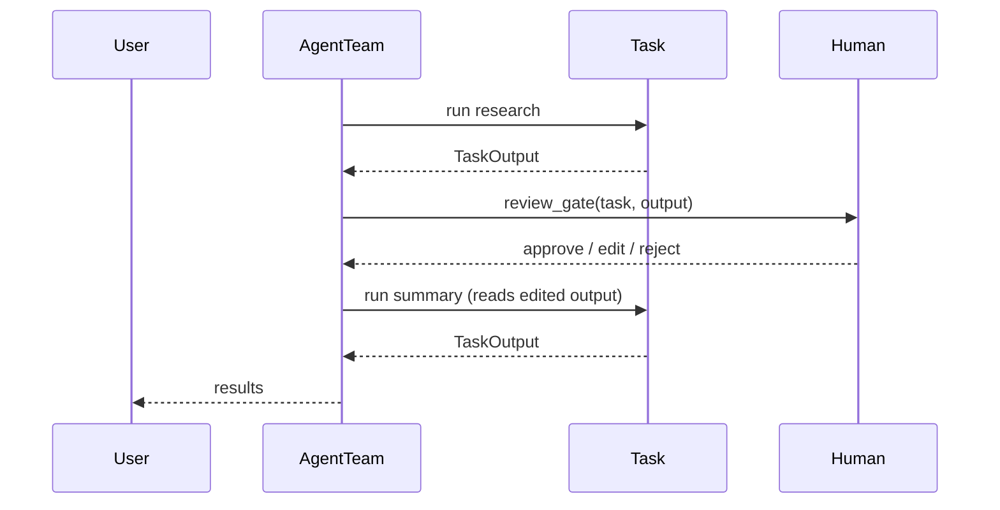

Pause a sequential team between tasks so a human can approve, edit, or reject each intermediate output.



## Quick Start

<Steps>
<Step title="Team-level review gate (soft: approve / edit)">
The team-level hook receives `(task, task_output)` and fires for every task — filter by `task.name`. Rejection is logged, not raised.

```python
from praisonaiagents import Agent, Task, AgentTeam
from praisonaiagents.config.feature_configs import MultiAgentHooksConfig

REVIEW_TASKS = {"research"}

def review_gate(task, task_output):        # signature: (task, task_output)
    if task.name not in REVIEW_TASKS:
        return
    print(f"\n--- Review: {task.name} ---\n{task_output.raw}\n")
    choice = input("Approve (y), reject (n), edit (e)? ").strip().lower()
    if choice == "e":
        # downstream tasks that read this task via context=[t1] see the edit
        task_output.raw = input("Edited output: ").strip()

researcher = Agent(name="Researcher", role="Researcher", goal="Research", backstory="Expert")
writer = Agent(name="Writer", role="Writer", goal="Write", backstory="Writer")

t1 = Task(name="research", description="List 5 facts about {{topic}}",
          expected_output="5 bullets", agent=researcher)
t2 = Task(name="summary", description="Write 3-sentence summary",
          expected_output="3 sentences", agent=writer, context=[t1])

team = AgentTeam(
    agents=[researcher, writer],
    tasks=[t1, t2],
    process="sequential",
    variables={"topic": "REST APIs"},   # NOT team.start(inputs=...) — see Gotchas
    hooks=MultiAgentHooksConfig(on_task_complete=review_gate),
)
team.start()
```
</Step>

<Step title="Per-task strict gate (hard-stop on reject)">
The per-task 1-argument callback halts the run when combined with `fail_on_callback_error=True`.

```python
def review_output(task_output):          # signature: (task_output)
    print(f"\n--- Review output ---\n{task_output.raw}\n")
    if input("Approve? (y/n) ").strip().lower() == "n":
        raise RuntimeError("Human rejected output")

t1_strict = Task(
    name="research",
    description="List 5 facts about {{topic}}",
    expected_output="5 bullets",
    agent=researcher,
    variables={"topic": "REST APIs"},
    on_task_complete=review_output,       # 1-arg signature
    fail_on_callback_error=True,          # REQUIRED so reject halts the workflow
)
```
</Step>
</Steps>

---

## How It Works



## ⚠️ Two different `on_task_complete` hooks — DIFFERENT signatures

This is the whole point of the page: the team-level and per-task hooks look identical but bind different objects.

| Where set | Signature | Rejects halt run? | Use when |
|---|---|---|---|
| `AgentTeam(hooks=MultiAgentHooksConfig(on_task_complete=fn))` | `fn(task, task_output)` | ❌ exceptions are logged + swallowed | Soft gate that filters by `task.name` |
| `Task(on_task_complete=fn)` — 1 param | `fn(task_output)` | ✅ with `fail_on_callback_error=True` | Hard-stop gate on one specific task |
| `Task(on_task_complete=fn)` — 2 params | `fn(task_output, metadata)` — **NOT** `(task, task_output)` | ✅ with `fail_on_callback_error=True` | You need the metadata dict (`task_id`, `task_name`) |

<Note>
`MultiAgentHooksConfig` is imported from `praisonaiagents.config.feature_configs` (it is not yet re-exported at the top level).
</Note>

---

## Best Practices

<AccordionGroup>
<Accordion title="The team-level hook swallows exceptions">
A bare `raise` inside a `MultiAgentHooksConfig` hook does **not** stop the workflow today — the team-level path logs and swallows it. To hard-stop on reject, use a per-task `Task(on_task_complete=…, fail_on_callback_error=True)` instead.
</Accordion>

<Accordion title="AgentTeam.start(inputs=…) is silently ignored">
`start()` forwards `**kwargs` but never consumes an `inputs=` argument. Pass template values via `AgentTeam(variables={...})` with `{{key}}` placeholders in task/agent fields. Note the **double brace** `{{topic}}` — not the single-brace `{topic}` used by the roles-file YAML loader.
</Accordion>

<Accordion title="Editing propagates through context=[t1]">
Mutating `task_output.raw` inside the hook is picked up by downstream tasks that read that task via `context=[t1]`, so edits flow forward automatically.
</Accordion>

<Accordion title="Filter by task.name, not index">
The team-level hook fires for every task in the team. Use `task.name in REVIEW_TASKS` to opt individual tasks into review rather than relying on position.
</Accordion>
</AccordionGroup>

---

## Related

<CardGroup cols={2}>
<Card title="Multi-Agent Hooks" icon="webhook" href="/features/multi-agent-hooks">
  Lifecycle callbacks for multi-agent workflows
</Card>
<Card title="Callbacks" icon="bell" href="/features/callbacks">
  Agent callback system
</Card>
<Card title="Task Context Control" icon="sitemap" href="/features/task-context-control">
  Control which task outputs feed the next task
</Card>
<Card title="Sequential Team (YAML)" icon="list-check" href="/examples/sequential-team-yaml">
  The YAML starting point for sequential teams
</Card>
</CardGroup>
