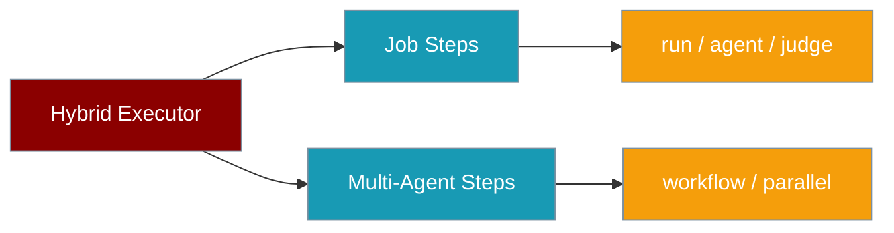

Hybrid workflows combine deterministic shell/Python steps from job workflows and multi-agent collaboration from agent workflows, all in a single YAML file.



## Quick Start

<Steps>

<Step title="Simple Usage">

```yaml pipeline.yaml
type: hybrid
name: release-pipeline

steps:
  - name: Check environment
    run: python --version

  - name: Generate notes
    agent:
      role: Technical Writer
      prompt: Generate release notes for v1.2.0
      model: gpt-4o-mini
    output_file: RELEASE_NOTES.md
```

```bash
praisonai workflow run pipeline.yaml
```

</Step>

<Step title="With Configuration">

```yaml pipeline.yaml
type: hybrid
name: release-pipeline
description: Shell + AI in one workflow

agents:
  researcher:
    name: Researcher
    role: Research Analyst
    instructions: Provide concise research findings
    model: gpt-4o-mini

steps:
  - name: Check environment
    run: python --version

  - name: Generate notes
    agent:
      role: Technical Writer
      prompt: Generate release notes for v1.2.0
      model: gpt-4o-mini
    output_file: RELEASE_NOTES.md

  - name: Research best practices
    workflow:
      agent: researcher
      action: Research release management best practices

  - name: Parallel checks
    parallel:
      - run: echo "Lint passed"
      - run: echo "Security scan passed"
```

```bash
praisonai workflow run pipeline.yaml
praisonai workflow run pipeline.yaml --dry-run
```

</Step>

<Step title="Run programmatically">

```python
from praisonai.agents_generator import AgentsGenerator

gen = AgentsGenerator(agent_file="pipeline.yaml")
gen.generate_crew_and_kickoff()
```

</Step>

</Steps>

**No extra flag needed** — the wrapper detects `type: hybrid` and routes automatically. Previously only the `praisonai workflow run` CLI did this; the programmatic API now matches.

---

## How It Works

The `HybridWorkflowExecutor` delegates deterministic and agent-centric steps to `JobWorkflowExecutor`, while handling multi-agent `workflow:` and `parallel:` steps itself.

---

## Step Types

Hybrid workflows support **all** step types from both engines:

### From Job Workflows

| Key | Type | Description |
|-----|------|-------------|
| `run:` | Shell | Shell command |
| `python:` | Script | Python script file |
| `script:` | Inline | Inline Python code |
| `action:` | Action | Named actions (3-tier resolution) |
| `agent:` | AI Agent | Single agent via `Agent.chat()` |
| `judge:` | Quality Gate | Evaluate content with threshold |
| `approve:` | Approval | Human or auto approval gate |

### Hybrid-Only Steps

| Key | Type | Description |
|-----|------|-------------|
| `workflow:` | Multi-Agent | Execute a named agent from the `agents:` block |
| `parallel:` | Parallel | Run multiple sub-steps concurrently |

---

## Multi-Agent Steps (`workflow:`)

Reference agents defined in the top-level `agents:` block:

```yaml
type: hybrid
agents:
  researcher:
    name: Researcher
    role: Research Analyst
    goal: Gather comprehensive information
    instructions: Provide factual, well-sourced findings
    model: gpt-4o-mini

  writer:
    name: Writer
    role: Content Writer
    goal: Write clear documentation
    instructions: Write professional, concise content
    model: gpt-4o-mini

steps:
  - name: Research topic
    workflow:
      agent: researcher
      action: Research best practices for documentation
  
  - name: Write documentation
    workflow:
      agent: writer
      action: Write a getting-started guide
```

**`workflow:` config**:

| Field | Description |
|-------|-------------|
| `agent` | Reference to an agent in the `agents:` block |
| `action` | The task/prompt for the agent to execute |

---

## Parallel Steps (`parallel:`)

Run multiple sub-steps simultaneously:

```yaml
- name: Run all checks
  parallel:
    - run: echo "Running lint..."
    - run: echo "Running type check..."
    - run: echo "Running security scan..."
    - agent:
        role: Reviewer
        prompt: Check for code quality issues
```

Each sub-step inside `parallel:` can be any supported step type — shell, script, agent, etc.

---

## Dry Run

```bash
praisonai workflow run pipeline.yaml --dry-run
```

```
╭────────────── 🔀 Hybrid Workflow — DRY RUN ──────────────╮
│ release-pipeline                                          │
│ Shell + AI in one workflow                                │
╰──────────────────────────────────────────────────────────╯

  ● Check environment — shell: python --version
  ● Generate notes — agent: Technical Writer (model: gpt-4o-mini)
  ● Research — workflow: agent=researcher
  ● Parallel checks — parallel: 3 steps
  ● Quality check — judge: threshold=7.0
  ● Approve — approve: risk=medium

🔀 Dry run complete — 6 steps planned
```

---

## Full Example

```yaml hybrid-release.yaml
type: hybrid
name: hybrid-release-pipeline
description: Complete release with shell, AI, and multi-agent steps

agents:
  researcher:
    name: Researcher
    role: Research Analyst
    instructions: Provide concise research findings
    model: gpt-4o-mini

flags:
  skip-tests: { description: "Skip tests" }
  auto-approve: { description: "Auto-approve deployment" }

steps:
  # Deterministic: check environment
  - name: Check environment
    run: python --version

  # Agent: generate release notes
  - name: Generate release notes
    agent:
      role: Technical Writer
      instructions: Write clear, concise release notes
      prompt: Generate release notes for v1.2.0
      model: gpt-4o-mini
    output_file: RELEASE_NOTES.md

  # Parallel: run multiple checks
  - name: Parallel checks
    parallel:
      - run: echo "Lint check passed"
      - run: echo "Type check passed"
      - run: echo "Security scan passed"

  # Multi-agent: research step
  - name: Research best practices
    workflow:
      agent: researcher
      action: Research release management best practices

  # Judge: quality gate
  - name: Quality check
    judge:
      input_file: RELEASE_NOTES.md
      criteria: Complete, clear, professional tone
      threshold: 7.0
      on_fail: warn

  # Approve: human sign-off
  - name: Approve release
    approve:
      description: Review and approve the release
      risk_level: medium
      auto_approve: "{{ flags.auto_approve }}"

  # Deterministic: build
  - name: Build package
    run: echo "Building..."
    if: "{{ not flags.skip_tests }}"

  # Final notification
  - name: Done
    run: echo "✅ Release complete!"
```

```bash
praisonai workflow run hybrid-release.yaml --dry-run
praisonai workflow run hybrid-release.yaml --auto-approve
```

---

## Comparison: Job vs Hybrid

| | Job Workflows | Hybrid Workflows |
|---|---|---|
| **Type** | `type: job` | `type: hybrid` |
| **Deterministic steps** | ✅ | ✅ |
| **Agent steps** | ✅ `agent`, `judge`, `approve` | ✅ |
| **Multi-agent** | ❌ | ✅ `workflow:` |
| **Parallel** | ❌ | ✅ `parallel:` |
| **`agents:` block** | ❌ | ✅ Named agent definitions |
| **Use case** | CI/CD, automation | Complex pipelines mixing automation + AI |

---

## Best Practices

<AccordionGroup>

<Accordion title="Start with dry run">
Use `praisonai workflow run pipeline.yaml --dry-run` to validate step order and agent references before executing shell or deployment steps.
</Accordion>

<Accordion title="Define named agents for reuse">
Put multi-turn agents in the top-level `agents:` block and reference them with `workflow:` steps — keeps prompts and model settings in one place.
</Accordion>

<Accordion title="Mix parallel and sequential wisely">
Use `parallel:` for independent checks (lint, security, type-check) and keep dependent steps sequential to preserve output files like `RELEASE_NOTES.md`.
</Accordion>

<Accordion title="Use flags for environment control">
Define `flags:` in YAML and reference them with `if:` expressions so the same pipeline works in CI and production without duplicating files.
</Accordion>

</AccordionGroup>

---

## Related

<CardGroup cols={2}>
  <Card title="Job Workflows" icon="list-check" href="/docs/features/job-workflows">
    Deterministic + agent steps
  </Card>
  <Card title="Custom Actions" icon="puzzle-piece" href="/docs/features/custom-actions">
    YAML-defined, file-based actions
  </Card>
  <Card title="All Systems" icon="layer-group" href="/docs/features/execution-systems">
    Compare all 8 PraisonAI systems
  </Card>
  <Card title="Workflows" icon="diagram-project" href="/docs/features/workflows">
    Multi-agent workflow patterns
  </Card>
</CardGroup>
