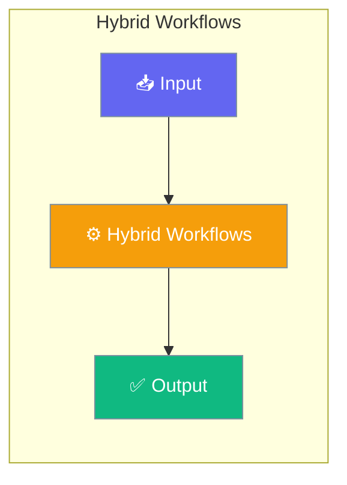

Hybrid workflows combine the best of both worlds — deterministic shell/Python steps from job workflows and multi-agent collaboration from agent workflows, all in a single YAML file.




## Quick Start


<Steps>
<Step title="Simple Usage">
```yaml pipeline.yaml
type: hybrid
name: release-pipeline
description: Shell + AI in one workflow

agents:
  researcher:
    name: Researcher
    role: Research Analyst
    instructions: Provide concise research findings
    model: gpt-4o-mini

steps:
  - name: Check environment
    run: python --version

  - name: Generate notes
    agent:
      role: Technical Writer
      prompt: Generate release notes for v1.2.0
      model: gpt-4o-mini
    output_file: RELEASE_NOTES.md

  - name: Research best practices
    workflow:
      agent: researcher
      action: Research release management best practices

  - name: Parallel checks
    parallel:
      - run: echo "Lint passed"
      - run: echo "Security scan passed"
```
</Step>

<Step title="With Configuration">
```bash
praisonai workflow run pipeline.yaml
praisonai workflow run pipeline.yaml --dry-run
```

```python Run programmatically
from praisonai.agents_generator import AgentsGenerator

# Hybrid workflow YAML
gen = AgentsGenerator(agent_file="pipeline.yaml")
gen.generate_crew_and_kickoff()

# Or async
import asyncio
asyncio.run(AgentsGenerator(agent_file="pipeline.yaml").agenerate_crew_and_kickoff())
```

**No extra flag needed** — the wrapper detects `type: hybrid` and routes automatically. Previously only the `praisonai workflow run` CLI did this; the programmatic API now matches.

---
</Step>
</Steps>


## Best Practices

<AccordionGroup>
  <Accordion title="Start simple">
    Enable the feature with a single parameter before adding configuration. Verify it works, then layer in options.
  </Accordion>
  <Accordion title="Use environment variables for secrets">
    Never hardcode API keys or tokens. Use `os.getenv("KEY_NAME")` to read from environment variables.
  </Accordion>
  <Accordion title="Test with minimal examples first">
    Copy the Quick Start example, run it, then extend it. This confirms your environment is set up correctly.
  </Accordion>
  <Accordion title="Check the logs">
    Set `verbose=True` on your agent to see detailed execution logs when debugging unexpected behavior.
  </Accordion>
</AccordionGroup>

## Related

<CardGroup cols={2}>
  <Card title="Features Overview" icon="grid-2" href="/docs/features">
    Browse all PraisonAI features
  </Card>
  <Card title="Quick Start" icon="rocket" href="/docs/introduction">
    Get started with PraisonAI agents
  </Card>
</CardGroup>
