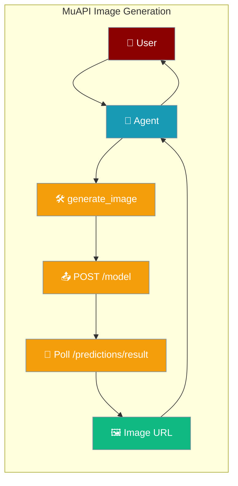
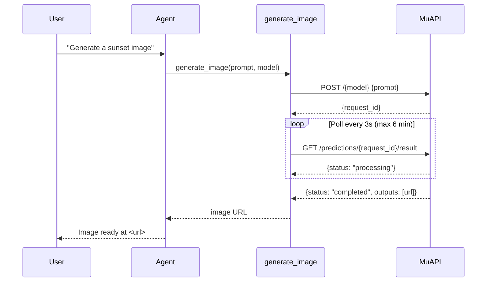
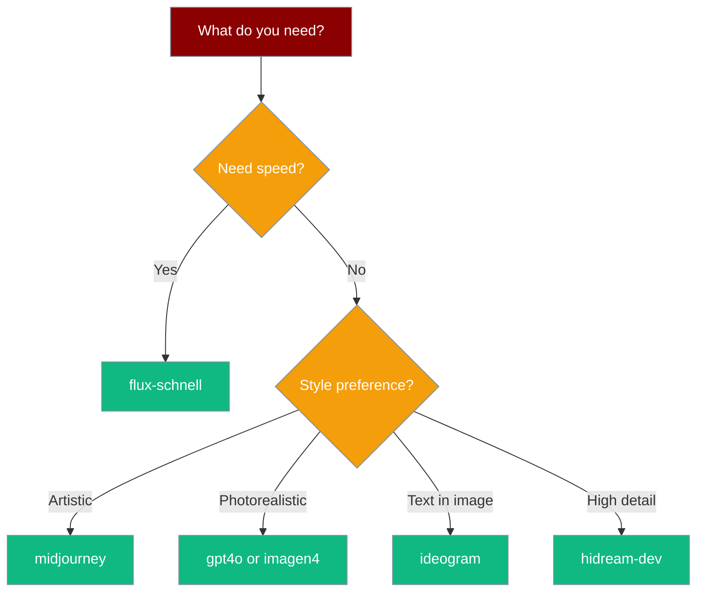

Give any agent image-generation capability using MuAPI's unified API across 400+ generative media models.



## Quick Start

<Steps>
<Step title="Install packages">
```bash
pip install praisonaiagents requests
```
</Step>

<Step title="Get your API key">
Get a free API key at [https://muapi.ai/dashboard/api-keys](https://muapi.ai/dashboard/api-keys).
</Step>

<Step title="Set environment variable">
```bash
export MUAPI_API_KEY=your_key_here
```
</Step>

<Step title="Run the agent">
```python
import os, time, requests
from praisonaiagents import Agent, Tool

MUAPI_BASE_URL = "https://api.muapi.ai/api/v1"

def generate_image(prompt: str, model: str = "flux-schnell") -> str:
    """Generate an image and return the URL."""
    api_key = os.environ["MUAPI_API_KEY"]
    headers = {"x-api-key": api_key, "Content-Type": "application/json"}
    resp = requests.post(f"{MUAPI_BASE_URL}/{model}", headers=headers, json={"prompt": prompt}, timeout=30)
    resp.raise_for_status()
    request_id = resp.json()["request_id"]
    for _ in range(120):
        time.sleep(3)
        r = requests.get(f"{MUAPI_BASE_URL}/predictions/{request_id}/result", headers={"x-api-key": api_key}, timeout=15)
        data = r.json()
        if data.get("status") == "completed":
            return data["outputs"][0]
    raise TimeoutError("Generation timed out")

agent = Agent(
    name="Image Generator",
    instructions="Generate images using the generate_image tool.",
    tools=[Tool(name="generate_image", description="Generate an image from a text prompt.", function=generate_image)],
)

print(agent.start("Create a photorealistic coffee mug on a marble table."))
```
</Step>
</Steps>

## How It Works



## Available Models

| Model ID | Style | Speed |
|----------|-------|-------|
| `flux-schnell` | Photorealistic | Fastest |
| `flux-dev` | High quality | Fast |
| `flux-kontext-dev` | Context-aware | Medium |
| `flux-kontext-pro` | Context-aware Pro | Medium |
| `midjourney` | Artistic | Medium |
| `gpt4o` | Photorealism | Medium |
| `imagen4` | Google photorealism | Medium |
| `imagen4-fast` | Google photorealism | Fast |
| `seedream` | Creative | Medium |
| `hidream-fast` | High detail | Fast |
| `hidream-dev` | High detail | Medium |
| `reve` | Stylized | Medium |
| `ideogram` | Text-in-image | Medium |
| `hunyuan` | Chinese aesthetic | Medium |

## Model Selection Guide



## Full Example

```python
import os
import time

import requests
from praisonaiagents import Agent, Tool


MUAPI_BASE_URL = "https://api.muapi.ai/api/v1"

ALLOWED_MODELS = {
    "flux-schnell", "flux-dev", "flux-kontext-dev", "flux-kontext-pro",
    "midjourney", "gpt4o", "imagen4", "imagen4-fast", "seedream",
    "hidream-fast", "hidream-dev", "reve", "ideogram", "hunyuan",
}


def generate_image(prompt: str, model: str = "flux-schnell") -> str:
    """Generate an image using MuAPI and return the output URL."""
    if model not in ALLOWED_MODELS:
        raise ValueError(f"Unsupported model '{model}'. Choose from: {sorted(ALLOWED_MODELS)}")

    api_key = os.environ.get("MUAPI_API_KEY", "")
    if not api_key:
        raise ValueError("MUAPI_API_KEY environment variable not set")

    headers = {"x-api-key": api_key, "Content-Type": "application/json"}

    submit_resp = requests.post(
        f"{MUAPI_BASE_URL}/{model}",
        headers=headers,
        json={"prompt": prompt},
        timeout=30,
    )
    submit_resp.raise_for_status()
    request_id = submit_resp.json()["request_id"]

    for _ in range(120):
        time.sleep(3)
        poll_resp = requests.get(
            f"{MUAPI_BASE_URL}/predictions/{request_id}/result",
            headers={"x-api-key": api_key},
            timeout=15,
        )
        poll_resp.raise_for_status()
        data = poll_resp.json()
        if data.get("status") == "completed":
            return data["outputs"][0]
        if data.get("status") in ("failed", "cancelled"):
            raise RuntimeError(f"Generation {data['status']}: {data.get('error', '')}")

    raise TimeoutError("Image generation timed out after 6 minutes")


image_tool = Tool(
    name="generate_image",
    description=(
        "Generate an image from a text description using MuAPI's 400+ model library. "
        "Supported models: flux-schnell (fast), midjourney (artistic), gpt4o (photorealism)."
    ),
    function=generate_image,
)

agent = Agent(
    name="Image Generator",
    instructions=(
        "You are a creative image generation assistant. "
        "Use generate_image for all image requests. "
        "Pick the best model: flux-schnell for speed, midjourney for art, gpt4o for photorealism."
    ),
    tools=[image_tool],
)

response = agent.start(
    "Generate a photorealistic product photo of a black coffee mug on white marble. "
    "Use the best model for photorealism."
)
print(response)
```

## Best Practices

<AccordionGroup>
<Accordion title="Choosing a model">
Start with `flux-schnell` for testing — it's the fastest. Switch to `midjourney` for artistic output or `gpt4o` / `imagen4` for photorealistic images. Use `ideogram` when the image needs text overlaid.
</Accordion>
<Accordion title="Handling timeouts">
The default timeout is 6 minutes (120 polls × 3 seconds). Complex models like `midjourney` or `hidream-dev` may take longer. Increase the poll count if needed, or use faster models for real-time use cases.
</Accordion>
<Accordion title="Cost considerations">
Faster models (`flux-schnell`, `imagen4-fast`, `hidream-fast`) use fewer API credits. Reserve high-quality models for final outputs, and prototype with fast variants.
</Accordion>
<Accordion title="Error handling">
Always check for `failed` or `cancelled` status in the poll loop. MuAPI returns an `error` field when generation fails. Wrap `generate_image` in try/except for production use.
</Accordion>
</AccordionGroup>

## Environment Variables

| Variable | Required | Description |
|----------|----------|-------------|
| `MUAPI_API_KEY` | Yes | MuAPI authentication key |
| `OPENAI_API_KEY` | Yes | For the PraisonAI agent LLM |

## Related

<CardGroup cols={2}>
<Card title="Image Generation" icon="image" href="/docs/features/image-generation">
  Built-in image generation via ImageAgent
</Card>
<Card title="Custom Tools" icon="wrench" href="/docs/concepts/tools">
  Building custom tools for agents
</Card>
</CardGroup>
