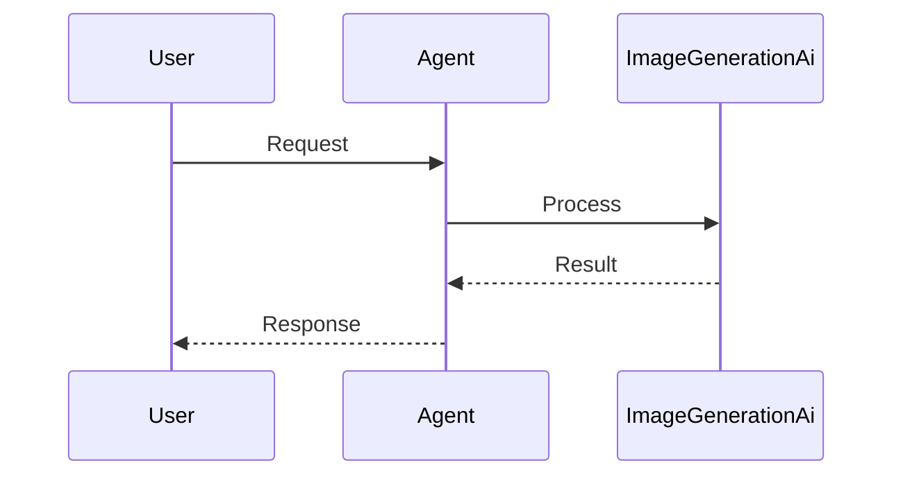

Generate images from natural language descriptions with PraisonAI Image Agents — sync or async, with DALL-E integration out of the box.


```python
from praisonaiagents import ImageAgent

agent = ImageAgent(llm="dall-e-3")
agent.chat("A minimalist logo for a coffee shop")
```

The user describes an image; the image agent calls the generation API and returns a URL.


## How It Works




## Quick Start

<Steps>

<Step title="Simple Usage">

```python
import os
from praisonaiagents import ImageAgent

agent = ImageAgent(llm="dall-e-3")
result = agent.chat("A cute baby sea otter playing with a laptop")
print(result)
```

Set `OPENAI_API_KEY` in your environment before running.

</Step>

<Step title="With Configuration">

```python
import os
from praisonaiagents import ImageAgent

agent = ImageAgent(
    name="ImageCreator",
    llm="dall-e-3",
    style="natural",
)

result = agent.chat("A minimalist logo for a coffee shop")
print(result)
```

</Step>

<Step title="Async">

```python
import asyncio
import os
from praisonaiagents import ImageAgent

async def main():
    agent = ImageAgent(name="ImageCreator", llm="dall-e-3", style="natural")
    result = await agent.achat("A cute baby sea otter playing with a laptop")
    print(result)

asyncio.run(main())
```

</Step>

</Steps>

Install with LLM support: `pip install "praisonaiagents[llm]"`

## Features

<CardGroup cols={2}>
  <Card title="DALL-E Integration" icon="image">
    Seamless integration with DALL-E for high-quality image generation.
  </Card>
  <Card title="Async Support" icon="bolt">
    Asynchronous operations for better performance in concurrent environments.
  </Card>
  <Card title="Natural Style" icon="paintbrush">
    Generate images with natural, realistic styling options.
  </Card>
  <Card title="Verbose Mode" icon="message">
    Detailed output logging for better debugging and monitoring.
  </Card>
</CardGroup>

## Best Practices

<AccordionGroup>

<Accordion title="Use environment variables for API keys">
Read `OPENAI_API_KEY` from the environment — never hardcode keys in source files.
</Accordion>

<Accordion title="Pick the right model">
Use `dall-e-3` for quality; switch models via the `llm` parameter when cost or speed matters more.
</Accordion>

<Accordion title="Prefer async in web apps">
Use `achat()` when serving multiple concurrent image requests from a FastAPI or gateway handler.
</Accordion>

<Accordion title="Describe style explicitly">
Pass `style="natural"` or include style cues in the prompt for consistent visual output across runs.
</Accordion>

</AccordionGroup>

## Related

<CardGroup cols={2}>
  <Card title="Multimodal" icon="images" href="/docs/features/multimodal">
    Text, image, and audio processing with agents
  </Card>
  <Card title="Outbound Media Delivery" icon="photo-film" href="/docs/features/outbound-media-delivery">
    Deliver generated images to users via messaging bots
  </Card>
</CardGroup>
