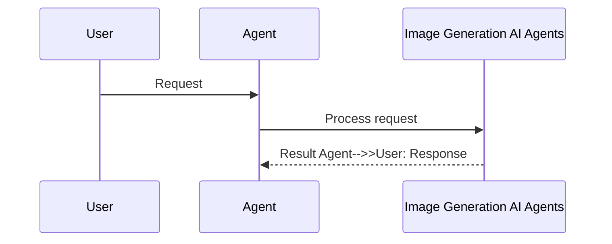

Generate images from natural language descriptions with PraisonAI Image Agents — sync or async, with DALL-E integration out of the box.


```python
from praisonaiagents import ImageAgent

agent = ImageAgent(llm="dall-e-3")
agent.chat("A minimalist logo for a coffee shop")
```

The user describes an image; the image agent calls the generation API and returns a URL.


```mermaid
graph LR
    U[User prompt] --> A[Image Agent]
    A --> API[DALL-E API]
    API --> Out[Image URL]

    classDef agent fill:#8B0000,stroke:#7C90A0,color:#fff
    classDef process fill:#189AB4,stroke:#7C90A0,color:#fff
    classDef result fill:#10B981,stroke:#7C90A0,color:#fff

    class U agent
    class A process
    class API process
    class Out result

```

## How It Works


```mermaid
sequenceDiagram
    participant User
    participant Agent
    participant Feature as Image Generation AI Agents

    User->>Agent: Request
    Agent->>Feature: Process request
    Feature-->>Agent: Result    Agent-->>User: Response
```


## Quick Start

<Steps>

<Step title="Simple Usage">

```python
import os
from praisonaiagents import ImageAgent

agent = ImageAgent(llm="dall-e-3")
result = agent.chat("A cute baby sea otter playing with a laptop")
print(result)
```

Set `OPENAI_API_KEY` in your environment before running.

</Step>

<Step title="With Configuration">

```python
import os
from praisonaiagents import ImageAgent

agent = ImageAgent(
    name="ImageCreator",
    llm="dall-e-3",
    style="natural",
)

result = agent.chat("A minimalist logo for a coffee shop")
print(result)
```

</Step>

<Step title="Async">

```python
import asyncio
import os
from praisonaiagents import ImageAgent

async def main():
    agent = ImageAgent(name="ImageCreator", llm="dall-e-3", style="natural")
    result = await agent.achat("A cute baby sea otter playing with a laptop")
    print(result)

asyncio.run(main())
```

<Note>
`achat()` is genuinely non-blocking as of [PR #5219](https://github.com/MervinPraison/PraisonAI/pull/5219) — the image round-trip runs on a worker thread, not the event loop. See [Non-blocking async](#non-blocking-async-pr-5219) below.
</Note>

</Step>

</Steps>

Install with LLM support: `pip install "praisonaiagents[llm]"`

## Non-blocking async (PR #5219)

`ImageAgent.agenerate_image`, `agenerate`, `aedit`, `avariation`, and (transitively) `achat` now offload the synchronous image call via `asyncio.to_thread`, so awaiting one no longer freezes the event loop for the 10–60 second image round-trip.

Reference: [PR #5219](https://github.com/MervinPraison/PraisonAI/pull/5219), fixes [#5162](https://github.com/MervinPraison/PraisonAI/issues/5162).

Run an `ImageAgent` and a text-only `Agent` side by side — the text agent keeps streaming while the image generates:

```python
import asyncio
from praisonaiagents import Agent, ImageAgent

img_agent = ImageAgent(name="ImageCreator", llm="dall-e-3", style="natural")
text_agent = Agent(name="Writer", instructions="Write a short product blurb.")

async def main():
    # Before PR #5219 the image call ran inline on the loop thread and
    # silently starved the text agent for the whole 10–60s round-trip.
    # Now both run concurrently.
    image, blurb = await asyncio.gather(
        img_agent.achat("A minimalist logo for a coffee shop"),
        text_agent.achat("Describe a cozy neighbourhood coffee shop"),
    )
    print(image)
    print(blurb)

asyncio.run(main())
```

<Warning>
This fix landed for `ImageAgent` **only**. `VideoAgent` (`astart`, `adownload`) and `AudioAgent` (`atranscribe`) still run their synchronous call inline on the event loop as of PR #5219 and will block a concurrent `gather`. If a follow-up PR offloads them, this warning will be updated.
</Warning>

## Features

<CardGroup cols={2}>
  <Card title="DALL-E Integration" icon="image">
    Seamless integration with DALL-E for high-quality image generation.
  </Card>
  <Card title="Async Support" icon="bolt">
    Asynchronous operations for better performance in concurrent environments.
  </Card>
  <Card title="Natural Style" icon="paintbrush">
    Generate images with natural, realistic styling options.
  </Card>
  <Card title="Verbose Mode" icon="message">
    Detailed output logging for better debugging and monitoring.
  </Card>
</CardGroup>

## Best Practices

<AccordionGroup>

<Accordion title="Use environment variables for API keys">
Read `OPENAI_API_KEY` from the environment — never hardcode keys in source files.
</Accordion>

<Accordion title="Pick the right model">
Use `dall-e-3` for quality; switch models via the `llm` parameter when cost or speed matters more.
</Accordion>

<Accordion title="Prefer async in web apps">
Use `achat()` when serving multiple concurrent image requests from a FastAPI or gateway handler.
</Accordion>

<Accordion title="Describe style explicitly">
Pass `style="natural"` or include style cues in the prompt for consistent visual output across runs.
</Accordion>

</AccordionGroup>

## Related

<CardGroup cols={2}>
  <Card title="Multimodal" icon="images" href="/features/multimodal">
    Text, image, and audio processing with agents
  </Card>
  <Card title="Outbound Media Delivery" icon="photo-film" href="/features/outbound-media-delivery">
    Deliver generated images to users via messaging bots
  </Card>
  <Card title="Async Safety" icon="shield-check" href="/features/async-safety">
    How blocking calls are offloaded to keep the event loop responsive
  </Card>
</CardGroup>
