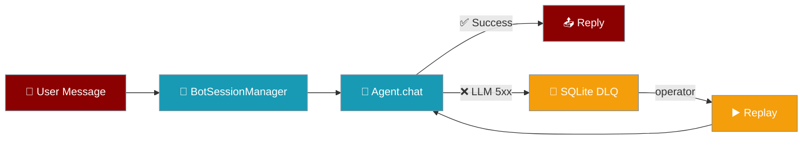
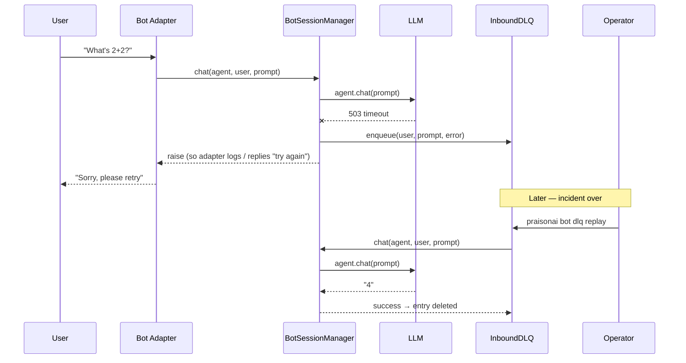

When the LLM fails, the user's message lands in a local SQLite queue you can inspect and replay later, instead of being lost.



## Quick Start

<Steps>
<Step title="Simple Usage">

Enable dead-letter queue with a single parameter:

```python
from praisonai.bots import BotSessionManager, InboundDLQ

dlq = InboundDLQ(path="~/.praisonai/dlq.sqlite")
mgr = BotSessionManager(platform="telegram", dlq=dlq)
# That's it — failed messages now persist for replay.
```

</Step>

<Step title="With Configuration">

Configure TTL and size limits:

```python
from praisonai.bots import BotSessionManager, InboundDLQ

dlq = InboundDLQ(
    path="~/.praisonai/dlq.sqlite",
    max_size=5_000,        # keep max 5000 entries
    ttl_seconds=3*86400    # 3 days before auto-eviction
)
mgr = BotSessionManager(platform="telegram", dlq=dlq)
```

</Step>

<Step title="Replay via CLI">

Replay failed messages after fixing LLM issues:

```bash
praisonai bot dlq replay --config bot.yaml
```

</Step>
</Steps>

---

## How It Works



When `BotSessionManager.chat()` raises due to LLM errors (5xx, timeouts, rate-limits), the user's message is persisted before the exception is re-raised, so bot adapters can still show friendly error messages while preserving the request for later replay.

---

## Configuration Options

| Parameter | Type | Default | Description |
|-----------|------|---------|-------------|
| `path` | `str \| Path` | — (required) | SQLite file path. `~` is expanded; parent dirs auto-created. |
| `max_size` | `int` | `10_000` | Max entries kept; oldest evicted on overflow. |
| `ttl_seconds` | `int` | `604800` (7 days) | Entries older than this are evicted on next `enqueue()` / `evict_expired()`. |

### InboundDLQ Methods

| Method | Returns | Description |
|--------|---------|-------------|
| `enqueue(*, platform, user_id, prompt, error, ...)` | `int` (row id) | Persists failed message. Runs TTL + overflow eviction inline. |
| `size()` | `int` | Total entry count. |
| `list(limit=100)` | `List[DLQEntry]` | List entries newest first. |
| `purge()` | `int` (count removed) | Deletes all entries. |
| `evict_expired()` | `int` (count removed) | Drop entries older than `ttl_seconds`. |
| `async replay(handler, *, limit=None)` | `tuple[int, int]` (succeeded, failed) | Calls `handler(entry) -> bool` oldest-first. `True` deletes the entry. |

### DLQEntry Fields

| Field | Type | Description |
|-------|------|-------------|
| `id` | `int` | Unique entry ID |
| `ts` | `float` | Timestamp when message failed |
| `platform` | `str` | Platform where message originated |
| `user_id` | `str` | User who sent the message |
| `prompt` | `str` | The user's message content |
| `chat_id` | `str` | Chat/channel ID |
| `thread_id` | `str` | Thread ID (if applicable) |
| `user_name` | `str` | Display name of user |
| `error` | `str` | Error message that caused failure |
| `attempts` | `int` | Number of replay attempts |

---

## CLI Reference

Path resolution order: `--path` flag → `PRAISONAI_DLQ_PATH` env var → `~/.praisonai/dlq.sqlite` (default).

### List Entries

```bash
praisonai bot dlq list                              # newest first (default 20)
praisonai bot dlq list --path /var/lib/x.sqlite     # custom path
praisonai bot dlq list --limit 50                   # show more entries
```

Shows: `id`, `platform`, `user_id`, `attempts`, `error[:50]`, `prompt[:60]`.

### Purge All

```bash
praisonai bot dlq purge                             # prompts for confirmation
praisonai bot dlq purge --yes                       # skip confirmation
praisonai bot dlq purge --path /custom/dlq.sqlite   # custom path
```

### Replay Failed Messages

```bash
praisonai bot dlq replay --config bot.yaml          # default 50 entries
praisonai bot dlq replay --config bot.yaml --limit 100
praisonai bot dlq replay --config bot.yaml --path /custom/dlq.sqlite
```

Loads agent from YAML, replays oldest-first via `BotSessionManager.chat()`. Exits non-zero if any entries remain failed.

---

## Common Patterns

### Custom Replay Handler

For programmatic replay with custom logic:

```python
from praisonai.bots import InboundDLQ, BotSessionManager

dlq = InboundDLQ("~/.praisonai/dlq.sqlite")
mgr = BotSessionManager(platform="telegram")

async def custom_replayer(entry):
    """Custom replay logic with retry backoff."""
    try:
        # Add custom pre-processing
        if entry.attempts > 3:
            return False  # Skip entries with too many attempts
        
        response = await mgr.chat(
            agent, entry.user_id, entry.prompt,
            chat_id=entry.chat_id,
            thread_id=entry.thread_id,
            user_name=entry.user_name,
        )
        print(f"Replayed entry {entry.id}: {response[:50]}...")
        return True  # Success - delete entry
    except Exception as e:
        print(f"Entry {entry.id} failed again: {e}")
        return False  # Keep for next attempt

succeeded, failed = await dlq.replay(custom_replayer)
```

### Inspecting the Queue

Check queue status programmatically:

```python
from praisonai.bots import InboundDLQ

dlq = InboundDLQ("~/.praisonai/dlq.sqlite")

print(f"Queue size: {dlq.size()}")
print(f"Recent entries:")
for entry in dlq.list(limit=5):
    print(f"  [{entry.id}] {entry.platform} user={entry.user_id} "
          f"attempts={entry.attempts} error={entry.error[:30]}")
```

### Environment-Based Path

Use environment variable for flexible deployment:

```python
import os
from praisonai.bots import InboundDLQ

# Set PRAISONAI_DLQ_PATH=/var/lib/myapp/dlq.sqlite in production
dlq_path = os.environ.get("PRAISONAI_DLQ_PATH", "~/.praisonai/dlq.sqlite")
dlq = InboundDLQ(path=dlq_path)
```

---

## Best Practices

<AccordionGroup>
<Accordion title="Pick TTL That Matches Ops Cadence">

Default TTL is 7 days — long enough for ops teams to notice and act on LLM outages, short enough to prevent disk bloat. Adjust based on your monitoring and incident response times:

```python
# For teams with 24h incident response
dlq = InboundDLQ(path="dlq.sqlite", ttl_seconds=2*86400)  # 2 days

# For teams monitoring daily
dlq = InboundDLQ(path="dlq.sqlite", ttl_seconds=7*86400)  # 7 days (default)
```

</Accordion>

<Accordion title="Cap Max Size for Disk Safety">

Set `max_size` based on expected message volume and available disk space. When exceeded, oldest entries are evicted automatically:

```python
# For high-volume bots
dlq = InboundDLQ(path="dlq.sqlite", max_size=50_000)

# For resource-constrained environments
dlq = InboundDLQ(path="dlq.sqlite", max_size=1_000)
```

</Accordion>

<Accordion title="Keep DLQ Off in Tests">

DLQ is OFF by default — explicitly note this in test environments to avoid confusion:

```python
# In tests - DLQ disabled by default (good)
mgr = BotSessionManager(platform="test")  # No DLQ

# In production - explicitly enable DLQ
dlq = InboundDLQ("~/.praisonai/dlq.sqlite")
mgr = BotSessionManager(platform="telegram", dlq=dlq)
```

</Accordion>

<Accordion title="Use Same Agent Config for Replay">

Always replay through the same agent configuration used by the live bot to avoid prompt drift and inconsistent responses:

```yaml
# bot.yaml - use for both live bot and replay
platform: telegram
agent:
  name: "CustomerSupport"
  instructions: "You are a helpful customer support agent..."
  llm: "anthropic/claude-haiku-4-5"
```

```bash
# Consistent replay using same config
praisonai bot dlq replay --config bot.yaml
```

</Accordion>
</AccordionGroup>

---

## Related

<CardGroup cols={2}>
<Card title="Messaging Bots" icon="robot" href="/docs/features/messaging-bots">
  Core bot infrastructure and platform adapters
</Card>
<Card title="Bot Gateway" icon="gateway" href="/docs/features/bot-gateway">
  Multi-platform bot orchestration and routing
</Card>
</CardGroup>