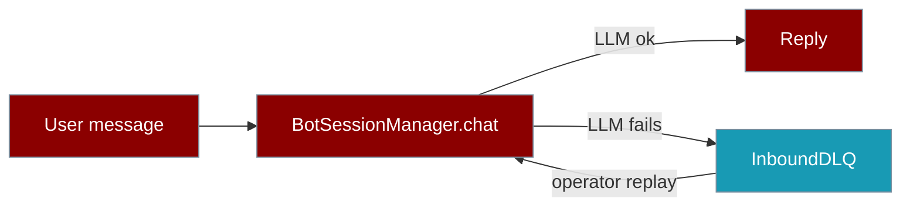

When `agent.chat()` fails, the Inbound DLQ persists the user's message so operators can inspect and replay it later.



<Note>
**On by default for gateway/bot runs** — When your bot starts via `praisonai bot start`, `onboard`, or `bot.yaml`, an `InboundDLQ` is wired automatically. No code needed. Set `delivery.durable: false` in your channel config to opt out.
</Note>

## Quick Start

<Steps>

<Step title="List failed messages">

```bash
praisonai bot dlq list
```

</Step>

<Step title="Replay through your bot">

```bash
praisonai bot dlq replay --config bot.yaml
```

</Step>

<Step title="Purge when resolved">

```bash
praisonai bot dlq purge --yes
```

</Step>

</Steps>

## Why you want this

<CardGroup cols={2}>
  <Card title="No silent data loss" icon="shield-check">
    Failed inbound messages are persisted to a SQLite file before the exception bubbles up.
  </Card>
  <Card title="Operator-friendly replay" icon="rotate">
    A single CLI command (`praisonai bot dlq replay`) re-runs failed messages through the agent.
  </Card>
  <Card title="Bounded by design" icon="ruler">
    TTL + `max_size` keep the queue from growing unbounded; oldest entries evict first.
  </Card>
  <Card title="Zero new dependency" icon="feather">
    Uses only stdlib `sqlite3`. On by default for gateway/bot runs — existing bots are upgraded automatically.
  </Card>
</CardGroup>

## Default behaviour (no config needed)

Every bot started through `build_session_manager` (all shipped adapters) automatically gets a DLQ at:

```
~/.praisonai/state/<platform>/inbound_dlq.sqlite
```

For example, a Telegram bot stores failed messages at `~/.praisonai/state/telegram/inbound_dlq.sqlite`. A Discord bot uses `~/.praisonai/state/discord/inbound_dlq.sqlite`. Each platform is fully isolated.

Set `PRAISONAI_HOME` to override the base directory:

```
$PRAISONAI_HOME/state/<platform>/inbound_dlq.sqlite
```

## Opt out or override path

Add a `delivery:` block to any channel in your `bot.yaml` or `gateway.yaml`:

```yaml
channels:
  telegram:
    token: "${TELEGRAM_BOT_TOKEN}"
    delivery:
      durable: false   # opt out of durable inbound delivery for this channel
```

Override the store directory:

```yaml
channels:
  telegram:
    token: "${TELEGRAM_BOT_TOKEN}"
    delivery:
      store: /var/lib/praisonai/telegram-state
      # → inbound_dlq.sqlite lives in /var/lib/praisonai/telegram-state/
```

## CLI

```bash
# List failed messages (newest first)
praisonai bot dlq list

# List from a custom path
praisonai bot dlq list --path /var/lib/myapp/dlq.sqlite --limit 50

# Replay through your bot's configured agent
praisonai bot dlq replay --config bot.yaml

# Purge everything (asks for confirmation)
praisonai bot dlq purge
praisonai bot dlq purge --yes  # skip confirmation
```

## Advanced: manual instantiation

Most users get the DLQ automatically. For custom setups outside `build_session_manager`, create it directly:

```python
from praisonai.bots import BotSessionManager, InboundDLQ

dlq = InboundDLQ(path="~/.praisonai/state/telegram/inbound_dlq.sqlite")
mgr = BotSessionManager(platform="telegram", dlq=dlq)
# ↑ that's it — failed agent.chat() now lands in the DLQ
```

## API reference

<ParamField path="path" type="str | Path" required>
  Where the SQLite file lives. Parent directories are created automatically.
</ParamField>

<ParamField path="max_size" type="int" default="10_000">
  Maximum number of entries kept. When exceeded, oldest entries are dropped first.
</ParamField>

<ParamField path="ttl_seconds" type="int" default="604800 (7 days)">
  Entries older than this are evicted on the next `enqueue()` or `evict_expired()`.
</ParamField>

### `DLQEntry`

<Expandable title="Fields">
  - `id: int` — primary key, monotonic.
  - `ts: float` — UNIX time of failure.
  - `platform: str` — bot platform (`telegram`, `discord`, etc).
  - `user_id: str` — platform user id.
  - `prompt: str` — the original user message.
  - `chat_id: str`, `thread_id: str`, `user_name: str` — metadata when known.
  - `error: str` — the error string that caused the failure.
  - `attempts: int` — how many times replay has been attempted (and failed).
</Expandable>

### Methods

<Tabs>
  <Tab title="Inspect">
    ```python
    dlq.size()                  # int
    dlq.list(limit=100)         # list[DLQEntry], newest first
    ```
  </Tab>
  <Tab title="Mutate">
    ```python
    dlq.enqueue(
        platform="telegram", user_id="12345",
        prompt="hi", error="LLM 503",
    )
    dlq.purge()                 # delete all
    dlq.evict_expired()         # drop entries older than ttl
    ```
  </Tab>
  <Tab title="Replay">
    ```python
    async def handler(entry):
        try:
            await mgr.chat(agent, entry.user_id, entry.prompt,
                           chat_id=entry.chat_id,
                           user_name=entry.user_name)
            return True   # success → entry deleted
        except Exception:
            return False  # keep entry, increment attempts

    succeeded, failed = await dlq.replay(handler)
    ```
  </Tab>
</Tabs>

## Real LLM smoke test

<Frame>
```text
[1] Sending failing message: 'What is 2 plus 2? Answer with a single digit.'
   Caught expected error: simulated LLM 503
   DLQ size after fail: 1  ✅

[2] Replaying DLQ via real LLM …
   succeeded=1, failed=0, remaining=0

[Real LLM reply] 4

PASS: DLQ → replay → real LLM produced expected '4'.
```
</Frame>

## Best Practices

<AccordionGroup>

<Accordion title="Tune retention for your SLO">
Set `max_size` and `ttl_seconds` to match how long you need to retain failed messages. Chronic LLM outages can fill disk quickly.
</Accordion>

<Accordion title="Retry inline before the DLQ">
For transient failures, use `BackoffPolicy` to retry inline first. The DLQ is the last resort, not the first response.
</Accordion>

<Accordion title="Alert on DLQ growth">
Wrap `dlq.enqueue()` with your tracer (e.g. OTEL span). A non-zero `dlq.size()` is a strong SLO trip-wire.
</Accordion>

<Accordion title="Combine with durable outbound">
Pair inbound DLQ with [Durable Outbound Delivery](/docs/features/durable-delivery) so both sides of a conversation survive failures.
</Accordion>

</AccordionGroup>

<Warning>
**Disk usage** — every failed message + its prompt is written to disk. With chronic LLM outages this can grow fast. Tune `max_size` and `ttl_seconds` for your retention policy.
</Warning>

<Info>
**Thread safety** — every write is guarded by an internal `threading.Lock`. SQLite WAL is enabled. Safe to share one `InboundDLQ` instance across threads.
</Info>

<Info>
**Fallback** — if durability is requested but SQLite fails to initialise (permissions, disk full, etc.), the manager logs a warning and falls back to in-memory delivery automatically.
</Info>

## Combining with other features

<AccordionGroup>
  <Accordion title="With Cross-Platform Mirror (W1)">
    The DLQ records `platform`, `user_id`, and (if W1's `IdentityResolver` is wired) the same `user_id` resolves the same human across platforms. Replay restores the exact session.
  </Accordion>
  <Accordion title="With BackoffPolicy (resilience)">
    For *transient* failures use `praisonai.bots._resilience.BackoffPolicy` to retry **inline** before falling back to the DLQ. The DLQ is the *last resort*, not the first.
  </Accordion>
  <Accordion title="With observability">
    Wrap `dlq.enqueue()` with your tracer (e.g. OTEL span) to alert on DLQ growth. A non-zero `dlq.size()` is a great SLO trip-wire.
  </Accordion>
</AccordionGroup>

## Paid upgrade path

<Badge>OSS now</Badge> File-backed SQLite DLQ — single-host deploys.

<Badge>Cloud (planned)</Badge> Multi-region replicated DLQ with web dashboard, automatic alerting, and one-click bulk replay.

---

## Related

<CardGroup cols={2}>
<Card title="Delivery Config" icon="shield-check" href="/docs/features/delivery-config">
  Full reference for the `delivery:` channel config block — defaults, opt-out, and path override
</Card>
<Card title="Inbound Journal" icon="book" href="/docs/features/inbound-journal">
  Deduplicate webhook redeliveries and recover in-flight messages after a crash
</Card>
<Card title="Durable Outbound Delivery" icon="shield-check" href="/docs/features/durable-delivery">
  Outbound counterpart — persist outgoing messages with retry and idempotency
</Card>
<Card title="Messaging Bots" icon="robot" href="/docs/features/messaging-bots">
  Bot setup where the DLQ is wired automatically
</Card>
</CardGroup>
