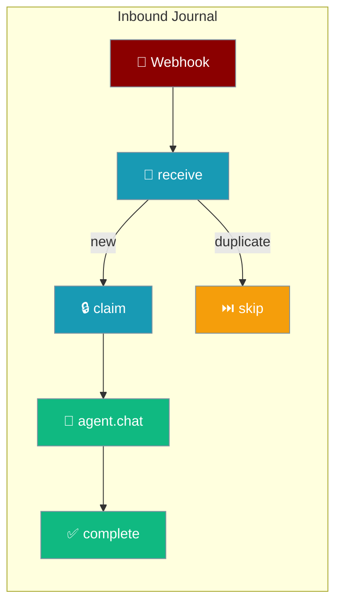
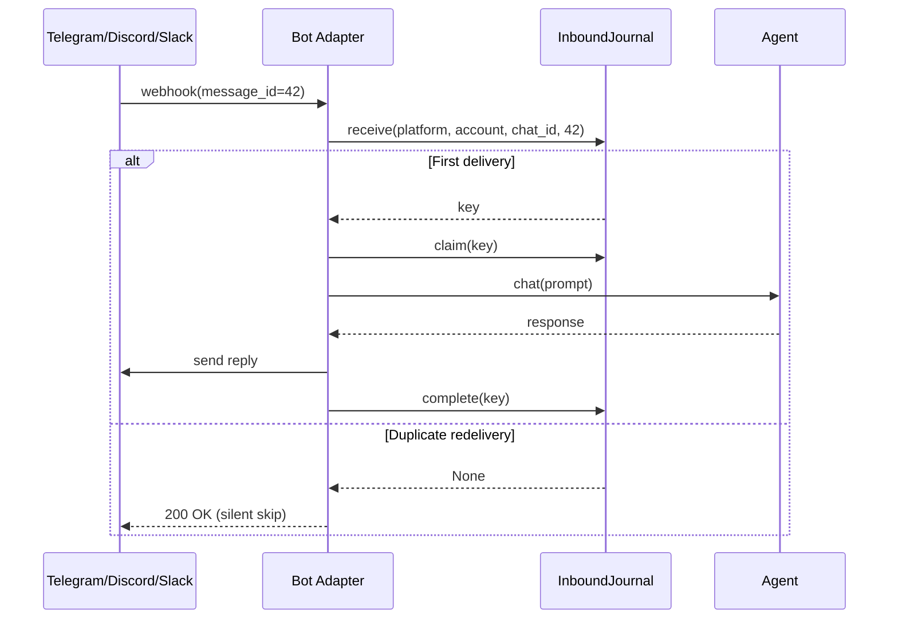
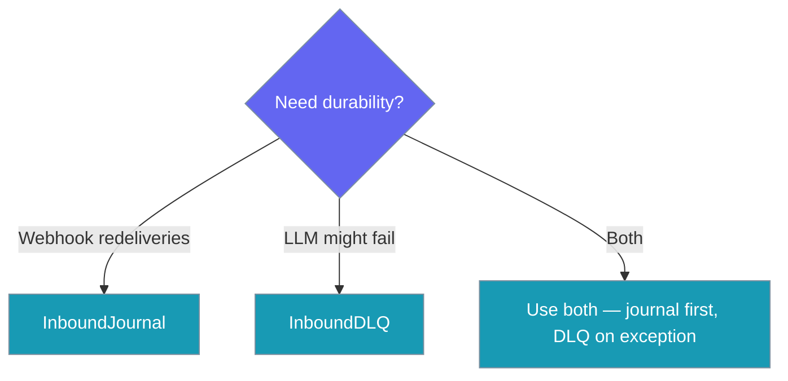

Inbound Journal tracks messages before agents process them, providing deduplication of webhook redeliveries and crash-safe replay of in-flight messages.



## Quick Start

<Steps>
<Step title="Create journal that survives restarts">
```python
from praisonaiagents import Agent
from praisonai.bots import InboundJournal, BotSessionManager

# 1. Create a journal that survives restarts
journal = InboundJournal(path="~/.praisonai/state/ingress.sqlite")
```
</Step>

<Step title="Enable on your bot">
```python
# 2. Plug it into the session manager
session = BotSessionManager(platform="telegram", ingress_journal=journal)

# 3. Use your agent normally — duplicates and crashes are now handled for you
agent = Agent(name="Support Bot", instructions="Help users with their questions")
```
</Step>
</Steps>

---

## How It Works



| Stage | Purpose | What happens |
|-------|---------|-------------|
| **receive** | Deduplication | Returns key for new messages, None for duplicates |
| **claim** | Crash protection | Marks entry as being processed |
| **complete** | Cleanup | Marks successful processing |

---

## When to use which option



| Feature | **InboundJournal** | **InboundDLQ** |
|---------|-------------------|----------------|
| **When triggered** | Every inbound message | Only on agent failure |
| **Solves** | Webhook redeliveries, crash recovery | Failed LLM calls |
| **Performance** | Fast dedup check | No overhead until failure |
| **Use together** | ✅ Journal → agent → DLQ on exception | ✅ Complete durability stack |

---

## Configuration Options

| Option | Type | Default | Description |
|--------|------|---------|-------------|
| `path` | `str \| Path` | **required** | SQLite file path. Parent dirs auto-created. `~` is expanded. |
| `max_size` | `int` | `50_000` | Max entries kept. Excess evicted: completed first, then oldest pending. |
| `ttl_seconds` | `int` | `2_592_000` (30 days) | Completed entries older than this are evicted. |
| `claim_timeout` | `int` | `300` (5 min) | Claimed entries older than this are considered stale and replayed. |

---

## Per-platform examples

<Tabs>
<Tab title="Telegram">
```python
from praisonaiagents import Agent
from praisonai.bots import InboundJournal, BotSessionManager

journal = InboundJournal(path="~/.praisonai/telegram-journal.sqlite")
session = BotSessionManager(platform="telegram", ingress_journal=journal)

agent = Agent(
    name="Telegram Bot",
    instructions="Respond helpfully to Telegram users"
)

# In your webhook handler:
response = await session.chat(
    agent=agent,
    user_id=update.effective_user.id,
    prompt=update.message.text,
    message_id=str(update.message.message_id),
    account="my_telegram_bot"
)
```
</Tab>

<Tab title="Discord">
```python
from praisonaiagents import Agent
from praisonai.bots import InboundJournal, BotSessionManager

journal = InboundJournal(path="~/.praisonai/discord-journal.sqlite")
session = BotSessionManager(platform="discord", ingress_journal=journal)

agent = Agent(
    name="Discord Bot",
    instructions="Help Discord server members"
)

# In your message handler:
response = await session.chat(
    agent=agent,
    user_id=str(message.author.id),
    prompt=message.content,
    message_id=str(message.id),
    account="my_discord_bot"
)
```
</Tab>

<Tab title="Slack">
```python
from praisonaiagents import Agent
from praisonai.bots import InboundJournal, BotSessionManager

journal = InboundJournal(path="~/.praisonai/slack-journal.sqlite")
session = BotSessionManager(platform="slack", ingress_journal=journal)

agent = Agent(
    name="Slack Bot",
    instructions="Assist Slack workspace users"
)

# In your event handler:
response = await session.chat(
    agent=agent,
    user_id=event["user"],
    prompt=event["text"],
    message_id=event["ts"],
    account="my_slack_bot"
)
```
</Tab>

<Tab title="WhatsApp">
```python
from praisonaiagents import Agent
from praisonai.bots import InboundJournal, BotSessionManager

journal = InboundJournal(path="~/.praisonai/whatsapp-journal.sqlite")
session = BotSessionManager(platform="whatsapp", ingress_journal=journal)

agent = Agent(
    name="WhatsApp Bot",
    instructions="Help WhatsApp users with their questions"
)

# In your webhook handler:
response = await session.chat(
    agent=agent,
    user_id=message["from"],
    prompt=message["text"]["body"],
    message_id=message["id"],
    account="my_whatsapp_bot"
)
```
</Tab>

<Tab title="Email">
```python
from praisonaiagents import Agent
from praisonai.bots import InboundJournal, BotSessionManager

journal = InboundJournal(path="~/.praisonai/email-journal.sqlite")
session = BotSessionManager(platform="email", ingress_journal=journal)

agent = Agent(
    name="Email Assistant",
    instructions="Respond to email inquiries professionally"
)

# In your email processor:
response = await session.chat(
    agent=agent,
    user_id=email["from"],
    prompt=email["body"],
    message_id=email["message_id"],
    account="support@company.com"
)
```
</Tab>

<Tab title="AgentMail">
```python
from praisonaiagents import Agent
from praisonai.bots import InboundJournal, BotSessionManager

journal = InboundJournal(path="~/.praisonai/agentmail-journal.sqlite")
session = BotSessionManager(platform="agentmail", ingress_journal=journal)

agent = Agent(
    name="AgentMail Bot",
    instructions="Handle AgentMail messages efficiently"
)

# In your AgentMail handler:
response = await session.chat(
    agent=agent,
    user_id=message.sender,
    prompt=message.content,
    message_id=message.id,
    account="my_agentmail_account"
)
```
</Tab>
</Tabs>

---

## Common Patterns

### Pattern 1: Dedup-only (webhook redelivery protection)

```python
# Minimal setup for webhook deduplication
journal = InboundJournal(
    path="~/.praisonai/dedup.sqlite",
    claim_timeout=60  # Fast timeout for quick processing
)

session = BotSessionManager(platform="telegram", ingress_journal=journal)
# Duplicate webhooks now return empty string and skip agent execution
```

### Pattern 2: Crash recovery + replay loop on startup

```python
# Setup with crash recovery
journal = InboundJournal(
    path="~/.praisonai/durable.sqlite",
    claim_timeout=600  # 10 minutes for complex agent tasks
)

# On startup, replay any stale claimed entries
replayed_count = journal.replay()
print(f"Replayed {replayed_count} stale entries from previous crash")

session = BotSessionManager(platform="discord", ingress_journal=journal)
```

### Pattern 3: Combining with InboundDLQ for full durability stack

```python
from praisonai.bots import InboundJournal, InboundDLQ, BotSessionManager

# Both journal and DLQ for complete durability
journal = InboundJournal(path="~/.praisonai/journal.sqlite")
dlq = InboundDLQ(path="~/.praisonai/dlq.sqlite")

session = BotSessionManager(
    platform="slack",
    ingress_journal=journal,  # Handles dedup + crash recovery
    dlq=dlq                   # Handles agent failures
)

# Flow: webhook → journal.receive() → agent.chat() → dlq on exception
```

---

## Best Practices

<AccordionGroup>
<Accordion title="Use the same path across restarts">
The journal's SQLite file must survive restarts for crash recovery to work. Use an absolute path or a location that persists across deployments.

```python
# ✅ Good: persists across restarts
journal = InboundJournal(path="/var/lib/myapp/journal.sqlite")

# ❌ Bad: temporary path, lost on restart
journal = InboundJournal(path="/tmp/journal.sqlite")
```
</Accordion>

<Accordion title="Tune claim_timeout to match your agent latency">
Set `claim_timeout` to be longer than your p99 `agent.chat()` latency to avoid false stale entry detection.

```python
# If your agent takes up to 30 seconds, use a longer timeout
journal = InboundJournal(
    path="~/.praisonai/journal.sqlite",
    claim_timeout=900  # 15 minutes safety margin
)
```
</Accordion>

<Accordion title="Call journal.replay() in your bot's startup hook">
Always replay stale entries when your bot starts to recover from crashes.

```python
def startup_hook():
    # Replay any messages that were claimed but not completed
    replayed = journal.replay()
    logger.info(f"Startup replay: {replayed} messages recovered")

# Call this before starting your bot's event loop
startup_hook()
```
</Accordion>

<Accordion title="Keep account stable per bot instance">
The `account` parameter is part of the deduplication key. Keep it consistent for each bot instance.

```python
# ✅ Good: stable account identifier
ACCOUNT = "production_telegram_bot_v1"

await session.chat(..., account=ACCOUNT)

# ❌ Bad: changing account breaks deduplication
await session.chat(..., account=f"bot_{random.randint(1,100)}")
```
</Accordion>
</AccordionGroup>

---

## Related

<CardGroup cols={2}>
<Card title="Inbound DLQ" icon="inbox" href="/docs/features/inbound-dlq">
  Failure-side durability when agent execution fails
</Card>
<Card title="Durable Outbound Delivery" icon="shield-check" href="/docs/features/durable-delivery">
  Outbound counterpart — persist outgoing messages with retry and idempotency
</Card>
<Card title="Bot Routing" icon="route" href="/docs/features/bot-routing">
  Multi-channel session routing for complex bot setups
</Card>
</CardGroup>