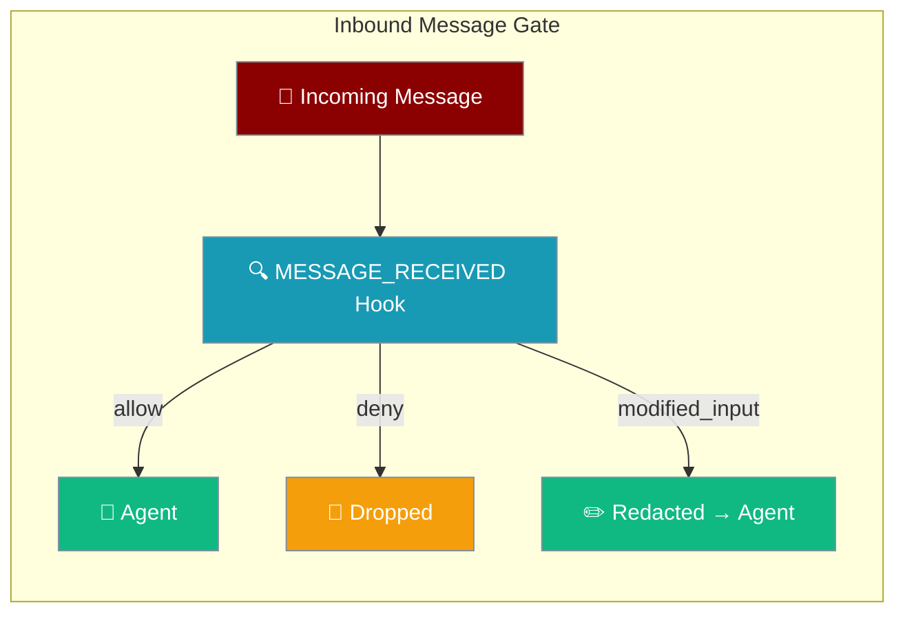
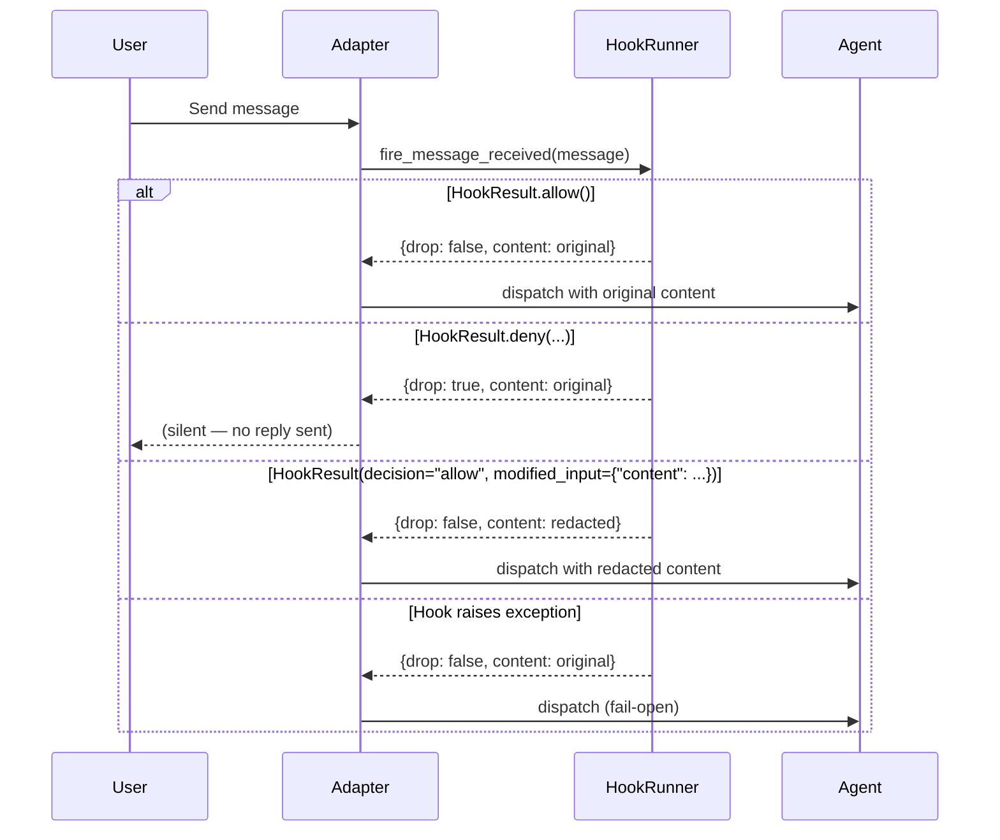

Filter, redact, or reject messages from Telegram, Slack, Discord, WhatsApp, and email before your agent sees them.

```python
from praisonaiagents import Agent
from praisonaiagents.hooks import HookRegistry, HookEvent, HookResult
from praisonai.bots import TelegramBot

registry = HookRegistry()
ALLOWED = {"12345", "67890"}

@registry.on(HookEvent.MESSAGE_RECEIVED)
def gate(event_data):
    if event_data.sender_id not in ALLOWED:
        return HookResult.deny("not on allowlist")
    return HookResult.allow()

agent = Agent(name="GatedBot", instructions="Be helpful.", hooks=registry)
bot = TelegramBot(token="...", agent=agent)

import asyncio
asyncio.run(bot.start())
```



## Quick Start

<Steps>

<Step title="Allowlist — drop messages from unknown senders">
```python
from praisonaiagents import Agent
from praisonaiagents.hooks import HookRegistry, HookEvent, HookResult

ALLOWED = {"12345", "67890"}
registry = HookRegistry()

@registry.on(HookEvent.MESSAGE_RECEIVED)
def gate(event_data):
    if event_data.sender_id not in ALLOWED:
        return HookResult.deny("not on allowlist")
    return HookResult.allow()

agent = Agent(name="GatedBot", instructions="Be helpful.", hooks=registry)
agent.start("Hello")
```
</Step>

<Step title="PII redaction — rewrite content before the LLM sees it">
```python
import re
from praisonaiagents import Agent
from praisonaiagents.hooks import HookRegistry, HookEvent, HookResult

SSN = re.compile(r"\b\d{3}-\d{2}-\d{4}\b")
registry = HookRegistry()

@registry.on(HookEvent.MESSAGE_RECEIVED)
def redact(event_data):
    cleaned = SSN.sub("[SSN]", event_data.content)
    if cleaned != event_data.content:
        return HookResult(decision="allow", modified_input={"content": cleaned})
    return HookResult.allow()

agent = Agent(name="SafeBot", instructions="Be helpful.", hooks=registry)
agent.start("My SSN is 123-45-6789")
```
</Step>

</Steps>

---

## How It Works



---

## Decision Table

| Hook returns | `drop` | `content` sent to agent | Effect |
|---|---|---|---|
| `HookResult.allow()` (or no hook) | `false` | original | Message flows unchanged |
| `HookResult.deny("...")` | `true` | — | Adapter skips dispatch — bot stays silent |
| `HookResult(decision="allow", modified_input={"content": "…"})` | `false` | redacted text | LLM sees rewritten content |
| Hook raises exception | `false` | original | Non-fatal — message passes through |

<Warning>
Hook exceptions are **non-fatal**. Raising an exception does **not** drop the message — the message passes through to the agent. Use `HookResult.deny(...)` to explicitly block.
</Warning>

---

## Supported Adapters

Every built-in messaging adapter honours the gate decision:

| Adapter | Module |
|---------|--------|
| Telegram | `praisonai.bots.telegram` |
| Slack | `praisonai.bots.slack` |
| Discord | `praisonai.bots.discord` |
| WhatsApp | `praisonai.bots.whatsapp` (regular + status paths) |
| Email | `praisonai.bots.email` |
| AgentMail | `praisonai.bots.agentmail` |

<Note>
Custom adapters must call `fire_message_received` and check the returned `drop` / `content` fields to participate in the gate.
</Note>

---

## Common Patterns

### Allowlist

```python
from praisonaiagents.hooks import HookRegistry, HookEvent, HookResult

ALLOWED = {"user_id_1", "user_id_2"}
registry = HookRegistry()

@registry.on(HookEvent.MESSAGE_RECEIVED)
def allowlist(event_data):
    if event_data.sender_id not in ALLOWED:
        return HookResult.deny("sender not allowed")
    return HookResult.allow()
```

### Rate Limiter

```python
import time
from collections import defaultdict
from praisonaiagents.hooks import HookRegistry, HookEvent, HookResult

registry = HookRegistry()
_counts: dict = defaultdict(list)
LIMIT = 5
WINDOW = 60

@registry.on(HookEvent.MESSAGE_RECEIVED)
def rate_limit(event_data):
    now = time.time()
    timestamps = [t for t in _counts[event_data.sender_id] if now - t < WINDOW]
    if len(timestamps) >= LIMIT:
        return HookResult.deny("rate limit exceeded")
    timestamps.append(now)
    _counts[event_data.sender_id] = timestamps
    return HookResult.allow()
```

### Keyword Ban

```python
from praisonaiagents.hooks import HookRegistry, HookEvent, HookResult

BANNED = {"spam", "scam"}
registry = HookRegistry()

@registry.on(HookEvent.MESSAGE_RECEIVED)
def keyword_ban(event_data):
    for word in BANNED:
        if word in event_data.content.lower():
            return HookResult.deny("banned keyword")
    return HookResult.allow()
```

### Combined Gate + Redaction

```python
import re
from praisonaiagents import Agent
from praisonaiagents.hooks import HookRegistry, HookEvent, HookResult
from praisonai.bots import TelegramBot

registry = HookRegistry()
BLOCKED = {"1234567"}
SSN = re.compile(r"\b\d{3}-\d{2}-\d{4}\b")

@registry.on(HookEvent.MESSAGE_RECEIVED)
def gate(event_data):
    if event_data.sender_id in BLOCKED:
        return HookResult.deny("blocked sender")
    scrubbed = SSN.sub("[SSN]", event_data.content)
    if scrubbed != event_data.content:
        return HookResult(decision="allow", modified_input={"content": scrubbed})
    return HookResult.allow()

agent = Agent(name="SafeBot", instructions="Be helpful.", hooks=registry)
bot = TelegramBot(token="...", agent=agent)

import asyncio
asyncio.run(bot.start())
```

**Behaviour:**
- Blocked user's messages: agent stays silent, no reply sent.
- Messages containing an SSN pattern: LLM sees `[SSN]` instead of the digits.
- All other messages: unchanged.

---

## User Interaction Flow

A Telegram user sends a message. The gate runs before the agent responds:

| Message | `sender_id` | Hook result | Agent sees | Bot reply |
|---------|-------------|-------------|------------|-----------|
| "Hello!" | `12345` (allowed) | `allow` | "Hello!" | Normal response |
| "ping" | `99999` (blocked) | `deny` | — | *(silent)* |
| "SSN: 123-45-6789" | `12345` (allowed) | `modified_input` | "SSN: [SSN]" | Answers without digits |

---

## Symmetry with Outbound

`MESSAGE_RECEIVED` (inbound) and `MESSAGE_SENDING` (outbound) share the same `deny` / `modified_input` contract. Use the same pattern for both directions:

```python
@registry.on(HookEvent.MESSAGE_SENDING)
def redact_outbound(event_data):
    cleaned = SSN.sub("[SSN]", event_data.content)
    if cleaned != event_data.content:
        return HookResult(decision="allow", modified_input={"content": cleaned})
    return HookResult.allow()
```

---

## Best Practices

<AccordionGroup>

<Accordion title="Keep the gate cheap">
The hook runs on every inbound message. Avoid blocking I/O or heavy computation — use in-memory lookups and pre-compiled regex patterns.
</Accordion>

<Accordion title="Fail-open, not fail-closed">
Raising an exception lets the message through. Explicitly call `HookResult.deny(...)` if you mean to block.
</Accordion>

<Accordion title="Mutate content only for redaction">
The LLM will see the `modified_input` content and may quote it back in replies. Only rewrite when necessary (e.g. PII scrubbing).
</Accordion>

<Accordion title="Use deny for hard blocks, not redaction">
`deny` prevents agent dispatch entirely. `modified_input` still dispatches — use it only when you want the agent to respond to the sanitised content.
</Accordion>

</AccordionGroup>

---

## Related

<CardGroup cols={2}>
  <Card title="Hook Events" icon="webhook" href="/docs/features/hook-events">
    Complete reference for all hook events and input types
  </Card>
  <Card title="Bot Lifecycle Hooks" icon="robot" href="/docs/features/bot-lifecycle-hooks">
    Gateway, session, and schedule lifecycle hooks
  </Card>
</CardGroup>
