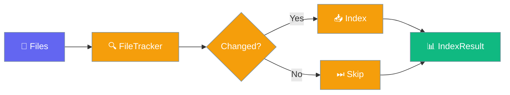
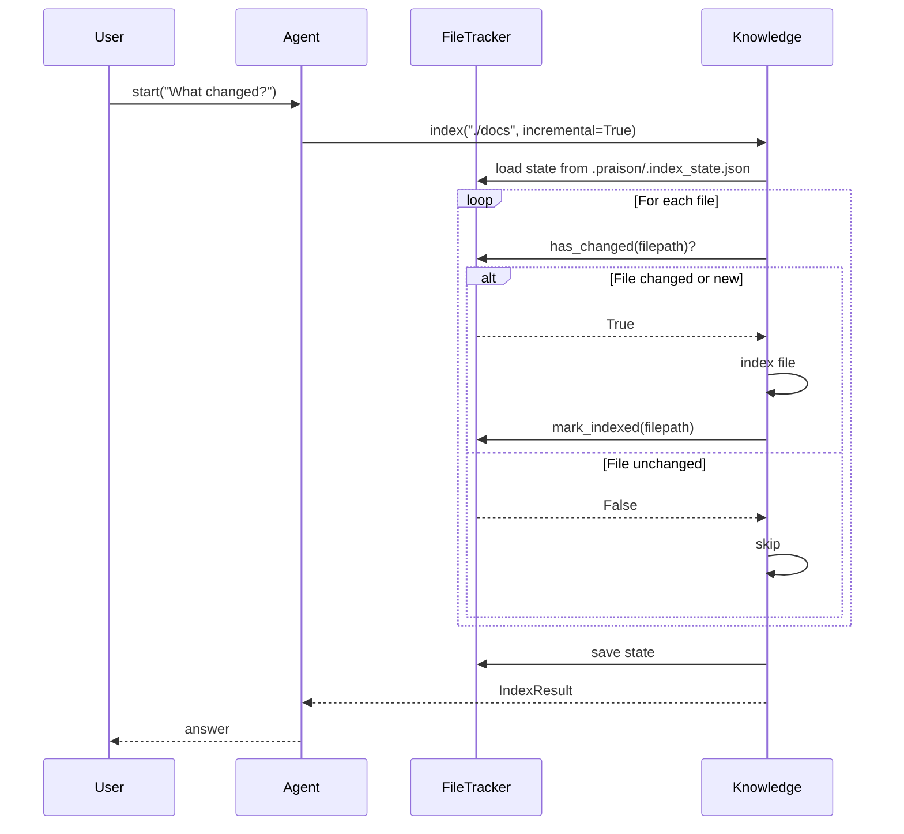

Skip unchanged files automatically — only modified content is re-indexed on each run, saving time on large document corpora.


```python
from praisonaiagents import Agent

agent = Agent(
    name="DocExpert",
    instructions="Answer questions using the knowledge base.",
    knowledge=["./docs"],
)

agent.start("What changed in the docs since last week?")
```

The user queries the knowledge base; only changed files are re-indexed on each run.



## Quick Start

<Steps>
<Step title="Agent with incremental knowledge">

```python
from praisonaiagents import Agent

agent = Agent(
    name="DocExpert",
    instructions="Answer questions using the knowledge base.",
    knowledge=["./docs"],
    memory={"user_id": "my_user"},
)

response = agent.start("What are the main topics covered?")
```

On the second run, unchanged files are skipped automatically.

</Step>

<Step title="Direct index with result stats">

```python
from praisonaiagents import Agent, Knowledge

knowledge = Knowledge()

result = knowledge.index(
    "./docs",
    memory={"user_id": "my_user"},
    incremental=True,
)

print(f"Indexed: {result.files_indexed}, Skipped: {result.files_skipped}")
print(f"Duration: {result.duration_seconds:.2f}s")
```

</Step>
</Steps>

---

## How It Works



| Component | Purpose |
|-----------|---------|
| `FileTracker` | Tracks file hash and mtime across sessions |
| `IndexResult` | Reports indexed, skipped, and error counts |
| `CorpusStats` | Corpus-level statistics and strategy recommendation |
| `.praisonignore` | Gitignore-style patterns to exclude files |

---

## Configuration Options

### `Knowledge.index()` parameters

| Parameter | Type | Default | Description |
|-----------|------|---------|-------------|
| `path` | `str` | — | Directory or file path to index |
| `incremental` | `bool` | `True` | Skip unchanged files |
| `force` | `bool` | `False` | Re-index all files regardless of changes |
| `include_glob` | `list[str]` | `None` | Glob patterns to include, e.g. `["*.md", "*.py"]` |
| `exclude_glob` | `list[str]` | `None` | Glob patterns to exclude, e.g. `["*.log", "test_*"]` |
| `user_id` | `str` | `None` | Scope index to a user |
| `agent_id` | `str` | `None` | Scope index to an agent |
| `run_id` | `str` | `None` | Scope index to a run |

### `IndexResult` fields

| Field | Type | Default | Description |
|-------|------|---------|-------------|
| `success` | `bool` | `True` | Whether indexing succeeded |
| `files_indexed` | `int` | `0` | Files newly indexed |
| `files_skipped` | `int` | `0` | Files skipped (unchanged) |
| `chunks_created` | `int` | `0` | Chunks created from indexed files |
| `errors` | `list[str]` | `[]` | Error messages for failed files |
| `duration_seconds` | `float` | `0.0` | Total indexing time |
| `corpus_stats` | `CorpusStats \| None` | `None` | Corpus statistics |

### `CorpusStats` fields

| Field | Type | Default | Description |
|-------|------|---------|-------------|
| `file_count` | `int` | `0` | Number of files in corpus |
| `chunk_count` | `int` | `0` | Number of chunks created |
| `total_tokens` | `int` | `0` | Estimated total tokens |
| `indexed_at` | `str \| None` | `None` | ISO timestamp of last index |
| `path` | `str \| None` | `None` | Path to corpus root |
| `strategy_recommendation` | `str` | computed | Retrieval strategy based on corpus size |

---

## Common Patterns

### Check and report results

```python
from praisonaiagents import Knowledge, IndexResult

knowledge = Knowledge()
result = knowledge.index("./docs", memory={"user_id": "alice"})

if result.errors:
    for err in result.errors:
        print(f"Error: {err}")

print(f"Total: {result.files_indexed + result.files_skipped} files")
print(f"New/updated: {result.files_indexed}")
print(f"Unchanged: {result.files_skipped}")
```

### Force full re-index

```python
from praisonaiagents import Knowledge

knowledge = Knowledge()

result = knowledge.index(
    "./docs",
    memory={"user_id": "alice"},
    force=True,
)
print(f"Full re-index complete: {result.files_indexed} files")
```

### Selective indexing with glob patterns

```python
from praisonaiagents import Knowledge

knowledge = Knowledge()

result = knowledge.index(
    "./project",
    memory={"user_id": "alice"},
    include_glob=["*.md", "*.txt", "*.py"],
    exclude_glob=["*.log", "test_*", "__pycache__/*"],
)
```

### Corpus statistics

```python
from praisonaiagents import Knowledge, CorpusStats

stats = CorpusStats.from_directory("./docs")
print(f"Files: {stats.file_count}")
print(f"Estimated tokens: {stats.total_tokens}")
print(f"Recommended strategy: {stats.strategy_recommendation}")
```

### Low-level file tracking

```python
from praisonaiagents import FileTracker

tracker = FileTracker(state_file=".praison/.index_state.json")
tracker.load()

if tracker.has_changed("./docs/readme.md"):
    print("File needs re-indexing")
```

---

## Best Practices

<AccordionGroup>
<Accordion title="Use .praisonignore to exclude noisy files">
Create a `.praisonignore` in your corpus directory — it follows gitignore syntax and is auto-detected:

```gitignore
*.log
*.tmp
test/
tests/
__pycache__/
.env
secrets.txt
```

`.gitignore` is also read as a fallback.
</Accordion>

<Accordion title="Scope indexes per user for multi-tenant apps">
Pass `user_id` or `agent_id` to isolate indexes per tenant. Without a scope identifier, the mem0 backend raises `ScopeRequiredError`.

```python
result = knowledge.index("./shared-docs", memory={"user_id": user_id})
```
</Accordion>

<Accordion title="Inspect strategy_recommendation for large corpora">
`CorpusStats.strategy_recommendation` returns the optimal retrieval strategy based on file count:

| Files | Strategy |
|-------|----------|
| < 10 | `direct` |
| < 100 | `basic` |
| < 1000 | `hybrid` |
| < 10000 | `reranked` |
| < 100000 | `compressed` |
| 100000+ | `hierarchical` |
</Accordion>

<Accordion title="Schedule periodic full re-indexes">
Run incremental indexes continuously, but schedule a full re-index (with `force=True`) weekly to catch any state drift or hash collisions.
</Accordion>
</AccordionGroup>

---

## Related

<CardGroup cols={2}>
  <Card title="Knowledge Backends" icon="database" href="/features/knowledge-backends">
    Choose and configure the knowledge storage backend
  </Card>
  <Card title="Knowledge" icon="book" href="/features/knowledge">
    Core knowledge retrieval and agent integration
  </Card>
</CardGroup>
