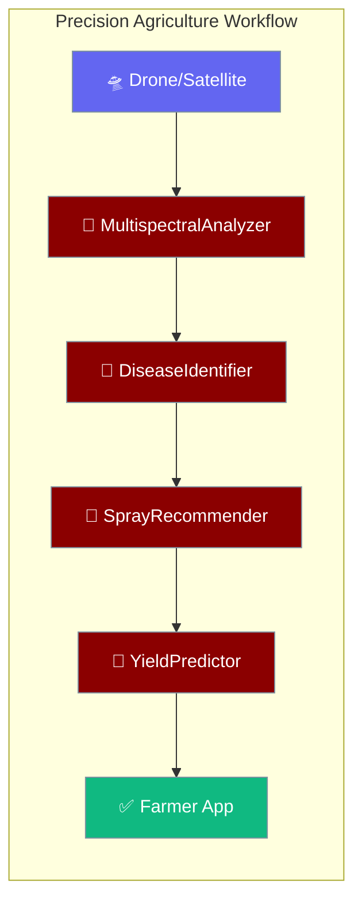
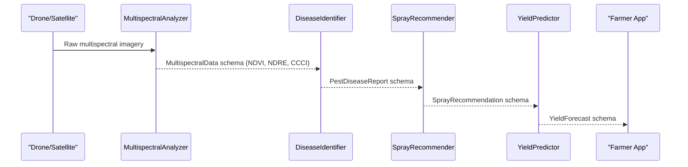

Analyse drone or satellite imagery, detect crop stress and pests before they spread, and receive actionable treatment plans — all from a single workflow call.

```python
from examples.cookbooks.Industry_Templates.agriculture_template import precision_agriculture_workflow

result = precision_agriculture_workflow("Field 12 multispectral scan — NDVI drop in north quadrant")
print(result)
```

The user uploads crop imagery; agents detect stress, pests, and irrigation recommendations per field.



## Quick Start

<Steps>
<Step title="Run the prebuilt workflow for multiple fields">

```python
from praisonaiagents import Agent, tool
from examples.cookbooks.Industry_Templates.agriculture_template import precision_agriculture_workflow

fields  = ["FIELD-001", "FIELD-002", "FIELD-003"]
weather = {"temperature": 25, "humidity": 60, "wind_speed": 8, "precipitation": 0}

result = precision_agriculture_workflow(fields, "wheat", weather)

print(result["alerts"])
print(result["yield_forecasts"])
print(f"Sustainability score: {result['sustainability_score']:.0f}/100")
```
</Step>

<Step title="Use IoT sensor network agent for real-time data">

```python
from examples.cookbooks.Industry_Templates.agriculture_template import IoTSensorPatterns

sensor_agent = IoTSensorPatterns.create_sensor_network_agent(
    sensor_types=["soil_moisture", "temperature", "humidity", "ph"]
)

status = sensor_agent.start("Collect sensor readings from all FIELD-001 nodes")
print(status)
```
</Step>
</Steps>

---

## How It Works



| Agent | Responsibility | SLA |
|-------|---------------|-----|
| `MultispectralAnalyzer` | Calculate NDVI/NDRE/CCCI vegetation indices and identify stress zones | ≤ 2 min per field |
| `DiseaseIdentifier` | AI-based pest and disease classification with severity level | ≤ 30 s |
| `SprayRecommender` | Targeted spray strategy — product, rate, GPS zones, weather window | ≤ 1 min |
| `YieldPredictor` | Harvest yield forecast with quality grade and market value estimate | ≤ 45 s |

---

## Configuration Options

Pydantic I/O schemas used by this template:

| Schema | Key Fields |
|--------|-----------|
| `MultispectralData` | `field_id`, `ndvi_index`, `ndre_index`, `ccci_index`, `moisture_level`, `temperature`, `affected_area`, `gps_coordinates` |
| `PestDiseaseReport` | `report_id`, `field_id`, `pest_type`, `disease_type`, `severity`, `affected_crops`, `spread_rate`, `confidence_score` |
| `SprayRecommendation` | `recommendation_id`, `field_id`, `treatment_type`, `product_name`, `application_rate`, `target_zones`, `optimal_time`, `cost_estimate`, `environmental_impact` |
| `YieldForecast` | `forecast_id`, `field_id`, `crop_type`, `predicted_yield`, `confidence_interval`, `harvest_window`, `quality_grade`, `market_price_estimate` |

**Severity levels** (used in `PestDiseaseReport`)

| Level | Meaning | Typical action |
|-------|---------|---------------|
| `none` | No threat detected | Routine fertiliser application |
| `low` | Early blight signs | Organic treatment (e.g. Neem Oil) |
| `moderate` | Localised infestation | Targeted fungicide/pesticide |
| `high` | Spreading infestation | Systemic treatment + monitoring |
| `severe` | Field-wide outbreak | Emergency intervention |

---

## Common Patterns

**Integrated Pest Management (IPM) strategy by severity**

```python
from examples.cookbooks.Industry_Templates.agriculture_template import SustainableFarmingPatterns

strategy = SustainableFarmingPatterns.integrated_pest_management("moderate")
print(strategy)
```

**Precision irrigation based on soil moisture**

```python
from examples.cookbooks.Industry_Templates.agriculture_template import SustainableFarmingPatterns

irrigation = SustainableFarmingPatterns.precision_irrigation(
    moisture_level=25.0,
    crop_stage="flowering"
)
print(f"Irrigate: {irrigation['irrigation_needed']}, Amount: {irrigation['amount_mm']} mm")
```

**Recommend next crop for rotation**

```python
from examples.cookbooks.Industry_Templates.agriculture_template import SustainableFarmingPatterns

next_crop = SustainableFarmingPatterns.crop_rotation_optimizer("wheat", soil_data={})
print(f"Next crop: {next_crop}")
```

---

## Best Practices

<AccordionGroup>
<Accordion title="Fly imagery in optimal lighting conditions">
`MultispectralAnalyzer` accuracy degrades significantly in overcast conditions or when shadows cover more than 20 % of a field. Schedule drone flights within 2 hours of solar noon for best NDVI readings.
</Accordion>

<Accordion title="Act on high-severity alerts within 24 hours">
`DiseaseIdentifier` reports `spread_rate` in % per day. At high severity (`spread_rate > 2 %`), a one-day delay can double the affected area. The workflow automatically generates a `SprayRecommendation` for high/severe findings.
</Accordion>

<Accordion title="Monitor the sustainability_score trend">
The workflow calculates a `sustainability_score` (0–100) based on total chemical application. Track this per season — a declining score signals overuse of pesticides, which correlates with long-term soil health degradation.
</Accordion>

<Accordion title="Validate GPS spray zones before field application">
`SprayRecommendation.target_zones` contains GPS polygon boundaries. Always cross-check these against your field boundary GIS layer to prevent off-target application near water bodies or buffer zones.
</Accordion>
</AccordionGroup>

---

## Related

<CardGroup cols={2}>
<Card title="Industry Templates Overview" icon="building-2" href="/docs/features/industry-templates/overview">
  Hub page — choose the right template and understand cross-industry reuse.
</Card>
<Card title="Transportation Template" icon="truck" href="/docs/features/industry-templates/transportation">
  LiDAR structural analysis, displacement tracking, and infrastructure safety heatmaps.
</Card>
</CardGroup>
