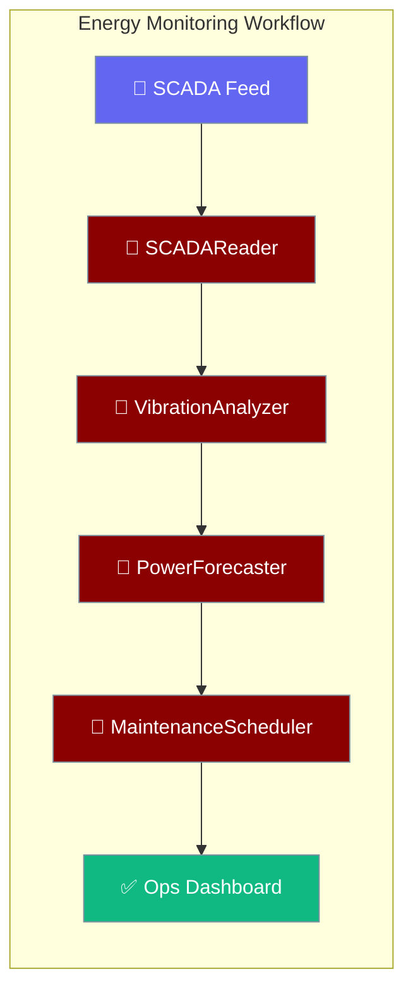
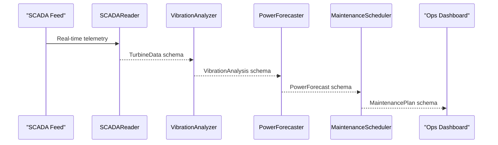

Monitor an entire wind farm, detect mechanical faults early, forecast 24-hour power output, and schedule maintenance — all in one workflow call.



## Quick Start

<Steps>
<Step title="Run the prebuilt workflow">

```python
from praisonaiagents import Agent, tool
from examples.cookbooks.Industry_Templates.energy_template import energy_monitoring_workflow

turbines = ["WT-001", "WT-002", "WT-003"]
weather  = {"wind_speed": 14.0, "direction": "NW", "temperature": 15.0}

result = energy_monitoring_workflow(turbines, weather)
print(result["alerts"])
print(result["power_forecast"])
```
</Step>

<Step title="Adapt for solar or battery storage">

```python
from examples.cookbooks.Industry_Templates.energy_template import EnergyPatternAdapter

solar_agent   = EnergyPatternAdapter.adapt_for_solar_farm()
grid_agent    = EnergyPatternAdapter.adapt_for_power_grid()
battery_agent = EnergyPatternAdapter.adapt_for_battery_storage()

status = solar_agent.start("Monitor panel efficiency for array SOLAR-A1")
print(status)
```
</Step>
</Steps>

---

## How It Works



| Agent | Responsibility | SLA |
|-------|---------------|-----|
| `SCADAReader` | Process real-time turbine telemetry | ≤ 1 s |
| `VibrationAnalyzer` | FFT analysis and early fault detection | ≤ 5 s per turbine |
| `PowerForecaster` | 24-hour generation forecast | ≤ 30 s |
| `MaintenanceScheduler` | Condition-based maintenance planning | ≤ 1 min |

---

## Configuration Options

Pydantic I/O schemas used by this template:

| Schema | Key Fields |
|--------|-----------|
| `TurbineData` | `turbine_id`, `wind_speed`, `power_output`, `rotor_speed`, `vibration_level`, `operational_status` |
| `VibrationAnalysis` | `turbine_id`, `vibration_rms`, `frequency_peaks`, `anomaly_detected`, `failure_probability`, `recommended_action` |
| `PowerForecast` | `forecast_id`, `predicted_output` (24 h list), `confidence_interval`, `weather_factors`, `grid_demand` |
| `MaintenancePlan` | `plan_id`, `turbine_id`, `maintenance_type`, `scheduled_date`, `estimated_duration`, `required_parts` |

---

## Common Patterns

**Attach a live weather API tool to PowerForecaster**

```python
from praisonaiagents import tool
from examples.cookbooks.Industry_Templates.energy_template import power_forecaster

@tool
def fetch_weather_forecast(location: str) -> dict:
    """Fetch 24-hour weather forecast from weather service"""
    return {"wind_speed": 13.5, "direction": "SW", "cloud_cover": 0.3}

power_forecaster.tools.append(fetch_weather_forecast)
forecast = power_forecaster.start("Forecast power for farm at coordinates 51.5, -0.1")
```

**Handle turbine failure with built-in fallback**

```python
from examples.cookbooks.Industry_Templates.energy_template import EnergyFallbackStrategies

strategy = EnergyFallbackStrategies.turbine_failure_fallback(
    failed_turbine_id="WT-003",
    available_turbines=["WT-001", "WT-002", "WT-004", "WT-005"]
)
print(strategy)
```

**Communicate failure to grid operator**

```python
from examples.cookbooks.Industry_Templates.energy_template import EnergyFallbackStrategies

comm_fallback = EnergyFallbackStrategies.communication_failure_fallback()
print(comm_fallback["actions"])
```

---

## Best Practices

<AccordionGroup>
<Accordion title="Set vibration anomaly thresholds per turbine model">
The default anomaly threshold is `vibration_level > 5.0 mm/s`. Older turbine models often tolerate higher baseline vibration. Override the `analyze_vibration_patterns` tool logic to use model-specific thresholds.
</Accordion>

<Accordion title="Run SCADAReader within 1 second">
Grid stability decisions depend on real-time data. Any custom SCADA integration tool must complete within the 1-second SLA — use streaming MQTT connections rather than polling REST APIs.
</Accordion>

<Accordion title="Use conservative forecasts during system failures">
`EnergyFallbackStrategies.forecast_failure_fallback()` returns the last known forecast with reduced confidence. Always request additional grid reserves when operating in fallback mode.
</Accordion>

<Accordion title="Minimise production loss during maintenance windows">
`MaintenanceScheduler` calculates `production_loss` in MW. Schedule non-critical maintenance during low-wind forecasts to reduce grid impact.
</Accordion>
</AccordionGroup>

---

## Related

<CardGroup cols={2}>
<Card title="Industry Templates Overview" icon="building-2" href="/docs/features/industry-templates/overview">
  Hub page — choose the right template and understand cross-industry reuse.
</Card>
<Card title="Healthcare Template" icon="stethoscope" href="/docs/features/industry-templates/healthcare">
  Emergency triage, HIPAA-compliant EMR retrieval, and resource allocation.
</Card>
</CardGroup>
