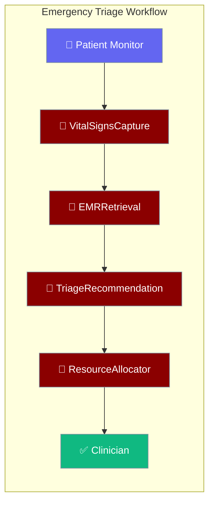
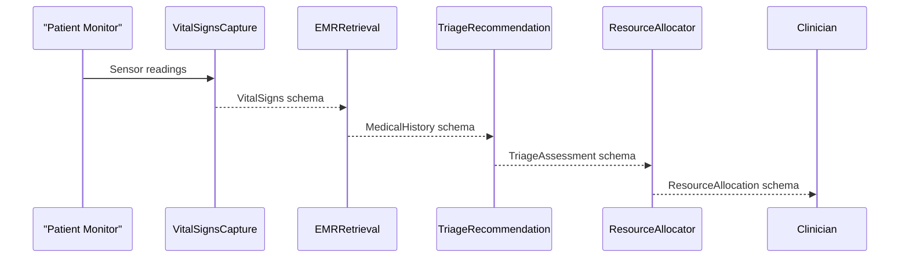

From patient arrival to bed assignment in four coordinated agents — with built-in HIPAA-compliant data handling and safety red-flag detection at every step.



## Quick Start

<Steps>
<Step title="Run the prebuilt triage workflow">

```python
from praisonaiagents import Agent, tool
from examples.cookbooks.Industry_Templates.healthcare_template import emergency_triage_workflow

result = emergency_triage_workflow(
    patient_id="PT-2024-00123",
    chief_complaint="severe chest pain radiating to left arm"
)

print(result["clinical_pathway"])
print(result["safety_checks"])
```
</Step>

<Step title="Add a specialised coordinator for labs or radiology">

```python
from examples.cookbooks.Industry_Templates.healthcare_template import (
    HealthcareCoordinationPatterns, TriageLevel
)

lab_agent = HealthcareCoordinationPatterns.coordinate_lab_orders(
    patient_id="PT-2024-00123",
    triage_level=TriageLevel.EMERGENT.value
)

lab_result = lab_agent.start("Order STAT troponin and CBC")
print(lab_result)
```
</Step>
</Steps>

---

## How It Works



| Agent | Responsibility | SLA |
|-------|---------------|-----|
| `VitalSignsCapture` | Capture vital signs from monitoring devices with HIPAA handling | ≤ 30 s |
| `EMRRetrieval` | Retrieve patient EMR with consent verification and audit trail | ≤ 5 s |
| `TriageRecommendation` | ESI-based triage assessment with red-flag detection | ≤ 1 min |
| `ResourceAllocator` | Assign bed, staff, and equipment by priority score | ≤ 30 s |

---

## Configuration Options

Pydantic I/O schemas used by this template:

| Schema | Key Fields |
|--------|-----------|
| `VitalSigns` | `patient_id`, `heart_rate`, `blood_pressure_systolic`, `blood_pressure_diastolic`, `respiratory_rate`, `temperature`, `oxygen_saturation`, `pain_scale`, `consciousness_level` |
| `MedicalHistory` | `patient_id`, `allergies`, `chronic_conditions`, `current_medications`, `recent_visits`, `insurance_status` |
| `TriageAssessment` | `assessment_id`, `patient_id`, `triage_level`, `chief_complaint`, `recommended_department`, `estimated_wait_time`, `required_resources`, `red_flags` |
| `ResourceAllocation` | `allocation_id`, `patient_id`, `assigned_bed`, `assigned_staff`, `equipment_needed`, `department`, `priority_score` |

**Triage Levels (ESI standard)**

| Level | Value | Meaning |
|-------|-------|---------|
| 1 | `1_resuscitation` | Immediate life-saving intervention |
| 2 | `2_emergent` | High risk, severe pain or distress |
| 3 | `3_urgent` | Stable but multiple resources needed |
| 4 | `4_less_urgent` | Stable, one resource needed |
| 5 | `5_non_urgent` | Stable, no resources needed |

---

## Common Patterns

**Audit every EMR access for HIPAA compliance**

```python
from examples.cookbooks.Industry_Templates.healthcare_template import HIPAACompliancePatterns

audit = HIPAACompliancePatterns.audit_log_access(
    user_id="DR-001",
    patient_id="PT-2024-00123",
    action="EMR_ACCESS",
    reason="emergency_triage"
)
print(audit)
```

**Anonymise data before sending to analytics**

```python
from examples.cookbooks.Industry_Templates.healthcare_template import HIPAACompliancePatterns

raw_triage = {
    "patient_id": "PT-123",
    "triage_level": "2_emergent",
    "department": "emergency",
    "wait_time": 10
}
safe_data = HIPAACompliancePatterns.anonymize_patient_data(raw_triage)
print(safe_data)
```

**Coordinate radiology for an urgent patient**

```python
from examples.cookbooks.Industry_Templates.healthcare_template import HealthcareCoordinationPatterns

radiology = HealthcareCoordinationPatterns.coordinate_radiology(
    patient_id="PT-2024-00123",
    imaging_type="chest_xray"
)
schedule = radiology.start("Book urgent chest X-ray, check for contrast allergy")
print(schedule)
```

---

## Best Practices

<AccordionGroup>
<Accordion title="Verify patient consent before EMR access">
`EMRRetrieval` accepts `consent_verified=True`. In production, gate this on an explicit consent check from your registration system — never assume consent for new patients.
</Accordion>

<Accordion title="Treat fallback triage as ESI-3 (Urgent)">
If `TriageRecommendation` fails, the built-in fallback defaults to `3_urgent`. This is a conservative choice — always escalate to a human nurse when the AI pipeline cannot complete.
</Accordion>

<Accordion title="Alert on clinical red flags immediately">
`TriageAssessment.red_flags` is populated when vital signs suggest life-threatening conditions (e.g. `low_oxygen`, `altered_consciousness`). Wire these to your nurse-call or PA system with zero delay.
</Accordion>

<Accordion title="Log all resource allocations for audit">
`ResourceAllocator` returns `allocation_id` and `assigned_staff`. Persist every allocation to your incident tracking system to satisfy accreditation and shift-handover requirements.
</Accordion>
</AccordionGroup>

---

## Related

<CardGroup cols={2}>
<Card title="Industry Templates Overview" icon="building-2" href="/docs/features/industry-templates/overview">
  Hub page — choose the right template and understand cross-industry reuse.
</Card>
<Card title="Agriculture Template" icon="wheat" href="/docs/features/industry-templates/agriculture">
  Multispectral crop analysis, disease detection, and yield forecasting.
</Card>
</CardGroup>
