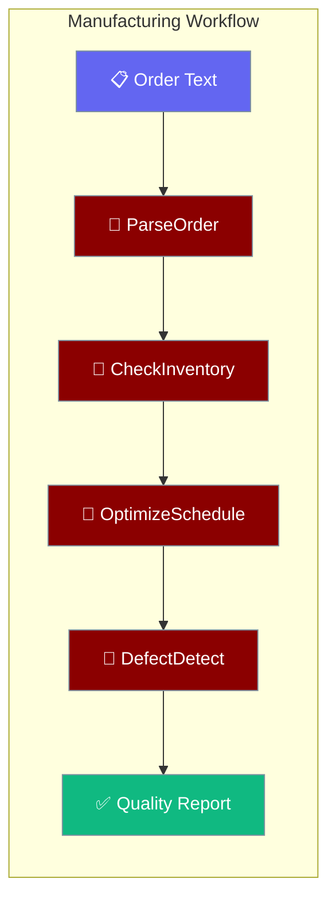
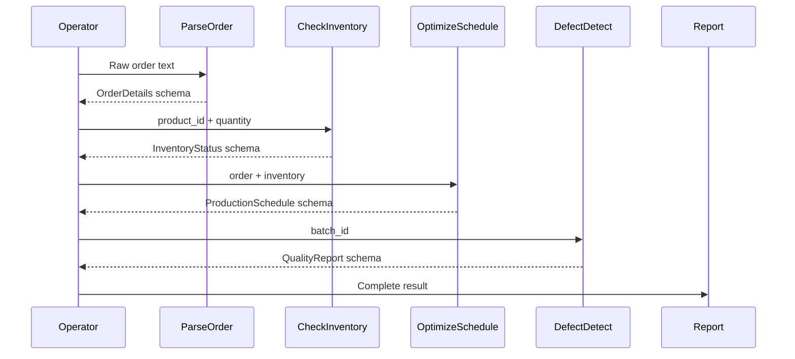

Turn an unstructured order (email, PDF, API payload) into a quality-checked production schedule with a single function call.



## Quick Start

<Steps>
<Step title="Run the prebuilt workflow">

```python
from praisonaiagents import Agent, tool
from examples.cookbooks.Industry_Templates.manufacturing_template import manufacturing_workflow

result = manufacturing_workflow(
    "Customer ABC needs 100 units of Product-XYZ by March 15th, high priority"
)
print(result)
```

`result` is a dict with keys `order`, `inventory`, `schedule`, and `quality`.
</Step>

<Step title="Build a custom agent with IndustryAgentPattern">

```python
from examples.cookbooks.Industry_Templates.manufacturing_template import IndustryAgentPattern

custom_parser = IndustryAgentPattern.create_data_parser(
    name="XMLOrderParser",
    domain="XML purchase orders",
    sla_seconds=15
)

order_data = custom_parser.start("Parse <order><id>999</id><qty>50</qty></order>")
print(order_data)
```
</Step>
</Steps>

---

## How It Works



| Agent | Responsibility | SLA |
|-------|---------------|-----|
| `ParseOrder` | Extract structured order info from any format | ≤ 30 s |
| `CheckInventory` | Validate material availability and reorder levels | ≤ 5 s |
| `OptimizeSchedule` | Generate optimal production schedule | ≤ 2 min |
| `DefectDetect` | Automated quality inspection per batch | ≤ 1 min |

---

## Configuration Options

Pydantic I/O schemas used by this template:

| Schema | Fields |
|--------|--------|
| `OrderDetails` | `order_id`, `customer_id`, `product_id`, `quantity`, `priority`, `due_date`, `requirements` |
| `InventoryStatus` | `material_id`, `available_quantity`, `reorder_level`, `supplier_lead_time`, `location` |
| `ProductionSchedule` | `schedule_id`, `production_line`, `start_time`, `end_time`, `assigned_workers`, `estimated_completion`, `bottleneck_analysis` |
| `QualityReport` | `batch_id`, `inspection_time`, `defect_rate`, `defect_types`, `passed`, `recommendations` |

---

## Common Patterns

**Plug a custom ERP tool into ParseOrder**

```python
from praisonaiagents import tool
from examples.cookbooks.Industry_Templates.manufacturing_template import order_parser

@tool
def erp_order_lookup(order_ref: str) -> dict:
    """Fetch order details from ERP system"""
    return {"erp_confirmed": True, "order_ref": order_ref, "priority": "high"}

order_parser.tools.append(erp_order_lookup)
result = order_parser.start("Look up order ORD-2024-555 in ERP")
print(result)
```

**Swap the fallback strategy for inventory**

```python
from examples.cookbooks.Industry_Templates.manufacturing_template import (
    manufacturing_workflow, inventory_checker
)

def conservative_inventory(order_text: str) -> dict:
    try:
        return manufacturing_workflow(order_text)
    except Exception:
        return {
            "status": "manual_review_required",
            "reason": "inventory_system_unavailable"
        }

result = conservative_inventory("Rush order: 200 units PART-999")
```

**Scale with IndustryAgentPattern**

```python
from examples.cookbooks.Industry_Templates.manufacturing_template import IndustryAgentPattern

optimizer = IndustryAgentPattern.create_optimizer(
    name="ShiftOptimizer",
    optimization_target="shift scheduling across 3 production lines",
    sla_minutes=5
)
schedule = optimizer.start("Optimize night shift for lines A, B, C with 80% capacity")
```

---

## Best Practices

<AccordionGroup>
<Accordion title="Always validate priority before scheduling">
The `OptimizeSchedule` agent sorts by priority (`urgent > high > normal`). Ensure `ParseOrder` correctly extracts the priority field — incorrect priorities cascade into suboptimal schedules.
</Accordion>

<Accordion title="Keep SLA budgets per agent">
`CheckInventory` must respond within 5 seconds to avoid blocking production scheduling. Any custom inventory tool you attach should query a cache or pre-indexed store rather than a slow ERP endpoint.
</Accordion>

<Accordion title="Use fallback_strategies for supply chain disruptions">
When `CheckInventory` cannot find stock, the built-in fallback returns an alternative-supplier flag. Extend this by attaching a `@tool` that queries a supplier API before escalating to manual review.
</Accordion>

<Accordion title="Run quality inspection on every batch, not just failures">
`DefectDetect` returns a `defect_rate` even when `passed=True`. Log these rates over time to catch drift in machine calibration before it causes real rejections.
</Accordion>
</AccordionGroup>

---

## Related

<CardGroup cols={2}>
<Card title="Industry Templates Overview" icon="building-2" href="/docs/features/industry-templates/overview">
  Hub page — choose the right template and understand cross-industry reuse.
</Card>
<Card title="Energy Template" icon="bolt" href="/docs/features/industry-templates/energy">
  Wind-farm monitoring, vibration fault detection, and predictive maintenance.
</Card>
</CardGroup>
