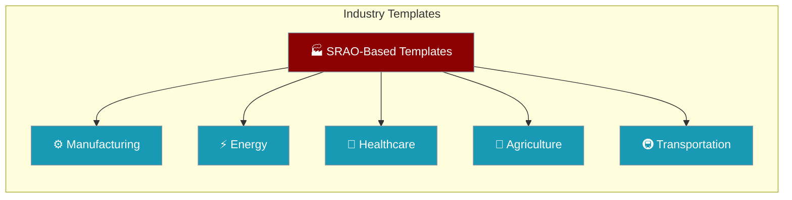
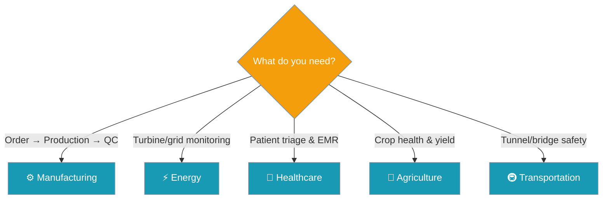
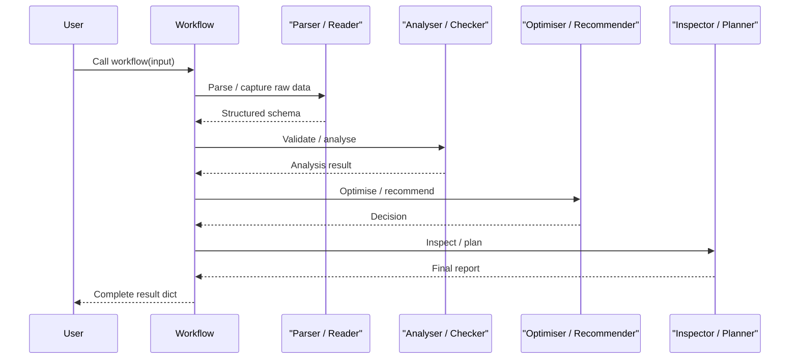

Five production-ready agent pipelines built on the SRAO Framework, each targeting a specific industry with typed I/O schemas, SLA targets, and graceful fallback strategies.

Five production-ready agent pipelines built on the SRAO Framework, each targeting a specific industry with typed I/O schemas, SLA targets, and graceful fallback strategies.

```python
from praisonaiagents import Agent
from examples.cookbooks.Industry_Templates.manufacturing_template import manufacturing_workflow

agent = Agent(name="ops-lead", instructions="Route industry template workflows.")
result = manufacturing_workflow(
    "Customer ABC needs 100 units of Product-XYZ by March 15th, high priority"
)
print(result)
```

The user picks an industry template; agents parse the request and return a structured operations report.



## Quick Start

<Steps>
<Step title="Pick an industry and run">

Each template ships a single workflow function you can call immediately:

```python
from praisonaiagents import Agent, tool

# Manufacturing: order → inventory → schedule → quality
from examples.cookbooks.Industry_Templates.manufacturing_template import manufacturing_workflow

result = manufacturing_workflow("Customer ABC needs 100 units of Product-XYZ by March 15th, high priority")
print(result)
```
</Step>

<Step title="Customise with IndustryAgentPattern">

Every template exposes `IndustryAgentPattern` — a base class you can mix into any domain:

```python
from examples.cookbooks.Industry_Templates.manufacturing_template import IndustryAgentPattern

# Build a domain-specific parser in one line
parser = IndustryAgentPattern.create_data_parser(
    name="CustomParser",
    domain="pharmaceutical batch records",
    sla_seconds=20
)

result = parser.start("Parse batch record BR-2024-001")
print(result)
```
</Step>
</Steps>

---

## Which Template Should I Use?



---

## Templates at a Glance

| Industry | Key Agents | Highlights |
|----------|-----------|------------|
| **Manufacturing** | `ParseOrder`, `CheckInventory`, `OptimizeSchedule`, `DefectDetect` | Multi-format order processing, real-time inventory, production optimisation, quality inspection |
| **Energy** | `SCADAReader`, `VibrationAnalyzer`, `PowerForecaster`, `MaintenanceScheduler` | Wind-farm monitoring, vibration-based fault detection, power forecasting, predictive maintenance |
| **Healthcare** | `VitalSignsCapture`, `EMRRetrieval`, `TriageRecommendation`, `ResourceAllocator` | Emergency triage workflow, HIPAA-compliant data handling, ESI-based triage, resource allocation |
| **Agriculture** | `MultispectralAnalyzer`, `DiseaseIdentifier`, `SprayRecommender`, `YieldPredictor` | Drone/satellite multispectral analysis, pest/disease detection, targeted spraying, yield forecasting |
| **Transportation** | `LiDARFusion`, `DisplacementCalculator`, `HeatmapGenerator`, `MaintenancePlanner` | Tunnel/bridge LiDAR analysis, displacement tracking, safety heatmaps, predictive maintenance |

---

## How It Works

All five templates share the same SRAO architecture — only the domain logic differs.



Every step includes a fallback strategy — if an agent fails, the workflow degrades gracefully rather than crashing.

---

## Cross-Industry Reuse with `IndustryAgentPattern`

`IndustryAgentPattern` provides four factory methods that power ~70 % of every template:

```python
from examples.cookbooks.Industry_Templates.manufacturing_template import IndustryAgentPattern

# Generic parser — works for any domain
parser    = IndustryAgentPattern.create_data_parser("MyParser", "logistics data", sla_seconds=15)

# Generic availability checker
checker   = IndustryAgentPattern.create_resource_checker("BedChecker", "hospital bed", sla_seconds=3)

# Generic optimiser
optimizer = IndustryAgentPattern.create_optimizer("IrrigationOpt", "water usage", sla_minutes=5)

# Generic inspector
inspector = IndustryAgentPattern.create_inspector("TunnelInspect", "structural integrity", sla_minutes=2)
```

| Method | Purpose | SLA param |
|--------|---------|-----------|
| `create_data_parser(name, domain, sla_seconds)` | Extract/structure raw inputs | `sla_seconds=30` |
| `create_resource_checker(name, resource_type, sla_seconds)` | Verify availability | `sla_seconds=5` |
| `create_optimizer(name, optimization_target, sla_minutes)` | Find optimal solution | `sla_minutes=2` |
| `create_inspector(name, inspection_type, sla_minutes)` | Analyse quality/safety | `sla_minutes=1` |

---

## Pydantic I/O Schemas

Every template uses Pydantic models to enforce typed data between agents:

| Industry | Input Schema | Output Schema |
|----------|-------------|---------------|
| Manufacturing | `OrderDetails` | `QualityReport` |
| Energy | `TurbineData` | `MaintenancePlan` |
| Healthcare | `VitalSigns` | `ResourceAllocation` |
| Agriculture | `MultispectralData` | `YieldForecast` |
| Transportation | `LiDARScan` | `MaintenanceSchedule` |

---

## Common Patterns

**Add a custom tool to any agent**

```python
from praisonaiagents import Agent, tool

@tool
def my_erp_lookup(order_id: str) -> dict:
    """Look up order in ERP system"""
    return {"erp_status": "confirmed", "order_id": order_id}

from examples.cookbooks.Industry_Templates.manufacturing_template import order_parser

order_parser.tools.append(my_erp_lookup)
result = order_parser.start("Parse order ORD-999")
```

**Override the fallback strategy**

```python
def custom_fallback(error: Exception) -> dict:
    return {"status": "queued_for_review", "error": str(error)}

try:
    result = manufacturing_workflow("urgent order text")
except Exception as e:
    result = custom_fallback(e)
```

---

## Best Practices

<AccordionGroup>
<Accordion title="Start with the prebuilt workflow function">
Call `manufacturing_workflow()`, `energy_monitoring_workflow()`, etc. before customising. These functions already wire up all agents and fallbacks in the correct order.
</Accordion>

<Accordion title="Use Pydantic schemas for typed hand-offs">
Pass structured Pydantic objects (e.g. `OrderDetails`, `VitalSigns`) between agents instead of raw strings. This catches type errors early and makes pipelines easier to test.
</Accordion>

<Accordion title="Respect SLA targets per agent">
Each agent declares its SLA in its instructions. Keep custom tools within those bounds — e.g. inventory checks must complete in ≤ 5 seconds to not block downstream agents.
</Accordion>

<Accordion title="Attribution: SRAO Framework">
These templates are based on the [SRAO Framework (MIT)](https://github.com/beixuan577/SRAO-Framework). The `IndustryAgentPattern` class provides the shared 70 % reuse layer.
</Accordion>
</AccordionGroup>

---

## Related

<CardGroup cols={2}>
<Card title="Manufacturing Template" icon="factory" href="/docs/features/industry-templates/manufacturing">
  Order processing, inventory, scheduling, and quality control agents.
</Card>
<Card title="Energy Template" icon="bolt" href="/docs/features/industry-templates/energy">
  Wind-farm monitoring, vibration analysis, and predictive maintenance agents.
</Card>
<Card title="Healthcare Template" icon="stethoscope" href="/docs/features/industry-templates/healthcare">
  Emergency triage, EMR retrieval, and resource allocation agents.
</Card>
<Card title="Agriculture Template" icon="wheat" href="/docs/features/industry-templates/agriculture">
  Multispectral analysis, disease detection, and yield prediction agents.
</Card>
</CardGroup>
