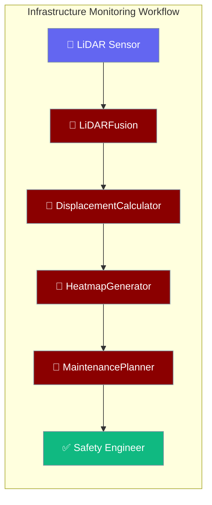
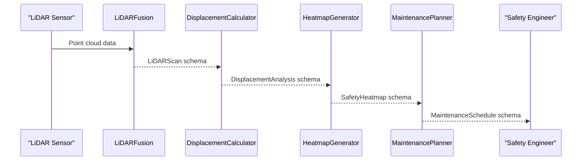

Process LiDAR scans of tunnels and bridges, calculate structural displacement in millimetres, generate safety heatmaps, and schedule maintenance — all in one workflow call.



## Quick Start

<Steps>
<Step title="Run the prebuilt monitoring workflow">

```python
from praisonaiagents import Agent, tool
from examples.cookbooks.Industry_Templates.transportation_template import (
    infrastructure_monitoring_workflow,
    InfrastructureType
)

tunnels = ["TUN-001", "TUN-002", "TUN-003"]
traffic = {"peak_volume": 3000, "off_peak_volume": 800, "peak_hours": [7, 9, 17, 19]}

result = infrastructure_monitoring_workflow(tunnels, InfrastructureType.TUNNEL, traffic)

print(result["safety_assessments"])
print(result["emergency_alerts"])
print(f"Network health score: {result['network_health_score']:.1f}/100")
```
</Step>

<Step title="Adapt for bridges, railways, or airports">

```python
from examples.cookbooks.Industry_Templates.transportation_template import MultiModalTransportPatterns

bridge_monitor  = MultiModalTransportPatterns.adapt_for_bridge_monitoring()
railway_monitor = MultiModalTransportPatterns.adapt_for_railway_tracks()
runway_monitor  = MultiModalTransportPatterns.adapt_for_airport_runways()

result = bridge_monitor.start("Check deck deflection and cable tension for BRG-007")
print(result)
```
</Step>
</Steps>

---

## How It Works



| Agent | Responsibility | SLA |
|-------|---------------|-----|
| `LiDARFusion` | Process 5M-point scans from mobile and terrestrial LiDAR | ≤ 5 min |
| `DisplacementCalculator` | Compare current vs. baseline scan; calculate mm-level settlement | ≤ 2 min |
| `HeatmapGenerator` | Generate 2D safety grid highlighting critical zones | ≤ 1 min |
| `MaintenancePlanner` | Plan preventive, corrective, or emergency maintenance | ≤ 3 min |

---

## Configuration Options

Pydantic I/O schemas used by this template:

| Schema | Key Fields |
|--------|-----------|
| `LiDARScan` | `scan_id`, `infrastructure_id`, `point_cloud_size`, `scan_resolution`, `coverage_area`, `anomaly_points`, `reference_baseline` |
| `DisplacementAnalysis` | `analysis_id`, `infrastructure_id`, `max_displacement`, `displacement_vector`, `critical_zones`, `settlement_rate`, `tilt_angle`, `safety_factor` |
| `SafetyHeatmap` | `heatmap_id`, `infrastructure_id`, `grid_resolution`, `safety_scores`, `critical_areas`, `overall_safety`, `risk_trends` |
| `MaintenanceSchedule` | `schedule_id`, `infrastructure_id`, `maintenance_type`, `priority_level`, `scheduled_date`, `estimated_duration`, `traffic_impact`, `cost_estimate` |

**Safety levels** (used in `SafetyHeatmap.overall_safety`)

| Level | `safety_factor` range | Action |
|-------|----------------------|--------|
| `safe` | ≥ 0.9 | Routine monitoring |
| `caution` | 0.8 – 0.9 | Preventive maintenance within 30 days |
| `warning` | 0.7 – 0.8 | Corrective maintenance within 7 days |
| `danger` | 0.3 – 0.7 | Emergency maintenance within 24 h |
| `critical` | < 0.3 | Immediate closure |

---

## Common Patterns

**Predict structural failure probability from displacement history**

```python
from examples.cookbooks.Industry_Templates.transportation_template import PredictiveMaintenancePatterns

displacement_history = [2.0, 2.3, 2.8, 3.5, 4.3]  # mm over past 5 months
environment = {"temp_variation": 30, "humidity": 75}

prob = PredictiveMaintenancePatterns.predict_failure_probability(
    displacement_history, environment
)
print(f"Failure probability: {prob:.2%}")
```

**Optimise maintenance budget across a network**

```python
from examples.cookbooks.Industry_Templates.transportation_template import PredictiveMaintenancePatterns

conditions = [
    {"id": "TUN-001", "safety_factor": 0.65, "cost": 80000, "recommended_date": "2024-04-01"},
    {"id": "TUN-002", "safety_factor": 0.92, "cost": 30000, "recommended_date": "2024-06-01"},
]

schedule = PredictiveMaintenancePatterns.optimize_maintenance_schedule(
    infrastructure_conditions=conditions,
    budget_constraint=100000.0
)
print(schedule)
```

**Plan traffic flow during maintenance**

```python
from examples.cookbooks.Industry_Templates.transportation_template import TrafficManagementPatterns

traffic_plan = TrafficManagementPatterns.optimize_traffic_flow(
    maintenance_window={"start_time": "22:00", "duration": 8},
    traffic_patterns={"peak_hours": [7, 9, 17, 19]}
)
print(traffic_plan["diversion_routes"])
```

---

## Best Practices

<AccordionGroup>
<Accordion title="Establish a baseline scan before going live">
`DisplacementCalculator` computes change relative to a `reference_baseline`. Capture this baseline during construction or last major rehabilitation, and store it in a versioned database alongside each new scan.
</Accordion>

<Accordion title="Close to traffic when overall_safety reaches 'danger'">
The workflow automatically raises an `emergency_alert` with `immediate_action: close_to_traffic` for danger/critical safety levels. Wire this alert to your traffic management system to trigger lane closures without human delay.
</Accordion>

<Accordion title="Schedule LiDAR scans during low-traffic windows">
Scan accuracy degrades when vehicles pass through the scan envelope. Use `TrafficManagementPatterns.optimize_traffic_flow()` to identify overnight windows with minimal traffic before dispatching the LiDAR crew.
</Accordion>

<Accordion title="Use network_health_score for KPI reporting">
The `network_health_score` (0–100) aggregates safety factors across all monitored structures. Report this monthly to asset managers — a score below 70 should trigger a portfolio-level maintenance budget review.
</Accordion>
</AccordionGroup>

---

## Related

<CardGroup cols={2}>
<Card title="Industry Templates Overview" icon="building-2" href="/docs/features/industry-templates/overview">
  Hub page — choose the right template and understand cross-industry reuse.
</Card>
<Card title="Manufacturing Template" icon="factory" href="/docs/features/industry-templates/manufacturing">
  Order processing, inventory management, and quality inspection agents.
</Card>
</CardGroup>
