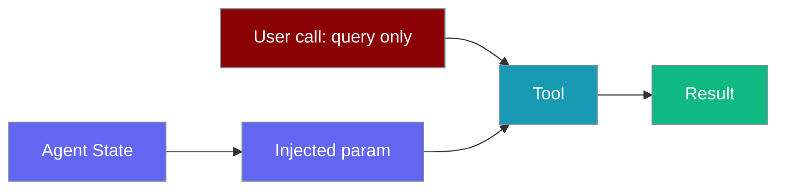
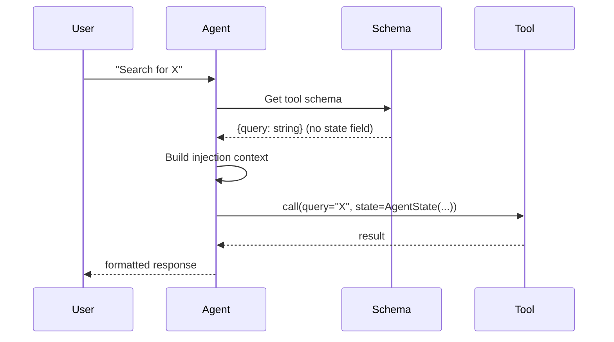

Injected state lets tools receive hidden context — session ID, agent ID, previous results — without users or the LLM ever seeing those parameters in the tool schema.



The LLM sees only `query` in the schema. The agent automatically fills `state` before calling the tool.

## Quick Start

<Steps>
<Step title="Simplest form — bare Injected">

```python
from praisonaiagents import Agent, tool
from praisonaiagents.tools import Injected

@tool
def quick_context(query: str, state: Injected) -> str:
    """Search with session context — bare Injected defaults to dict."""
    session = state.get("session_id", "unknown")
    return f"Results for '{query}' (session: {session})"

agent = Agent(name="SearchBot", tools=[quick_context])
agent.start("Find Python tutorials")
```

Bare `Injected` behaves like `Injected[dict]` — excluded from the tool schema and resolved to `state.to_dict()`.

</Step>

<Step title="Create a tool with injected state">

```python
from praisonaiagents import Agent, tool
from praisonaiagents.tools import Injected

@tool
def personalized_search(query: str, state: Injected[dict]) -> str:
    """Search with user context."""
    session = state.get("session_id", "unknown")
    return f"Results for '{query}' (session: {session})"

agent = Agent(
    name="SearchBot",
    instructions="Search for information.",
    tools=[personalized_search]
)

result = agent.start("Find Python tutorials")
```

The `state` parameter never appears in tool descriptions shown to the LLM — only `query` does.

</Step>

<Step title="Use AgentState for typed access">

```python
from praisonaiagents import Agent, tool
from praisonaiagents.tools import Injected
from praisonaiagents.tools.injected import AgentState

@tool
def context_aware_tool(query: str, state: Injected[AgentState]) -> str:
    """Access typed agent state fields."""
    return (
        f"Query: {query}\n"
        f"Agent: {state.agent_id}\n"
        f"Session: {state.session_id}\n"
        f"Previous results: {len(state.previous_tool_results)}"
    )

agent = Agent(
    name="ContextBot",
    instructions="Help with context-aware tasks.",
    tools=[context_aware_tool]
)

result = agent.start("What's the current context?")
```

</Step>
</Steps>

---

## How It Works



When a tool parameter is annotated with `Injected`, `Injected[T]`, or bare `Injected`, the SDK:
1. Strips that parameter from the schema sent to the LLM
2. Captures the current `AgentState` at call time
3. Injects the state value automatically before the tool runs

| Annotation | Injected value |
|------------|---------------|
| `Injected` | `state.to_dict()` — same as `Injected[dict]` |
| `Injected[dict]` | `state.to_dict()` — plain Python dict |
| `Injected[AgentState]` | Full `AgentState` dataclass with all fields |

---

## Configuration Options

**`AgentState` fields available at runtime:**

| Field | Type | Description |
|-------|------|-------------|
| `agent_id` | `str` | Name/ID of the running agent |
| `run_id` | `str` | Unique ID for this run |
| `session_id` | `str` | Conversation session identifier |
| `last_user_message` | `str \| None` | Most recent message from the user |
| `last_agent_message` | `str \| None` | Most recent message from the agent |
| `memory` | `Any` | Agent memory object if configured |
| `previous_tool_results` | `list` | Results from earlier tool calls in this run |
| `metadata` | `dict` | Extra key-value context |

<Card title="Injected Tools TypeScript Reference" icon="code" href="/docs/sdk/reference/typescript/classes/LLM">
  TypeScript injected state configuration
</Card>
<Card title="Tools Rust Reference" icon="code" href="/docs/sdk/reference/rust/classes/Tool">
  Rust tool configuration
</Card>

---

## Common Patterns

**Multi-turn memory access in a tool:**

```python
from praisonaiagents import Agent, tool
from praisonaiagents.tools import Injected
from praisonaiagents.tools.injected import AgentState

@tool
def summarize_session(topic: str, state: Injected[AgentState]) -> str:
    """Summarize what we discussed about a topic this session."""
    history = state.previous_tool_results
    return f"Session {state.session_id} — {len(history)} tool calls so far on '{topic}'"
```

**Testing with a manual injection context:**

```python
from praisonaiagents.tools.injected import AgentState, with_injection_context

state = AgentState(agent_id="test-agent", run_id="run-001", session_id="sess-42")

with with_injection_context(state):
    result = personalized_search(query="Python")
    print(result)
```

**Validating the tool schema has no injected params:**

```python
import inspect
from praisonaiagents.tools import Injected

sig = inspect.signature(personalized_search)
public_params = [
    name for name, param in sig.parameters.items()
    if not (hasattr(param.annotation, "__origin__") and param.annotation.__origin__ is Injected)
]
print(public_params)
```

---

## Best Practices

<AccordionGroup>
<Accordion title="Prefer bare Injected or Injected[dict] for simple access">
  Bare `Injected` and `Injected[dict]` both return `state.to_dict()`. Use `Injected[AgentState]` when you need `memory`, `learn_manager`, or `previous_tool_results` objects directly.
</Accordion>

<Accordion title="Never add injected params to tool docstrings">
  The LLM builds its understanding from the docstring. Documenting injected parameters confuses the model — describe only the user-facing parameters.
</Accordion>

<Accordion title="Use with_injection_context in tests">
  Direct unit tests cannot rely on an agent to set up injection context. Wrap calls with `with_injection_context(state)` to test tools in isolation without spinning up a full agent.
</Accordion>

<Accordion title="Keep injected parameters optional-safe">
  `get_current_state()` returns `None` when called outside an agent context. `resolve_injected_value` falls back to an empty dict. Design tools to handle empty state gracefully.
</Accordion>
</AccordionGroup>

---

## Related

<CardGroup cols={2}>
<Card title="Tools" icon="wrench" href="/docs/features/toolsets">
  Creating and registering tools with agents
</Card>
<Card title="Middleware" icon="webhook" href="/docs/features/middleware">
  Intercept tool calls before and after execution
</Card>
</CardGroup>
