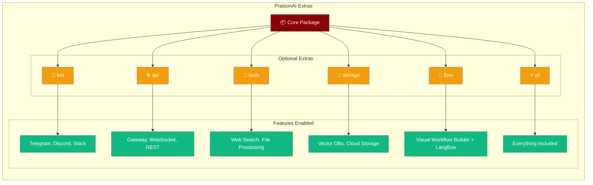
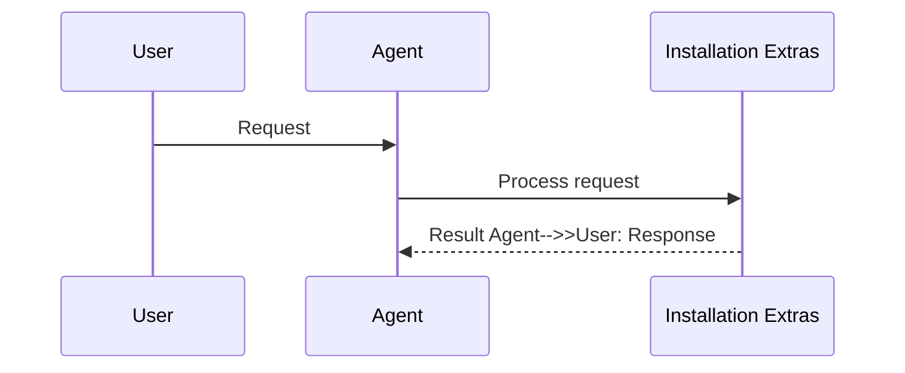

PraisonAI provides optional dependency groups (extras) for specific features like bot integrations, gateway servers, and storage backends.

<Note>
**Package split.** Framework integrations (CrewAI, AutoGen, AG2) are now distributed through a separate package:

```bash
# Native runtime (recommended)
pip install praisonaiagents

# Framework integrations (CrewAI, AutoGen, AG2)
pip install praisonai-frameworks[crewai]
pip install praisonai-frameworks[autogen]
pip install praisonai-frameworks[ag2]

# Legacy (deprecated) — still works but will be removed
# pip install 'praisonai[crewai]'  # use praisonai-frameworks[crewai] instead
```
</Note>


```python
from praisonaiagents import Agent

agent = Agent(name="assistant", instructions="Be helpful.")
agent.start("Hello!")
```

The user installs optional extras, then runs agents with the features those extras unlock.



## How It Works




## Quick Start

<Steps>
<Step title="Choose Your Use Case">

Select installation based on your requirements:

```bash
# Basic agent development
pip install praisonai

# Bot integrations (Telegram, Discord, Slack)
pip install "praisonai[bot]"

# Gateway server with WebSocket/REST
pip install "praisonai[api]"

# Visual workflow builder (Langflow)
pip install "praisonai[flow]"

# Gateway + bots (most common)
pip install "praisonai[bot,api]"

# Everything included
pip install "praisonai[all]"
```

<Note>
`praisonaiagents[all]` also installs the **`[autonomy]`** and **`[os]`** optional groups (verification hooks, OS/gateway helpers). The wrapper extra `praisonai[all]` focuses on bots, gateway, and tools — add `pip install "praisonaiagents[autonomy]"` or `"praisonaiagents[os]"` when you need only those slices.
</Note>

</Step>

<Step title="Verify Installation">

Test that required dependencies are available:

```python
# Test core functionality
from praisonaiagents import Agent
agent = Agent(name="test", instructions="Hello")

# Test bot integration (if [bot] installed)
from praisonai.bots import TelegramBot

# Test gateway (if [api] installed)
from praisonai.gateway import WebSocketGateway
```

</Step>

<Step title="Handle Missing Dependencies">

If you encounter import errors, install the required extra:

```bash
# Error: Gateway requires starlette and uvicorn
pip install "praisonai[api]"

# Error: No module named 'python-telegram-bot'
pip install "praisonai[bot]"
```

</Step>
</Steps>

---

## Available Extras

### Bot Integration (`[bot]`)

Enables chat platform integrations:

```bash
pip install "praisonai[bot]"
```

**Includes:**
- `python-telegram-bot` - Telegram bot API
- `discord.py` - Discord bot integration
- `slack-sdk` - Slack app development
- `twilio` - WhatsApp Business API
- `requests` - HTTP client for webhooks

**Use cases:**
- Telegram bot deployment
- Discord server integration
- Slack workspace apps
- WhatsApp Business messaging
- Multi-platform chat bots

**Example:**
```python
from praisonai.bots import TelegramBot, DiscordBot

telegram = TelegramBot(token="your_token")
discord = DiscordBot(token="your_token")
```

### API Server (`[api]`)

Enables gateway and web server functionality:

```bash
pip install "praisonai[api]"
```

**Includes:**
- `uvicorn` - ASGI server
- `fastapi` - Web framework
- `starlette` - WebSocket support
- `python-multipart` - File upload handling
- `websockets` - WebSocket protocol

**Use cases:**
- PraisonAI Gateway deployment
- REST API endpoints
- WebSocket real-time communication
- Agent-as-a-Service hosting
- Dashboard and UI backends

**Example:**
```python
from praisonai.gateway import WebSocketGateway
from praisonaiagents import GatewayConfig

config = GatewayConfig(host="127.0.0.1", port=8765)
gateway = WebSocketGateway(config=config)
```

### Tools Collection (`[tools]`)

Specialized tools and integrations:

```bash
pip install "praisonai[tools]"
```

**Includes:**
- `tavily-python` - Web search API
- `requests` - HTTP requests
- `beautifulsoup4` - HTML parsing
- `PyPDF2` - PDF processing
- `python-docx` - Word document handling

**Use cases:**
- Web search capabilities
- Document processing
- File format conversion
- Data extraction and parsing
- Research and analysis

### Storage Backends (`[storage]`)

Database and vector store integrations:

```bash
pip install "praisonai[storage]"
```

**Includes:**
- `chromadb` - Vector database
- `qdrant-client` - Qdrant vector store
- `pinecone-client` - Pinecone vector database
- `redis` - Redis caching
- `pymongo` - MongoDB integration

**Use cases:**
- Knowledge base storage
- Vector similarity search
- Session state persistence
- Caching and performance
- Multi-agent coordination

### Visual Flow Builder (`[flow]`)

Launch Langflow with PraisonAI Agent and AgentTeam components pre-loaded:

```bash
pip install "praisonai[flow]"
```

**Includes:**
- `langflow>=1.0.0` — visual workflow builder
- `requests>=2.31.0` — Langflow REST client

**Use cases:**
- Launch the Langflow UI with PraisonAI components in the sidebar
- Import/export YAML ↔ Langflow JSON
- Visual multi-agent workflow design

**Example:**
```bash
praisonai flow
# Opens http://localhost:7860 with Agent + Agent Team components
```

See [Flow CLI](/docs/cli/flow) and [Visual Workflow Builder](/docs/ui/flow).

### Training (`praisonai-train`)

LLM fine-tuning and iterative agent training ship in the standalone **`praisonai-train`** package (Tier 2c).

```bash
# Agent training only (lightweight — pulls praisonaiagents + litellm, no CUDA/Unsloth)
pip install praisonai-train

# Adds the Unsloth/torch stack for LLM fine-tuning
pip install "praisonai-train[llm]"

# Full wrapper plus fine-tuning deps
pip install "praisonai[train]"
```

<Note>
`pip install "praisonai[train]"` previously installed nothing (empty extra). It now pulls `praisonai-train[llm]`, so it installs the Unsloth stack.
</Note>

| Command | Gets you | When to use |
|---------|----------|-------------|
| `pip install praisonai-train` | `praisonai-train agents/list/show/apply`, no CUDA/Unsloth; litellm included for LLM-as-Judge grading | Fastest way to try LLM-as-Judge / human-feedback agent training |
| `pip install "praisonai-train[llm]"` | Above + Unsloth/torch stack for `praisonai-train llm` | Fine-tuning a base model |
| `pip install praisonai` | Full stack: `praisonai train ...` routes through the code tier | Standard PraisonAI install |
| `pip install "praisonai[train]"` | Now equivalent to `praisonai` + `praisonai-train[llm]` | Full stack **plus** fine-tuning deps |

See [Train](/docs/train) and [praisonai-train Package](/docs/features/praisonai-train-package).

### Complete Installation (`[all]`)

All optional dependencies included:

```bash
pip install "praisonai[all]"
```

**Includes:** All extras above plus additional integrations.

**Best for:**
- Development environments
- Full-featured deployments
- Experimenting with all features
- Production systems using multiple capabilities

---

## Common Use Cases

### Gateway Deployment

**Requirement:** Multi-channel bot gateway with WebSocket support

```bash
pip install "praisonai[bot,api]"
```

**Why both extras:**
- `[bot]` provides Telegram, Discord, Slack integration
- `[api]` provides gateway WebSocket server and REST endpoints

**Configuration:**
```yaml
# gateway.yaml
gateway:
  host: "127.0.0.1"
  port: 8765

channels:
  telegram:
    platform: telegram
    token: ${TELEGRAM_BOT_TOKEN}
```

### Agent Development

**Requirement:** Basic agent creation and testing

```bash
pip install praisonai
# No extras needed for core agent functionality
```

**Example:**
```python
from praisonaiagents import Agent

agent = Agent(
    name="researcher", 
    instructions="Research topics thoroughly",
    model="gpt-4o-mini"
)
```

### Production Bot

**Requirement:** Robust bot with search, storage, and monitoring

```bash
pip install "praisonai[all]"
```

**Features enabled:**
- Bot platform integration
- Web search and document processing
- Vector knowledge storage
- REST API for monitoring
- All available tools and integrations

---

## Installation Troubleshooting

### Common Import Errors

<AccordionGroup>

<Accordion title="Gateway requires starlette and uvicorn">

**Error:**
```python
ImportError: Gateway requires starlette and uvicorn.
Install with: pip install praisonai[api]
```

**Solution:**
```bash
pip install "praisonai[api]"
# or
pip install "praisonai[bot,api]" # for bot + gateway
```

</Accordion>

<Accordion title="No module named 'python-telegram-bot'">

**Error:**
```python
ModuleNotFoundError: No module named 'python-telegram-bot'
```

**Solution:**
```bash
pip install "praisonai[bot]"
```

This happens when trying to use Telegram integration without the bot extra.

</Accordion>

<Accordion title="No module named 'chromadb'">

**Error:**
```python
ModuleNotFoundError: No module named 'chromadb'
```

**Solution:**
```bash
pip install "praisonai[storage]"
# or
pip install "praisonai[all]"
```

Vector storage requires the storage extra.

</Accordion>

<Accordion title="Cannot install on Windows">

**Symptoms:** Package installation fails on Windows

**Solutions:**

For encoding issues:
```powershell
$env:PYTHONUTF8 = "1"
pip install "praisonai[bot,api]"
```

For build errors:
```powershell
# Install Visual Studio Build Tools
# or use conda-forge
conda install -c conda-forge praisonai
```

</Accordion>

<Accordion title="Langflow is not installed">

**Error:**
```
Langflow is not installed. Install with: pip install praisonai[flow]
```

**Solution:**
```bash
pip install "praisonai[flow]"
```

</Accordion>

</AccordionGroup>

### Dependency Conflicts

Handle version conflicts between extras:

```bash
# Clean installation
pip uninstall praisonai
pip cache purge

# Reinstall with specific extras
pip install "praisonai[bot,api]==latest"

# Check for conflicts
pip check
```

### Minimal Installation

For resource-constrained environments:

```bash
# Core only (smallest footprint)
pip install praisonai --no-deps
pip install openai  # Manual essential deps

# Specific platform only
pip install "praisonai[bot]" --no-deps
pip install python-telegram-bot openai
```

---

## Extra Dependency Reference

Complete dependency listing by extra:

| Extra | Key Dependencies | Size | Use Case |
|-------|------------------|------|----------|
| `[bot]` | python-telegram-bot, discord.py, slack-sdk | ~50MB | Chat platform integration |
| `[api]` | uvicorn, fastapi, starlette | ~30MB | Web server and WebSocket |
| `[tools]` | tavily-python, beautifulsoup4, PyPDF2 | ~25MB | Document and web processing |
| `[storage]` | chromadb, qdrant-client, pymongo | ~100MB | Databases and vector stores |
| `[flow]` | langflow, requests | ~500MB | Visual workflow builder (Langflow) |
| `praisonai-train` | praisonaiagents, litellm | ~5MB | Iterative agent training (no CUDA/Unsloth) |
| `praisonai-train[llm]` | unsloth, torch | ~2GB | LLM fine-tuning via Unsloth |
| `[all]` | All of the above + additional | ~200MB | Complete functionality |

### Platform-Specific Notes

**Windows:**
- Some packages may require Visual Studio Build Tools
- UTF-8 encoding setup recommended: `$env:PYTHONUTF8 = "1"`
- Consider using conda for complex dependencies

**macOS:**
- May require Xcode Command Line Tools
- Install via Homebrew Python for best compatibility

**Linux:**
- Usually installs without issues
- May need system packages for some features (e.g., `libssl-dev`)

---

## Best Practices

<AccordionGroup>

<Accordion title="Use virtual environments">

Always isolate PraisonAI installations:

```bash
# Create dedicated environment
python -m venv praisonai-env
source praisonai-env/bin/activate  # Linux/macOS
# or
praisonai-env\Scripts\activate     # Windows

# Install with extras
pip install "praisonai[bot,api]"
```

</Accordion>

<Accordion title="Pin versions in production">

Use specific versions for reproducible builds:

```bash
# requirements.txt
praisonai[bot,api]==1.2.3
python-telegram-bot==20.7
fastapi==0.104.1
```

</Accordion>

<Accordion title="Install only needed extras">

Minimize dependency footprint:

```bash
# Development: everything
pip install "praisonai[all]"

# Production bot: minimal
pip install "praisonai[bot]"

# Gateway only: minimal  
pip install "praisonai[api]"
```

</Accordion>

<Accordion title="Monitor dependency security">

Keep dependencies updated:

```bash
# Check for vulnerabilities
pip-audit

# Update safely
pip install --upgrade "praisonai[all]"
pip check  # Verify no conflicts
```

</Accordion>

</AccordionGroup>

---

## Related

<CardGroup cols={2}>
<Card title="Gateway Overview" icon="broadcast-tower" href="/docs/features/gateway-overview">
  Gateway requires [api] extra
</Card>
<Card title="Bot Integrations" icon="robot" href="/docs/features/bot-gateway">
  Bot platforms require [bot] extra
</Card>
<Card title="praisonai-train Package" icon="graduation-cap" href="/docs/features/praisonai-train-package">
  Training ships in praisonai-train
</Card>
<Card title="Package Tiers" icon="layer-group" href="/docs/features/architecture-tiers">
  How the five packages stack
</Card>
</CardGroup>