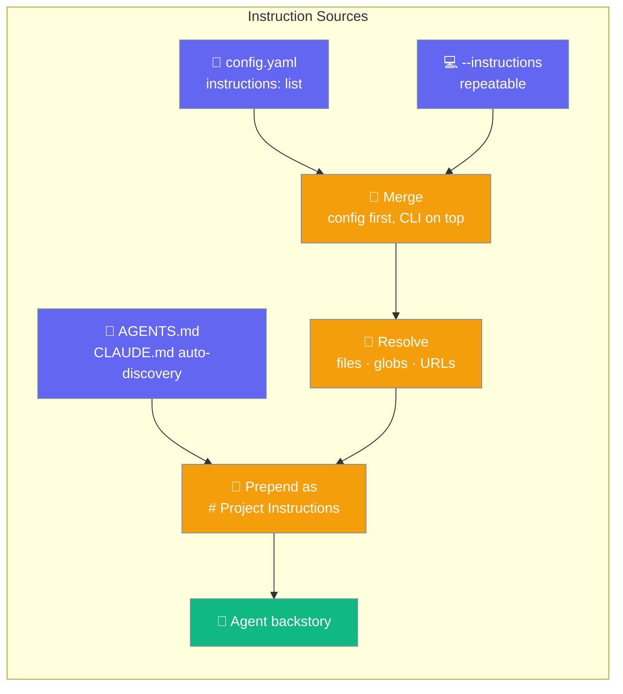
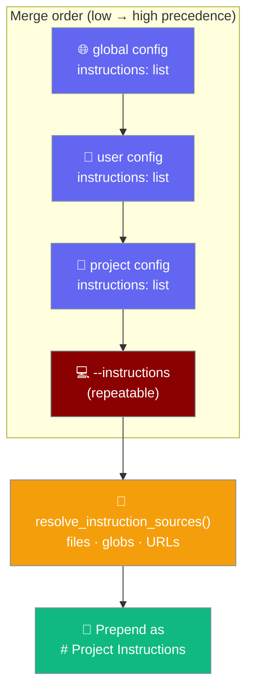

Instruction sources let you declare extra files, globs, or URLs that load on every run, on top of the convention-only `AGENTS.md` / `CLAUDE.md` auto-discovery.

```bash
praisonai run --instructions docs/rules.md "explain this codebase"
```



## Quick Start

<Steps>
<Step title="Layer one extra source for this run">

Pass `--instructions` with a file, glob, or URL:

```bash
praisonai run --instructions docs/rules.md "explain this codebase"
```

</Step>

<Step title="Declare sources in config">

Add a top-level `instructions:` list to `.praisonai/config.yaml` so every run picks them up:

```yaml
instructions:
  - docs/standards/python.md
  - docs/standards/security.md
```

```bash
praisonai run "review the diff"   # both files load automatically
```

</Step>

<Step title="Layer org-wide + project sources">

Set an org list in your global config and extend it per project — the resolver concatenates list values across the hierarchy (global → user → project):

```yaml
# ~/.praisonai/config.yaml (org-wide)
instructions:
  - ~/company/ai-rules.md

# .praisonai/config.yaml (project)
instructions:
  - docs/project-rules.md
```

```bash
# Both org and project sources merge; --instructions appends on top
praisonai run --instructions docs/one-off.md "task"
```

</Step>
</Steps>

---

## Source Types

Each entry may be a file path, glob, home path, or remote URL.

| Source type | Example | Notes |
|-------------|---------|-------|
| File path | `docs/rules.md` | Resolved relative to cwd unless absolute |
| Glob | `docs/standards/*.md` | Matches expanded sorted for determinism |
| Home path | `~/company/ai-rules.md` | `~` and env vars expanded |
| Remote URL | `https://example.com/rules.md` | Best-effort, ≤256 KB, 5 s timeout, SSRF-guarded |

```yaml
instructions:
  - docs/standards/*.md                       # glob (sorted)
  - ~/company/ai-rules.md                      # home + env-var expansion
  - https://example.com/ai-rules.md            # remote fetch, SSRF-guarded
```

---

## How It Works

Config sources are resolved first, then repeatable `--instructions` flags are appended on top; the merged text is prepended into the agent's backstory as `# Project Instructions` before the run.



Declared instructions load **up front**, alongside the `AGENTS.md` / `CLAUDE.md` walk-up. They are passed to the subtree-context hook as `already_loaded`, so a nested `packages/foo/AGENTS.md` named in both places is not re-attached when the agent later touches a file there.

The CLI resolves the helper module in this order: `praisonai_bot` → `praisonai` → `praisonai_code` (resident). The resident fallback (PR #4338) is why a standalone `pip install praisonai-code` gets full instruction-loading parity without the optional packages.

All three run paths honour the merged instructions:

| Path | Command |
|------|---------|
| Direct prompt | `praisonai run --instructions docs/rules.md "task"` |
| Custom agent | `praisonai run --agent lead --instructions docs/rules.md "task"` |
| Named command | `praisonai run --command review --instructions docs/rules.md "task"` |

---

## Behaviour Guarantees

| Guarantee | Plain language |
|-----------|----------------|
| Missing local paths skipped | A path that does not exist is logged and skipped — the run continues. |
| Remote failures skipped | A slow, unreachable, or blocked URL is skipped with a warning, never blocking the run. |
| Remote size bound | Bodies over 256 KB are truncated with `... [remote instruction source truncated]`. |
| Sorted globs | Glob matches are sorted so ordering is deterministic across machines. |
| Dedup | The same physical file (by device + inode) is read once, even via different entries. |
| Layering order | Config sources first (global → user → project), then `--instructions` on top. |

---

## Opt-outs

Two switches turn declared instructions off.

<Steps>
<Step title="Skip all rules for a run">

`--no-rules` (or `PRAISON_NO_RULES=true`) suppresses **both** the auto-discovered `AGENTS.md` / `CLAUDE.md` walk-up **and** these declared instructions:

```bash
praisonai run --no-rules --instructions docs/only-these.md "task"
```

</Step>

<Step title="Allow internal-host URLs (SSRF opt-in)">

Remote URLs resolving to private, loopback, link-local, reserved, multicast, or unspecified addresses are blocked by default. Opt in only for trusted internal setups:

```bash
export PRAISONAI_INSTRUCTIONS_ALLOW_LOCAL_URLS=1   # accepts 1 / true / yes, case-insensitive
praisonai run --instructions https://intranet.internal/rules.md "task"
```

</Step>
</Steps>

<Warning>
`PRAISONAI_INSTRUCTIONS_ALLOW_LOCAL_URLS=1` disables the SSRF guard for internal hosts. An auto-loaded project config from an untrusted checkout could then make the host contact internal services — set it only for trusted, internal environments.

It **also disables the pinned-IP opener**. With the flag off (default), connections pin to the IP validated up front, so a DNS rebind cannot redirect the fetch to an internal address (closes a TOCTOU window). With the flag on, the fetch uses the plain stdlib opener.
</Warning>

---

## Common Patterns

### Org-wide standards + per-project extensions

Declare shared standards in your global config and extend them in each project. List values concat across the hierarchy, so both sets load:

```yaml
# ~/.praisonai/config.yaml
instructions:
  - ~/company/ai-rules.md

# .praisonai/config.yaml
instructions:
  - docs/project-rules.md
```

### CI-only overrides via the command line

Keep the repo config clean and layer CI-specific rules from the pipeline:

```bash
praisonai run --instructions ci/strict-review.md "review the diff"
```

### Language-specific bundles via globs

Load every standard in a folder with one entry:

```yaml
instructions:
  - docs/standards/*.md
```

---

## Python API

`resolve_instruction_sources()` resolves a list of entries into combined text — the same function the CLI uses.

```python
# On a standalone `pip install praisonai-code` install:
from praisonai_code.integration.context_files import resolve_instruction_sources

# Or, when the wrapper / bot is installed, either import path works:
# from praisonai.integration.context_files import resolve_instruction_sources
# from praisonai_bot.integration.context_files import resolve_instruction_sources

text = resolve_instruction_sources(
    entries=[
        "docs/standards/*.md",           # glob (sorted)
        "~/company/ai-rules.md",         # home + env-var expansion
        "https://example.com/rules.md",  # remote fetch, SSRF-guarded
    ],
    cwd=None,  # defaults to Path.cwd()
)
```

| Argument | Type | Default | Description |
|----------|------|---------|-------------|
| `entries` | `Optional[List[str]]` | `None` | Ordered source specifiers. `None`/empty returns `""`. |
| `cwd` | `Optional[Path]` | `None` | Base directory for resolving relative paths. Defaults to `Path.cwd()`. |

<Note>
`resolve_instruction_sources` is available from **three** module locations, all with the same signature and behaviour:

- `praisonai_code.integration.context_files` — resident copy, the standalone-native path on `pip install praisonai-code` (PR #4338).
- `praisonai.integration.context_files` — wrapper re-export (backward-compat).
- `praisonai_bot.integration.context_files` — bot re-export (backward-compat).

It adds no `Agent` parameters and does not change the `Agent` core.
</Note>

---

## Best Practices

<AccordionGroup>

<Accordion title="Prefer config for durable rules, --instructions for one-offs">
Put rules that should always apply in the `instructions:` config key so every run and every teammate picks them up. Reach for `--instructions` when you need an extra source for a single command — a CI-only review checklist, or a temporary spec.
</Accordion>

<Accordion title="Use globs for language bundles">
Group per-language standards under one folder and reference them with a glob (`docs/standards/*.md`). Matches expand sorted, so the merged order is stable across machines and CI.
</Accordion>

<Accordion title="Keep remote URLs public and small">
Remote sources are fetched best-effort, capped at 256 KB, and time out after 5 seconds. Point at public, stable URLs. For internal hosts, prefer committing the file to the repo over enabling the SSRF opt-out.
</Accordion>

<Accordion title="Combine --no-rules to replace rather than extend">
`--instructions` normally layers on top of auto-discovered rules. Add `--no-rules` when you want the declared sources to be the *only* instructions, replacing the `AGENTS.md` / `CLAUDE.md` walk-up entirely.
</Accordion>

</AccordionGroup>

---

## Related

<CardGroup cols={2}>
<Card title="Context Files" icon="file-text" href="/features/context-files">
  Auto-discovered AGENTS.md / CLAUDE.md injection
</Card>
<Card title="Rules" icon="scroll" href="/cli/rules">
  Auto-discovered instruction files
</Card>
<Card title="Run CLI" icon="play" href="/cli/run">
  The praisonai run command reference
</Card>
</CardGroup>
