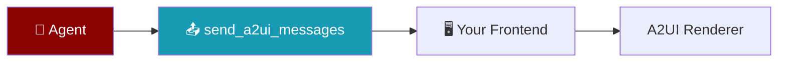

# Integrate A2UI with Your Frontend

Use this guide when building **your own** chat app, dashboard, or canvas — not only PraisonAIUI.

PraisonAI core emits A2UI via the agent tool `send_a2ui_messages`. Your frontend detects the payload and renders with [Google A2UI renderers](https://github.com/google/A2UI/tree/main/renderers) or a custom mapper.

<Note>
Core SDK documents the **contract** (`A2UIToolResultProtocol`). Detection helpers for rich UI live in [PraisonAIUI `a2ui_utils`](https://github.com/MervinPraison/PraisonAIUI) as the reference UI implementation — do not expect parsing logic in `praisonaiagents` core.
</Note>

## Prerequisites

```bash
pip install praisonaiagents[a2ui]
```

Optional React renderer:

```bash
npm install @a2ui/react @a2ui/web_core
```

## Quick Start

<Steps>
<Step title="Install and add the A2UI tool">

```bash
pip install praisonaiagents[a2ui]
```

```python
from praisonaiagents import Agent
from praisonaiagents.tools.a2ui_tools import send_a2ui_messages

agent = Agent(
    name="assistant",
    instructions="When the user asks for UI, call send_a2ui_messages with valid A2UI v0.9 JSON.",
    tools=[send_a2ui_messages],
)
```

</Step>

<Step title="Detect A2UI in your frontend">

```python
def handle_tool_result(result):
    if isinstance(result, dict) and result.get("mime_type") == "application/json+a2ui":
        return result["messages"]
    return None
```

</Step>
</Steps>

## Four-step contract

### 1. Agent with the A2UI tool

```python
from praisonaiagents import Agent
from praisonaiagents.tools.a2ui_tools import send_a2ui_messages

agent = Agent(
    name="assistant",
    instructions=(
        "When the user asks for UI, call send_a2ui_messages with valid A2UI v0.9 JSON."
    ),
    tools=[send_a2ui_messages],
)
```

### 2. Tool output shape (integrator contract)

`send_a2ui_messages` returns:

```python
{
    "mime_type": "application/json+a2ui",
    "messages": [  # A2UI v0.9 message list
        {"createSurface": {"surfaceId": "main", "catalogId": "basic"}, ...}
    ],
    "a2ui_part": ...  # A2A-wrapped payload
}
```

Type hint in core (zero runtime cost):

```python
from praisonaiagents.ui.a2ui import A2UI_MIME_TYPE, A2UIToolResultProtocol
from praisonaiagents.ui.protocols import A2UI_MIME_TYPE  # same constant
```

### 3. Detect in your UI (minimum)

```python
def handle_tool_result(result):
    if isinstance(result, dict) and result.get("mime_type") == "application/json+a2ui":
        messages = result["messages"]
        # → pass to @a2ui/react or your renderer
        return messages
    return None
```

For richer normalisation (surface id, version fields), use [PraisonAIUI `a2ui_utils.py`](https://github.com/MervinPraison/PraisonAIUI/blob/main/src/praisonaiui/a2ui_utils.py) as a reference — copy or vendor that file in your UI layer.

### 4. Render and handle user actions

**React (Google renderer):**

```tsx
import { A2uiSurface, basicCatalog } from '@a2ui/react/v0_9'
// Process messages with MessageProcessor, render A2uiSurface
```

Wire button clicks back to your agent (POST user action → new agent turn).

## Transport options

| Transport | Entry point | A2UI delivery |
|-----------|-------------|---------------|
| **Tool result JSON** | Your WebSocket/SSE | Parse `mime_type` on `TOOL_CALL_COMPLETED` |
| **AG-UI** | `AGUI(agent).get_router()` → `POST /agui` | `TOOL_CALL_RESULT` (JSON string) + **`CUSTOM` event** `name: "a2ui"` |
| **A2A** | `A2A(agent)` → `POST /a2a` | `create_a2ui_part()` / `is_a2ui_part()` |
| **PraisonAIUI** | `aiui run app.py` | Reference impl — surfaces, canvas, chat preview |

### AG-UI CUSTOM event

When a tool returns A2UI, the AG-UI bridge emits an additive event:

```json
{
  "type": "CUSTOM",
  "name": "a2ui",
  "value": {
    "mime_type": "application/json+a2ui",
    "messages": [...],
    "surface_id": "main"
  }
}
```

The existing `TOOL_CALL_RESULT` with stringified JSON is unchanged for backward compatibility.

## Tiers (pick the simplest)

See [Generative UI](/docs/features/generative-ui) for the full tier list:

| Tier | Use when |
|------|----------|
| 0 | Markdown streaming only |
| 1 | Your frontend owns component mapping (`output_pydantic`) |
| 2 | CopilotKit / AG-UI client |
| 3 | Cross-platform A2UI catalog (this guide) |

## Reference implementation

[PraisonAIUI example 29 — A2UI canvas](https://github.com/MervinPraison/PraisonAIUI/tree/main/examples/python/29-a2ui-canvas) demonstrates chat + live surface preview.

## Best Practices

<AccordionGroup>
  <Accordion title="Choose the right UI tier">
    Start at tier 0 (Markdown) and move up only when you need structured or generative surfaces.
  </Accordion>
  <Accordion title="Own the component mapping at tier 1">
    Map `output_pydantic` types to your design system — do not hard-code PraisonAI defaults in production UIs.
  </Accordion>
  <Accordion title="Test with the reference example">
    Use the PraisonAIUI example 29 canvas to validate message flow before custom frontends.
  </Accordion>
  <Accordion title="Keep A2UI payloads small">
    Stream incremental surface updates instead of resending full component trees each turn.
  </Accordion>
</AccordionGroup>

## Related

<CardGroup cols={2}>
<Card title="A2UI Protocol" icon="puzzle-piece" href="/docs/features/a2ui">
  Core A2UI message contract
</Card>
<Card title="Generative UI" icon="wand-magic-sparkles" href="/docs/features/generative-ui">
  UI tiers and integration patterns
</Card>
</CardGroup>
