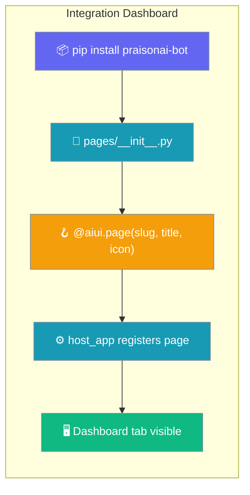
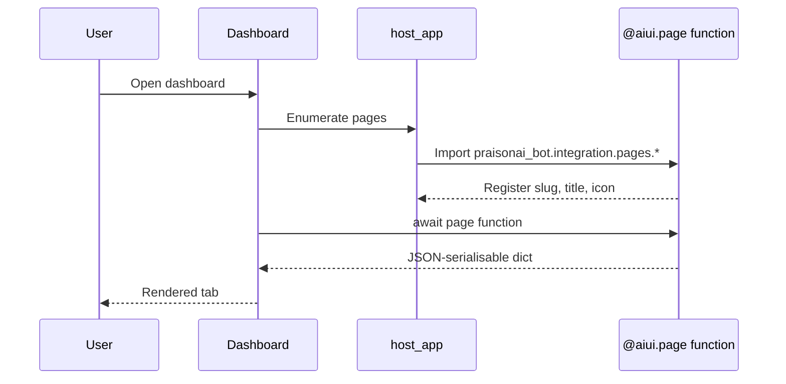

Integration dashboard pages let a bot install extra views — like a live workflow-runs table or a health panel — into the PraisonAI integration dashboard.



## Quick Start

<Steps>
<Step title="See the pages that ship">
Launch the integration dashboard and open the **🔄 Workflow Runs** and **🤖 Bot Health** tabs.

```bash
praisonai serve ui-gateway --style dashboard --port 8765
```
</Step>

<Step title="Add your own page">
Drop a decorated async function in `praisonai_bot/integration/pages/` and register it.

```python
# praisonai_bot/integration/pages/my_status.py
import praisonaiui as aiui


@aiui.page("my-status", title="My Status", icon="✨")
async def my_status_page():
    """Dashboard tab showing custom status data."""
    try:
        from myapp.services import get_status
    except ImportError:
        return {"items": [], "note": "Status service unavailable"}

    return {"items": await get_status(), "status": "ready"}
```
</Step>
</Steps>

---

## How It Works

The host app imports `praisonai_bot.integration.pages` at configure time, each `@aiui.page`-decorated function registers itself, and the dashboard renders each function's returned `dict` as a page.



The mount point is `host_app.py:193`, where the pages are imported inside a `try/except ImportError: pass` guard so a missing dependency never breaks the host app.

| Step | What happens |
|------|--------------|
| Import | `host_app` imports `praisonai_bot.integration.pages` |
| Register | Each `@aiui.page(...)` function attaches its slug, title, and icon |
| Render | The dashboard awaits the function and turns its `dict` into a page |
| Optional | The import is wrapped in `except ImportError: pass` — pages stay optional |

---

## Pages That Ship Today

Two pages ship with `praisonai-bot`.

| Slug | Title | Icon | Source module | Depends on |
|------|-------|------|---------------|------------|
| `workflow-runs` | Workflow Runs | 🔄 | `praisonai_bot.integration.pages.workflow_runs` | `praisonai.integration.bridges.workflows_service` (falls back to `"Workflow bridge unavailable"` note) |
| `bot-health` | Bot Health | 🤖 | `praisonai_bot.integration.pages.bot_health` | `praisonaiui.features._gateway_ref` (falls back to `"gateway": "unknown"`) |

<Warning>
The **Workflow Runs** page was invisible in production until PR [#3829](https://github.com/MervinPraison/PraisonAI/pull/3829) (merge commit `d1f387e`). Upgrade past that commit to see the tab — users on older wheels won't have it.
</Warning>

The `workflow-runs` page returns one of two shapes depending on whether the workflows bridge is available.

```python
# Bridge unavailable — service not installed / not initialised
{"runs": [], "note": "Workflow bridge unavailable"}

# Bridge ready — dashboard renders the runs table
{"runs": [], "service": "WorkflowRunService", "status": "ready"}
```

The `bot-health` page returns a live gateway status.

```python
# Gateway not running
{"gateway": "unknown", "channels": []}

# Gateway running
{"gateway": "running", "channels": [], "agents": [...]}
```

---

## Writing Your Own Page

A page is an async function decorated with `@aiui.page(...)` that returns a JSON-serialisable `dict`.

```python
# praisonai_bot/integration/pages/my_status.py
import praisonaiui as aiui


@aiui.page("my-status", title="My Status", icon="✨")
async def my_status_page():
    """Dashboard tab showing custom status data."""
    try:
        from myapp.services import get_status
    except ImportError:
        return {"items": [], "note": "Status service unavailable"}

    return {"items": await get_status(), "status": "ready"}
```

Register it with one import line so the host app discovers it.

```python
# praisonai_bot/integration/pages/__init__.py
from . import bot_health, workflow_runs, my_status  # noqa: F401
```

Restart the dashboard; the **✨ My Status** tab appears in the sidebar.

| Argument | Type | Example | Description |
|----------|------|---------|-------------|
| `slug` | `str` | `"my-status"` | URL slug for the dashboard route |
| `title` | `str` | `"My Status"` | Label shown in the dashboard nav |
| `icon` | `str` | `"✨"` | Emoji or glyph for the nav entry |

<Warning>
Pages must stay optional. Guard external imports with `try/except ImportError` and return an empty payload with a `note` — a missing dependency should never break the host app, which imports pages under `except ImportError: pass`.
</Warning>

---

## Backward Compatibility

<Note>
The legacy import path `praisonai.integration.pages.workflow_runs` still works as a shim; new pages should import from `praisonai_bot.integration.pages`. See PR [#3829](https://github.com/MervinPraison/PraisonAI/pull/3829) for the C9 shim pattern.
</Note>

---

## Best Practices

<AccordionGroup>
<Accordion title="Return only JSON-serialisable data">
The dashboard renderer serialises the returned `dict`. Return plain lists, strings, numbers, and dicts — no live objects, connections, or callables.
</Accordion>

<Accordion title="Fail soft on bridge unavailability">
Mirror the `workflow-runs` pattern: wrap the bridge import in `try/except ImportError` and return an empty payload with a `note` when the dependency is missing.
</Accordion>

<Accordion title="Keep pages async">
The host app awaits page functions. A synchronous function blocks the event loop — always declare the page with `async def`.
</Accordion>

<Accordion title="Pick icons that read at 16 px">
Emoji icons render across the supported dashboard themes. Choose a glyph that stays legible in the nav at small sizes.
</Accordion>
</AccordionGroup>

---

## Related

<CardGroup cols={2}>
<Card title="Bot Gateway" icon="plug" href="/features/bot-gateway">
  Run the bot gateway that hosts the integration dashboard.
</Card>
<Card title="Workflows" icon="diagram-project" href="/features/workflows">
  The workflows service the Workflow Runs page reads from.
</Card>
</CardGroup>
