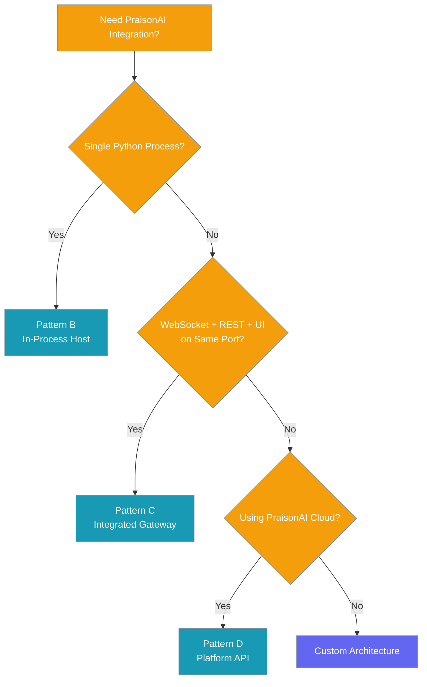
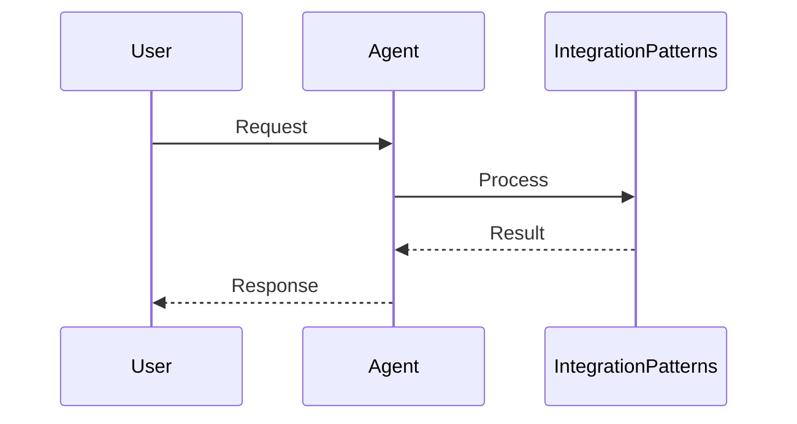
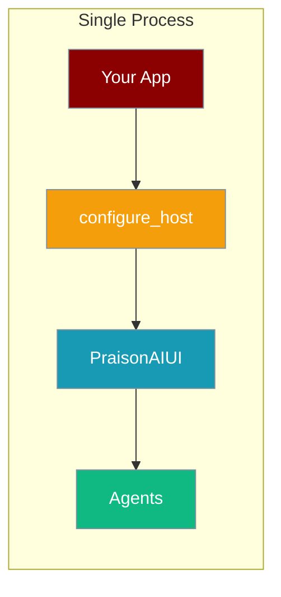
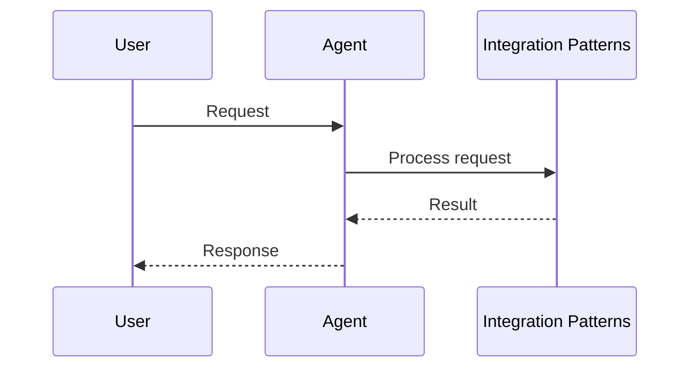
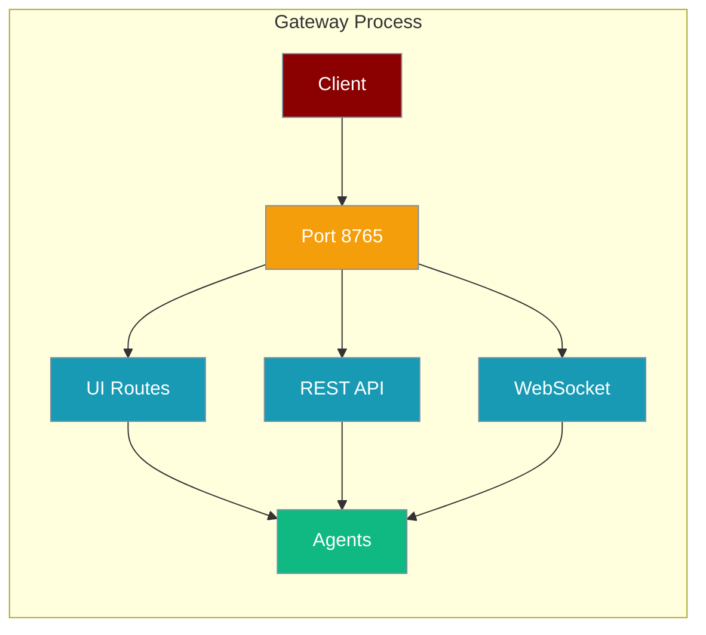
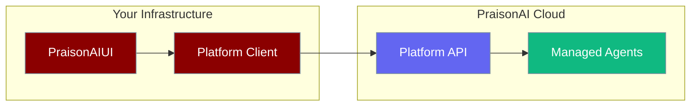

```python
from praisonaiagents import Agent

agent = Agent(name="integration-agent", instructions="Use common integration patterns.")
agent.start("Integrate with a REST API using the webhook pattern.")
```

The user describes how PraisonAI should run in their stack; you pick in-process, gateway, or platform API pattern.

PraisonAI supports three integration patterns for different deployment scenarios.



## How It Works




## Quick Start

<Steps>

<Step title="Choose a pattern">

| Pattern | Best for |
|---------|----------|
| **B — In-Process Host** | Single Python app, embedded UI |
| **C — Integrated Gateway** | One port for UI + REST + WebSocket |
| **D — Platform API** | PraisonAI Cloud (planned) |

</Step>

<Step title="Pattern B — embed in your app">

```python
from praisonai.integration import build_host_app

app = build_host_app(
    title="My Agent App",
    pages=["chat", "agents", "sessions"]
)
```

</Step>

<Step title="Pattern C — unified gateway">

```bash
praisonai serve ui-gateway --style dashboard --port 8765
```

</Step>

</Steps>

---

## Pattern Decision Guide

## Pattern B: In-Process Host

Embed PraisonAIUI directly in your Python application.






```python
from praisonai.integration import build_host_app

app = build_host_app(
    title="My Agent App",
    pages=["chat", "agents", "sessions"]
)

# Run with uvicorn main:app
```

**When to Use:**
- Single application deployment
- Direct Python integration needed
- Simple agent interactions
- Development and testing

**When NOT to Use:**
- Need separate UI and API processes
- Complex microservice architecture
- High-scale production deployments

---

## Pattern C: Integrated Gateway

Single process serving UI, REST API, and WebSocket on one port.



```python
from praisonai import run_integrated_gateway

run_integrated_gateway(
    port=8765,
    host="0.0.0.0",
    title="Agent Gateway",
    style="dashboard",
    agents=[{"name": "Assistant", "llm": "gpt-4o"}]
)
```

Or via CLI:

```bash
praisonai serve ui-gateway --style dashboard --port 8765
```

**When to Use:**
- Need unified endpoint for UI + API
- WebSocket real-time communication required
- Single-port deployment constraints
- Container deployment scenarios

**When NOT to Use:**
- Want separate scaling of UI vs API
- Complex routing requirements
- Need multiple protocol support

---

## Pattern D: Platform API

<Info>Deferred (P3) - Connect to PraisonAI Cloud via Platform Client</Info>

Connect PraisonAIUI to PraisonAI Cloud for managed agents.



```python
# Future implementation
from praisonai.integration import configure_host

configure_host(
    title="Cloud Agents",
    platform_token=os.getenv("PRAISONAI_PLATFORM_TOKEN")
)
```

**When Available:**
- Cloud-managed agent infrastructure
- Multi-tenant deployments
- Enterprise security requirements
- Global agent orchestration

---

## Comparison Matrix

| Feature | Pattern B | Pattern C | Pattern D |
|---------|-----------|-----------|-----------|
| **Complexity** | Low | Medium | High |
| **Setup Time** | Minutes | Minutes | TBD |
| **Scalability** | Application-bound | Single-process | Cloud-scale |
| **Real-time** | Via callbacks | WebSocket | Platform streams |
| **Deployment** | Embedded | Standalone | Distributed |
| **Use Cases** | Apps, Prototypes | Gateways, APIs | Enterprise, SaaS |

---

## Pattern Examples

### FastAPI Integration (Pattern B)

```python
from fastapi import FastAPI
from praisonai.integration import build_host_app

main_app = FastAPI()

# Your API routes
@main_app.get("/api/health")
def health():
    return {"status": "healthy"}

# Mount agent UI
agent_ui = build_host_app(
    title="Agent Dashboard",
    pages=["chat", "agents"]
)
main_app.mount("/agents", agent_ui)

# Access at: http://localhost:8000/agents
```

### Container Deployment (Pattern C)

```dockerfile
FROM python:3.11
COPY . /app
WORKDIR /app
RUN pip install praisonai[ui]
EXPOSE 8765
CMD ["praisonai", "serve", "ui-gateway", "--host", "0.0.0.0", "--port", "8765"]
```

### Development vs Production

<Tabs>

<Tab title="Development">
```python
# Quick development setup
from praisonai.integration import build_host_app

app = build_host_app(
    title="Dev Agent",
    pages=["chat", "agents", "logs"],
    agent_kwargs={"llm": "gpt-4o-mini"}
)
```
</Tab>

<Tab title="Production">
```python
# Production-ready gateway
import os
from praisonai import run_integrated_gateway

run_integrated_gateway(
    port=int(os.getenv("PORT", "8765")),
    host="0.0.0.0",
    title=os.getenv("APP_TITLE", "Agent Gateway"),
    style=os.getenv("UI_STYLE", "dashboard"),
    agents=[{
        "name": "Production Assistant",
        "llm": os.getenv("PRAISONAI_MODEL", "gpt-4o"),
        "instructions": "You are a production assistant."
    }],
    ui_config={
        "analytics": os.getenv("ANALYTICS_ID"),
        "theme": "production"
    }
)
```
</Tab>

</Tabs>

---

## Migration Path

Moving between patterns as your needs evolve:

```python
# Start with Pattern B (embedded)
app = build_host_app(title="MVP")

# Migrate to Pattern C (gateway)
# Extract configuration:
config = {
    "title": "MVP",
    "agents": [...],
    "pages": [...]
}

# Use in gateway:
run_integrated_gateway(**config)

# Future: Pattern D (cloud)
# Same config, different backend
configure_host(platform_token="...", **config)
```

---

## Best Practices

<AccordionGroup>

<Accordion title="Start with Pattern B for prototypes">
Embed `build_host_app()` in your existing FastAPI or Flask app — fastest path to a working agent UI without extra infrastructure.
</Accordion>

<Accordion title="Move to Pattern C for production gateways">
When you need WebSocket streaming and a single deployable port, switch to `run_integrated_gateway()` with the same agent config.
</Accordion>

<Accordion title="Never hardcode tokens">
Read platform tokens from environment variables in both development and production configs.
</Accordion>

<Accordion title="Plan a migration path">
Extract shared agent config into a dict or YAML file so moving from Pattern B → C → D reuses the same definitions.
</Accordion>

</AccordionGroup>

---

## Related

<CardGroup cols={2}>
<Card title="Host Integration" icon="plug" href="/docs/features/host-integration">
  Implementation details
</Card>
<Card title="Channels Gateway" icon="comments" href="/docs/features/channels-gateway">
  Connect agents to chat platforms
</Card>
<Card title="Backend Injection" icon="arrows-right-left" href="/docs/features/aiui-backends">
  Custom backend services
</Card>
<Card title="Gateway" icon="tower-broadcast" href="/docs/features/gateway">
  Multi-channel gateway architecture
</Card>
</CardGroup>